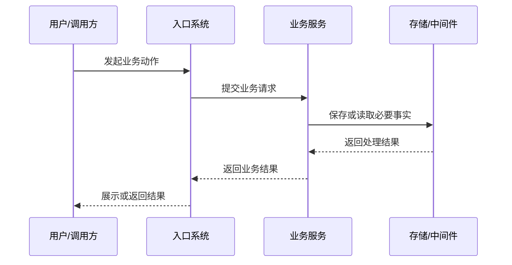

# [项目/模块名称] PRD

> **文档用途：** 面向 Agent/LLM 的需求理解与后续技术设计输入 
> **文档状态：** [草稿 / PRD 待审核 / 已确认 / 已进入技术设计]
> **项目名称：** [项目名称]
> **业务域：** [业务域]
> **模块名称：** [模块名称]
> **输入来源：** [pre_requirement_analysis.md 路径]
> **输出文件：** [requirement.md 路径]
> **最后更新时间：** YYYY-MM-DD

---

## 1. 文档修订记录

| 版本号 | 修改日期 | 修改内容简述 | 来源/提出人 | 审核状态 |
| :--- | :--- | :--- | :--- | :--- |
| v1.0 | YYYY-MM-DD | 初始 PRD 创建 | pre_requirement_analysis.md | 待审核 |

---

## 2. Agent/LLM 阅读说明

### 2.1 使用方式

- 本文档是后续 `technical-design` 的需求输入。
- 后续 Agent/LLM 应只基于本文档和明确引用的上下文继续设计，不应依赖聊天记录。
- 本文档描述“做什么”和“需求级边界”，不描述最终代码实现。

### 2.2 后续阶段约束

- 技术设计阶段必须保留本文档中的业务边界、状态语义和验收标准。
- 技术设计阶段如发现实现约束与 PRD 冲突，必须回到 PRD 待确认问题中补充确认。
- 实现阶段不得绕过 PRD 中的“明确不做”和“待确认问题”。

---

## 3. 预分析输入摘要

### 3.1 输入文档

- 预分析文档路径：
- 用户确认信息：
- 相关背景文档：

### 3.2 已确认结论

| 结论项 | 结论内容 | 证据/来源 |
| :--- | :--- | :--- |
| 业务目标 |  |  |
| 本次范围 |  |  |
| 关键边界 |  |  |
| 主要风险 |  |  |

### 3.3 仍需保留的待确认点

| 问题 | 影响范围 | 当前处理方式 |
| :--- | :--- | :--- |
|  | 需求边界 / 技术设计 / 验收 | 写入待确认问题 |

---

## 4. 业务背景与目标

### 4.1 当前现状

-

### 4.2 当前问题

-

### 4.3 业务目标

-

### 4.4 用户目标

-

### 4.5 非目标

本次明确不解决：

-

---

## 5. 范围与边界

### 5.1 本次必须完成

| 编号 | 范围项 | 需求描述 | 验收口径 |
| :--- | :--- | :--- | :--- |
| R-001 |  |  |  |

### 5.2 本次明确不做

| 编号 | 不做内容 | 原因 | 后续处理 |
| :--- | :--- | :--- | :--- |
| NR-001 |  |  |  |

---

## 6. 角色、系统与职责边界

### 6.1 角色与参与方

| 角色/系统 | 身份说明 | 可执行动作 | 可见结果 | 明确不能做 |
| :--- | :--- | :--- | :--- | :--- |
| 用户 |  |  |  |  |
| 管理员 |  |  |  |  |
| 内部服务 |  |  |  |  |
| 外部系统 |  |  |  |  |

### 6.2 系统职责划分

| 端 / 系统 / 模块 | 负责内容 | 明确不负责内容 | 与其他系统关系 |
| :--- | :--- | :--- | :--- |
| 前端 |  |  |  |
| 后端 API |  |  |  |
| Python 服务 |  |  |  |
| 中间件 / 任务系统 |  |  |  |
| 存储 / 检索系统 |  |  |  |

---

## 7. 业务流程与状态

### 7.1 主流程

### 7.2 主流程说明

| 步骤 | 触发方 | 行为 | 系统响应 | 用户/调用方可见结果 |
| :--- | :--- | :--- | :--- | :--- |
| 1 |  |  |  |  |

### 7.3 异常流程

| 异常场景 | 触发条件 | 系统预期行为 | 用户/调用方可见结果 | 是否阻断主流程 |
| :--- | :--- | :--- | :--- | :--- |
|  |  |  |  | 是 / 否 |

### 7.4 状态与结果

| 对象 | 状态/结果 | 状态含义 | 触发条件 | 谁负责更新 | 谁需要感知 |
| :--- | :--- | :--- | :--- | :--- | :--- |
|  |  |  |  |  |  |

---

## 8. 功能规格与验收标准

### 8.1 功能清单

| 功能编号 | 功能名称 | 优先级 | 需求描述 | 前置条件 | 输出结果 |
| :--- | :--- | :--- | :--- | :--- | :--- |
| F-001 |  | P0 / P1 / P2 |  |  |  |

### 8.2 功能详情

#### F-001 [功能名称]

- 触发条件：
- 参与角色：
- 输入信息：
- 业务规则：
- 成功结果：
- 失败结果：
- 明确不处理：

### 8.3 验收标准

| 验收编号 | 对应功能 | 验收标准 | 验证方式 |
| :--- | :--- | :--- | :--- |
| AC-001 | F-001 |  | 人工审核 / 单元测试 / 集成测试 |

---

## 9. 业务对象与数据事实

### 9.1 核心业务对象

| 数据对象 | 职责说明 | 与主业务维度关系 | 本次是否需要 | 关键状态/结果是否挂载于此 |
| :--- | :--- | :--- | :--- | :--- |
|  |  |  | 是 / 否 | 是 / 否 |

### 9.2 对象事实说明

#### [对象名称]

- 对象职责：
- 必须记录的业务事实：
- 归属关系：
- 与其他对象的关系：
- 数据可见性：
- 生命周期：
- 明确不记录的内容：

### 9.3 数据可见性与权限边界

| 数据/结果 | 谁可见 | 谁可修改 | 谁不可见 | 说明 |
| :--- | :--- | :--- | :--- | :--- |
|  |  |  |  |  |

说明：本节只描述业务对象、事实和可见性，不定义最终表字段、字段类型、索引或 SQL。

---

## 10. 系统协作与中间件边界

### 10.1 协作关系

| 协作方 | 协作类型 | 交互目的 | 需求级输入 | 需求级输出 | 当前状态 |
| :--- | :--- | :--- | :--- | :--- | :--- |
|  | 同步调用 / 异步消息 / 存储 / 检索 / 人工流程 |  |  |  | 已具备 / 待确认 / 有风险 |

### 10.2 涉及的存储与中间件类型

* [ ] 关系型数据库
* [ ] 缓存
* [ ] 消息队列
* [ ] 对象存储
* [ ] 搜索 / 向量检索
* [ ] 外部系统
* [ ] 其他：__________

### 10.3 需求级技术边界

| 边界项 | 需求级说明 | 是否本次定稿 | 是否影响技术设计 |
| :--- | :--- | :--- | :--- |
| 存储边界 | 结构化数据、对象数据、中间产物分别需要承载哪些业务事实 | 是 / 否 | 是 / 否 |
| 系统交互方式 | 同步调用、异步消息、轮询或其他方式的需求级约束 | 是 / 否 | 是 / 否 |
| 状态更新责任 | 哪个角色或系统在需求层面负责更新关键状态 | 是 / 否 | 是 / 否 |
| 幂等与稳定性 | 是否要求业务动作、任务或结果具备稳定语义 | 是 / 否 | 是 / 否 |
| 扩展兼容 | 后续扩展时必须保持的业务兼容边界 | 是 / 否 | 是 / 否 |

---

## 11. 非功能性需求

| 类型 | 需求描述 | 验收方式 |
| :--- | :--- | :--- |
| 权限与安全 |  |  |
| 性能 |  |  |
| 稳定性 |  |  |
| 可观测性 |  |  |
| 兼容性 |  |  |
| 数据保留 |  |  |

---

## 12. 面向 technical-design 的输入清单

### 12.1 可能影响接口设计的需求

-

### 12.2 可能影响数据模型的需求

-

### 12.3 可能影响中间件或公共契约的需求

-

### 12.4 必须在技术设计阶段继续确认的问题

-

### 12.5 技术设计阶段禁止改变的需求结论

-

---

## 13. 风险、依赖与待确认问题

### 13.1 当前主要风险

| 风险 | 影响 | 当前缓解方式 |
| :--- | :--- | :--- |
|  |  |  |

### 13.2 前置依赖

| 依赖项 | 依赖类型 | 对本需求的影响 | 当前状态 |
| :--- | :--- | :--- | :--- |
|  | 系统 / 组件 / 数据 / 人工流程 |  | 已具备 / 待确认 / 有风险 |

### 13.3 待确认问题

| 问题 | 为什么阻塞或影响后续设计 | 建议确认人 | 当前处理方式 |
| :--- | :--- | :--- | :--- |
|  |  |  |  |

---

## 14. 人工审核清单

PRD 进入 `technical-design` 前，必须确认：

* [ ] 本次范围已确认
* [ ] 明确不做事项已确认
* [ ] 主流程和异常流程已确认
* [ ] 关键状态和结果已确认
* [ ] 核心业务对象与数据事实已确认
* [ ] 验收标准可执行
* [ ] 待确认问题不阻塞技术设计，或已明确处理方式
