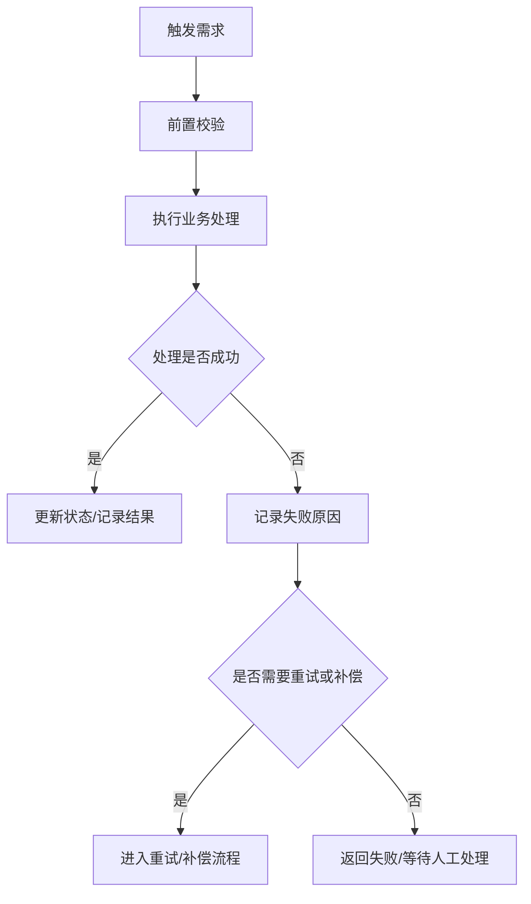

# Pre-PRD Requirement Analysis

## 1. 定位

本 skill 用于正式 PRD 或开发需求之前，把用户的初步需求放到当前项目中分析清楚。

它的产物不是正式 PRD，也不是技术方案，而是一份给开发者看的“需求预分析”。开发者读完后应能快速知道：

- 这个需求要解决什么问题
- 当前项目里可能落在哪些模块
- 主流程怎么走
- 哪些异常、状态、依赖、数据一致性问题容易踩坑
- 哪些问题必须先确认，不能直接开工

本 skill 的工作不是一次性写完文档就结束。首次输出 `pre_requirement_analysis.md` 后，应进入问答式需求收敛：围绕文档中的“待确认问题”向用户提问，用户每次回答后都要把确认结果更新回原文档，直到关键问题收敛或用户明确停止。

## 2. 使用边界

### 2.1 适合使用

- 用户只有口头描述、初步想法或粗略框架
- 用户要求“先分析”“先拆一下”“看看有什么风险”
- 用户希望生成需求文档，但需求范围还不稳定
- 用户已经拿到 `pre_requirement_analysis.md` 初稿，并继续回答其中的待确认问题
- 用户补充新信息、修正假设、确认或否定某个推测，需要迭代更新预分析文档
- 需求涉及业务流程、异步任务、状态流转、MQ、回调、外部依赖、权限、数据一致性等开发风险
- 需要结合当前项目判断影响面和已有模块复用关系

### 2.2 不适合使用

- 用户明确要求正式 PRD，且范围、流程、验收标准已经确认
- 用户要求详细接口、库表、类图、任务拆分或编码实现
- 用户只是要修改模板本身
- 用户已经指定进入其他 skill

### 2.3 与 PRD 类 skill 的优先级

如果用户说“生成需求文档”，但同时出现以下任一信号，应优先使用本 skill：

- “分析一下”
- “可能有什么问题”
- “为什么会卡住”
- “流程怎么走”
- “需要注意什么”
- “哪些地方没想到”
- “结合当前项目”
- “后续再完善”

只有当用户明确要“正式 PRD / 产品需求文档 / 验收标准 / 已确认范围”时，才转入 `prd-generator`。

## 3. 工作原则

- 面向开发者阅读，少写说明，多写结论。
- 先看项目上下文，再分析需求；无法读取项目时要说明限制。
- 区分“已确认 / 推测 / 待确认”，不要把推测写成事实。
- 初稿生成后必须保留可继续追问的“待确认问题”，并优先围绕这些问题和用户交互。
- 问答过程中的确认结论必须回写到正文对应章节，不允许只追加在文档末尾。
- 每轮问答默认只聚焦 1 个最阻塞问题，方便用户逐点确认；同时必须列出完整待确认清单，让用户知道后续还需要确认哪些问题。
- 优先分析主流程、异常流、状态变化、模块影响和待确认问题。
- 表格只用于高密度清单；全链路推演不要默认用表格，优先用分步骤叙述，便于开发者顺着流程阅读。
- 不提前写接口设计、库表设计或技术方案。
- 文档允许迭代，后续补充信息时应更新原章节，不只追加在末尾。

## 4. 分析流程

### 步骤 1：理解原始需求

- 保留用户原话
- 用 1-3 句话整理成开发者能理解的描述
- 提炼需求目标
- 标出明显缺失的信息

### 步骤 2：快速读取项目上下文

根据需求关键词，优先查看：

- README、已有 PRD、requirement、架构说明
- 相关模块目录、路由、接口、服务、任务、消费者、状态枚举
- 数据模型、权限、配置、日志、监控、外部依赖相关代码

只做支撑需求分析的最小探索，不做完整代码审查。

### 步骤 3：还原业务流程

从触发到结果，按顺序说明：

- 谁触发
- 系统做什么
- 依赖什么
- 状态如何变化
- 成功结果是什么
- 失败时会怎样
- Mermaid 流程图如何串起主链路和关键异常分支

### 步骤 4：判断项目影响

重点判断：

- 是否改已有模块
- 是否新增链路
- 是否影响状态机、数据模型、权限、异步任务、MQ、回调或外部系统
- 是否影响测试、发布、灰度、排障

### 步骤 5：暴露问题和风险

优先检查：

- 重复触发和幂等
- 并发和状态冲突
- 部分成功和补偿
- MQ ack、重试、死信、消费顺序
- 长耗时任务和任务卡住
- 下游失败和超时
- 历史数据兼容
- 权限越权
- 可观测性不足

### 步骤 6：给出下一步

输出必须说明：

- 哪些内容已经可以进入 PRD
- 哪些问题必须先确认
- 是否需要继续补充需求、开评审、转 PRD 或转技术方案

### 步骤 7：问答式收敛并回写文档

初次生成 `pre_requirement_analysis.md` 后，如果文档中仍有待确认问题，必须进入问答式收敛：

1. 从“待确认问题”中挑选 1 个最阻塞的问题向用户提问；不要一次要求用户回答多个问题，除非用户明确要求批量确认。
2. 每个问题必须说明它影响哪个需求边界、业务流程、状态、数据或后续 PRD 输入。
3. 提问时仍要罗列完整待确认清单，并标出“本轮请确认”的问题与“后续待确认”的问题。
4. 用户回答后，重新读取当前 `pre_requirement_analysis.md`。
5. 将用户确认的信息回写到正文对应章节，包括摘要、需求理解、流程、状态、项目影响面、风险和待确认问题。
6. 把已确认事项从“推测 / 待确认”移动到“已确认”。
7. 若用户回答引入新问题或与旧结论冲突，将冲突写入“待确认问题”并标注来源。
8. 不在输出文档中维护问答确认记录或迭代记录。
9. 如果仍有阻塞问题，继续只提出下一轮 1 个问题，并继续展示完整清单；如果关键问题已收敛，明确建议进入 `prd-generator`。

问答收敛不是聊天记录摘要，必须体现为文档内容被持续修订。

## 5. 输出模板

将输出文件保存在docs目录下的当前需求名称（如果没有则创建，使用中文）文件夹下，命名 `pre_requirement_analysis.md`。

```markdown
# [项目/模块名称] 需求预分析

- **状态：** 草稿 / 迭代中 / 已收敛
- **来源：** [用户口头描述 / 初步想法 / 问题排查 / 业务输入]
- **关联模块：** [模块名 / 待确认]
- **收敛状态：** 待提问 / 问答收敛中 / 已收敛 / 暂停
- **更新时间：** YYYY-MM-DD

## 1. 摘要

### 1.1 需求

[用一句话说明这个需求要解决什么问题。]

### 1.2 当前判断

- **需求类型：** [新增能力 / 改造现有流程 / 问题修复 / 自动化 / 外部集成 / 待确认]
- **项目落点：** [可能涉及的模块、服务、页面、任务或数据对象]
- **最大风险：** [当前最值得优先确认的风险]
- **是否可直接进入 PRD：** [可以 / 不建议 / 需要先确认 X]

### 1.3 结论状态

- **已确认：** [已经由用户输入、项目文档或代码支撑的结论]
- **推测：** [基于上下文推断但尚未确认的判断]
- **待确认：** [缺少信息、会影响后续 PRD 或实现的问题]
- **下一轮优先确认：** [最多 1-3 个最阻塞的问题]

## 2. 原始需求与理解

### 2.1 原始需求

> [原样粘贴用户输入]

### 2.2 整理后的需求描述

[把口语化需求整理成开发者能读懂的描述。不要扩写成 PRD。]

### 2.3 需求目标

- [目标 1]
- [目标 2]

### 2.4 当前不明确的地方

- [不明确点 1：为什么影响后续判断]
- [不明确点 2：为什么影响后续判断]

## 3. 项目上下文

### 3.1 已观察到的项目现状

- [项目结构、已有模块、已有能力、当前流程或相关代码线索]

### 3.2 可能涉及的模块

| 模块/能力 | 当前作用 | 与本需求的关系 | 判断状态 |
| :--- | :--- | :--- | :--- |
| [模块 A] | [当前作用] | [复用/修改/新增依赖/待确认] | [已确认/推测/待确认] |

### 3.3 现有流程关系

- **新增链路：** [是否新增完整流程]
- **改造链路：** [是否改变已有流程]
- **复用能力：** [可复用的已有能力]
- **兼容影响：** [是否影响历史数据、旧入口、旧逻辑或已有用户行为]

## 4. 全链路推演

### 4.1 主流程



#### 步骤 1：[步骤名称]

- **触发/参与方：** [角色或系统]
- **系统动作：** [系统具体做什么]
- **输入/依赖：** [依赖的数据、状态、服务或前置条件]
- **输出/结果：** [这一步完成后产生什么结果]
- **失败影响：** [失败后会影响什么]
- **待确认：** [需要先确认的问题]

#### 步骤 2：[步骤名称]

- **触发/参与方：** [角色或系统]
- **系统动作：** [系统具体做什么]
- **输入/依赖：** [依赖的数据、状态、服务或前置条件]
- **输出/结果：** [这一步完成后产生什么结果]
- **失败影响：** [失败后会影响什么]
- **待确认：** [需要先确认的问题]

### 4.2 状态与数据变化

- **核心对象：** [涉及的业务对象]
- **状态变化：** [新增或改变了哪些状态]
- **关键数据：** [必须记录或传递的数据]
- **链路标识：** [是否需要业务 id、任务 id、trace id 等]

### 4.3 异常流程

#### 异常场景 1：[场景名称]

- **可能发生在：** [步骤或模块]
- **触发条件：** [什么情况下会发生]
- **影响：** [对用户、数据、状态、任务或下游的影响]
- **需要确认/建议：** [确认项或当前建议]

#### 异常场景 2：[场景名称]

- **可能发生在：** [步骤或模块]
- **触发条件：** [什么情况下会发生]
- **影响：** [对用户、数据、状态、任务或下游的影响]
- **需要确认/建议：** [确认项或当前建议]

## 5. 项目影响面

只列出和当前需求实际相关的影响方向；如果不涉及，不要输出该项。若无法判断但会影响后续实现，应标为“待确认”。

### 5.1 [影响方向名称]

- **是否涉及：** [是/待确认]
- **影响对象：** [具体页面、接口、服务、任务、数据对象、权限点、外部依赖等]
- **可能变化：** [新增/修改/复用/兼容/迁移/补偿/监控等]
- **开发关注点：** [对开发实现、测试、发布或排障的影响]
- **待确认：** [如果有需要确认的问题则写，没有则写“不涉及”]

### 5.2 [影响方向名称]

- **是否涉及：** [是/待确认]
- **影响对象：** [具体对象]
- **可能变化：** [变化说明]
- **开发关注点：** [关注点]
- **待确认：** [确认项]

## 6. 重点风险

| 风险 | 为什么重要 | 如果不处理会怎样 | 当前建议 |
| :--- | :--- | :--- | :--- |
| [风险 A] | [原因] | [后果] | [建议/待确认] |

常见风险检查：

- 重复触发是否会产生重复数据
- 并发执行是否会造成状态冲突
- 部分成功后是否需要补偿
- MQ 消息确认、重试、死信是否明确
- 长耗时任务是否可能永久卡住
- 下游失败后是否可恢复
- 日志和 trace 是否足够排障

## 7. 可扩展性判断

### 7.1 需要现在考虑

- [如果不现在明确，后续会明显返工的问题]

### 7.2 只需简单预留

- [例如配置化、状态枚举扩展、保留扩展字段、模块边界不要写死]

### 7.3 暂不建议处理

- [当前做会过度设计的内容，以及原因]

## 8. 待确认问题

| 编号 | 问题 | 为什么必须确认 | 不确认的影响 | 建议确认人 | 当前状态 |
| :--- | :--- | :--- | :--- | :--- | :--- |
| Q1 | [问题 A] | [原因] | [影响] | [用户/产品/研发/架构/运维] | 待提问 / 已提问 / 已确认 / 暂缓 |

## 9. 下一步建议

- **可进入 PRD 的内容：** [已经相对明确的需求输入]
- **进入 PRD 前必须确认：** [必须先拍板的问题]
- **建议下一步：** [继续问答收敛 / 组织评审 / 转正式 PRD / 转技术方案]
```

## 6. 输出要求

- 默认输出精简版，不要把每个检查项都展开成长文。
- 全链路推演必须包含一个 Mermaid 流程图；流程图只画主链路和关键异常分支，不要把所有细节都塞进图里。
- 项目影响面必须根据具体需求动态生成，只写实际涉及或高度待确认的方向；不要固定输出前端、后端、数据、MQ、权限、外部依赖、测试发布等完整清单。
- 如果某个章节和当前需求无关，写“不涉及”或“暂未发现”，不要硬填。
- 优先把不确定性收敛到“待确认问题”，不要散落在全文。
- 风险要写具体场景，不写泛泛的“需要注意稳定性”。
- 对开发者有直接帮助的信息优先，例如状态、依赖、幂等、补偿、排障。
- 不要把预分析写成正式 PRD，不写详细验收标准。
- 不要提前给出接口字段、表结构、Topic 名、类名，除非项目中已经存在且只是引用现状。
- 初稿完成后，如果仍存在会阻塞 PRD 的问题，最终回复必须给出下一轮建议提问，而不是直接宣称可以进入 PRD。
- 问题数量要克制：默认每轮只让用户回答 1 个问题，但需要同步展示完整待确认清单；只有用户明确要求批量确认时才一次提多个问题。
- 不要在输出文档中写“问答收敛方式：每轮只要求确认 1 个问题，但始终保留完整待确认清单，避免遗漏后续决策点”这类过程说明。
- 不要在输出文档中保留“问答确认记录”或“迭代记录”章节。
- 当最后一个待确认问题解决后，从输出文档中删除“下一步建议”章节；只在最终回复中提示可进入正式 PRD / `requirement.md`。
- 当最后一个待确认问题解决后，必须根据完整确认结果生成或重写“完整过程描述”和最终 Mermaid 流程图；流程图应体现已确认的主流程、重复消息分支、异常终态分支和最终用户反馈路径。

## 7. 迭代规则

当用户继续补充信息时：

1. 先读取现有 `pre_requirement_analysis.md`，识别用户回答对应的待确认问题编号或章节。
2. 找到对应章节并更新原内容，不只在末尾追加。
3. 把已确认的信息从“待确认 / 推测”移动到“已确认”。
4. 如果新增信息改变流程或影响面，更新主流程、状态与数据变化、项目影响面和重点风险。
5. 如果用户否定了原推测，删除或改写原推测。
6. 如果出现冲突，保留冲突并加入“待确认问题”。
7. 不在输出文档中追加问答确认记录或迭代记录；只更新正文结论和待确认问题状态。
8. 重新计算“是否可直接进入 PRD”。
9. 如果仍有阻塞问题，在回复中继续提出下一轮 1 个问题，并列出完整待确认清单。
10. 如果最后一个待确认问题已解决，清理文档中的“下一步建议”章节。
11. 如果最后一个待确认问题已解决，重写“完整过程描述”和最终 Mermaid 流程图，确保文档能直接作为正式 PRD 输入。

## 8. 问答规则

问答式收敛必须遵守：

- 优先问会阻塞后续 PRD 的问题，不问纯好奇问题。
- 默认一次只问 1 个问题，并明确标注“本轮请确认”；其余问题归入“后续待确认清单”。
- 即使只问 1 个问题，也要完整罗列当前所有待确认点，避免用户误以为只有一个问题。
- 每个问题都要短，并说明“为什么会影响 PRD 或实现判断”。
- 优先使用用户已经给出的术语，不强行引入新概念。
- 用户回答明确时，直接更新文档；不要反复要求二次确认。
- 用户回答模糊时，把能确认的部分写入“已确认”，把仍模糊的部分保留在“待确认”。
- 用户提出新需求时，判断是补充当前需求还是新增需求；若会改变范围，更新摘要、流程、影响面和风险。
- 用户要求停止问答或直接生成 PRD 时，先检查是否仍有阻塞问题；若有，明确提示风险，再按用户选择执行。

## 9. 与其他 skill 的衔接

- 待确认问题收敛后，如果用户要求正式 PRD 或 `requirement.md`，转入 `prd-generator`。
- 用户要求接口、库表、架构、任务拆分时，基于本预分析进入 `technical-design`。
- 用户只是想继续优化本 skill 或模板时，直接修改本 skill，不按需求预分析流程产出业务文档。
