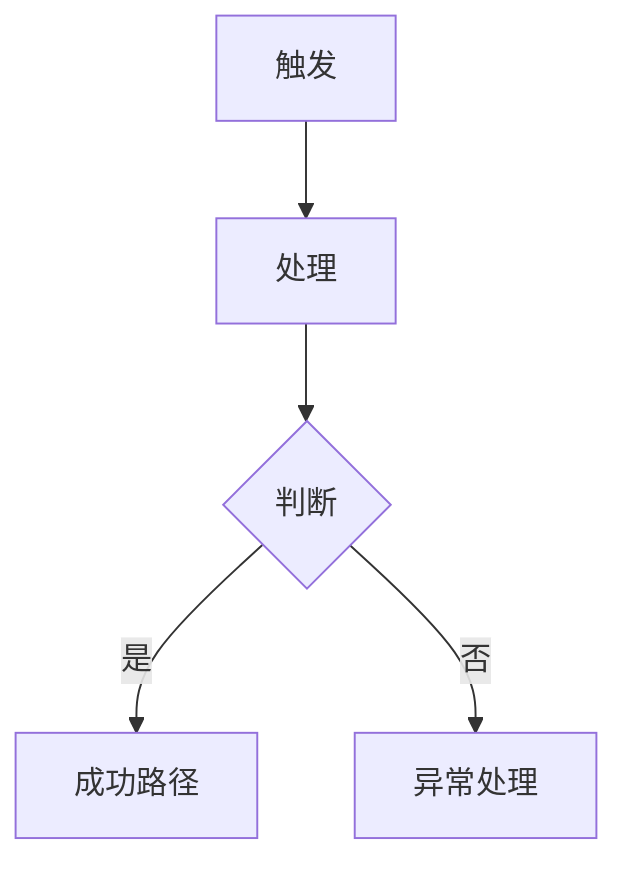

# Brief Generator

## 1. 定位

本 skill 把开发者的初始需求转化为一份**面向另一个开发者**的 `brief.md`。

`brief.md` 的目标读者是团队成员（包括未来的自己）。读完后应能在脑子里跑通这次需求：

- 做什么、为什么做、不做什么
- 业务流程怎么走（含主路径与关键异常）
- 涉及哪些模块、各自承担什么、复用什么、新增什么
- 哪些风险必须重视、哪些问题必须先确认

它**不是**：

- 速览摘要——必要内容要写透
- 设计文档——不到代码层（不写接口字段、表结构、类名、方法签名）
- PRD 散文——不写产品营销话术、不写"用户体验"等无法验证的说辞

它的**核心特性是可迭代**。Agent 首次生成后，开发者审阅、提出疑问或修改意见，Agent 把修订写回**原章节**（而非追加在末尾），反复直到开发者明确说"冻结"。冻结后删除"待确认问题"章节，进入 `acceptance-generator`。

## 2. 触发边界

### 2.1 适合使用

- 用户口头描述需求、初步想法、粗略框架
- 用户要求"先分析一下"、"写个 brief"、"搞清楚业务"、"看看会影响哪些模块"
- 用户基于已有 `brief.md` 提出修改、补充、疑问
- 用户回答 brief 中"待确认问题"章节里的某个问题

### 2.2 不适合使用

- 用户已有冻结的 brief，明确要求"生成 acceptance / 生成 Gherkin / 生成验收"→ 转 `acceptance-generator`
- 用户已有 brief + acceptance.feature，要求技术方案 → 转 `technical-design`
- 用户只是要改本 skill 模板或工作规则本身

## 3. 工作原则

- 面向开发者读，少写说明，多写结论。
- 写到"另一个开发者能在脑子里跑通"为止，不到代码层。
- 不预设篇幅上限：简单需求 1 页够，复杂需求 5-8 页合理。**篇幅由内容必要性决定，不由模板预算决定**。
- 模糊的部分进"待确认问题"章节，不要用"按需处理"、"适当判断"等模糊措辞掩盖。
- 表格只用于高密度清单（如风险表、待确认问题表）；流程详解优先用分步骤叙述。
- 迭代时把修订写回**原章节**，不要只追加在末尾或新建"修订记录"段落。
- 不暴露 skill 内部机制：状态元信息（草稿/迭代中）、推测/已确认/待确认分类、问答收敛说明、Agent 阅读指令——**全部不进文档**。

## 4. 输出位置

固定为：

```
docs/<需求名称>/brief.md
```

要求：

- 需求名称使用中文，与现有 `docs/` 目录约定一致。
- 若用户未提供需求名称，从需求内容提取候选并向用户确认后再创建目录。
- 同目录同时维护 `feature_info.md`，记录当前阶段（如 `brief 迭代中` / `brief 已冻结`）、产物清单、推荐阅读顺序。
- 若目录已存在 `brief.md`，先读旧版判断是修订还是覆盖，不允许无说明地重写关键结论。

## 5. 模板

```markdown
# [需求名] Brief

## 1. 需求摘要

- **做什么**：[1-3 句话描述本次需求要解决的核心问题]
- **为什么做**：[业务动机、问题来源、上游诉求]
- **本次不做**：[明确排除的范围，避免后续扩展]

## 2. 业务流程

### 2.1 主流程图



流程图只画主链路 + 关键异常分支，不要把所有细节塞进图里。

### 2.2 流程详解

对图中每个关键节点展开：

- 谁触发 / 系统做什么 / 依赖什么
- 状态如何变化 / 数据如何流转
- 用户或下游系统如何感知结果

异常分支单独成段，说明触发条件、影响范围、当前处理策略。

## 3. 核心模块与实现思路

按模块列出，每个模块独立一段。每段回答：

- **位置**：在现有项目的哪个目录 / 层
- **职责**：本次承担什么业务责任
- **实现思路**：
  - 复用哪些现有能力（点名具体模块 / 服务，但不到代码层）
  - 需要新增什么链路或扩展什么能力
  - 与上下游模块如何串联
  - 状态 / 数据如何在本模块流动
- **关键决策**：本模块在实现上的选型 / 取舍（如"选异步而非同步"、"用 MQ 而非定时轮询"），说明理由

允许写得详细——目标是让另一个开发者读完能在脑子里跑通这个模块的工作方式。但**不要写到代码层**：不写接口字段、表结构、类名、函数签名。这些留给 `technical-design`。

## 4. 风险与不确定性

| 风险 / 问题 | 触发条件 | 影响 | 当前判断 / 应对方向 |
| :--- | :--- | :--- | :--- |
| [具体场景] | [何时发生] | [对谁、对什么] | [当前思路或"待确认"] |

不写"需要注意稳定性"、"可能有性能问题"这种泛泛的话。每条要落到具体场景。

## 5. 待确认问题

> 仅在迭代期使用。所有问题收敛后，**整章删除**，不进入冻结版。

| 编号 | 问题 | 为什么影响判断 | 阻塞级别 |
| :--- | :--- | :--- | :--- |
| Q1 | [具体问题] | [影响哪个流程 / 模块 / 决策] | 阻塞 / 影响范围 / 可后置 |
```

## 6. 工作流程

### 步骤 1：理解原始需求

- 保留用户原话的关键信息
- 用 1-3 句整理成开发者能理解的描述
- 提炼核心目标、范围、非目标
- 标出明显缺失的信息

### 步骤 2：读取项目上下文

按需求关键词，最小化探索：

- README、已有同业务域的 brief / technical_design
- 相关模块目录、入口文件、状态枚举、消息契约
- 公共契约（`docs/architecture/middleware_contract.md` 等）

不做完整代码审查，**只读到能支撑模块草图为止**。不要把"读到了什么文件"写成独立章节，转化为对模块归属、复用边界的具体判断。

### 步骤 3：生成 brief 初稿

按模板 5 章生成。原则：

- 第 2 章业务流程要覆盖主链路 + 关键异常
- 第 3 章核心模块要写透实现思路（位置、职责、复用、新增、决策）
- 第 4 章风险写具体场景
- 第 5 章把所有不确定的、影响后续决策的问题列出

### 步骤 4：迭代收敛

进入开发者审阅—Agent 修订循环：

1. 把初稿展示给用户。
2. 默认聚焦"待确认问题"中 1 个最阻塞的问题向用户提问；同时罗列完整待确认清单。
3. 用户回答 / 提出修改 / 指出错误后：
   - **读取当前 brief.md**（不要凭记忆）
   - 把确认信息**回写到正文对应章节**（摘要 / 流程 / 模块 / 风险）
   - 把已确认的问题从"待确认问题"删除
   - 如果用户回答引入新问题或与旧结论冲突，把冲突加入"待确认问题"并标注来源
4. 不在文档中保留"问答记录"、"迭代记录"等过程章节。
5. 持续直到：
   - 用户明确说"冻结" / "OK 这版可以" / "进入下一阶段"
   - 或所有阻塞性问题已收敛

### 步骤 5：冻结

冻结时：

1. 删除"待确认问题"章节（如果还有非阻塞性的，需用户确认后保留或删除）
2. 更新 `feature_info.md`：状态改为 `brief 已冻结`，记录冻结时间
3. 告知用户下一步：进入 `acceptance-generator` 生成 acceptance.feature

## 7. 输出质量标准

合格的 `brief.md` 必须做到：

- 另一个开发者读完不需要追问就能进入下一阶段
- 业务流程能在脑子里跑通，含关键异常
- 每个核心模块都有"位置 + 职责 + 实现思路 + 关键决策"
- 风险落到具体场景，不是泛泛的"注意稳定性"
- 没有任何模糊措辞（"按需"、"适当"、"完善"、"相关逻辑"）
- 不含 skill 内部机制说明、状态元信息、问答过程记录

不合格的信号：

- 篇幅过短，模块章节只有 1-2 行
- 流程描述跳跃，关键步骤缺失
- 模块章节只写"做 X"，没写"在哪里、复用什么、怎么串联"
- 风险表用泛泛措辞
- 出现"用户体验"、"系统应正确处理"等无法验证的描述

## 8. 与其他 skill 的衔接

- **进入前**：用户提出原始需求、想法或框架
- **冻结后**：转入 `acceptance-generator` 生成 Gherkin 验收契约
- **不允许**：未经冻结直接跳到 `technical-design`；在 brief 阶段写代码层细节
