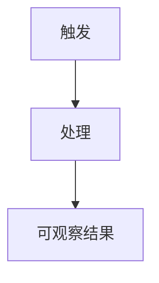

# <任务名称>方案

> 完整章节库。生成时保留核心章节和真实命中的条件章节，删除说明、占位内容、空表及未命中章节。

## 基本信息
- 任务标识：`<KEY>`
- 来源：`<用户请求 / Issue / 明确材料>`
- 后续路径：`直接施工 | 契约验收`
- 日期：`YYYY-MM-DD`

# 第一部分：业务方案
## 1. 需求描述
### 1.1 需求正文
### 1.2 可观察结果
- R1：
### 1.3 本次不做
## 2. 现状与问题
## 3. 模块分解（按需）
## 4. 业务流程

### 4.1 关键规则
- BR1：
## 5. 状态机（按需，高优先判断）

# 第二部分：技术方案
## 6. 整体架构（按需）
## 7. 数据模型（读写持久数据时保留）
### 7.1 数据影响与真值源
### 7.2 数据结构变更（按需）
### 7.3 存量数据、兼容与迁移（按需）
## 8. HTTP、MQ 与配置契约（按需）
## 9. 外部服务与安全边界（按需）
## 10. 文件结构与实现方案
### 10.1 当前代码证据
### 10.2 代码实施计划
1. `[R1/BR1] path/to/file.py`：动作、修改后职责、依赖或消费方、完成判据。
## 11. 实施与发布顺序（按需）
## 12. 已确认决策（按需）
## 13. 风险与依赖（按需）
## 14. 验证与验收
| 结果或规则 | 验证层 | 文件或命令 | 关键断言 / 人工可观察结果 |
| --- | --- | --- | --- |
| R1 / BR1 | 单元 / 集成 / 迁移 / 人工 |  |  |
