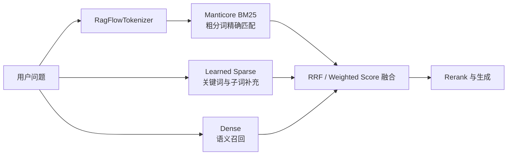

# Manticore BM25 生产化实践：实现、评测与上线边界

## 先给结论

`toLink-Rag` 当前的 Manticore BM25 已经不是一个只验证“能不能搜”的 POC，而是一条具备完整写入、召回、删除、迁移和回滚能力的候选生产链路。它在现有中英文公开集上的召回质量已经与 Elasticsearch、Qdrant 处于同一水平，按 dataset 物理建表还解决了后两种方案没有彻底解决的统计隔离问题。

但“代码链路完整”和“可以立即成为生产默认后端”不是一回事。当前默认主读仍然是 Qdrant，Manticore 仍标记为实验性后端。缺口主要不在召回准确率，而在生产环境的高可用、备份恢复、多表容量、并发延迟、资源水位和长时间稳定性验证。

因此，更准确的判断是：

> Manticore 已经具备生产候选能力，可以进入双写和影子读阶段；在完成真实业务语料验证、容量压测和故障演练之前，不应直接跳过迁移过程切成主读。

本文不再重复完整的 ES → Qdrant → Manticore 选型历史，而是聚焦当前代码回答五个问题：

1. Manticore 在 `toLink-Rag` 里承担什么职责？
2. 为什么采用“一 dataset 一张表”？
3. 为什么当前只保留粗分词？
4. 写入、召回和删除如何避免隐蔽错误？
5. 召回质量过关以后，生产上线还需要补什么？

## Manticore 在三路召回中的位置

`toLink-Rag` 不是只依靠 BM25，而是同时保留三条召回路线：

- **BM25**：擅长错误码、配置项、产品名、编号等字面精确匹配。
- **learned sparse**：把文本编码成带权重的稀疏词项，兼顾关键词和一定程度的词形、子词扩展。
- **dense**：把文本编码成稠密向量，主要负责同义表达和语义相似。

三路结果在召回 Pipeline 中融合，再进入后续 rerank。Manticore 只替换 BM25 这一条路，不替换 Qdrant 上的 learned sparse 和 dense，也不会因为 Manticore 切换而让 Qdrant 整体退出系统。



这个分工直接影响后面的粗细分词决策：Manticore BM25 不需要独自解决所有召回问题，它应该把自己最擅长的精确关键词排序做好，而不是重复 learned sparse 和 dense 已经覆盖的能力。

## 当前实现总览

Manticore 后端位于 [`src/core/storage/manticore_bm25/`](../../src/core/storage/manticore_bm25/)，通过统一工厂接入既有 BM25 管线。上层仍然调用相同的写入和召回接口，不需要知道底层是 ES、Qdrant 还是 Manticore。

核心模块的职责如下：

| 模块 | 职责 |
| --- | --- |
| `table_router.py` | 把 `dataset_id` 安全映射成独立表名 |
| `schema.py` | 定义 coarse-only 表结构、中文字符集和 IDF 语义 |
| `store.py` | 建表、写入回读、查询、删除、连接池和超时 |
| `pipeline.py` | 把预分词后的 chunk 写入 Manticore，并回写 chunk 状态 |
| `retrieval.py` | 适配统一的 BM25 召回请求和结果模型 |
| `bm25_backend.py` | 按配置装配主读、双写和影子读后端 |
| `bm25_migration.py` | 严格双写及主读/影子结果比较 |

从解析到召回的链路可以简化为：

```text
文档解析与分片
    ↓
RagFlowTokenizer 生成 coarse_tokens
    ↓
按 dataset_id 路由到 bm25_ds_v2_<dataset_id>
    ↓
REPLACE INTO 批量幂等写入 + chunk_id 回读确认
    ↓
查询侧使用相同 tokenizer
    ↓
Manticore bm25a(k1, b) 召回
    ↓
应用层按 chunk_type 乘数重排
    ↓
返回 BM25 top-k，参与三路融合
```

## 为什么是一 dataset 一张表

BM25 排序依赖三个语料统计量：文档总数、包含查询词的文档数，以及平均文档长度。它们共同决定一个词有多稀有、长文档应受到多大惩罚。

如果多个不相关知识库共享一张物理索引，即使查询时通过 `dataset_id` 过滤候选，IDF 和平均长度也可能仍按共享语料统计。一个只在某个知识库里很常见的词，可能因为放到全局语料里显得稀有而被错误抬高；反过来也可能被其他知识库的大量同名内容稀释。

当前 Manticore 方案直接把统计边界变成物理边界：

```text
dataset 101 → bm25_ds_v2_101
dataset 102 → bm25_ds_v2_102
dataset 103 → bm25_ds_v2_103
```

每张表只存一个 dataset 的 chunk，因此：

- IDF 天然只统计这个 dataset 的语料。
- `avgdl` 由 Manticore 根据该表字段长度动态计算。
- 不需要在应用层维护词频计数器。
- 不依赖过滤条件去“模拟”统计隔离。

表路由虽然已经按 dataset 隔离，查询、写入和删除仍保留 `user_id` 校验。这是第二道防线：如果 MQ 消息或调用参数发生错配，代码会拒绝向已有其他 owner 的表写入，也会阻止错误 owner 整表删除。

这种设计也带来新的代价：表数量随 dataset 数量线性增长。数据集删除时不能只删行，必须执行 `DROP TABLE` 回收空表。生产压测也不能只测一张大表，还要同时覆盖“大量小表”和“少量大表”两种分布。

## 表结构为什么只有 coarse

当前 v2 表结构只有一个全文字段：

```sql
CREATE TABLE bm25_ds_v2_<dataset_id> (
    chunk_id string,
    doc_id bigint,
    user_id bigint,
    chunk_type string,
    coarse text indexed
)
morphology='none'
index_field_lengths='1'
charset_table='non_cjk, chinese';
```

其中三个选项不能随意删除：

- `morphology='none'`：正文已经经过项目的 RagFlowTokenizer 预分词，Manticore 不再做词干化或二次形态处理。
- `index_field_lengths='1'`：让 `bm25a()` 可以使用字段长度做长度归一。
- `charset_table='non_cjk, chinese'`：显式把中文加入可索引字符集；不配置时，中文词可能被当成分隔内容丢弃。

### 粗分词和细分词分别解决什么

粗分词倾向于保留完整词语，例如“无线网络”“新能源汽车”；细分词会进一步拆出“网络”“汽车”等较短成分。

细分词能扩大局部匹配范围，但它会产生更多高频短词，改变词频、文档长度和 IDF。把粗细词直接混进一个 BM25F 分数，并不等价于 ES 的多字段查询，也不等价于 Qdrant 对两个隔离词项空间分别计分后求和。

实际评测验证了这个风险：

| Manticore 方案 | CovidRetrieval Recall@10 | nDCG@10 |
| --- | ---: | ---: |
| coarse + fine BM25F 初版 | 0.656 | 0.538 |
| coarse + fine，修正 IDF | 0.760 | 0.635 |
| coarse-only + 显式 IDF 语义 | 0.919 | 0.818 |

因此 v2 明确拒绝旧 fine 字段，使用 `bm25_ds_v2` 表前缀区分索引代际，已有错误结构也不会被 `CREATE TABLE IF NOT EXISTS` 静默复用。

### 不使用细分词是否会漏召回

会存在一种明确边界：查询只包含复合词内部的短词，而索引粗分词只保留完整复合词时，纯 BM25 可能无法命中。例如查询“网络”，文档只有粗词“无线网络”。

但在当前系统里，这个缺口不需要由 Manticore 单路兜底：learned sparse 可以提供关键词、词形或子词层面的补充，dense 可以覆盖语义改写，三路结果最终再融合。只要 sparse 路使用独立的编码空间且召回深度足够，Manticore 保持 coarse-only 会比在同一 BM25 分数里混入细词更稳定。

这项决策的边界也很清楚：如果某个数据集没有配置可用的 learned sparse 模型，或者 sparse 路的 `top_k` 过小，复合词局部匹配的缺口就可能重新暴露。因此仍应保留“细分词独有命中”专项回归，而不是假设多路召回永远不会退化。

## Manticore 实际怎样计算分数

当前查询使用 Manticore 原生 `bm25a(k1, b)`：

```sql
SELECT chunk_id, doc_id, chunk_type, WEIGHT() AS w
FROM bm25_ds_v2_<dataset_id>
WHERE MATCH(?) AND user_id = ?
ORDER BY w DESC, id ASC
LIMIT ?
OPTION
    ranker=expr('1000*bm25a(1.2,0.75)'),
    idf='plain,tfidf_unnormalized';
```

查询词通过参数传递，MATCH 内部则被编码成显式 OR：

```text
"公积金" | "提取" | "流程"
```

这里有三个经过真实问题验证的细节：

1. 空格连接不能替代显式 OR，否则多词查询可能表现得更接近“所有词都要命中”，召回会变窄。
2. SQL 参数化不能自动处理 MATCH 扩展语法，代码还需要逐词加引号并转义反斜杠和双引号。
3. `plain,tfidf_unnormalized` 用于固定项目所需的 IDF 语义，避免默认归一方式让高频词和多词查询的分数发生不符合现有基线的漂移。

参考文章中曾记录过“先取 top50，再拉回 coarse/fine 文本，由应用层重新计算 BM25”的中间阶段。当前代码已经不再走这条路径：BM25 主分由 Manticore 按 dataset 表的真实统计动态计算，应用层只在配置了 `BM25_TYPE_MULT` 时扩大候选池，按 `chunk_type` 乘一次权重后重新排序。

例如表格、代码块、公式块可以温和升权，front matter 可以降权。候选池扩大是必要的，因为只有先让候选进入应用层，类型乘数才可能改变最终 top-k。

## 多 dataset 查询为什么不能直接比较原始分

一 dataset 一张表解决了统计隔离，也意味着不同表的 BM25 原始分不在同一统计空间：同样的分数，在大表和小表里的含义可能不同。

因此 Manticore Retriever 显式声明 `score_scope = "dataset"`。一次请求涉及多个 dataset 时，上层不会直接把各表 raw score 放在一起排序，而是先在每张表内部排名，再用 RRF 把名次转成可比较分数。

这不是额外的“效果调参”，而是物理隔离后的正确性要求。否则某个表里的稀有词或语料规模差异，可能长期把其他 dataset 的结果挤出 top-k。

## 写入不是“SQL 没报错就算成功”

写入链路采用确定性 row id 和 `REPLACE INTO`：同一个 `chunk_id` 总能映射到同一个正整数 id，重复写入会覆盖同一行，因此回填和重试具备幂等性。

为了避免大批次撑爆 SQL 包或内存，每次写入同时受两个限制：

- 条数上限，默认每批 500 条。
- 估算 UTF-8 字节上限，默认每批 5 MiB。

单个 coarse 文本也有 128 KiB 上限，异常巨型 chunk 会在进入 Manticore 前失败。

更重要的是，批量写完还会按 `chunk_id` 回读。只有实际查询到的 chunk 才会被标记为成功；如果 SQL 执行没有报错但回读缺失，该 chunk 仍按失败处理。

这一步专门规避过一个真实陷阱：Manticore 的 SELECT 有默认返回行数限制，如果回读语句不显式添加 `LIMIT`，第 21 条以后的已写入记录可能被错误判断为失败。当前实现按回读批次长度显式设置 LIMIT，并通过单元测试固定这一行为。

## 表生命周期与并发边界

Manticore 使用进程内共享 `aiomysql` 连接池，默认参数为：

| 配置 | 默认值 | 作用 |
| --- | ---: | --- |
| `MANTICORE_POOL_MINSIZE` | 1 | 每个应用进程最小连接数 |
| `MANTICORE_POOL_MAXSIZE` | 10 | 每个应用进程最大连接数 |
| `MANTICORE_POOL_RECYCLE_SECONDS` | 300 | 连接回收周期 |
| `MANTICORE_CONNECT_TIMEOUT_SECONDS` | 5 | 建连超时 |
| `MANTICORE_POOL_ACQUIRE_TIMEOUT_SECONDS` | 5 | 获取连接超时 |
| `MANTICORE_TIMEOUT_SECONDS` | 10 | 单条 SQL 超时 |

应用关闭时会在 FastAPI lifespan 中关闭连接池，避免进程退出期间遗留连接。

建表操作在单进程内有锁和 ready cache，减少重复 DDL；其他进程删除表后，如果写入遇到明确的缺表错误，当前进程会清理缓存、重建表并幂等重试一次。

数据集删除则走完整生命周期：先按文档清理行，随后调用 Manticore 专有的 `delete_by_dataset()` 整表 DROP。DROP 前会读取表内 owner；归属与删除请求不一致时拒绝执行，避免错删整个知识库索引。

## 离线召回质量到了什么水平

当前仓库记录的统一评测结果如下。三个后端使用同一份语料和 query，Manticore 跑的就是生产 coarse-only store，而不是单独写的一份简化模拟。

| 数据集 | Qdrant R@10 / nDCG@10 | Manticore R@10 / nDCG@10 | ES R@10 / nDCG@10 | Manticore ↔ Qdrant overlap@10 |
| --- | ---: | ---: | ---: | ---: |
| NFCorpus，英文 | 0.156 / 0.323 | 0.156 / 0.323 | 0.154 / 0.322 | 0.934 |
| CovidRetrieval，中文 | 0.914 / 0.815 | 0.919 / 0.818 | 0.918 / 0.819 | 0.861 |

这些数字支持两个结论：

1. Manticore 当前打分没有在中英文公开集上出现相对 ES/Qdrant 的明显质量退化。
2. `overlap@10` 不等于准确率。不同后端 top10 不完全相同，并不表示其中一个一定错误；应优先看有人工相关性标注的 Recall 和 nDCG。

它们不能支持“Manticore 在所有业务上更强”的结论。NFCorpus 是英文医学营养语料，CovidRetrieval 是中文疫情医疗问答，而且中文 corpus 只采样了 1 万条。合同、政务、电商、代码、表格、超短标题和企业专有名词仍需要在新的十万级混合数据集和真实业务 query 上继续验证。

详细数据和复现命令见 [`docs/internals/bm25_eval.md`](../../docs/internals/bm25_eval.md)。

## 性能和资源：目前能说什么，不能说什么

从架构上看，Manticore 不依赖 JVM，也不需要维护 ES 那套集群状态；当前表只索引一个 coarse 字段，fine 字段也没有重复占用索引空间。这些因素使它具备比 ES 更轻的基础条件。

但当前证据还不足以给出生产 QPS、P99、每百万 chunk 内存或磁盘成本。公开集评测主要验证召回质量，不等价于并发压测和资源测试。项目已经准备了十万级中英文、多行业数据集以及读写 workload，但现有 evaluator 还没有完整覆盖以下项目：

- 并发 1/8/32/64 下的 QPS、P50/P95/P99。
- 冷缓存与热缓存差异。
- top-k 10 与 top-k 100 的成本差异。
- 批量回填速度、索引 ready 延迟和磁盘放大。
- 大量 dataset 表同时存在时的常驻内存、文件句柄和表管理成本。
- 混合读写、后端重启、连接耗尽和部分批次失败。
- 30 分钟稳定负载及生产前 6 小时 soak test。

所以现阶段可以说“它的召回质量已经具备比较资格”，不能说“它已经被证明比 ES/Qdrant 更快、更省资源”。后者必须由同机、同数据、同 tokenizer、同过滤范围的压测结果支撑。

## 迁移能力为什么也是生产能力的一部分

直接修改 `BM25_BACKEND=manticore` 会制造一个明显风险：历史数据还在旧后端，新写入却可能只进入新后端，最终形成无法立即发现的缺失。

当前项目已经提供完整迁移路径：

```text
Qdrant 主读
    ↓ 开启 qdrant,manticore 严格双写
存量按 dataset 回填
    ↓
完整 chunk_id 对账与修复
    ↓
Qdrant 主读 + Manticore 影子读
    ↓ 观察准确率、延迟、错误率和资源
Manticore 主读 + Qdrant 影子读
    ↓ 保留一个回滚观察期
决定是否停止旧 BM25 双写
```

严格双写不是 best-effort：任何一个后端写入失败，当前 BM25 入库都按失败处理，不会用“另一个后端成功”掩盖数据不一致。

影子读不会修改线上结果。主后端正常返回的同时，稳定采样的一部分请求会在后台查询另一个后端，记录 top-k Jaccard overlap、top1 是否相同以及两侧耗时。影子超时或失败只告警，不把影子结果降级成主结果。

存量对账也不是只比较数量，而是比较 MySQL ACTIVE chunk 和 Manticore 的完整 `chunk_id` 集合。这样可以识别“总数相同，但丢了一条又多了一条”的假一致。

完整操作步骤见 [`docs/ops/manticore_bm25_migration.md`](../../docs/ops/manticore_bm25_migration.md)。

## 当前生产上线的硬门槛

切主读之前至少需要满足：

1. 固定使用已验证的 Manticore `27.1.5`，不能依赖 `latest` 静默升级。
2. 生产环境配置持久卷、备份恢复和高可用，不使用根 Compose 单节点作为生产拓扑。
3. 跨主机 9306 启用鉴权与 TLS，不暴露到公网。
4. 服务端连接上限覆盖“应用副本数 × 每进程连接池上限 + 回填和运维连接”。
5. 真实集成测试、固定质量门禁和 `/ready` 检查通过。
6. 按真实 dataset 数量、最大 chunk 数和查询并发完成容量压测。
7. 严格双写后完成存量回填，并至少连续两次精确对账零差异。
8. 影子读覆盖一个完整业务周期，错误率、P95/P99、空结果率、资源水位满足系统 SLO。
9. 完成后端重启、节点故障、连接耗尽和备份恢复演练。

只满足前五项，说明功能基本可用；九项全部满足，才有充分证据把它作为生产主读。

## 已知风险与后续观察点

### 表数量膨胀

一 dataset 一张表是统计隔离的核心，同时也是最需要压测的资源风险。必须监控表总数、空表、磁盘碎片、文件句柄和建表延迟，并确保 dataset 删除最终能触发 DROP。

### 多表原始分不可比

当前已用 dataset 内排名 + RRF 处理跨表合并。后续改造 Retriever 时，不能丢失 `score_scope="dataset"` 标记，否则这个问题会悄悄复发。

### learned sparse 不是无条件兜底

coarse-only 的细粒度缺口依赖 sparse 路补充。数据集缺少 sparse 配置、模型不可用、词项被 top-k 截断或融合权重不合理，都可能让补偿失效。需要按召回来源持续观察 query 级命中情况。

### schema 代际变更需要重建

中文字符集、全文字段、morphology 或 IDF 语义发生变化时，不能复用旧表。当前 v2 前缀和建表校验可以阻止静默漂移，但真正迁移仍需要新表、回填、对账和切换。

### 哈希 row id 存在理论碰撞

`chunk_id` 使用 64 位 BLAKE2b 结果映射为正整数 row id。实际业务规模下碰撞概率极低，但不是数学上的零。`chunk_id` 回读和精确对账能发现部分异常；如果未来规模显著扩大，可以考虑增加碰撞检测或调整主键方案。

### 删除存在异步一致性窗口

项目删除链路经过 MQ 和补偿机制，数据库状态翻转与搜索索引物理删除之间可能存在短暂窗口。这不是 Manticore 独有问题，但切换后仍要监控已删除 chunk 的残留命中，并通过对账和清理任务收敛。

## 如何验证这套方案

提交或发布前，至少执行三层验证。

第一层是单元测试，覆盖表结构、查询转义、OR 语义、写入拆批、回读 LIMIT、owner 防线、连接池和超时：

```bash
pytest \
  tests/unit/core/storage/manticore_bm25 \
  tests/unit/core/storage/test_bm25_backend.py \
  tests/unit/core/storage/test_bm25_migration.py -q
```

第二层是真实 Manticore 集成测试，验证实际 SQL 协议、中文索引、幂等写入、租户隔离和整表删除：

```bash
TOLINK_RUN_REAL_MANTICORE_TESTS=1 \
pytest --run-integration -m real_env \
  tests/integration/core/storage/manticore_bm25/test_real_environment.py
```

第三层是固定公开集质量门禁：

```bash
python scripts/dev/eval_bm25_recall.py \
  --from-beir /data/nfcorpus \
  --k 10 \
  --with-manticore \
  --manticore-min-recall 0.15 \
  --manticore-min-ndcg 0.31
```

生产切换还必须增加第四层：十万级多行业 workload、真实流量影子读、资源采样和故障演练。前三层证明“实现没有明显写歪”，第四层才证明“它适合当前生产环境”。

## 总结

当前 Manticore 方案最重要的价值，不是简单地把 ES 或 Qdrant 换成另一个搜索引擎，而是把 BM25 的统计边界明确收窄到了 dataset：IDF 和平均长度只由当前知识库决定，避免共享索引中的语料相互污染。

质量上，coarse-only 不是临时妥协，而是公开集对比后的选择。细分词直接混入同一 BM25F 分数会明显破坏中文排序；在三路召回架构里，把局部词和语义补偿交给 learned sparse、dense，再通过融合汇总，比让 Manticore 一条路承担所有能力更清晰。

工程上，表结构校验、幂等写入、写后回读、owner 防线、连接池、超时、整表删除、严格双写、存量对账、影子读和回滚链路已经齐备。这些能力让 Manticore 有资格进入生产验证阶段。

最后剩下的判断不能再靠离线准确率代替：只有真实业务周期里的 P95/P99、资源水位、多表容量、故障恢复和长时间稳定性都满足 SLO，Manticore 才算真正完成从“生产候选”到“生产主读”的最后一步。

## 相关实现与文档

- [`src/core/storage/manticore_bm25/`](../../src/core/storage/manticore_bm25/)
- [`src/core/storage/bm25_backend.py`](../../src/core/storage/bm25_backend.py)
- [`src/core/storage/bm25_migration.py`](../../src/core/storage/bm25_migration.py)
- [`src/core/storage/es/bm25_retriever.py`](../../src/core/storage/es/bm25_retriever.py)
- [`docs/internals/bm25_eval.md`](../../docs/internals/bm25_eval.md)
- [`docs/internals/sparse_vector.md`](../../docs/internals/sparse_vector.md)
- [`docs/ops/manticore_bm25_migration.md`](../../docs/ops/manticore_bm25_migration.md)
- [`scripts/dev/eval_bm25_recall.py`](../../scripts/dev/eval_bm25_recall.py)
- [`scripts/migrate/qdrant_to_manticore_bm25.py`](../../scripts/migrate/qdrant_to_manticore_bm25.py)
