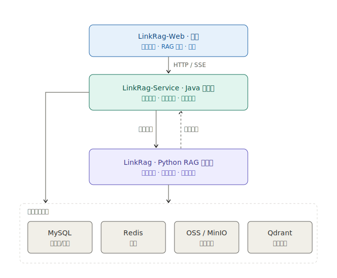

# LinkRag 项目新人指南

> 面向新加入成员的总览文档。读完应能回答三个问题：项目由哪几个仓库组成、各自负责什么、它们如何协作。
> 单个仓库的开发细节以各仓库的 `README.md`、`CLAUDE.md` 和 `docs/` 为准，本文只做导航和全局视图。

---

## 一、项目是什么

LinkRag 是一套面向企业知识库场景的 **RAG（检索增强生成）系统**：把文档解析、知识图谱可视化与 AI 检索问答结合起来，将知识库变成可对话、可探索的智能图谱。

完整能力覆盖文档接入 → 解析 → 分片 → 向量化 → 检索 → 问答的全链路。系统采用 **"Java 管理端 + Python RAG 执行端 + React 前端"** 的三层协作模式，分属三个独立仓库。

---

## 二、三个仓库

| 仓库 | 角色 | 技术栈 | 代码库 |
| --- | --- | --- | --- |
| **LinkRag-Web** | 前端 | React 19 + TypeScript + Vite 6 | [github.com/ql-link/LinkRag-Web](https://github.com/ql-link/LinkRag-Web) |
| **LinkRag-Service** | Java 管理端 | Java 17 + Spring Boot 2.5.3 + Maven 多模块 | [github.com/ql-link/LinkRag-Service](https://github.com/ql-link/LinkRag-Service) |
| **LinkRag-Rag** | Python RAG 执行端 | Python 3.10+ + FastAPI + Kafka + Qdrant | [github.com/ql-link/LinkRag](https://github.com/ql-link/LinkRag) |

### 2.1 LinkRag-Web —— 前端

用户直接交互的 Web 界面，负责所有可见的产品功能。

职责包括：知识图谱可视化（基于 D3 渲染文档关系网络）、知识库 RAG 问答与多会话对话、数据集与知识文件管理、LLM 配置中心、用量统计，以及响应式布局和暗色模式。

- 入口：`src/main.tsx` / `src/App.tsx`，路由在 `src/routes.ts`
- 页面：`src/pages/`（chats、datasets、files、settings、usage、home 等）
- 后端调用：`src/services/`（auth、chat、dataset、llm、oss、user）
- 本地开发端口：`3000`（`npm run dev`，需 Node.js 20+）

### 2.2 toLink-Service —— Java 管理端

系统的"控制平面"，承接所有管理入口、用户态资源和权限，是前端唯一直接对接的后端。

职责包括：用户认证与管理、系统/用户 LLM 配置、对话与消息、用量统计、数据集与知识文件管理、原始文件上传与私有文件读取、解析任务投递、解析结果回传与 SSE 事件转发、Redis 缓存一致性、OSS（本地 / MinIO）文件存储。

Maven 多模块划分：

| 模块 | 职责 |
| --- | --- |
| `link-model` | Entity、Request/Response DTO、枚举、统一响应模型 |
| `link-core` | 异常体系、全局异常处理、认证上下文、加密与基础工具 |
| `link-components` | Redis、MQ、OSS 等横向组件 |
| `link-mapper` | MyBatis-Plus Mapper |
| `link-service` | 用户、配置、数据集、知识文件、解析、用量等业务逻辑 |
| `link-api` | Controller、启动类、接口层配置与测试入口 |

- 启动类：`link-api/.../LinkApplication.java`，端口 `8080`
- 鉴权：sa-token；数据库 `tolink_rag_db`（MySQL）
- 新需求采用 Spec-as-Test 工作流：`brief.md → acceptance.feature → technical_design.md → 代码 + 测试`

### 2.3 toLink-Rag —— Python RAG 执行端

系统的"数据/计算平面"，承接重型的文档处理与 RAG 计算，通过 MQ 与 Java 端异步协作，不直接面向前端。

职责包括：文档解析（PDF / Word / HTML，PDF 后端可插拔，默认接入 MinerU API）、解析结果统一沉淀为 Markdown、层次化语义分片、Embedding 与向量索引构建、Chunk 状态维护（MySQL，用于失败补偿）、向量检索存储（Qdrant），以及通过 MQ 完成解析任务消费、终态通知、缓存同步和用量上报。

- 应用入口：`src/main.py`（FastAPI），配置 `src/config.py`
- 核心业务：`src/core/`；HTTP 路由 `src/api/routes`
- 数据库演进唯一入口：Alembic 迁移（`migrations/`）
- 本地开发端口：`8000`（Swagger UI `/docs`，健康检查 `/health`）

---

## 三、整体架构

两端通过 **MySQL、MQ、OSS/MinIO 和必要的内部 HTTP 接口** 协作。Java 端是控制平面（用户可见状态、权限、文件入口），Python 端是执行平面（解析、向量化、RAG 计算）。

### 共享基础设施

| 组件 | 用途 |
| --- | --- |
| MySQL（`tolink_rag_db`） | 业务元数据、解析任务与 Chunk 状态 |
| MQ（Kafka / RabbitMQ，默认 Kafka） | 解析任务投递与结果回传 |
| OSS / MinIO | 原始文件与解析产物存储 |
| Redis | Java 端缓存（用户、LLM 配置等） |
| Qdrant | 向量检索存储 |

---

## 四、核心数据流：一次文档解析

新人理解这条链路，就理解了三个仓库如何协作：

1. **上传**：前端（Web）通过 Java 上传知识文件。
2. **登记**：Java 写入文件元数据、OSS 对象信息和解析聚合记录。
3. **投递**：用户触发解析后，Java 在事务内更新 `latest_parse_task_id`，并发送 MQ 消息 `tolink.rag.parse_task`。
4. **消费**：Python 消费解析任务，读取 Java 暴露的内部文件内容接口。
5. **执行**：Python 完成解析 → Markdown → 分片 → Embedding → 写入 Qdrant，并维护 Chunk 状态。
6. **回传**：Python 通过 `tolink.rag.parse_result` 回传终态结果。
7. **转发**：Java 消费结果消息，校验归属关系，通过 SSE 把事件转发给前端。

MQ 消息契约见 `toLink-Service/docs/reference/mq_contracts.md` 与 `toLink-Rag/docs/api/mq_contracts.md`。

---

## 五、本地启动速查

| 仓库 | 启动命令 | 端口 | 前置条件 |
| --- | --- | --- | --- |
| toLink-Rag | `docker compose up -d` → `alembic upgrade head` → `uvicorn src.main:app --reload` | 8000 | Python 3.10+，MySQL/Redis/MinIO/MQ/Qdrant |
| toLink-Service | `mvn spring-boot:run -pl link-api` | 8080 | Java 17，MySQL/Redis/MQ/OSS |
| LinkRag-Web | `npm install` → `npm run dev` | 3000 | Node.js 20+ |

依赖的中间件（MySQL、Redis、MinIO、MQ、Qdrant）由 toLink-Rag 的 `docker-compose.yml` 一并拉起，建议先启动它。
