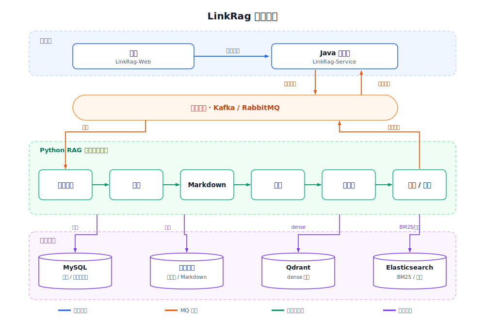
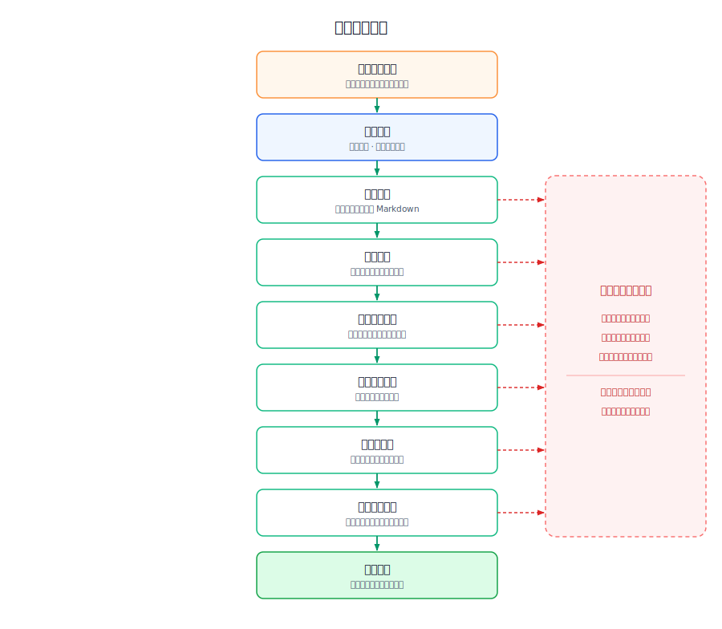
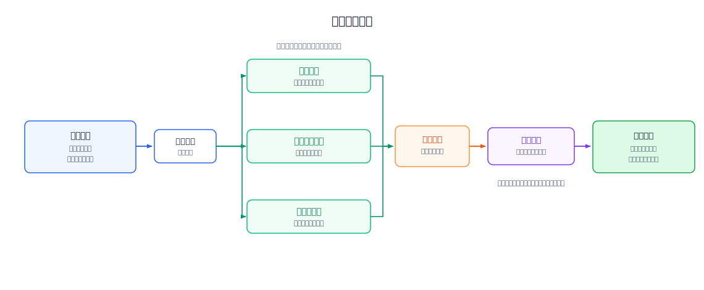

<div align="center">

# LinkRag

面向企业知识库场景的完整 RAG 系统。

</div>

<p align="center">
  
  
  
  
  
</p>

## LinkRag 是什么？

`LinkRag` 是面向企业知识库场景的完整 RAG 系统，覆盖从文档接入、解析、分片、向量化、检索到问答生成的全链路能力。

本仓库是其中的 **Python RAG 服务**，当前阶段聚焦最关键的知识入库链路：把复杂文档解析为结构化 Markdown，经层次化语义分片形成可检索的知识单元，再完成 Embedding 与向量索引构建，并通过消息队列与业务系统异步集成。

能力细节见技术文档：[文件解析](./docs/internals/file_parser.md) · [分块](./docs/internals/chunking.md) · [向量化](./docs/internals/vectorization.md) · [召回](./docs/internals/recall_pipeline.md)。

## 快速开始

前提：Python `3.10+`、Docker、以及 MySQL / Redis / 对象存储 / Kafka 或 RabbitMQ / Qdrant 等依赖服务，外加可用的 LLM / Embedding 服务（PDF 解析可选 MinerU）。

```bash
docker compose up -d                       # 1. 启动外部依赖
python -m venv .venv && source .venv/bin/activate
pip install -e ".[dev]"                     # 2. 安装项目
cp .env.example .env                        # 3. 准备配置（按需修改连接信息，勿提交密钥）
alembic upgrade head                        # 4. 初始化数据库
uvicorn src.main:app --host 0.0.0.0 --port 8000 --reload  # 5. 启动服务
```

启动后访问 Swagger UI `http://localhost:8000/docs`、健康检查 `http://localhost:8000/health`。

完整前提条件、配置项与联调清单见 [部署](./docs/ops/deploy.md) 与 [配置](./docs/ops/configure.md)；测试运行方式见 [docs/contributing.md §三](./docs/contributing.md#三测试)。

## 关联仓库

LinkRag 由三个仓库协作组成：

| 仓库 | 角色 |
| --- | --- |
| [ql-link/LinkRag](https://github.com/ql-link/LinkRag)（本仓） | Python RAG 服务：文档解析、分片、向量化、索引与召回 |
| [ql-link/LinkRag-Service](https://github.com/ql-link/LinkRag-Service) | Java 管理端：业务编排、任务下发与终态回收 |
| [ql-link/LinkRag-Web](https://github.com/ql-link/LinkRag-Web) | 前端：知识库管理与交互界面 |

## 架构导览

LinkRag 以本仓的 Python RAG 服务为核心，前端与 Java 管理端在业务侧协作，通过消息队列与 RAG 服务异步集成，数据落在共享基础设施。



- **外部协作边界**：前端与 Java 管理端负责业务编排，只通过消息队列与 RAG 服务交互（Java 发 `parse_task`、RAG 回 `parse_result`），不直接耦合解析实现。
- **本仓内部主链路**：文档接入 → 解析 → Markdown → 分片 → 向量化 → 索引/召回，状态由 MySQL 维护以支持失败补偿与一致性恢复。

### 解析流水线

文档入库走六阶段状态机，任一阶段失败即终态并回发 `parse_result failed`。完整状态语义见 [解析任务状态机](./docs/internals/parse_task_pipeline.md) 与 [解析 Pipeline 架构](./docs/internals/pipeline_architecture.md)。



### 召回流水线

查询侧并行触发多路 Retriever，按容错策略收敛后做 RRF 粗融合。详见 [召回 Pipeline](./docs/internals/recall_pipeline.md)。



## 深入文档

完整导航见 [docs/README.md](./docs/README.md)。常用入口：

- **对外契约**：[HTTP](./docs/api/http_contracts.md) / [MQ](./docs/api/mq_contracts.md) / [错误码](./docs/api/error_codes.md) / [MySQL](./docs/api/schemas/mysql.md) · [Qdrant](./docs/api/schemas/qdrant.md) · [Elasticsearch](./docs/api/schemas/elasticsearch.md) Schema
- **内部实现**：[file_parser](./docs/internals/file_parser.md) / [chunking](./docs/internals/chunking.md) / [vectorization](./docs/internals/vectorization.md) / [mq](./docs/internals/mq.md)
- **部署与配置**：[deploy](./docs/ops/deploy.md) / [configure](./docs/ops/configure.md)
- **贡献者规范**：[docs/contributing.md](./docs/contributing.md) — 分支、提交、测试、迁移、文档同步
- **项目入口（AI / 新成员）**：[CLAUDE.md](./CLAUDE.md)

## 许可证

本项目基于 MIT License 开源。
