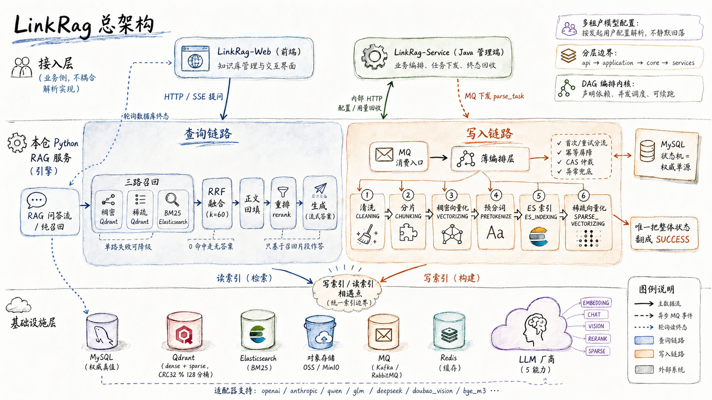
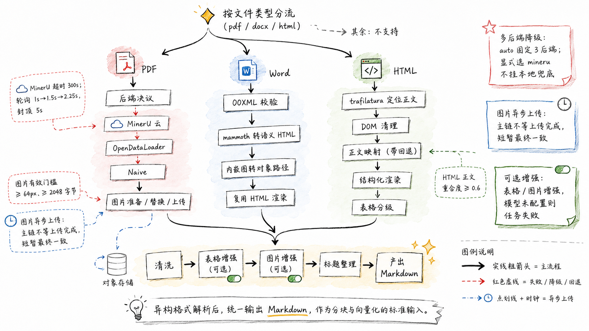
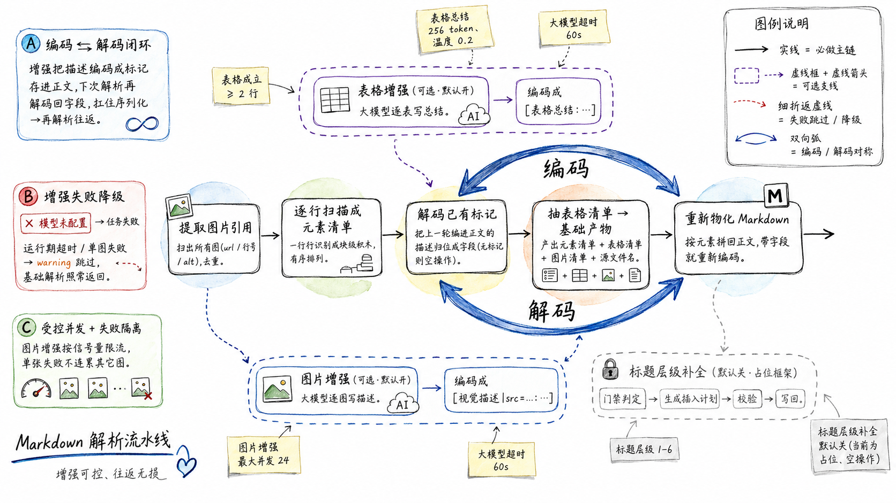
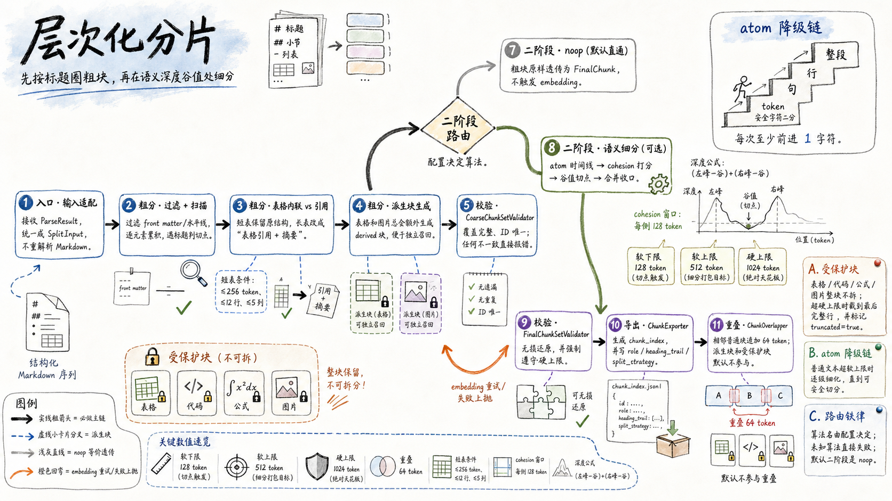
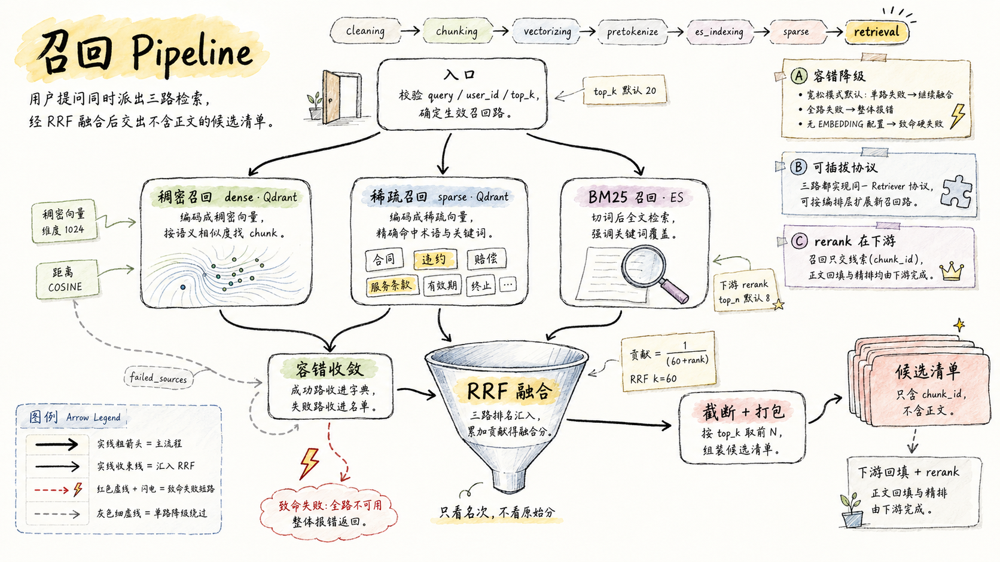
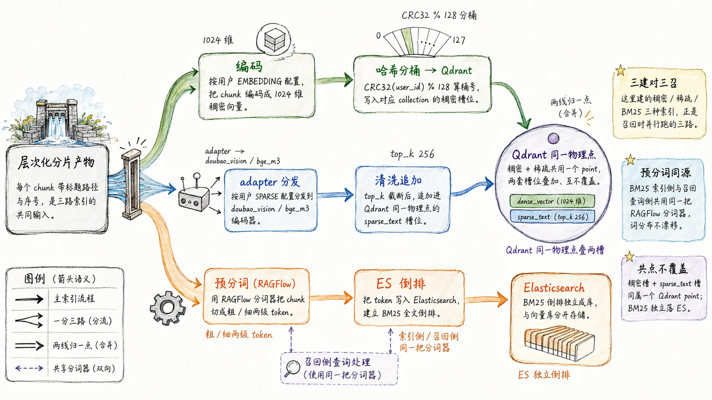
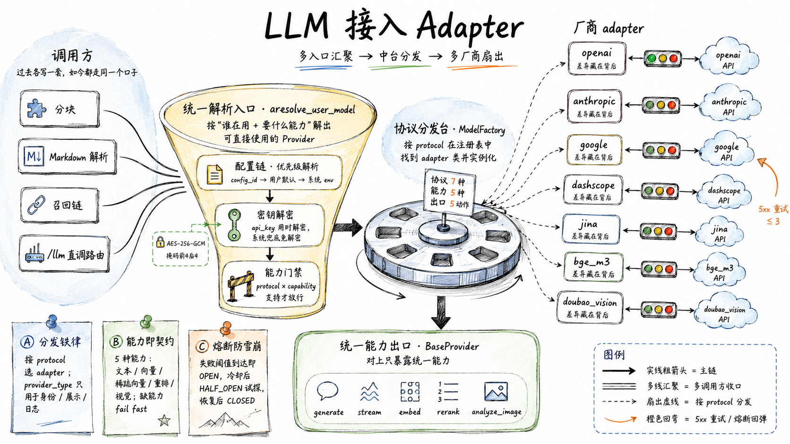
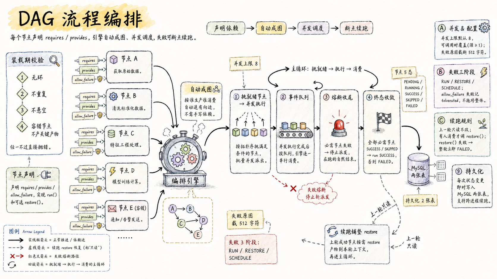
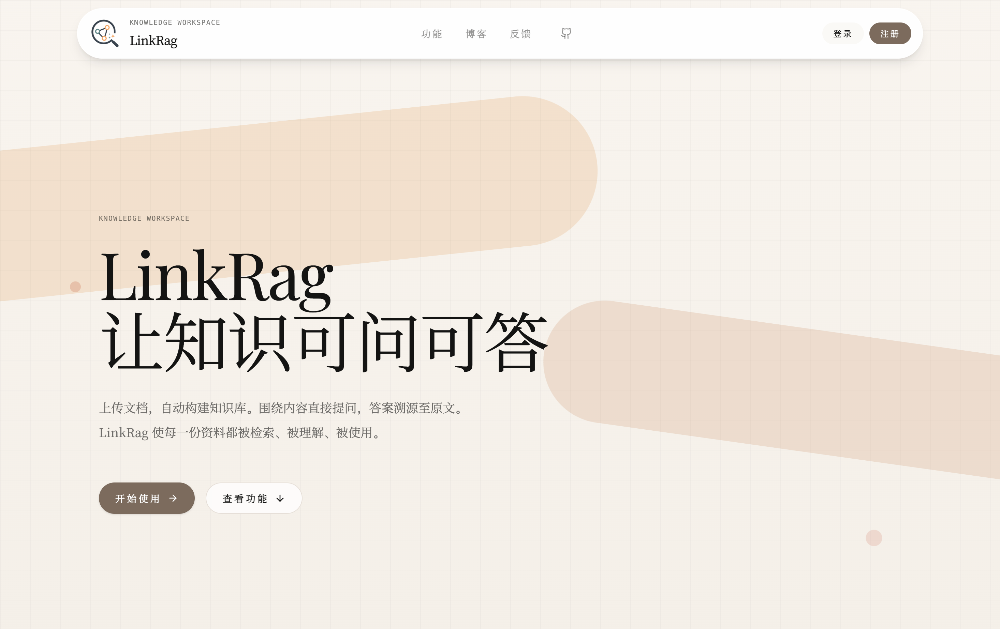
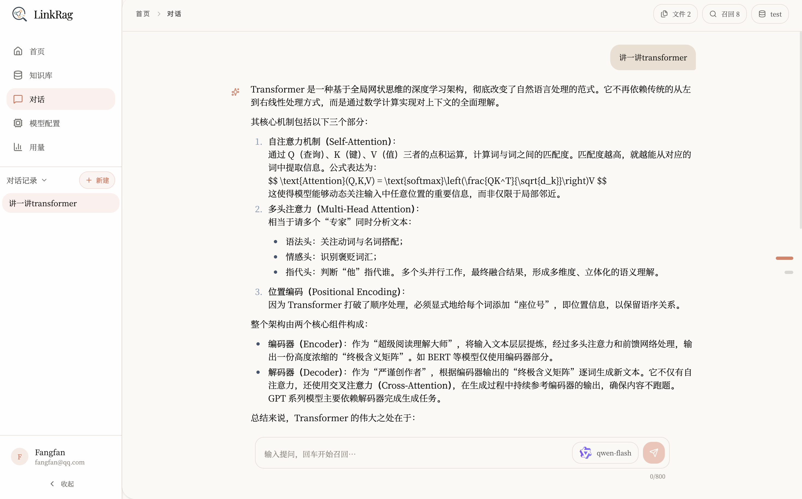

# LinkRag

人人可用的企业级 RAG 系统——把复杂文档，变成可以对话的知识。

  <b>简体中文</b> · <a href="./README_EN.md">English</a>

  
  
  
  
  

  

  

## LinkRag 是什么？

`LinkRag` 是一款从0开始完全自研自建的已上线RAG项目，立意之初是为了作为Agent的数据底座而构建，提供非结构化文档的存储召回。目前已经基于传统路线实现向量RAG，构建出完整的Web服务，可作为通用知识库解决企业/个人知识问答场景。同时我们也在拓展Agent的落地场景，将文档的存与查拓展到辅助写成为长期记忆底座。

本仓库是其中的 **Python RAG 服务**，也是整个系统的引擎：它把各种复杂格式的文档解析成结构化 Markdown，按语义切成可检索的知识单元，建立稠密、稀疏、BM25 三路索引；在查询时多路并行召回、融合、重排，最终基于真正检索到的内容生成有据可查的答案。整个过程通过消息队列与 Java 业务系统异步集成，业务侧只管下发任务，不必关心解析与检索的内部实现。

能力细节见技术文档：[文件解析](./docs/internals/file_parser.md) · [分块](./docs/internals/chunking.md) · [向量化](./docs/internals/vectorization.md) · [召回](./docs/internals/recall_pipeline.md)。

## 主要功能

从解析到问答，每一个环节都是自研搭建，针对企业文档的真实复杂度做了大量工程取舍。下面七项是 LinkRag 区别于"调几个开源库拼起来"的地方。

**1. 复杂文档进，干净知识出——深度文档理解**

企业文档从来不规整：版式错综的 PDF、带合并单元格的表格、嵌着图片和广告的网页。LinkRag 把 PDF、Word、HTML 统一解析为结构化 Markdown，并按格式选用专用引擎——PDF 可在 MinerU 精准解析、OpenDataLoader、PyMuPDF 之间按可配置的回退链择优；HTML 先用 trafilatura 定位正文、剥离导航和样板，再由自研渲染器把表格、图片、列表保真还原，合并单元格、嵌套表这类复杂结构降级为"记录式 Markdown"而不是直接丢掉；图片落对象存储后还能接视觉模型做内容增强。大文件解析全程流式落盘，不会把整个源文件读进内存。

  

  

**2. 切得准，才检得到——结构感知的层次化分片**

检索质量的上限，在切分那一刻就定了。LinkRag 不做粗暴的定长截断，而是两阶段切分：先按标题层级和 token 软下限划出候选边界，再用语义细分算法（TextTiling 深度谷值）在话题真正转折的地方下刀。表格、代码、公式、图片被标记为"受保护元素"整体保留、绝不拦腰切断；表格和图片还会额外生成可独立召回的派生片段，让"第三节那张表"也能被单独命中。每个片段都携带自己的标题路径，作为上下文锚点。

  

**3. 三路召回，各取所长——混合检索 + RRF 融合**

没有哪一种检索方式能包打天下。LinkRag 同时跑三路：稠密向量（Qdrant，擅长语义相似）、稀疏向量（lexical 权重，擅长术语和关键词的精确匹配）、BM25 全文（Qdrant sparse vector + IDF，擅长关键词匹配）。三路并行触发，单路超时或出错按容错策略降级、不拖垮整体，再用 RRF（只看排名、不直接相加）把物理意义完全不同的分数稳定融合在一起。召回路是可插拔的协议，将来接入 GraphRAG、wiki 只需实现一个接口；融合之后还能接 rerank 精排，重排模型不可用时自动回落到 RRF 顺序。

  

**4. 答案有据可查，不替你编——抗幻觉的流式问答**

RAG 最怕"一本正经地胡说"。LinkRag 把召回到的片段回填正文、按 token 预算拼成带编号的上下文注入提示词，要求模型只基于这些片段作答、没有依据时明确回答"无法回答"。答案通过 SSE 逐字流式返回；终态语义被严格区分：零命中走"无答案"分支、生成失败如实报错，绝不把一个没有答案的响应伪装成成功。问答使用的是发起用户自己配置的模型，不会静默回落到系统默认。

**5. 入库不怕中断，失败可续跑——可靠的处理流水线**

一篇文档入库要过多道工序（清洗 → 分片 → 向量化 → 预分词 → BM25 索引 → 稀疏向量化），任何一步都可能因为外部服务抖动而失败。LinkRag 以 MySQL 为权威真值源、把每一步的状态都落库：任一阶段失败即终态，重试时从第一个未完成的阶段断点续跑，已成功的阶段直接跳过；task_id 唯一索引保证同一任务不被重复处理，重试用 CAS 抢占防止并发重复执行。向量与全文索引都是可重建的副本，一旦与真值出现不一致，由补偿流程收敛。

分片之后，稠密向量、稀疏向量、BM25 三路索引并行构建，BM25 通过 Qdrant sparse vector 承载，并在索引侧与召回侧共用同一套预分词结果，保证词分布不漂移：

  

**6. 一套服务，多租户各用各的模型——解耦集成与按用户配置**

LinkRag 通过消息队列与 Java 业务系统异步集成，业务侧只负责下发任务、读取终态，不与解析实现耦合。它天生为多租户设计：Embedding、Chat、Vision、Rerank、稀疏编码这五种能力，每一种都按发起用户自己的配置解析，不同用户可以用不同的模型；解析行为还能按数据集粒度配置（PDF 后端、分块参数、增强开关）。每个用户的向量数据按哈希路由到独立分桶，互不干扰。

  

**7. 声明依赖，自动并行——轻量 DAG 流程编排**

项目内置了一个业务无关的轻量 DAG 编排内核。每个节点只声明自己"需要哪些产物（requires）、产出哪些产物（provides）"，引擎据此自动推导依赖关系、编排成有向无环图，并在启动期就把环、重复产物、悬空依赖这类定义错误查出来。运行时互不依赖的节点自动并发（带并发上限），完成事件串行推进以避免重复调度；标记为允许失败的节点不会拖垮整体。它支持基于上一轮运行的续跑——成功的节点跳过、被下游依赖的产物按需 `restore` 恢复，上一轮只读不改；运行态可持久化到 MySQL，支持跨进程恢复。

  

## 在线体验

线上地址：[http://linkrag.cn/](http://linkrag.cn/)。上传文档、自动构建知识库，围绕内容直接提问，答案逐字流式返回，并溯源到原文片段。

  

  

## 关联仓库

LinkRag 由三个仓库协作组成：

| 仓库 | 角色 |
| --- | --- |
| [ql-link/LinkRag](https://github.com/ql-link/LinkRag)（本仓） | Python RAG 服务：文档解析、分片、向量化、索引与召回 |
| [ql-link/LinkRag-Service](https://github.com/ql-link/LinkRag-Service) | Java 管理端：业务编排、任务下发与终态回收 |
| [ql-link/LinkRag-Web](https://github.com/ql-link/LinkRag-Web) | 前端：知识库管理与交互界面 |

## 部署 Compose 说明

| 文件 | 用途 |
| --- | --- |
| [docker-compose.yml](./docker-compose.yml) | 主机服务器中间件栈：MySQL、Redis、MinIO、Qdrant、Manticore、Loki；生产 RabbitMQ 位于 Cloud 应用栈 |
| [deploy/host-server/docker-compose.yml](./deploy/host-server/docker-compose.yml) | 主机服务器中间件栈的 deploy 目录版本 |
| [deploy/cloud-server/docker-compose.yml](./deploy/cloud-server/docker-compose.yml) | 云服务器生产栈：RabbitMQ、Java、Python RAG、Web、Promtail |
| [deploy/cloud-server/data-compose.yml](./deploy/cloud-server/data-compose.yml) | 云服务器生产数据栈：MySQL、Redis、MinIO、Qdrant、Manticore、Loki |
| [deploy/docker-compose.yml](./deploy/docker-compose.yml) | 保留的 Python RAG 单服务部署入口 |

日志拓扑：Loki 部署在主机服务器；Promtail 跟随云服务器应用部署，读取 Java/Python 本机日志并通过 VPN 推送到 Loki。

## 架构导览

LinkRag 以本仓的 Python RAG 服务为核心，前端与 Java 管理端在业务侧协作，通过消息队列与 RAG 服务异步集成，数据落在共享基础设施。整体结构见文首总览图。

- **外部协作边界**：前端与 Java 管理端负责业务编排，只通过消息队列与 RAG 服务交互（Java 下发 `parse_task` 触发解析，解析终态写入共享数据库、由业务侧轮询读取），不直接耦合解析实现。
- **本仓内部主链路**：文档接入 → 解析 → Markdown → 分片 → 向量化 → 索引/召回，状态由 MySQL 维护以支持失败补偿与一致性恢复。

### 解析流水线

文档入库走六阶段状态机，任一阶段失败即终态并落库失败原因。完整状态语义见 [解析任务状态机](./docs/internals/parse_task_pipeline.md) 与 [解析 Pipeline 架构](./docs/internals/pipeline_architecture.md)。

### 召回流水线

查询侧并行触发多路 Retriever，按容错策略收敛后做 RRF 粗融合。详见 [召回 Pipeline](./docs/internals/recall_pipeline.md)。

## 深入文档

完整导航见 [docs/README.md](./docs/README.md)。常用入口：

- **对外契约**：[HTTP](./docs/api/http_contracts.md) / [MQ](./docs/api/mq_contracts.md) / [错误码](./docs/api/error_codes.md) / [MySQL](./docs/api/schemas/mysql.md) · [Qdrant](./docs/api/schemas/qdrant.md) Schema
- **内部实现**：[file_parser](./docs/internals/file_parser.md) / [chunking](./docs/internals/chunking.md) / [vectorization](./docs/internals/vectorization.md) / [recall_pipeline](./docs/internals/recall_pipeline.md) / [workflow_engine](./docs/internals/workflow_engine.md) / [mq](./docs/internals/mq.md)
- **部署与配置**：[deploy](./docs/ops/deploy.md) / [configure](./docs/ops/configure.md)
- **贡献者规范**：[docs/contributing.md](./docs/contributing.md) — 分支、提交、测试、迁移、文档同步
- **项目入口（AI / 新成员）**：[CLAUDE.md](./CLAUDE.md)

## 许可证

本项目基于 MIT License 开源。
