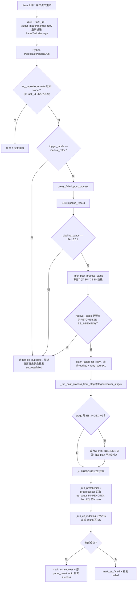

# ES 入库手动重试 Brief

> 本文件取代 [docs/ES入库重试机制/](../ES入库重试机制/) 下已废弃的 5 个文档，对应 PR 的方向修正版本。原 PR（commit `3389db9`）引入的 ES 后台自动重试 scheduler 与流水线"用户驱动 + 断点续跑"契约冲突，已被 leader 否决；本期改为只接 manual_retry 路径。

## 1. 需求摘要

- **真实问题**：[issue #25](https://github.com/ql-link/LinkRag/issues/25) 反映 `ES_INDEXING_MAX_RETRY=3` 配置只有计数语义、不会真的触发重试，且解析主流程一旦 `document_parsed_log=success` 落库，Kafka 自然投递不会再次拉起，重投也只会被去重逻辑兜底为补发失败通知。
- **修复方向**（leader 定）：
  - 删除 `ES_INDEXING_MAX_RETRY` 及一切与"配得上这个配置"相关的后台 scheduler / service / lifespan 注入 / 配置项。
  - 让用户手动重试 API 能正确从预分词阶段开始、按未完成 chunk 重跑，与解析 / 分片 / 稠密向量等阶段已有的"用户驱动 + 断点续跑"契约对齐。
- **本期不做**：
  - 不实现自动重试。
  - 不为 chunking / vectorizing 失败接 manual_retry（这两个阶段失败仍走 `handle_duplicate` 直接补发 failed）；vectorizing 续跑后续 PR 单独处理。
  - 不变 ES 索引结构 / mapping / chunk 级 ES 状态语义。
  - 不新增数据库表 / Kafka topic / 对外 API 契约。

## 2. 业务流程

### 关键约束

- **只重跑后处理**：源文件、Markdown、chunk、dense 向量都视为已落库可复用，不再走 OSS 下载 / 解析 / 上传 / 向量化。
- **per-chunk 断点续跑**：[`src/core/preprocessor/service.py:99`](../../src/core/preprocessor/service.py:99) 的 plan 构建 SQL 已经过滤 `es_status IN (PENDING, FAILED)`，已经成功写入 ES 的 chunk 不会被重复处理。
- **并发安全**：[`PostProcessPipelineRepository.claim_failed_for_retry`](../../src/core/pipeline/parse_task/post_process/repository.py) 用 `pipeline_status=FAILED` 条件 update 保证排他认领，同一 task_id 同一时刻只有一个 worker 能进入续跑。
- **`retry_count` 单写点**：仅在 `claim_failed_for_retry` 处 +1，与 [`ChunkRepository.claim_failed_for_reindex`](../../src/core/chunk_fact_storage/repository.py) 的语义对齐；模块、失败处理器、`mark_processing` 一律不写。
- **通知契约**：复用原 `parse_result` topic 与原 `task_id` 补发 success / failed；无新 MQ 契约。

## 3. 核心模块与实现位置

| 角色 | 路径 | 说明 |
| --- | --- | --- |
| manual_retry 入口判断 | [`pipeline.py` `_is_manual_retry`](../../src/core/pipeline/parse_task/pipeline.py) | `payload.trigger_mode.lower() == "manual_retry"` |
| 重试主控 | [`pipeline.py` `_retry_failed_post_process`](../../src/core/pipeline/parse_task/pipeline.py) | 校验 → 认领 → 续跑 |
| 阶段推断 | [`pipeline.py` `_infer_post_process_stage`](../../src/core/pipeline/parse_task/pipeline.py) | 取首个非 SUCCESS 阶段 |
| 续跑执行 | [`pipeline.py` `_run_post_process_from_stage`](../../src/core/pipeline/parse_task/pipeline.py) | ES 阶段统一回退到 PRETOKENIZE 重建 plan |
| 排他认领 | [`repository.py` `claim_failed_for_retry`](../../src/core/pipeline/parse_task/post_process/repository.py) | `retry_count` 唯一写入点 |
| chunk 过滤 | [`preprocessor/service.py`](../../src/core/preprocessor/service.py) | `es_status IN (PENDING, FAILED)` |

## 4. 风险与说明

- **chunking / vectorizing 失败不在本期手动重试范围**：会走 `handle_duplicate` 路径直接补发 failed（详见测试 `test_manual_retry_should_only_reuse_duplicate_path_for_unresumable_chunking_failure`）。Java 侧需要知道这两类失败需要从源头重新提交解析任务而非重试同 `task_id`。
- **vectorizing 失败的 manual_retry 后续 PR 跟进**：leader review 提到的"稠密向量"用户驱动续跑能力本期未做；后续 PR 接 [`ChunkRepository.claim_failed_for_reindex`](../../src/core/chunk_fact_storage/repository.py) 完成。
- **`recover_from_stage` 终态清零由 `mark_es_success` 负责**：成功收敛时同时清 `failed_stage / recover_from_stage / failure_reason`，不会留下"SUCCESS + recover_from_stage=ES_INDEXING"这种自相矛盾的快照。
- **lifespan 清理**：移除 scheduler 时一并修复了 [`src/main.py`](../../src/main.py) 中 `yield` 周围缺失的 `try/finally`，保证应用关闭异常时 MQ/Redis/DB 也能完成清理。

## 5. 待确认 / 后续 TODO

- vectorizing 失败的 manual_retry 路径接入。
- 是否需要为 manual_retry 增加请求级幂等键（当前依赖 `pipeline_status=FAILED` 条件 update，多并发同 task_id 重试理论上只能有 1 个进入续跑）。
- 是否将"chunking 失败不支持 manual_retry"显式写入对外 API 文档 [docs/reference/api_contracts.md](../reference/api_contracts.md) 或 [mq_integration.md](../guides/mq_integration.md)。
