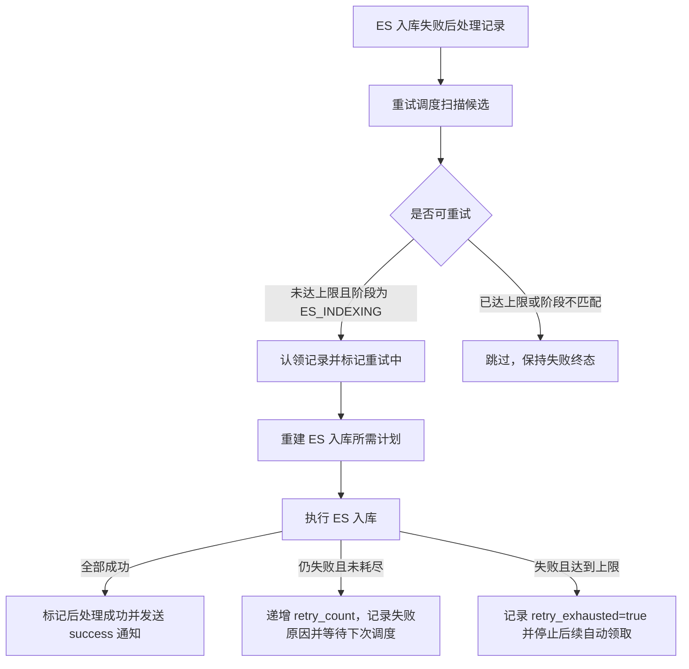

> ⚠️ **本方向已废弃（2026-05）**
>
> 本目录文档对应的 ES 入库后台自动重试方案与项目流水线"用户驱动 + 断点续跑"契约不一致，已被 leader 否决（见 issue #25 review）。实际实现改为用户手动重试路径，详见 [docs/ES入库手动重试/brief.md](../ES入库手动重试/brief.md)。
>
> 本文件仅保留作历史决策记录，不再维护，亦不反映线上代码现状。

---

# ES入库重试机制 Brief

## 1. 需求摘要

- **做什么**：为解析后处理流水线补齐 ES 入库失败后的独立重试机制。系统需要能发现 `document_post_process_pipeline` 中停留在 ES 入库失败状态、且未达到重试上限的记录，重新执行 ES 入库阶段，并根据结果收敛为成功、继续失败或重试耗尽。
- **为什么做**：当前 ES 失败路径只在 `_handle_es_failure()` 中递增 `retry_count`，随后把后处理流水线标记为失败并结束。成功路径已经提交 `document_parsed_log=success`，同一个 `parse_task` 不会再被 Kafka 自然投递；即使 MQ 重投，重复任务保护也只会补发失败通知，不会重跑 ES。因此 `ES_INDEXING_MAX_RETRY=3` 只有标记意义，实际通常只尝试 1 次，可能导致 MySQL/Qdrant 已成功但 ES 长期缺索引。
- **本次不做**：
  - 不重跑文件解析、Markdown 上传、分块、dense 向量化等已成功阶段。
  - 不拆分新的 ES MQ 消息流；本次优先做基于后处理状态表的补偿重试。
  - 不改变 ES 文档结构、mapping、索引名和 chunk 级 ES 状态语义。
  - 不新增数据库表；优先复用 `document_post_process_pipeline` 的失败阶段、恢复阶段、`retry_count`、`last_retry_at` 与既有索引。
  - 不把预分词独立阶段、稀疏向量化或其他后处理阶段纳入本次范围。
  - 不关闭 issue；只有代码、测试、文档全部完成并验证后，再处理 issue 状态。

## 2. 业务流程

### 2.1 主流程图

### 2.2 流程详解

ES 重试的触发对象不是原始 `parse_task` 消息，而是已经落库的后处理流水线记录。调度入口默认随 FastAPI 应用启动后以后台定时任务运行，同时保留可直接调用的服务入口，便于单元测试和后续管理命令复用。调度入口扫描处于失败终态、恢复阶段为 `ES_INDEXING`、ES 阶段未成功、且 `retry_count < ES_INDEXING_MAX_RETRY` 的记录。扫描结果必须经过认领，避免多个 worker 或多次调度同时处理同一条记录。

认领成功后，系统只恢复 ES 入库阶段。解析产物、chunk 真值和 dense 向量结果都应视为已经存在并可复用。重试时通过现有预分词 / ES 入库链路重新构建本次需要写入 ES 的计划，再调用现有 ES 入库能力写索引。chunk 级 ES 状态仍由 ES 入库模块负责更新：成功 chunk 标记成功，失败 chunk 标记失败；文件级后处理记录根据汇总结果推进。

当重试成功时，后处理流水线从失败收敛为成功，清理失败阶段和失败原因，并沿用原 `parse_result` topic、原 `task_id` 向 Java 侧补发整体 `success`。这条 success 通知表示“同一个 parse_task 的后处理最终完成”，用于修正此前 ES 失败时已经发出的 failed 状态。

当重试仍失败时，系统按同一套 ES 失败语义记录失败原因、更新时间和重试次数。如果重试次数尚未达到上限，记录保留为可恢复失败，等待下次调度继续尝试，默认不向 Java 重复发送 failed，避免失败事件噪音。如果本次失败后达到 `ES_INDEXING_MAX_RETRY`，失败原因追加 `retry_exhausted=true`，后续自动调度不再领取这条记录，并向 Java 补发 failed，明确表达自动重试已经放弃。

关键异常分支有三类。第一，候选记录被其他 worker 抢先认领或状态已经变化时，本次调度跳过，不应报错。第二，重试过程中无法找到必要的解析日志、原始任务上下文或 chunk 真值时，不能重跑上游阶段，应把当前重试记为失败并保留明确原因。第三，通知 Java 失败或成功时若 MQ 发送异常，沿用现有通知兜底策略，不应让 ES 已成功的索引结果被回滚。

## 3. 核心模块与实现思路

### ES 重试调度入口

- **位置**：解析后处理流水线相关模块，靠近 `src/core/pipeline/parse_task/` 或应用启动的后台任务入口。
- **职责**：随 FastAPI 应用启动后周期性扫描 ES 入库失败记录，批量驱动补偿重试；同时暴露可直接调用的内部服务入口，支撑测试和后续管理命令。
- **实现思路**：调度入口只负责“找候选、控制批量、调用重试服务、记录汇总结果”。候选条件必须明确绑定 ES 阶段失败和重试上限，不能误处理分块、向量化、预分词等其他失败。批量大小、触发频率和调度开关应通过运行时配置控制，避免生产环境不可控地拉起大量补偿任务。
- **关键决策**：优先采用状态表扫描而不是新增 ES MQ 流。原因是现有失败记录已经落在 `document_post_process_pipeline`，表上已有恢复阶段和重试字段；状态表扫描能以较小改动修复 issue，同时保留未来拆独立 MQ 流的扩展空间。

### 后处理流水线仓储

- **位置**：`src/core/pipeline/parse_task/post_process/` 对应仓储与状态常量。
- **职责**：提供 ES 重试候选查询、单条记录认领、重试中状态写入、成功/失败终态写入所需的状态操作。
- **实现思路**：仓储层应把“候选筛选”和“认领”封装为清晰动作。认领需要基于当前状态做条件更新，只有仍处于 ES 可恢复失败且未达上限的记录才能进入重试中。成功和失败写入继续复用现有文件级后处理状态语义，保证 `failed_stage`、`recover_from_stage`、`failure_reason`、耗时和更新时间一致。
- **关键决策**：不让调度入口直接拼 SQL 或直接改 ORM 字段。ES 重试是后处理状态机的一部分，状态变更集中在仓储层，后续调试和测试都更容易约束。

### ES 重试执行服务

- **位置**：解析任务 pipeline 的后处理能力附近，复用现有 `Preprocessor`、`EsIndexingPipeline`、`ChunkRepository`、`ParseResultNotifier` 等协作者。
- **职责**：对单条已认领的 ES 失败记录执行一次重试，并把结果收敛成文件级成功或失败。
- **实现思路**：执行服务需要从后处理记录关联到原解析日志和原 parse task 上下文，恢复出 ES 入库所需的业务参数。随后复用现有预分词计划构建和 ES 入库能力，只对 ES 阶段进行补偿。成功时调用后处理成功写入并发送 success 通知；失败时沿用现有 ES 失败原因构建、`retry_count` 增长和 `retry_exhausted` 判断。若预分词独立阶段已合入，则重试边界以“预分词已成功后的 ES 入库恢复”为准，TD 阶段需要按实际代码状态明确适配。
- **关键决策**：重试服务不调用完整 `ParseTaskPipeline.execute()`。完整执行会触发重复任务保护，并可能误入解析、上传、分块、向量化等已完成阶段；本需求只恢复 ES 入库，因此需要一个面向后处理记录的执行入口。

### 通知与对外状态

- **位置**：现有 `parse_result` 通知模块与 Java 对接契约。
- **职责**：在 ES 重试最终成功时补发 success，在重试失败时按现有失败语义保持或补发 failed。
- **实现思路**：初次 ES 失败已经向 Java 发送 failed。后续重试成功后必须沿用原 `parse_result` topic 和原 `task_id` 再发送 success，让业务侧能够把同一解析任务的最终状态修正为成功。重试失败默认不每次补发 failed；只有达到重试耗尽或发生需要业务侧感知的终态变化时才补发 failed。
- **关键决策**：success 通知不能省略。否则 ES 实际修复后，Java 侧仍可能停留在失败状态，形成新的跨系统不一致。

### 配置、运维与观测

- **位置**：运行时配置、部署文档和解析流水线架构文档。
- **职责**：让 ES 重试机制可开关、可限流、可观测。
- **实现思路**：需要明确重试开关、扫描间隔、单批数量、最大重试次数等配置语义。日志应能区分“扫描到多少候选、认领多少、成功多少、失败多少、耗尽多少”。文档同步说明哪些状态组合会被自动补偿，哪些失败需要人工介入。
- **关键决策**：重试机制默认应保守运行。ES 故障通常具有基础设施属性，批量重试过快可能放大 ES 压力；限流和开关应作为第一版的基本能力，而不是后续补丁。

## 4. 风险与不确定性

| 风险 / 问题 | 触发条件 | 影响 | 当前判断 / 应对方向 |
| :--- | :--- | :--- | :--- |
| 多 worker 并发重试同一条记录 | 多个应用实例同时扫描到同一 ES 失败记录 | 重复写 ES、重复通知 Java、重试次数异常增长 | 必须有数据库层认领语义；只有认领成功的 worker 执行重试 |
| ES 长时间不可用导致重试风暴 | ES 集群故障期间定时调度持续扫描失败记录 | 放大 ES 压力，应用日志和 DB 写入增加 | 配置批量和间隔；达到上限后停止自动领取；允许关闭调度 |
| 重试成功但通知 Java 失败 | ES 入库已成功，发送 success 通知时 MQ 失败 | ES 与 Java 业务状态继续不一致 | 沿用现有通知兜底策略；失败可记录为通知问题，但不回滚已成功 ES |
| 原始任务上下文缺失 | 后处理记录存在，但关联解析日志或 parse task 业务上下文被删除/不完整 | 无法重建 ES 入库所需 payload | 本次不重跑上游；记为明确失败原因并消耗一次重试，达到上限后人工处理 |
| 重试误处理非 ES 失败 | 查询条件过宽，把 chunking/vectorizing/pretokenize 失败记录也拉入 | 状态机被错误推进，掩盖真实失败阶段 | 候选条件必须同时检查失败阶段、恢复阶段和 ES 阶段状态 |
| 失败通知重复过多 | 每次自动重试失败都发送 failed | Java 侧收到大量重复失败事件，影响业务处理 | 默认只在最终成功或重试耗尽等状态变化时通知；每次失败仍落库和日志 |
| 与预分词独立阶段语义冲突 | 当前分支或后续分支把预分词拆成独立阶段 | ES 重试可能错误重算或错误记录预分词失败 | 本需求只定义 ES 阶段补偿；若预分词独立阶段已落地，TD 阶段需明确从 PRETOKENIZE 成功后的计划重建边界 |
