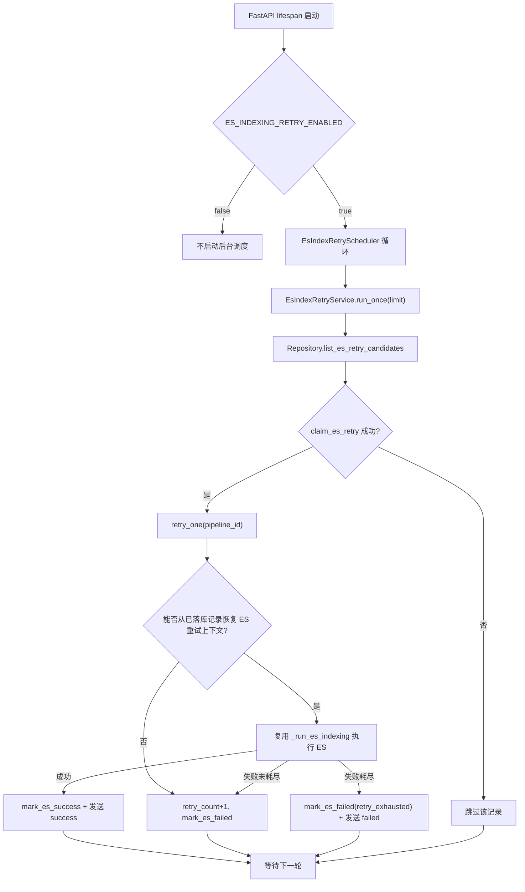

> ⚠️ **本方向已废弃（2026-05）**
>
> 本目录文档对应的 ES 入库后台自动重试方案与项目流水线"用户驱动 + 断点续跑"契约不一致，已被 leader 否决（见 issue #25 review）。实际实现改为用户手动重试路径，详见 [docs/ES入库手动重试/brief.md](../ES入库手动重试/brief.md)。
>
> 本文件仅保留作历史决策记录，不再维护，亦不反映线上代码现状。

---

# ES入库重试机制 技术设计

- **文档状态：** 技术方案已冻结
- **项目名称：** toLink-Rag
- **业务域：** 解析任务后处理流水线 / Elasticsearch 入库
- **需求名称：** ES入库重试机制
- **业务输入：** `docs/ES入库重试机制/brief.md`
- **验收输入：** `docs/ES入库重试机制/acceptance.feature`
- **输出文件：** `docs/ES入库重试机制/technical_design.md`
- **最后更新时间：** 2026-05-20

---

## 1. 文档修订记录

| 版本号 | 修改日期 | 修改内容简述 | 来源/提出人 | 审核状态 |
| :--- | :--- | :--- | :--- | :--- |
| v1.0 | 2026-05-20 | 初始技术设计创建并冻结 | brief.md + acceptance.feature + 代码扫描 | 已冻结 |

---

## 2. 输入依据与设计目标

### 2.1 输入依据映射

| 输入来源 | 关键结论 | 技术设计承接方式 |
| :--- | :--- | :--- |
| `brief.md` | ES 失败后需要独立补偿重试；不重跑解析、Markdown 上传、分块、dense 向量化；调度随 FastAPI 启动；普通失败不重复通知，成功或耗尽才通知 Java | 新增 ES 重试服务 + 后台调度器；复用现有 ES 入库能力；新增配置开关、间隔和批量；通知逻辑只在成功/耗尽触发 |
| `acceptance.feature` | 15 个 Scenario 覆盖候选领取、成功收敛、失败计数、耗尽通知、并发认领、配置边界和通知失败 | 方法级变更表逐条关联 Scenario；新增单测覆盖仓储、服务和调度器；更新启动生命周期测试 |
| 当前代码 | `retry_count` 只在 `ParseTaskPipeline._handle_es_failure()` 中递增；重复 MQ 投递不会重跑 ES；`document_post_process_pipeline` 已有恢复阶段、retry 字段和 retry 索引 | 不改表结构；在 `PostProcessPipelineRepository` 增加候选查询和条件认领；新增面向后处理记录的 ES 重试执行入口 |

### 2.2 技术目标

- 自动扫描并重试 `pipeline_status=FAILED`、`recover_from_stage=ES_INDEXING`、`es_indexing_status=FAILED`、`retry_count < ES_INDEXING_MAX_RETRY` 的后处理记录。
- 通过条件更新完成数据库层认领，保证多实例并发时同一记录只被一个 worker 执行。
- ES 重试只恢复 ES 入库阶段，不调用完整 `ParseTaskPipeline.execute()`。
- 重试成功后标记后处理成功，并沿用原 `parse_result` topic、原 `task_id` 发送 success。
- 重试失败未耗尽时只落库和日志，不重复发送 failed；达到上限时追加 `retry_exhausted=true` 并发送 failed。
- 配置可关闭自动调度，可控制扫描间隔和单批数量。

---

## 3. 改动范围

### 3.1 改动文件目录树

```text
toLink-Rag/
├── src/
│   ├── config.py                                           # [修改] 新增 ES 重试调度配置
│   ├── main.py                                             # [修改] 应用启动/关闭时管理 ES 重试调度器
│   └── core/pipeline/parse_task/
│       ├── pipeline.py                                     # [修改] 抽出 ES 失败原因/耗尽判断复用入口
│       ├── notifier.py                                     # [修改] 支持不依赖完整 ParseTaskPayload 发送 parse_result
│       ├── es_retry_service.py                             # [新增] 单条/批量 ES 补偿重试执行服务
│       ├── es_retry_scheduler.py                           # [新增] 后台定时扫描调度器
│       └── post_process/repository.py                      # [修改] ES 重试候选查询、认领、按 id 查询
├── tests/unit/core/pipeline/
│   ├── test_post_process_repository.py                     # [测试修改] 覆盖候选查询和并发认领
│   ├── test_parse_task_pipeline_es.py                      # [测试修改] 覆盖共享 ES 失败处理保持兼容
│   ├── test_es_index_retry_service.py                      # [测试新增] 覆盖 15 个 Scenario 的服务侧核心规则
│   └── test_es_index_retry_scheduler.py                    # [测试新增] 覆盖调度开关、批量、启动/停止
├── tests/unit/
│   └── test_main_lifespan_es_retry.py                      # [测试新增] 覆盖 FastAPI lifespan 启停调度器
├── .env.example                                            # [修改] 新增 ES 重试调度配置样例
└── docs/
    ├── architecture/parse_task_pipeline_module.md          # [修改] 同步 ES 重试流程和状态语义
    ├── guides/configuration.md                             # [修改] 同步新增配置项
    └── ES入库重试机制/technical_design.md                  # [新增] 本技术方案
```

### 3.2 文件级改动说明

| 文件 | 动作 | 改动目的 | 是否必须 |
| :--- | :--- | :--- | :--- |
| `src/config.py` | 修改 | 新增 `ES_INDEXING_RETRY_ENABLED`、`ES_INDEXING_RETRY_INTERVAL_SECONDS`、`ES_INDEXING_RETRY_BATCH_SIZE` | 是 |
| `src/main.py` | 修改 | FastAPI lifespan 启动/停止后台 ES 重试调度器 | 是 |
| `src/core/pipeline/parse_task/post_process/repository.py` | 修改 | 提供候选查询、条件认领、按 id 查询，封装状态机写入 | 是 |
| `src/core/pipeline/parse_task/es_retry_service.py` | 新增 | 执行单条和单批 ES 补偿重试 | 是 |
| `src/core/pipeline/parse_task/es_retry_scheduler.py` | 新增 | 周期性调用重试服务，支持关闭和优雅停止 | 是 |
| `src/core/pipeline/parse_task/notifier.py` | 修改 | 增加按结果字段发送 parse_result 的底层方法，避免伪造完整 `ParseTaskPayload` | 是 |
| `src/core/pipeline/parse_task/pipeline.py` | 修改 | 抽出 ES 失败原因构建和耗尽判断给重试服务复用，保留现有主链路行为 | 是 |
| `src/models/parse_task.py` | 不改 | 现有字段和索引足够支持本需求 | 是 |
| `src/core/mq/messages/parse_result.py` | 不改 | 消息契约不变，仍用原 topic 和原 task_id | 是 |

---

## 4. 当前系统分析

| 类型 | 文件/类/方法 | 当前行为 | 问题或复用点 |
| :--- | :--- | :--- | :--- |
| 主链路 | `ParseTaskPipeline.execute()` | ES 失败后调用 `_handle_es_failure()`，发送 failed 并返回 | 失败后没有后续调度；可复用 `_run_es_indexing()` 的预分词 + ES 写入链路 |
| 失败处理 | `ParseTaskPipeline._handle_es_failure()` | 直接改 ORM 对象 `retry_count += 1`，再 `mark_es_failed()` | 只在单次 parse_task 执行中触发；失败原因和耗尽判断可抽出复用 |
| 重复消息 | `ParseTaskGuard.handle_duplicate()` | 已失败后处理记录只补发 failed，不恢复 ES | 不能依赖 MQ 重投解决本 issue |
| 状态仓储 | `PostProcessPipelineRepository` | 支持创建、mark processing/success/failed，缺少候选查询和 claim | 是本次状态机扩展点 |
| 数据模型 | `DocumentPostProcessPipeline` | 已有 `pipeline_status`、`recover_from_stage`、`retry_count`、`last_retry_at`、`idx_post_pipeline_retry` | 不需要新增表或列 |
| 通知 | `ParseResultNotifier.send()` | 入参是完整 `ParseTaskPayload` | ES 重试只有后处理记录 + parse task 记录，需要新增字段级发送方法 |
| 启动 | `src/main.py::lifespan()` | 初始化 Redis/DB/MQ consumer，关闭 MQ/Redis/DB | 可挂载后台调度器；需要保存 task 并在 shutdown cancel |

---

## 5. 总体方案设计

### 5.1 总体流程



### 5.2 模块边界

| 模块 | 职责 | 本次是否改动 |
| :--- | :--- | :--- |
| `PostProcessPipelineRepository` | 文件级后处理状态读写、候选筛选和条件认领 | 改动 |
| `EsIndexRetryService` | 单轮/单条 ES 补偿重试编排 | 新增 |
| `EsIndexRetryScheduler` | 后台定时循环和优雅停止 | 新增 |
| `ParseResultNotifier` | parse_result MQ 发送 | 小改，提取字段级发送 |
| `ParseTaskPipeline` | 原解析任务主编排 | 小改，只抽共享 helper，不接管调度 |
| `EsIndexingPipeline` | ES bulk 写入和 chunk 级状态回写 | 不改 |
| `ParseTaskMessage` / `ParseResultMessage` | MQ 契约 | 不改 |

---

## 6. API、消息与数据设计

### 6.1 API 设计

本次不新增 HTTP API。后台调度默认随 FastAPI 启动。为测试和后续管理命令预留 Python 服务入口：

- `EsIndexRetryService.run_once(limit: int | None = None) -> EsIndexRetrySummary`
- `EsIndexRetryService.retry_one(pipeline_id: int) -> EsIndexRetryItemResult`

### 6.2 MQ 消息设计

不新增 topic，不修改消息 payload。ES 重试成功或耗尽时继续发送 `ParseResultMessage` 到既有 `tolink.rag.parse_result`：

- success：`task_status=success`，`failure_reason=None`，`task_id` 使用原解析任务 ID。
- exhausted failed：`task_status=failed`，`failure_reason` 包含 `retry_exhausted=true`。
- 未耗尽失败：不发送新的 failed，只更新 DB 和日志。

### 6.3 数据与存储设计

不新增表、不新增列。使用现有 `document_post_process_pipeline`：

- 候选条件：`pipeline_status=FAILED`、`recover_from_stage=ES_INDEXING`、`es_indexing_status=FAILED`、`retry_count < ES_INDEXING_MAX_RETRY`。
- 认领更新：条件匹配时把 `pipeline_status` 置为 `PROCESSING`，清理 `finished_at`，写入 `last_retry_at`，不增加 `retry_count`。
- 成功写入：复用 `mark_es_success()`，将后处理记录收敛为 `SUCCESS`。
- 失败写入：`retry_count += 1` 后复用 `mark_es_failed()`；达到上限时 failure_reason 追加 `retry_exhausted=true`。

### 6.4 配置设计

新增配置：

| 配置 | 默认值 | 说明 |
| :--- | :--- | :--- |
| `ES_INDEXING_RETRY_ENABLED` | `true` | 是否随 FastAPI 启动后台 ES 重试调度 |
| `ES_INDEXING_RETRY_INTERVAL_SECONDS` | `300` | 后台扫描间隔 |
| `ES_INDEXING_RETRY_BATCH_SIZE` | `20` | 单轮最多认领记录数 |

---

## 7. 方法级实现方案

### 7.1 方法级变更总表

| 文件 | 类/对象 | 方法/成员 | 动作 | 入参变化 | 返回变化 | 改动目的 | 对应 Scenario |
| :--- | :--- | :--- | :--- | :--- | :--- | :--- | :--- |
| `src/config.py` | `Settings` | `ES_INDEXING_RETRY_*` | 新增 | 无 | 新增配置字段 | 控制开关、间隔、批量 | 调度开关关闭时不扫描候选记录；单轮扫描遵守批量上限 |
| `src/main.py` | module | `lifespan` | 修改 | 无 | 无 | 启停后台调度器 | 调度开关关闭时不扫描候选记录 |
| `post_process/repository.py` | `PostProcessPipelineRepository` | `list_es_retry_candidates` | 新增 | `db, limit, max_retry` | `list[DocumentPostProcessPipeline]` | 查询可重试 ES 失败记录 | 调度器只领取 ES 入库可恢复失败记录；单轮扫描遵守批量上限；非 ES 恢复阶段不会进入 ES 重试 |
| `post_process/repository.py` | `PostProcessPipelineRepository` | `claim_es_retry` | 新增 | `db, pipeline_id, max_retry` | `bool` | 条件认领并写 `last_retry_at` | 两个调度器同时扫描时同一记录只会被一个调度器认领；重复扫描未耗尽失败记录会继续下一次重试 |
| `post_process/repository.py` | `PostProcessPipelineRepository` | `get_by_id` | 新增 | `db, pipeline_id` | `DocumentPostProcessPipeline | None` | 重试执行前刷新状态 | 已被认领后状态变化的记录不会被重复执行 |
| `pipeline.py` | `ParseTaskPipeline` | `build_es_failure_reason` / `is_es_retry_exhausted` | 新增/调整 | 接收 `EsIndexingResult` / record | `str` / `bool` | 复用失败原因和耗尽判断 | ES 重试失败但未达到上限时保留可恢复失败；ES 重试失败达到上限后标记耗尽并补发 failed |
| `notifier.py` | `ParseResultNotifier` | `send_fields` | 新增 | 基础业务字段 | `bool` | 不依赖完整 `ParseTaskPayload` 发送结果 | ES 重试成功后使用原 task_id 补发 success 通知；通知失败不回滚已成功的 ES 入库结果 |
| `es_retry_service.py` | `EsIndexRetryService` | `run_once` | 新增 | `limit` | `EsIndexRetrySummary` | 扫描并批量重试 | 调度器只领取 ES 入库可恢复失败记录；单轮扫描遵守批量上限 |
| `es_retry_service.py` | `EsIndexRetryService` | `retry_one` | 新增 | `pipeline_id` | `EsIndexRetryItemResult` | 执行单条 ES 重试 | ES 重试成功后后处理流水线收敛为成功；ES 重试只执行 ES 入库阶段；缺失原始任务上下文时记录明确失败原因 |
| `es_retry_service.py` | `EsIndexRetryService` | `_load_retry_context` | 新增 | `db, pipeline` | retry context | 从后处理记录、解析日志、文件解析表和 chunk 真值恢复通知与 ES 入库所需上下文 | 缺失原始任务上下文时记录明确失败原因 |
| `es_retry_service.py` | `EsIndexRetryService` | `_handle_retry_success` | 新增 | `db, pipeline, context, timing` | 无 | 标记成功并发送 success | ES 重试成功后后处理流水线收敛为成功；ES 重试成功后使用原 task_id 补发 success 通知 |
| `es_retry_service.py` | `EsIndexRetryService` | `_handle_retry_failure` | 新增 | `db, pipeline, reason, timing` | item result | 递增计数、写失败、耗尽时通知 | ES 重试失败但未达到上限时保留可恢复失败；ES 重试失败达到上限后标记耗尽并补发 failed |
| `es_retry_scheduler.py` | `EsIndexRetryScheduler` | `start` / `stop` / `_loop` | 新增 | 无 | 无 | 后台循环和优雅停止 | 调度开关关闭时不扫描候选记录 |

### 7.2 逐方法实现设计

#### 7.2.1 `PostProcessPipelineRepository.list_es_retry_candidates`

- 当前行为：仓储没有 ES 重试候选查询。
- 修改后职责：按 ES 可恢复失败条件返回待认领记录，按 `updated_at` 升序，受 `limit` 限制。
- 入参：`db`、`limit`、`max_retry`。
- 返回：候选 `DocumentPostProcessPipeline` 列表。
- 详细步骤：构造 `select(model_cls)`；过滤 `pipeline_status=FAILED`、`recover_from_stage=ES_INDEXING`、`es_indexing_status=FAILED`、`retry_count < max_retry`；排序和 limit。
- 事务与异常边界：只读，不提交。
- 幂等与并发边界：只负责发现；并发安全由 `claim_es_retry` 负责。
- 对应测试：调度器只领取 ES 入库可恢复失败记录；单轮扫描遵守批量上限；非 ES 恢复阶段不会进入 ES 重试。

#### 7.2.2 `PostProcessPipelineRepository.claim_es_retry`

- 当前行为：仓储没有文件级后处理认领动作。
- 修改后职责：用条件 `UPDATE` 原子认领单条候选。
- 入参：`db`、`pipeline_id`、`max_retry`。
- 返回：`bool`，表示是否认领成功。
- 详细步骤：`UPDATE document_post_process_pipeline SET pipeline_status=PROCESSING, finished_at=NULL, failure_reason=NULL, last_retry_at=func.now()`；where 条件与候选条件一致并限定 id；提交由调用方控制或方法内提交需在 TD 实现阶段统一。
- 事务与异常边界：认领失败返回 false，不抛业务异常；数据库异常向上抛并由 service 记录。
- 幂等与并发边界：两个 worker 同时认领时，只有一个 update rowcount 为 1；认领不增加 `retry_count`。
- 对应测试：两个调度器同时扫描时同一记录只会被一个调度器认领；重复扫描未耗尽失败记录会继续下一次重试。

#### 7.2.3 `EsIndexRetryService.run_once`

- 当前行为：没有批量补偿入口。
- 修改后职责：执行一轮扫描和批量重试，返回统计汇总。
- 入参：可选 `limit`，默认使用 `settings.ES_INDEXING_RETRY_BATCH_SIZE`。
- 返回：`EsIndexRetrySummary(scanned, claimed, succeeded, failed, exhausted, skipped)`。
- 详细步骤：打开 DB session；查询候选；逐条调用 `claim_es_retry`；认领成功后调用 `retry_one`；聚合结果；单条失败不影响同批其他记录。
- 事务与异常边界：每条记录独立 session 或独立事务，避免一条异常回滚整批。
- 幂等与并发边界：依赖 claim；未认领直接 skipped。
- 对应测试：调度器只领取 ES 入库可恢复失败记录；单轮扫描遵守批量上限。

#### 7.2.4 `EsIndexRetryService.retry_one`

- 当前行为：ES 入库只能在 `ParseTaskPipeline.execute()` 主链路内运行。
- 修改后职责：对已认领记录执行一次 ES 入库补偿。
- 入参：`pipeline_id`。
- 返回：`EsIndexRetryItemResult(status, task_id, reason)`。
- 详细步骤：刷新 pipeline；若记录不存在或不处于本服务可执行状态则跳过；从已落库的后处理记录、解析日志、文件解析表和 chunk 真值加载 ES 重试上下文；调用现有 `ParseTaskPipeline._run_es_indexing()` 或抽出的 ES 后处理执行器；根据 `EsIndexingResult.is_success` 分流成功/失败。
- 事务与异常边界：上下文缺失、预分词失败、ES 写入异常都收敛为失败结果，不重跑上游阶段。
- 幂等与并发边界：执行前二次校验记录状态，避免 stale worker 重复执行已成功记录。
- 对应测试：ES 重试成功后后处理流水线收敛为成功；ES 重试只执行 ES 入库阶段；缺失原始任务上下文时记录明确失败原因。

#### 7.2.5 `EsIndexRetryService._load_retry_context`

- 当前行为：`ParseResultNotifier` 依赖 `ParseTaskPayload`，但失败后处理记录无法完整恢复原 payload。
- 修改后职责：从 `DocumentPostProcessPipeline` 关联 `DocumentParsedLog` 和 `DocumentParseTask`，恢复 ES 入库和 parse_result 通知需要的最小上下文。
- 入参：`db`、`pipeline`。
- 返回：包含 `task_id`、`original_file_id`、`document_parse_task_id`、`dataset_id`、`user_id` 的上下文对象。这些字段均来自已落库记录，不依赖原始 MQ payload。
- 详细步骤：按 `document_parsed_log_id` 查询日志；按 `document_parse_file_id` 查询 parse task；校验必要字段；缺失时返回明确错误。
- 事务与异常边界：上下文缺失不抛未捕获异常，由 `_handle_retry_failure` 记录 `parse task context missing`。
- 幂等与并发边界：只读。
- 对应测试：缺失原始任务上下文时记录明确失败原因；ES 重试成功后使用原 task_id 补发 success 通知。

#### 7.2.6 `EsIndexRetryService._handle_retry_success`

- 当前行为：主链路成功时由 `ParseTaskPipeline.execute()` 标记成功并通知。
- 修改后职责：补偿成功时收敛后处理状态并发送 success。
- 入参：`db`、`pipeline`、从已落库记录恢复出的 retry context、ES 阶段耗时。
- 返回：无或成功结果。
- 详细步骤：调用 `mark_es_success()`；调用 `ParseResultNotifier.send_fields(... task_status=success ...)`；通知失败只记录，不回滚成功状态。
- 事务与异常边界：先提交 DB 成功，再发通知；通知失败沿现有兜底策略记录。
- 幂等与并发边界：执行前状态校验，已成功不重复发送。
- 对应测试：ES 重试成功后后处理流水线收敛为成功；ES 重试成功后使用原 task_id 补发 success 通知；通知失败不回滚已成功的 ES 入库结果。

#### 7.2.7 `EsIndexRetryService._handle_retry_failure`

- 当前行为：`_handle_es_failure()` 只服务主链路。
- 修改后职责：补偿失败时递增 `retry_count`、写失败原因；耗尽时发送 failed。
- 入参：`db`、`pipeline`、`EsIndexingResult` 或失败原因、耗时。
- 返回：失败结果，标识是否 exhausted。
- 详细步骤：`pipeline.retry_count += 1`；构建失败原因；若 `retry_count >= settings.ES_INDEXING_MAX_RETRY` 追加 `retry_exhausted=true`；调用 `mark_es_failed()`；未耗尽不通知；耗尽后调用 `send_fields(... task_status=failed ...)`。
- 事务与异常边界：DB 失败向上记录；通知失败不改变已落库的耗尽状态。
- 幂等与并发边界：只有被认领的 processing 记录进入失败写入；认领阶段不计数。
- 对应测试：ES 重试失败但未达到上限时保留可恢复失败；ES 重试失败达到上限后标记耗尽并补发 failed；已达到重试上限的记录不会被自动领取。

#### 7.2.8 `EsIndexRetryScheduler.start / stop / _loop`

- 当前行为：应用只有 MQ consumer 生命周期管理。
- 修改后职责：按配置启动后台循环，周期性调用 `run_once()`，shutdown 时 cancel 并等待退出。
- 入参：无；构造时注入 service、interval、enabled。
- 返回：无。
- 详细步骤：`start()` 在 enabled 时 `asyncio.create_task(_loop())`；`_loop()` 循环调用 `service.run_once()`，捕获并记录异常，然后 sleep；`stop()` cancel task 并吞掉 `CancelledError`。
- 事务与异常边界：单轮异常不终止永久循环。
- 幂等与并发边界：同一进程重复 `start()` 不创建多个 task。
- 对应测试：调度开关关闭时不扫描候选记录。

#### 7.2.9 `ParseResultNotifier.send_fields`

- 当前行为：`send()` 只能接收 `ParseTaskPayload`。
- 修改后职责：提供字段级发送能力，`send()` 改为包装器。
- 入参：`task_id`、`original_file_id`、`document_parse_task_id`、`dataset_id`、`user_id`、`task_status`、`parse_finished_at`、`failure_reason`。
- 返回：`bool`。
- 详细步骤：用字段直接构造 `ParseResultMessage.build()`；发送异常时记录日志；不要求完整 payload。
- 事务与异常边界：保持现有 `send()` 行为兼容。
- 幂等与并发边界：调用方负责避免重复发送。
- 对应测试：ES 重试成功后使用原 task_id 补发 success 通知；通知失败不回滚已成功的 ES 入库结果。

---

## 8. 组件与集成设计

- **DB**：复用 `get_async_session_factory()` 或 `get_db_context()`，后台服务每条记录独立事务，避免长事务。
- **MQ**：复用 `MQService` 和 `ParseResultNotifier`，不新增消息类型。
- **ES**：复用 `EsIndexingPipeline.write_es_index()`，不改 bulk 写入、mapping、chunk 级状态回写。
- **预分词**：当前分支 `ParseTaskPipeline._run_es_indexing()` 仍把预分词作为 ES 内部前置步骤。实现时若目标分支已合入“预分词独立阶段”，则 retry service 需调用新的阶段边界：只在 PRETOKENIZE 已成功后恢复 ES 入库；PRETOKENIZE 失败不由本需求处理。
- **应用生命周期**：`src/main.py` 保存 scheduler 实例或 task 引用，shutdown 时先停调度器，再关闭 MQ/Redis/DB，避免后台任务使用已关闭连接池。

---

## 9. 异常处理与降级策略

| 异常场景 | 处理方式 | 是否抛出 | 是否影响消息确认 |
| :--- | :--- | :--- | :--- |
| 候选记录被其他 worker 抢先认领 | `claim_es_retry` 返回 false，当前 worker 记 skipped | 否 | 不涉及 MQ |
| 记录已成功或状态变化 | `retry_one` 二次校验后跳过 | 否 | 不涉及 MQ |
| 原始解析上下文缺失 | 记录失败原因 `parse task context missing`，`retry_count + 1` | 否 | 不涉及 MQ |
| ES 入库失败未耗尽 | 标记失败，保留可恢复状态，不发 failed | 否 | 不涉及 MQ |
| ES 入库失败耗尽 | 标记失败并追加 `retry_exhausted=true`，发送 failed | 否 | 不涉及 MQ |
| success 通知发送失败 | 保留 DB success 和 ES 索引结果，记录通知失败 | 否 | 不回滚 ES |
| 调度循环单轮异常 | 记录日志，下一轮继续 | 否 | 不涉及 MQ |

---

## 10. 测试方案

### 10.1 方法级测试映射

| 被测文件/方法 | 测试文件 | 对应 Scenario | 断言要点 |
| :--- | :--- | :--- | :--- |
| `list_es_retry_candidates` | `tests/unit/core/pipeline/test_post_process_repository.py` | 调度器只领取 ES 入库可恢复失败记录；非 ES 恢复阶段不会进入 ES 重试；单轮扫描遵守批量上限 | 查询条件、limit、排序 |
| `claim_es_retry` | `tests/unit/core/pipeline/test_post_process_repository.py` | 两个调度器同时扫描时同一记录只会被一个调度器认领；重复扫描未耗尽失败记录会继续下一次重试 | 条件 update、rowcount、认领不增加 retry_count |
| `EsIndexRetryService.run_once` | `tests/unit/core/pipeline/test_es_index_retry_service.py` | 调度器只领取 ES 入库可恢复失败记录；单轮扫描遵守批量上限 | scanned/claimed/skipped 汇总 |
| `EsIndexRetryService.retry_one` | `tests/unit/core/pipeline/test_es_index_retry_service.py` | ES 重试成功后后处理流水线收敛为成功；ES 重试只执行 ES 入库阶段；缺失原始任务上下文时记录明确失败原因 | 不调用解析/分块/向量化，调用 ES |
| `_handle_retry_success` | `tests/unit/core/pipeline/test_es_index_retry_service.py` | ES 重试成功后使用原 task_id 补发 success 通知；通知失败不回滚已成功的 ES 入库结果 | DB success 先提交，通知失败不回滚 |
| `_handle_retry_failure` | `tests/unit/core/pipeline/test_es_index_retry_service.py` | ES 重试失败但未达到上限时保留可恢复失败；ES 重试失败达到上限后标记耗尽并补发 failed；已达到重试上限的记录不会被自动领取 | retry_count、failure_reason、通知策略 |
| `EsIndexRetryScheduler.start/stop` | `tests/unit/core/pipeline/test_es_index_retry_scheduler.py` | 调度开关关闭时不扫描候选记录 | enabled=false 不创建 task；stop cancel |
| `main.lifespan` | `tests/unit/test_main_lifespan_es_retry.py` | 调度开关关闭时不扫描候选记录 | lifespan 按配置启动或跳过 scheduler |

### 10.2 Scenario 覆盖自检

| Scenario | 承接方法 | 承接测试 | 是否覆盖 |
| :--- | :--- | :--- | :--- |
| 调度器只领取 ES 入库可恢复失败记录 | `list_es_retry_candidates`, `run_once` | `test_es_index_retry_service.py` | ✅ |
| ES 重试成功后后处理流水线收敛为成功 | `retry_one`, `_handle_retry_success` | `test_es_index_retry_service.py` | ✅ |
| ES 重试成功后使用原 task_id 补发 success 通知 | `_load_retry_context`, `send_fields`, `_handle_retry_success` | `test_es_index_retry_service.py` | ✅ |
| ES 重试只执行 ES 入库阶段 | `retry_one` | `test_es_index_retry_service.py` | ✅ |
| ES 重试失败但未达到上限时保留可恢复失败 | `_handle_retry_failure` | `test_es_index_retry_service.py` | ✅ |
| ES 重试失败达到上限后标记耗尽并补发 failed | `_handle_retry_failure` | `test_es_index_retry_service.py` | ✅ |
| 已达到重试上限的记录不会被自动领取 | `list_es_retry_candidates` | `test_post_process_repository.py` | ✅ |
| 缺失原始任务上下文时记录明确失败原因 | `_load_retry_context`, `_handle_retry_failure` | `test_es_index_retry_service.py` | ✅ |
| 两个调度器同时扫描时同一记录只会被一个调度器认领 | `claim_es_retry` | `test_post_process_repository.py` | ✅ |
| 已被认领后状态变化的记录不会被重复执行 | `get_by_id`, `retry_one` | `test_es_index_retry_service.py` | ✅ |
| 重复扫描未耗尽失败记录会继续下一次重试 | `claim_es_retry`, `list_es_retry_candidates` | `test_post_process_repository.py` | ✅ |
| 调度开关关闭时不扫描候选记录 | `EsIndexRetryScheduler.start`, `lifespan` | `test_es_index_retry_scheduler.py`, `test_main_lifespan_es_retry.py` | ✅ |
| 单轮扫描遵守批量上限 | `list_es_retry_candidates`, `run_once` | `test_post_process_repository.py` | ✅ |
| 非 ES 恢复阶段不会进入 ES 重试 | `list_es_retry_candidates` | `test_post_process_repository.py` | ✅ |
| 通知失败不回滚已成功的 ES 入库结果 | `_handle_retry_success`, `send_fields` | `test_es_index_retry_service.py` | ✅ |

### 10.3 回归命令

```bash
.venv/bin/pytest tests/unit/core/pipeline/test_post_process_repository.py -q
.venv/bin/pytest tests/unit/core/pipeline/test_parse_task_pipeline_es.py -q
.venv/bin/pytest tests/unit/core/pipeline/test_es_index_retry_service.py -q
.venv/bin/pytest tests/unit/core/pipeline/test_es_index_retry_scheduler.py -q
.venv/bin/pytest tests/unit/test_main_lifespan_es_retry.py -q
.venv/bin/pytest tests/unit/core/es_index_storage/test_pipeline.py -q
python scripts/check_docs_sync.py --staged
```

---

## 11. 发布与回滚

- 发布前将 `ES_INDEXING_RETRY_ENABLED=false` 作为安全开关；确认 ES 和 DB 正常后再开启。
- 默认批量不超过 20，避免故障恢复时压垮 ES。
- 回滚代码时，新增配置无人使用但不影响启动；无数据库迁移需要回滚。
- 若上线后重试风暴，先关闭 `ES_INDEXING_RETRY_ENABLED`，再排查 ES 可用性和失败记录规模。

---

## 12. 风险与待确认问题

| 风险/问题 | 影响 | 建议处理 |
| :--- | :--- | :--- |
| 当前分支缺少真实 `src.core.preprocessor.service` 文件，但 pipeline 已引用 | 运行真实 ES 入库可能在预分词阶段失败 | 实现前确认目标基线是否已合入预分词服务；若未合入，本需求只设计重试机制，不补预分词缺口 |
| 通知 success 失败后 Java 侧仍停留 failed | ES 已修复但业务侧状态未修正 | 本次按 acceptance 保留 DB success，不回滚 ES；通知失败进入日志/现有兜底，后续可另建通知补偿 |
| 多实例都启用调度 | 增加 DB 扫描和竞争 | 依赖数据库 claim 保证单条只执行一次；通过 batch 和 interval 控制压力 |
| 失败原因 512 字符截断 | `retry_exhausted=true` 可能被长原因截断 | 拼接耗尽标记前先压缩基础失败原因，确保后缀保留 |

---

## 13. 实施顺序

1. 新增配置字段、`.env.example` 和配置文档。
2. 扩展 `PostProcessPipelineRepository` 查询、认领和按 id 查询，并补单测。
3. 提取/开放 ES 失败原因构建与耗尽判断，保持现有 pipeline 单测通过。
4. 扩展 `ParseResultNotifier.send_fields` 并补通知单测。
5. 新增 `EsIndexRetryService`，先用 mock ES pipeline 覆盖成功、失败、耗尽、缺上下文。
6. 新增 `EsIndexRetryScheduler` 并接入 `src/main.py` lifespan。
7. 同步 `parse_task_pipeline_module.md`、`configuration.md`，运行 doc-sync。
8. 运行本 TD §10.3 的回归命令。

---

## 14. 人工审核清单

- [ ] 是否接受后台调度默认启用，还是上线时默认关闭由环境变量开启？
- [ ] 是否接受普通重试失败不重复通知 Java，仅成功/耗尽通知？
- [ ] 是否确认 `src.core.preprocessor.service` 在目标基线可用，或另行处理预分词缺口？
- [ ] 方法级变更总表与 15 个 Scenario 的承接关系是否完整？
- [ ] 配置、架构文档和 doc-sync 同步范围是否完整？
