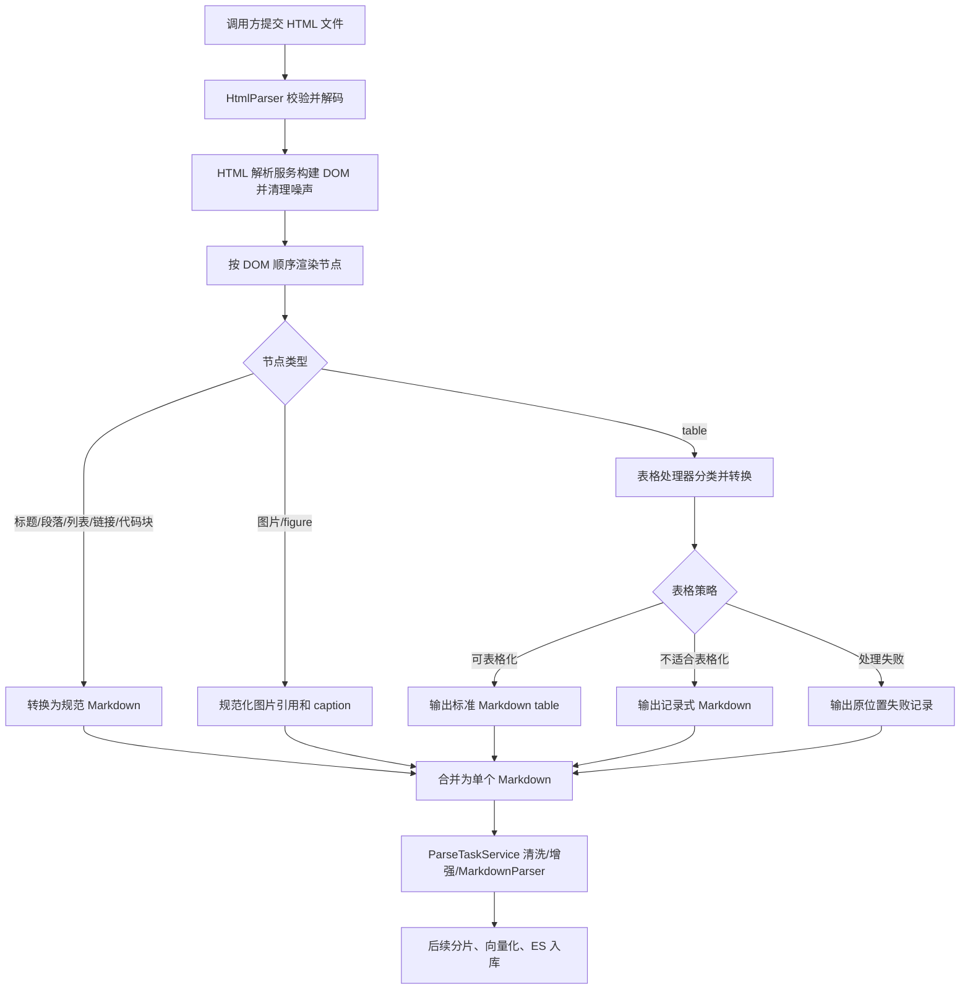

# HTML解析重构 Brief

## 1. 需求摘要

- **做什么**：重构 HTML 文件解析能力，将当前依赖 `trafilatura` 的网页正文抽取，改为面向 RAG 入库的结构保真解析。第一轮重点保证标题、段落、链接、代码块、图片引用和 HTML 表格能稳定转换为后续 Markdown 解析、分片、向量化链路可消费的 Markdown。
- **为什么做**：当前 HTML 解析只适合新闻、博客类正文抽取，表格可能被丢弃或扁平化，图片和代码块不可控，无法作为知识库文档解析算法使用。HTML 解析质量直接影响后续 table chunk、image chunk、code block chunk 和普通文本 chunk 的召回质量。
- **本次不做**：不处理 Word/DOCX；不做 RAG 问答评测；不引入 LLM 生成表格摘要；不改 API、MQ、数据库、对象存储公共契约；不改 pipeline、分片、向量化、ES、Qdrant 等非 HTML 解析模块；不做真实图片下载和 MinIO 上传；不把复杂表格数据放到文末 JSON；不要求记录式 Markdown 被 MarkdownScanner 识别为 table 元素；不保留旧的 `trafilatura` 网页正文抽取路径。

## 2. 业务流程

### 2.1 主流程图

### 2.2 流程详解

调用入口仍沿用现有解析链路：同步测试接口、MQ 解析任务或内部服务最终进入 `ParseTaskService`，由 `ParserFactory` 根据 `html` / `htm` 分发到 HTML 解析器。HTML 解析器负责把输入字节流转换为 Markdown 字符串，并通过 metadata 暴露解析策略、表格处理数量、图片处理数量和 warnings。

HTML 解析服务先完成字节流校验、字符集解码和 DOM 构建。DOM 预处理阶段移除明确无知识价值或会污染正文的节点，例如 `script`、`style`、`noscript`、模板节点和明显导航噪声；但默认采用“保结构优先”，避免像网页正文抽取器那样误删知识库需要的参数表、附录和页脚说明。

渲染阶段必须按 DOM 原始顺序输出 Markdown。标题输出为 ATX 标题，普通正文输出为段落，列表输出为 Markdown 列表，`pre/code` 输出 fenced code block，链接输出 Markdown link。图片先做引用规范化：相对 URL 结合来源上下文转绝对 URL，`figure/figcaption` 保留图片和说明；第一轮不真实下载外链图片或上传 MinIO，但要模拟最终链路中的 MinIO 文件路径回写，让 Markdown 图片引用使用可预测的模拟对象存储路径。

遇到 `table` 节点时交给表格处理能力。普通二维表格、可展开的 `rowspan` / `colspan`、多级表头和列表单元格应尽量输出标准 Markdown table，使后续 `MarkdownScanner` 识别为 table 元素。嵌套表格、图片单元格、多段长文本等不适合稳定 pipe table 的场景，输出固定格式的记录式 Markdown，让 AI 和分片结果能读出“这里原本是表格、表头是什么、每条记录对应哪一行”。大表格本轮不拆分，单个表格仍输出为一个连续 Markdown 片段。单个表格处理异常不能让整篇 HTML 解析失败，应在原表格位置输出失败记录。

异常分支分为三类。第一，整篇 HTML 无有效内容或 DOM 构建失败时，解析器抛出明确解析异常，让上层按现有 `PARSE_ENGINE_FAILED` 路径处理。第二，单个表格无法展开或渲染时，输出原位置失败记录并记录 metadata warning，不阻断整篇解析。第三，图片 URL 无法绝对化或无法生成模拟对象存储路径时，保留可读占位或绝对化后的原始引用，并记录 warning，不阻断 HTML 主链路。

## 3. 核心模块与实现思路

### HTML 解析入口

- **位置**：`src/core/parser/providers/html_parser.py`。
- **职责**：保留 `BaseParser` 契约，作为 `ParserFactory` 对 HTML 文件类型的格式入口。
- **实现思路**：入口删除旧的 `trafilatura.extract` 解析路径，委托新的 HTML 解析服务产出 Markdown 与 metadata。入口继续负责空文件校验、异常收敛和 metadata 暴露，保证 `ParseTaskService` 无需改变调用方式。
- **关键决策**：入口保持薄层，真正的 DOM 解析、节点渲染、表格处理、图片规范化拆到 `src/core/parser/html/` 内部模块。实现改动仅限 HTML parser 模块及其单元测试、文档；不改 pipeline 和其他业务模块。

### HTML 解析服务

- **位置**：新增 `src/core/parser/html/` 内部包。
- **职责**：完成 HTML 解码后的 DOM 构建、噪声清理、按 DOM 顺序渲染和 metadata 汇总。
- **实现思路**：服务层读取 HTML 字符串和可选来源上下文，构建可遍历的 DOM 树。允许为 HTML 模块新增轻量依赖，例如 DOM 解析和局部 Markdown 转换所需依赖；现有仅服务旧 HTML parser 且在本模块内不再使用的依赖可以删除。第一版优先使用 Python 生态中稳定可控的 DOM 处理能力完成自定义渲染，后续在依赖验证通过后可评估引入 `html-to-markdown/Kreuzberg` 承担常规标签转换。服务输出统一 Markdown 字符串，内部把表格、图片、代码块等复杂结构委托给专门组件。
- **关键决策**：只保留面向 RAG 入库的“文档模式”。知识库上传 HTML 更需要结构完整，不按新闻网页正文密度删除内容，也不在本轮提供旧网页正文抽取模式。

### 表格处理能力

- **位置**：新增 `src/core/parser/html/table_processor.py` 或同等内部模块。
- **职责**：把单个 HTML table 转换为标准 Markdown table、记录式 Markdown 或失败记录。
- **实现思路**：表格处理器先识别 caption、表头、行列、单元格跨度和复杂内容类型。普通表格和可展开复杂表格构建二维矩阵，展开 `rowspan` / `colspan`，多级表头压平为稳定列名，列表单元格压缩成不会破坏 pipe table 的文本。嵌套表格、图片单元格、多段长文本使用固定记录式模板表达。所有输出必须回填到原 table 所在位置。
- **关键决策**：复杂表格不默认输出原始 HTML table。旧需求文档里曾建议保留清洗后的 HTML table，但后续 PRD 明确要求不可稳定表格化内容输出记录式 Markdown，本次以后者为准。

### 图片与链接规范化

- **位置**：新增 `src/core/parser/html/image_rewriter.py`、`link_rewriter.py` 或合并在 HTML 解析服务内部。
- **职责**：处理 HTML 中的 `img`、`figure`、`figcaption`、`srcset` 和相对链接。
- **实现思路**：第一版只做低 IO 风险处理：选择 `srcset` 中较优图片地址，相对路径结合来源 URL 或解析上下文转绝对 URL，然后按最终生产链路“下载到 MinIO 后回写 MinIO 文件路径”的形态生成模拟对象存储路径，输出 Markdown 图片引用和 caption。真实图片下载、大小过滤、MIME 校验、上传 MinIO 不进入第一轮默认链路。
- **关键决策**：图片失败不阻断主解析。HTML 外链图片存在防盗链、超时和外网不可达风险，默认同步链路只保证 Markdown 中有可追踪的模拟对象存储引用和 warning。

### Markdown 后续链路

- **位置**：`src/services/parse_task_service.py`、`src/core/markdown_parser/`、`src/core/splitter/`。
- **职责**：消费 HTML 解析器输出的 Markdown，继续执行清洗、增强、结构扫描、分片和索引。
- **实现思路**：HTML 解析输出要主动对齐现有 `MarkdownScanner` 的识别规则：标题用 `#`，代码块用 fenced code，简单表格用标准 pipe table，独立图片用 ``。记录式 Markdown 不要求被识别为 table，但必须让 AI 阅读时明确知道内容来自表格。若后续决定让 HTML table 或记录式表格成为独立 table chunk，再单独扩展 scanner。
- **关键决策**：本次不改 API/MQ/DB/OSS 公共契约，不改 pipeline 和其他模块，只改变 HTML 到 Markdown 的内部转换质量。后续文档同步集中在文件解析模块架构文档和测试说明。

### 解析质量测试与评测

- **位置**：`tests/unit/core/parser/`，必要时新增 `tools/html_parse_eval/` 或复用已有评测工具目录。
- **职责**：用样例守住 HTML 解析输出形态，避免再次退化成纯文本抽取。
- **实现思路**：单元测试覆盖标题、段落、链接、代码块、图片、简单表格、合并单元格、多级表头、列表单元格、嵌套表格、图片单元格和表格失败兜底。评测工具统计 HTML 输入中表格数量、Markdown table 数量、记录式表格数量、失败记录数量和 warnings。
- **关键决策**：先用确定性样例测试解析结构，不把 LLM 摘要或视觉理解引入验收。这样测试能快速、稳定地约束 parser 行为。

## 4. 风险与不确定性

| 风险 / 问题 | 触发条件 | 影响 | 当前判断 / 应对方向 |
| :--- | :--- | :--- | :--- |
| 新增依赖影响部署 | HTML 模块新增轻量依赖，但 CI 或生产镜像未安装成功 | 阻塞部署或导致本地与生产输出不一致 | 仅允许为 HTML 解析模块新增轻量依赖；依赖必须在 technical design 中列出用途和替代方案 |
| DOM 清理误删知识内容 | 移除导航、页脚、侧栏等规则过宽 | 参数表、附录、版权说明等知识库内容丢失 | 文档模式保结构优先；只移除明确无效节点；不保留旧正文抽取路径 |
| `rowspan` / `colspan` 展开错位 | 表格跨度异常、缺失单元格、跨行跨列交叉复杂 | 输出 Markdown table 改变事实语义，影响检索答案 | 表格处理器需要样例驱动；无法稳定展开时转记录式 Markdown 或失败记录，不强行输出错误 pipe table |
| 记录式 Markdown 太长 | 大表格或单元格包含长文本 | 单个 chunk 过大，影响 embedding 成本和检索粒度 | 本轮明确不拆分大表格；通过 acceptance 样例固定输出形态，后续如需拆分再单独设计 |
| 图片模拟路径与真实 MinIO 规则不一致 | 当前不真实下载上传图片，只生成模拟对象存储路径 | 后续接入真实 MinIO 时 Markdown URL 规则可能需要调整 | technical design 需明确模拟路径规则，让后续真实上传链路能平滑替换 |
| 现有 Markdown 增强改变新输出 | `MarkdownEnhancementOrchestrator` 清洗或重组 Markdown 时改变表格、记录式表格、代码块格式 | parser 输出合格但最终入库 Markdown 退化 | 验收测试要覆盖 `ParseTaskService` 级别样例，而不只测底层 HTML parser |
| 旧 HTML 表格 PRD 与新重构范围不一致 | 旧文档限定“只做表格算法”，本轮希望重构 HTML parser | 文档依据冲突，后续 acceptance 难收敛 | 本轮以“HTML 解析重构”为新需求，吸收旧 PRD 中表格输出规则，但范围扩展到标题、链接、代码块、图片引用和 DOM 顺序 |
