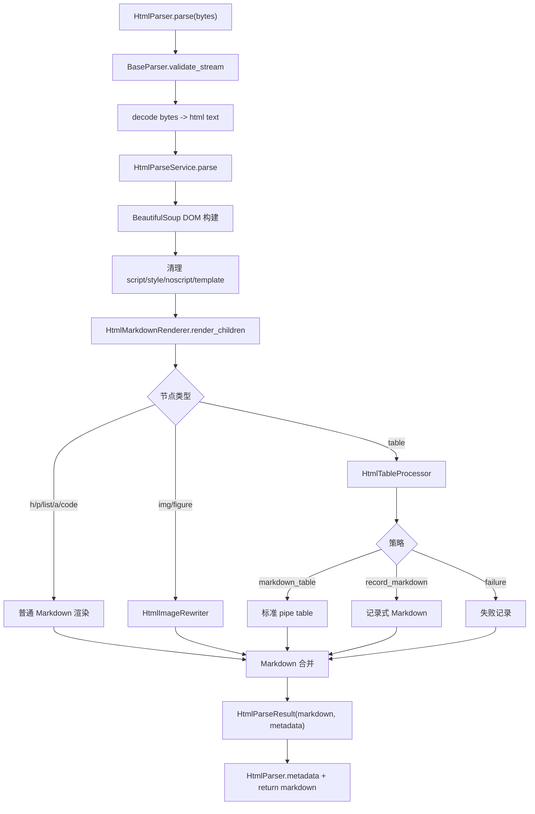

# HTML解析重构 技术设计

- **文档状态：** 技术方案已冻结
- **项目名称：** toLink-Rag
- **业务域：** 文档解析 / HTML 转 Markdown
- **需求名称：** HTML解析重构
- **业务输入：** `docs/HTML解析重构/brief.md`
- **验收输入：** `docs/HTML解析重构/acceptance.feature`
- **输出文件：** `docs/HTML解析重构/technical_design.md`
- **最后更新时间：** 2026-05-17

---

## 1. 文档修订记录

| 版本号 | 修改日期 | 修改内容简述 | 来源/提出人 | 审核状态 |
| :--- | :--- | :--- | :--- | :--- |
| v1.0 | 2026-05-17 | 初始技术设计创建，基于冻结 brief、冻结 acceptance 和当前代码扫描 | brief.md + acceptance.feature | 已冻结 |

---

## 2. 输入依据与设计目标

### 2.1 输入依据映射

| 输入来源 | 关键结论 | 技术设计承接方式 |
| :--- | :--- | :--- |
| `brief.md` | HTML 解析从旧 `trafilatura` 正文抽取改为 RAG 文档模式结构保真解析 | 删除 `HtmlParser` 中 `trafilatura.extract` 路径，新增 `src/core/parser/html/` 内部服务 |
| `brief.md` | 改动仅限 HTML parser 模块、测试和文档；不改 pipeline 和其他业务模块 | 只修改 `ParserFactory` 的 HTML kwargs 分发和 `HtmlParser`；`ParseTaskService`、pipeline、API、MQ 均标注不改 |
| `brief.md` | 图片不真实下载/上传 MinIO，但输出模拟对象存储路径 | 新增图片重写器，生成稳定模拟路径并记录 `image_upload_count=0` |
| `brief.md` | 大表格不拆分，复杂表格输出记录式 Markdown | 表格处理器不输出多段拆分；复杂单元格走记录式模板 |
| `acceptance.feature` | 19 条 Scenario 覆盖主流程、表格、图片链接、异常边界 | 方法级实现表和测试映射逐条关联 Scenario |

### 2.2 技术目标

- 替换当前 `HtmlParser.parse()` 中的 `trafilatura` 旧实现，输出结构稳定的 Markdown。
- 新增 HTML DOM 渲染服务，按 DOM 顺序处理标题、段落、列表、链接、代码块、图片和表格。
- 新增表格处理器，支持普通表格、`rowspan` / `colspan`、多级表头、列表单元格、记录式 Markdown 和失败记录。
- 新增图片/链接规范化能力，支持相对 URL 绝对化、`srcset` 候选选择、`figure/figcaption` 和模拟 MinIO 路径。
- 保持非 HTML 解析链路、pipeline 公共契约、API/MQ/DB/OSS 契约不变。

---

## 3. 改动范围

### 3.1 改动文件目录树

```text
toLink-Rag/
├── pyproject.toml                                      # [修改] 增加 HTML 模块轻量依赖，删除旧 HTML parser 专用 trafilatura 依赖
├── docs/
│   ├── HTML解析重构/
│   │   ├── brief.md                                    # [不改] 冻结业务输入
│   │   ├── acceptance.feature                          # [不改] 冻结验收输入
│   │   ├── feature_info.md                             # [修改] 标记 technical_design 待审核
│   │   └── technical_design.md                         # [新增] 本文件
│   └── architecture/
│       └── file_parser_module.md                       # [修改] 同步 HTML parser 新架构和旧 trafilatura 删除
├── src/
│   └── core/
│       └── parser/
│           ├── factory.py                              # [修改] HTML 分发时传递 parser kwargs，PDF/Word 行为不变
│           ├── providers/
│           │   └── html_parser.py                      # [修改] 删除 trafilatura 路径，委托 HTML 解析服务
│           └── html/
│               ├── __init__.py                         # [新增] HTML parser 内部包导出
│               ├── models.py                           # [新增] HTML 解析 options、result、metadata、表格/图片模型
│               ├── service.py                          # [新增] DOM 构建、清洗、按顺序渲染总入口
│               ├── renderer.py                         # [新增] 普通块级/行内 HTML 节点转 Markdown
│               ├── table_processor.py                  # [新增] 表格分类、矩阵展开、Markdown/记录式/失败渲染
│               └── image_rewriter.py                   # [新增] 图片 URL 绝对化、srcset 选择、模拟 MinIO 路径
└── tests/
    └── unit/
        └── core/
            └── parser/
                ├── test_parser_factory.py              # [修改] 增加 HTML kwargs 分发断言
                ├── test_html_parser.py                 # [测试新增] 覆盖入口、主流程、异常、ParseTaskService 返回契约
                ├── test_html_table_processor.py        # [测试新增] 覆盖表格核心算法和失败记录
                └── test_html_image_rewriter.py         # [测试新增] 覆盖图片链接、srcset、模拟 MinIO 路径
```

### 3.2 文件级改动说明

| 文件 | 动作 | 改动目的 | 是否必须 |
| :--- | :--- | :--- | :--- |
| `pyproject.toml` | 修改 | 显式加入 `beautifulsoup4`；删除仅旧 HTML parser 使用的 `trafilatura` | 是 |
| `src/core/parser/factory.py` | 修改 | 让 HTML parser 可接收 `source_file_url` 等上下文参数；PDF/Word 不变 | 是 |
| `src/core/parser/providers/html_parser.py` | 修改 | 删除旧正文抽取实现，委托新 HTML 服务 | 是 |
| `src/core/parser/html/models.py` | 新增 | 定义服务内部结构化模型，避免裸 dict 到处传 | 是 |
| `src/core/parser/html/service.py` | 新增 | HTML 解码后 DOM 构建、清洗、渲染、metadata 汇总 | 是 |
| `src/core/parser/html/renderer.py` | 新增 | 普通 DOM 节点到 Markdown 的确定性渲染 | 是 |
| `src/core/parser/html/table_processor.py` | 新增 | 表格策略与复杂表格输出核心能力 | 是 |
| `src/core/parser/html/image_rewriter.py` | 新增 | 图片/链接 URL 规范化和模拟对象路径 | 是 |
| `src/services/parse_task_service.py` | 不改 | 保持返回字段和后处理调用链不变 | 是 |
| `src/core/pipeline/parse_task/pipeline.py` | 不改 | 遵守“不改 pipeline”约束 | 是 |
| `src/api/routes/parse.py` / `src/core/mq/messages/parse_task.py` | 不改 | 不新增 API/MQ 公共字段 | 是 |
| `docs/architecture/file_parser_module.md` | 修改 | 文档同步规则要求解析器模块行为变化后更新架构文档 | 是 |
| `tests/unit/core/parser/test_html_*.py` | 测试新增 | 覆盖 acceptance 中可机器验证的 HTML 解析规则 | 是 |

---

## 4. 当前系统分析

| 类型 | 文件/类/方法 | 当前行为 | 问题或复用点 |
| :--- | :--- | :--- | :--- |
| HTML 入口 | `src/core/parser/providers/html_parser.py::HtmlParser.parse` | UTF-8 解码后调用 `trafilatura.extract(..., output_format="markdown")` | 只适合网页正文抽取，表格/图片/代码块不可控；本次删除 |
| Parser 分发 | `src/core/parser/factory.py::ParserFactory.get_parser` | `html/htm` 返回 `HtmlParser()`，不传 kwargs | 无法传 `source_file_url` 等 HTML 上下文；需仅对 HTML 分支补齐 |
| 通用基类 | `src/core/parser/base.py::BaseParser` | 提供空文件校验和 metadata | 可复用，不改 |
| 后处理入口 | `src/services/parse_task_service.py::ParseTaskService.aprocess` | 解析后执行 TextFormatter、MarkdownEnhancementOrchestrator、MarkdownParser | 返回字段契约可复用；不改 |
| Markdown 表格识别 | `src/core/markdown_parser/scanner.py::_extract_table` | 只识别标准 pipe table | 简单表格必须输出标准 pipe table；记录式表格不要求识别为 table |
| Markdown 图片识别 | `src/core/markdown_parser/image_extractor.py` | 可识别 Markdown 图片；可选使用 bs4 识别 HTML img | 本次输出 Markdown 图片，避免依赖 scanner 识别 HTML img |
| 分片标题边界 | `src/core/splitter/rule_chunker.py::ASTAwareChunker.chunk` | `h1` 到 `h3` 会触发 chunk flush 并写入 `heading_trail`；`h4+` 不触发结构强切分 | 记录式表格和失败记录不能使用 `###` / `####` 作为模板标题，避免污染分片边界和标题路径 |
| 依赖 | `pyproject.toml` | 声明 `trafilatura>=1.6.0`，未显式声明 `beautifulsoup4` | 删除旧 HTML 依赖，显式加入 DOM 解析轻量依赖 |
| 测试 | `tests/unit/core/parser/test_parser_factory.py` | 只覆盖 HTML 分发类型，不测真实 HTML 解析质量 | 新增 HTML parser、table、image 测试 |

---

## 5. 总体方案设计

### 5.1 总体流程



### 5.2 模块边界

| 模块 | 职责 | 本次是否改动 |
| :--- | :--- | :--- |
| `HtmlParser` provider | 保持 parser 契约，适配字节流、metadata 和异常 | 是 |
| `ParserFactory` | 文件类型分发 | 是，仅 HTML kwargs 分发 |
| `src/core/parser/html` | HTML 内部解析、渲染、表格、图片 | 是，新增 |
| `MarkdownParser` / `MarkdownScanner` | 消费最终 Markdown | 否 |
| `ParseTaskService` | 后处理和返回字段契约 | 否 |
| pipeline / API / MQ | 解析任务编排和公共契约 | 否 |

---

## 6. API、消息与数据设计

### 6.1 API 设计

- 不新增 HTTP API。
- 不修改 `extract_sync` 表单字段。
- 若调用方在测试或内部直接调用 `ParseTaskService.aprocess(..., source_file_url=...)`，`ParserFactory` 会把该参数传给 `HtmlParser`；现有 API 当前只为 PDF 组装 `source_file_url`，本次不改该 API 行为。

### 6.2 MQ 消息设计

- 不新增 MQ 字段。
- 不修改 `ParseTaskPayload`。
- 异步 pipeline 不为 HTML 构造 source URL；HTML 相对 URL 在缺少 `source_file_url` 时按降级策略保留相对或生成 warning。

### 6.3 数据与存储设计

- 不新增 MySQL/Redis/Qdrant/ES 数据结构。
- 不真实下载图片，不真实上传 MinIO。
- 模拟 MinIO 路径只写入 Markdown 和 metadata，例如：

```text
mock-minio://html-images/<stable_doc_key>/<filename>
```

`stable_doc_key` 优先来自 `source_file_url` 的路径哈希或文件名；缺失时使用固定 `unknown-source`。技术实现阶段需保证同一输入生成稳定路径。

---

## 7. 方法级实现方案

### 7.1 方法级变更总表

| 文件 | 类/对象 | 方法/成员 | 动作 | 入参变化 | 返回变化 | 改动目的 | 对应 Scenario |
| :--- | :--- | :--- | :--- | :--- | :--- | :--- | :--- |
| `src/core/parser/factory.py` | `ParserFactory` | `get_parser` | 修改 | HTML 分支使用 `**kwargs` | 不变 | 支持 HTML 来源上下文；保持 PDF/Word 不变 | 相对链接和图片 URL 转为绝对 URL后生成模拟 MinIO 图片引用；HTML解析重构不改变非 HTML解析链路 |
| `src/core/parser/providers/html_parser.py` | `HtmlParser` | `__init__` | 新增 | `source_file_url/source_url/image_prefix/simulate_image_failure` 等可选参数 | 无 | 保存 HTML 解析上下文 | 相对链接和图片 URL 转为绝对 URL后生成模拟 MinIO 图片引用 |
| `src/core/parser/providers/html_parser.py` | `HtmlParser` | `parse` | 修改 | 不变 | 不变 | 删除 trafilatura，委托 `HtmlParseService` | 基础 HTML结构按 DOM顺序转换为 Markdown；空 HTML文件直接失败；DOM构建后没有有效内容直接失败 |
| `src/core/parser/html/models.py` | `HtmlParseOptions` | dataclass | 新增 | options 字段 | 对象 | 传递 source URL、模拟路径配置 | 多个图片/链接 Scenario |
| `src/core/parser/html/models.py` | `HtmlParseResult` | dataclass | 新增 | markdown、metadata | 对象 | 服务层返回 Markdown 与元信息 | HTML解析重构不改变 pipeline公共契约 |
| `src/core/parser/html/models.py` | `TableRenderResult` / `ImageRewriteResult` | dataclass | 新增 | 结构化字段 | 对象 | 避免裸 dict 传递策略结果 | 表格处理；图片和链接 |
| `src/core/parser/html/service.py` | `HtmlParseService` | `parse` | 新增 | `html_text`, `options` | `HtmlParseResult` | HTML 总入口，构建 DOM、清洗、渲染、空结果校验 | 主流程全部；噪声节点不会进入 Markdown |
| `src/core/parser/html/service.py` | `HtmlParseService` | `_build_soup` | 新增 | `html_text` | `BeautifulSoup` | DOM 构建 | DOM构建后没有有效内容直接失败 |
| `src/core/parser/html/service.py` | `HtmlParseService` | `_clean_soup` | 新增 | `soup` | `None` | 删除噪声节点 | 噪声节点不会进入 Markdown |
| `src/core/parser/html/renderer.py` | `HtmlMarkdownRenderer` | `render_children` | 新增 | DOM children | `str` | 按 DOM 顺序合并子节点 Markdown | 表格、图片和段落保持原始上下文顺序 |
| `src/core/parser/html/renderer.py` | `HtmlMarkdownRenderer` | `render_node` | 新增 | DOM node | `str` | 分派普通节点、图片、表格、代码块 | 基础 HTML结构按 DOM顺序转换为 Markdown |
| `src/core/parser/html/renderer.py` | `HtmlMarkdownRenderer` | `render_inline` | 新增 | DOM node | `str` | 行内文本、链接、强调等转换 | 基础 HTML结构按 DOM顺序转换为 Markdown |
| `src/core/parser/html/renderer.py` | `HtmlMarkdownRenderer` | `render_list` | 新增 | `ul/ol` node | `str` | 输出 Markdown 列表 | 基础 HTML结构按 DOM顺序转换为 Markdown |
| `src/core/parser/html/renderer.py` | `HtmlMarkdownRenderer` | `render_code_block` | 新增 | `pre/code` node | `str` | 输出 fenced code block | 基础 HTML结构按 DOM顺序转换为 Markdown |
| `src/core/parser/html/image_rewriter.py` | `HtmlImageRewriter` | `rewrite_img` | 新增 | img node | `ImageRewriteResult` | 图片绝对 URL、srcset、模拟路径 | 相对链接和图片 URL；srcset图片选择；figure图片保留图注；图片无法生成模拟对象路径 |
| `src/core/parser/html/image_rewriter.py` | `HtmlImageRewriter` | `resolve_url` | 新增 | url | `str` | 相对 URL 绝对化 | 相对链接和图片 URL 转为绝对 URL后生成模拟 MinIO图片引用 |
| `src/core/parser/html/image_rewriter.py` | `HtmlImageRewriter` | `build_mock_object_url` | 新增 | source URL、alt | `str` | 生成稳定模拟 MinIO 路径 | 图片和链接 Scenario |
| `src/core/parser/html/table_processor.py` | `HtmlTableProcessor` | `render` | 新增 | table node | `TableRenderResult` | 单表处理总入口和异常兜底 | 所有表格处理 Scenario |
| `src/core/parser/html/table_processor.py` | `HtmlTableProcessor` | `_classify_table` | 新增 | table node | strategy | 区分 pipe table / 记录式 | 嵌套表格输出记录式 Markdown；图片单元格输出记录式 Markdown |
| `src/core/parser/html/table_processor.py` | `HtmlTableProcessor` | `_build_matrix` | 新增 | table node | matrix | 展开 rowspan/colspan | rowspan 表格展开；colspan 和多级表头 |
| `src/core/parser/html/table_processor.py` | `HtmlTableProcessor` | `_flatten_headers` | 新增 | matrix | headers | 多级表头压平 | colspan 和多级表头表格输出可读列名 |
| `src/core/parser/html/table_processor.py` | `HtmlTableProcessor` | `_render_markdown_table` | 新增 | headers、rows | `str` | 输出标准 Markdown table，不拆分大表格 | 简单 HTML表格输出标准 Markdown table；大表格不拆分 |
| `src/core/parser/html/table_processor.py` | `HtmlTableProcessor` | `_render_record_markdown` | 新增 | table、reason、matrix | `str` | 输出固定记录式 Markdown | 嵌套表格输出记录式 Markdown；图片单元格输出记录式 Markdown |
| `src/core/parser/html/table_processor.py` | `HtmlTableProcessor` | `_render_failure_note` | 新增 | table、error | `str` | 原位置失败记录 | 单个表格处理失败时输出原位置失败记录 |

### 7.2 逐方法实现设计

#### 7.2.1 `src/core/parser/factory.py::ParserFactory.get_parser`

- 当前行为：`html/htm` 直接返回 `HtmlParser()`，丢弃 `**kwargs`。
- 修改后职责：`elif ext in ["html", "htm"]` 返回 `HtmlParser(**kwargs)`；PDF 分支仍传 `PdfParser(**kwargs)`；Word 分支不变。
- 入参：不变。
- 返回：不变。
- 详细步骤：
  1. 保持 `ext = file_type.lower()`。
  2. Word 分支继续无参构造。
  3. PDF 分支继续传递 kwargs。
  4. HTML 分支改为传递 kwargs。
- 事务与异常边界：无事务；不支持格式仍抛 `UnsupportedFormatError`。
- 幂等与并发边界：纯工厂方法，无共享状态。
- 调用关系：`ParseTaskService._parse_markdown()` 调用。
- 对应测试：`HTML 解析重构不改变非 HTML 解析链路`、`相对链接和图片 URL 转为绝对 URL后生成模拟 MinIO 图片引用`。

#### 7.2.2 `src/core/parser/providers/html_parser.py::HtmlParser.__init__`

- 当前行为：未定义构造函数，只继承 `BaseParser.__init__`。
- 修改后职责：初始化 BaseParser metadata，并保存 HTML 解析上下文。
- 入参：可选 `source_file_url`、`source_url`、`image_prefix`、`simulate_image_path_failure`。
- 返回：无。
- 详细步骤：
  1. 调用 `super().__init__()`。
  2. 将 `source_url = source_file_url or source_url` 写入 `HtmlParseOptions`。
  3. 将图片模拟路径配置写入 options。
- 事务与异常边界：无外部 IO。
- 幂等与并发边界：parser 实例级状态，不跨任务共享。
- 调用关系：由 `ParserFactory.get_parser()` 构造。
- 对应测试：图片链接相关 Scenario。

#### 7.2.3 `src/core/parser/providers/html_parser.py::HtmlParser.parse`

- 当前行为：UTF-8 解码后调用 `trafilatura.extract`，失败时抛 `ParseBaseException`。
- 修改后职责：校验文件流、解码、调用 `HtmlParseService.parse()`，同步 metadata 并返回 Markdown。
- 入参：`file_stream: bytes` 不变。
- 返回：Markdown 字符串不变。
- 详细步骤：
  1. 调用 `validate_stream`，空 bytes 继续抛 `ValueError("文件流不可为空")`。
  2. UTF-8 解码，`errors="ignore"` 保持当前兼容性。
  3. 调用 `HtmlParseService(options).parse(html_content)`。
  4. 若服务返回空 markdown，抛 `ParseBaseException("HTML 正文提取失败：未找到有效正文内容或噪音过大")`，保持 acceptance 中异常语义。
  5. 将服务 metadata 合并到 `self.metadata`，设置 `pages_or_length`。
- 事务与异常边界：不做网络、MinIO 或数据库操作；服务内部单表失败不穿透，整篇无有效内容才抛异常。
- 幂等与并发边界：同一输入和 options 输出稳定。
- 调用关系：`ParseTaskService._parse_markdown()`。
- 对应测试：主流程、空 HTML、无有效内容、pipeline 公共契约。

#### 7.2.4 `src/core/parser/html/service.py::HtmlParseService.parse`

- 当前行为：无。
- 修改后职责：HTML 文本到 `HtmlParseResult` 的总入口。
- 入参：`html_text: str`。
- 返回：`HtmlParseResult`。
- 详细步骤：
  1. 初始化 metadata：`parse_mode=document`、`table_count=0`、`table_split_count=0`、`image_count=0`、`image_upload_count=0`、warning 计数字段。
  2. 调用 `_build_soup`。
  3. 调用 `_clean_soup`。
  4. 选择 `body` 或 soup 根节点作为渲染根。
  5. 调用 renderer 按 DOM 顺序渲染。
  6. 合并 renderer、table processor、image rewriter 产生的 metadata。
  7. 如果 Markdown 去空白后为空，抛 `ParseBaseException("HTML 正文提取失败：未找到有效正文内容或噪音过大")`。
- 事务与异常边界：整篇 DOM 构建异常可转 `ParseBaseException`；单表异常由 table processor 收敛。
- 幂等与并发边界：无共享可变全局状态。
- 调用关系：`HtmlParser.parse()`。
- 对应测试：主流程、噪声清理、无有效内容。

#### 7.2.5 `src/core/parser/html/service.py::HtmlParseService._build_soup`

- 当前行为：无。
- 修改后职责：使用 `BeautifulSoup(html_text, "html.parser")` 构建 DOM。
- 入参：HTML 字符串。
- 返回：BeautifulSoup 对象。
- 详细步骤：调用 BeautifulSoup；捕获极端解析异常并包装为 `ParseBaseException`。
- 事务与异常边界：不访问外部系统。
- 幂等与并发边界：纯内存对象。
- 调用关系：`parse()`。
- 对应测试：`DOM 构建后没有有效内容直接失败`。

#### 7.2.6 `src/core/parser/html/service.py::HtmlParseService._clean_soup`

- 当前行为：无。
- 修改后职责：删除 `script`、`style`、`noscript`、`template`。
- 入参：soup 对象。
- 返回：无，原地修改。
- 详细步骤：遍历上述标签并 `decompose()`；不默认删除 `nav/footer/aside`，避免误删知识内容。
- 事务与异常边界：清理失败记录 warning，不应导致整篇失败。
- 幂等与并发边界：对同一 soup 重复执行结果稳定。
- 调用关系：`parse()`。
- 对应测试：`噪声节点不会进入 Markdown`。

#### 7.2.7 `src/core/parser/html/renderer.py::HtmlMarkdownRenderer.render_children`

- 当前行为：无。
- 修改后职责：按 DOM 子节点顺序渲染并用空行合并块级 Markdown。
- 入参：节点列表。
- 返回：Markdown 字符串。
- 详细步骤：
  1. 顺序遍历 children。
  2. 对每个节点调用 `render_node`。
  3. 丢弃空片段。
  4. 块级片段之间用双换行合并。
- 事务与异常边界：单节点异常按节点类型处理；table 异常由 table processor 兜底。
- 幂等与并发边界：无共享状态。
- 调用关系：`HtmlParseService.parse()`。
- 对应测试：`表格、图片和段落保持原始上下文顺序`。

#### 7.2.8 `src/core/parser/html/renderer.py::HtmlMarkdownRenderer.render_node`

- 当前行为：无。
- 修改后职责：分派块级节点。
- 入参：BeautifulSoup node。
- 返回：Markdown 片段。
- 详细步骤：
  1. 文本节点返回 stripped 文本。
  2. `h1`-`h6` 输出对应 `#` 标题。
  3. `p/div/section/article/main` 渲染子节点。
  4. `ul/ol` 调用 `render_list`。
  5. `pre` 或 `pre > code` 调用 `render_code_block`。
  6. `figure` 调用图片重写器并追加 figcaption。
  7. `img` 调用图片重写器输出 ``。
  8. `table` 调用表格处理器。
  9. 其他标签递归渲染 children。
- 事务与异常边界：非 table 节点异常记录 warning 并返回可读文本兜底。
- 幂等与并发边界：纯内存渲染。
- 调用关系：`render_children()`。
- 对应测试：主流程、图片、表格。

#### 7.2.9 `src/core/parser/html/renderer.py::HtmlMarkdownRenderer.render_inline`

- 当前行为：无。
- 修改后职责：行内文本、链接、强调、代码等转换。
- 入参：行内 node。
- 返回：字符串。
- 详细步骤：文本转义 Markdown 特殊结构；`a` 使用 image/link rewriter 的 `resolve_url` 输出 `[text](absolute_url)`；`strong/b` 输出 `**text**`；`em/i` 输出 `*text*`；`code` 输出反引号。
- 事务与异常边界：URL 无法解析时保留原值并 warning。
- 幂等与并发边界：纯字符串处理。
- 对应测试：`基础 HTML 结构按 DOM 顺序转换为 Markdown`、`相对链接和图片 URL 转为绝对 URL后生成模拟 MinIO 图片引用`。

#### 7.2.10 `src/core/parser/html/renderer.py::HtmlMarkdownRenderer.render_list`

- 当前行为：无。
- 修改后职责：输出 Markdown 有序/无序列表。
- 入参：`ul` 或 `ol` node。
- 返回：列表 Markdown。
- 详细步骤：只遍历直接 `li`；无序输出 `- `；有序输出递增 `1. `；嵌套列表缩进两个空格。
- 事务与异常边界：异常时退化为 li 文本行。
- 对应测试：`基础 HTML 结构按 DOM 顺序转换为 Markdown`。

#### 7.2.11 `src/core/parser/html/renderer.py::HtmlMarkdownRenderer.render_code_block`

- 当前行为：无。
- 修改后职责：输出 fenced code block。
- 入参：`pre` 或 `code` node。
- 返回：Markdown 代码块。
- 详细步骤：从 class 中提取 `language-xxx`；保留代码文本；输出三反引号 fence。
- 事务与异常边界：语言缺失时输出无语言 fence。
- 对应测试：`基础 HTML 结构按 DOM 顺序转换为 Markdown`。

#### 7.2.12 `src/core/parser/html/image_rewriter.py::HtmlImageRewriter.rewrite_img`

- 当前行为：无。
- 修改后职责：把 HTML img 转为 Markdown 图片引用所需结构。
- 入参：img node。
- 返回：`ImageRewriteResult`。
- 详细步骤：
  1. 读取 `alt`。
  2. 从 `srcset` 选择最高倍率或最大宽度候选，否则使用 `src`。
  3. 调用 `resolve_url` 得到绝对 URL。
  4. 调用 `build_mock_object_url` 得到模拟 MinIO 路径。
  5. 更新 metadata：`image_count += 1`、`image_upload_count` 保持 0。
  6. 若模拟路径生成失败，返回绝对 URL 并记录 `image_warning_count += 1`。
- 事务与异常边界：不下载图片，不上传 MinIO；失败不穿透。
- 幂等与并发边界：同一 source URL 生成同一模拟路径。
- 对应测试：图片和链接三个 Scenario、图片失败 Scenario。

#### 7.2.13 `src/core/parser/html/image_rewriter.py::HtmlImageRewriter.resolve_url`

- 当前行为：无。
- 修改后职责：相对 URL 绝对化。
- 入参：原始 URL。
- 返回：URL 字符串。
- 详细步骤：如果是绝对 URL 或 `data:`，直接返回；如果有 `source_url`，用 `urllib.parse.urljoin`；否则返回原始 URL 并 warning。
- 对应测试：相对链接和图片 URL Scenario。

#### 7.2.14 `src/core/parser/html/image_rewriter.py::HtmlImageRewriter.build_mock_object_url`

- 当前行为：无。
- 修改后职责：生成稳定模拟对象存储路径。
- 入参：绝对 source URL、alt 或文件名。
- 返回：`mock-minio://...`。
- 详细步骤：从 URL path 提取 basename；用 source URL 或 basename 生成短 hash；拼接 `mock-minio://html-images/<hash>/<basename>`；测试可通过 option 强制失败。
- 对应测试：所有模拟 MinIO 路径 Scenario。

#### 7.2.15 `src/core/parser/html/table_processor.py::HtmlTableProcessor.render`

- 当前行为：无。
- 修改后职责：单个 table 的总入口，保证返回 Markdown 片段。
- 入参：table node。
- 返回：`TableRenderResult`。
- 详细步骤：
  1. metadata `table_count += 1`。
  2. try 内调用 `_classify_table`。
  3. `markdown_table`：构建矩阵、表头、数据行，调用 `_render_markdown_table`。
  4. `record_markdown`：调用 `_render_record_markdown`。
  5. 捕获异常：调用 `_render_failure_note`，`table_failure_count += 1`。
- 事务与异常边界：单表异常不穿透整篇解析。
- 幂等与并发边界：纯内存计算。
- 对应测试：所有表格 Scenario。

#### 7.2.16 `src/core/parser/html/table_processor.py::HtmlTableProcessor._classify_table`

- 当前行为：无。
- 修改后职责：识别可表格化或记录式表格。
- 入参：table node。
- 返回：策略字符串和原因。
- 详细步骤：含嵌套 table、img、svg、video、多段长文本时返回 `record_markdown`；否则返回 `markdown_table`。`rowspan/colspan` 不直接判复杂，交给矩阵展开。
- 对应测试：嵌套表格、图片单元格、rowspan/colspan。

#### 7.2.17 `src/core/parser/html/table_processor.py::HtmlTableProcessor._build_matrix`

- 当前行为：无。
- 修改后职责：展开 HTML table 为规则矩阵。
- 入参：table node。
- 返回：二维 cell 矩阵。
- 详细步骤：按 `thead/tbody/tfoot/tr` 顺序读取直属行；解析 `rowspan/colspan`；跳过已占用位置；纵向 rowspan 复制文本；横向 colspan 复制或标记父级表头；补齐列宽。
- 异常边界：结构冲突不可恢复时抛内部异常，由 `render` 转失败记录。
- 对应测试：rowspan、colspan、多级表头。

#### 7.2.18 `src/core/parser/html/table_processor.py::HtmlTableProcessor._flatten_headers`

- 当前行为：无。
- 修改后职责：将多行表头压平成稳定列名。
- 入参：矩阵。
- 返回：headers、data_rows。
- 详细步骤：优先 `th` 行；多级表头用 `父 / 子`；空列名用 `列 N`；重复列追加序号。
- 对应测试：`colspan 和多级表头表格输出可读列名`。

#### 7.2.19 `src/core/parser/html/table_processor.py::HtmlTableProcessor._render_markdown_table`

- 当前行为：无。
- 修改后职责：输出标准 pipe table。
- 入参：headers、rows。
- 返回：Markdown table。
- 详细步骤：转义 `|`；压缩换行；列表项用 `；` 连接；所有行按 header 宽度补齐；不按行数拆分大表格；`table_split_count` 固定 0。
- 对应测试：简单表格、列表单元格、大表格。

#### 7.2.20 `src/core/parser/html/table_processor.py::HtmlTableProcessor._render_record_markdown`

- 当前行为：无。
- 修改后职责：输出固定记录式 Markdown。
- 入参：table、reason、matrix。
- 返回：Markdown。
- 详细步骤：输出无 Markdown 标题语法的连续记录块，格式为 `[HTML表格开始：{caption 或 未命名表格}]`、`表格类型：记录式表格`、`表格说明：该 HTML 表格包含{reason}`、`表格结构：...`、`记录 N：` 和字段列表，最后输出 `[HTML表格结束：{caption 或 未命名表格}]`；图片单元格通过 `HtmlImageRewriter` 生成模拟路径；不输出原始 `<table>`；不使用 `###` / `####`，避免被分片器当作 h3/h4 标题元素。
- 对应测试：嵌套表格、图片单元格。

#### 7.2.21 `src/core/parser/html/table_processor.py::HtmlTableProcessor._render_failure_note`

- 当前行为：无。
- 修改后职责：输出原位置失败记录。
- 入参：table、error。
- 返回：Markdown。
- 详细步骤：输出无 Markdown 标题语法的失败记录块，格式为 `[HTML表格开始：{caption 或 未命名表格}]`、`表格类型：解析失败表格`、固定失败说明、脱敏失败原因、最多若干条文本摘要和 `[HTML表格结束：{caption 或 未命名表格}]`。
- 对应测试：单表失败 Scenario。

---

## 8. 组件与集成设计

- `beautifulsoup4`：作为本轮唯一明确新增的 HTML 轻量依赖，使用内置 `html.parser`，不引入 `lxml`。
- `trafilatura`：当前仅被旧 `HtmlParser` 使用，本次删除旧路径后从 `pyproject.toml` 移除。若后续其他模块新增使用，再单独加回。
- `ParseTaskService`：不改。继续通过 `ParserFactory` 拿 parser，继续返回 `markdown`、`parse_result`、`metadata`、`time_cost_ms`。
- `MarkdownParser`：不改。HTML 输出必须适配它当前的 pipe table、fenced code、Markdown image 识别能力。
- 对象存储：不接入真实 MinIO，只模拟路径；不读取 `StorageFactory`。

---

## 9. 异常处理与降级策略

| 异常场景 | 处理方式 | 是否抛出 | 是否影响消息确认 |
| :--- | :--- | :--- | :--- |
| 空 bytes | `BaseParser.validate_stream` 抛 `ValueError("文件流不可为空")` | 是 | 由现有 pipeline 失败路径处理 |
| DOM 构建后无有效 Markdown | 抛 `ParseBaseException("HTML 正文提取失败：未找到有效正文内容或噪音过大")` | 是 | 由现有 pipeline 失败路径处理 |
| 单个 table 处理异常 | 原位置输出失败记录，metadata `table_failure_count += 1` | 否 | 不影响 |
| 图片模拟路径生成失败 | 保留绝对原始 URL，metadata `image_warning_count += 1` | 否 | 不影响 |
| 相对 URL 缺 source_url | 保留原始 URL 或相对路径，记录 warning | 否 | 不影响 |
| 新增依赖缺失 | import 阶段失败，测试/启动暴露 | 是 | 发布前通过依赖安装验证阻断 |

---

## 10. 测试方案

### 10.1 方法级测试映射

| 被测文件/方法 | 测试文件 | 对应 Scenario | 断言要点 |
| :--- | :--- | :--- | :--- |
| `HtmlParser.parse` | `tests/unit/core/parser/test_html_parser.py` | 基础 HTML 结构按 DOM 顺序转换为 Markdown | 标题、段落、链接、列表、代码块、metadata |
| `HtmlParseService._clean_soup` | `test_html_parser.py` | 噪声节点不会进入 Markdown | script/style/noscript/template 被移除 |
| `HtmlMarkdownRenderer.render_children` | `test_html_parser.py` | 表格、图片和段落保持原始上下文顺序 | 片段顺序断言 |
| `HtmlTableProcessor._render_markdown_table` | `test_html_table_processor.py` | 简单 HTML 表格输出标准 Markdown table | pipe table 和 parse_result.tables |
| `HtmlTableProcessor._build_matrix` | `test_html_table_processor.py` | rowspan 表格展开后保持字段和值对应 | rowspan 复制语义，不输出 HTML |
| `HtmlTableProcessor._flatten_headers` | `test_html_table_processor.py` | colspan 和多级表头表格输出可读列名 | `父 / 子` 表头 |
| `HtmlTableProcessor._render_markdown_table` | `test_html_table_processor.py` | 列表单元格不会破坏 Markdown table；大表格不拆分 | 列数一致；单 table 块 |
| `HtmlTableProcessor._render_record_markdown` | `test_html_table_processor.py` | 嵌套表格输出记录式 Markdown；图片单元格输出记录式 Markdown | 固定模板、不含 `<table>`、不含 `### 表格` / `#### 记录` |
| `HtmlTableProcessor._render_failure_note` | `test_html_table_processor.py` | 单个表格处理失败时输出原位置失败记录 | 失败前后顺序、failure count |
| `HtmlImageRewriter.rewrite_img` | `test_html_image_rewriter.py` | 相对链接和图片 URL；srcset；figure；图片失败 | 绝对 URL、模拟路径、warning |
| `ParserFactory.get_parser` | `test_parser_factory.py` | HTML 解析重构不改变非 HTML 解析链路 | PDF 仍走 PdfParser；HTML kwargs 传入 |
| `ParseTaskService.aprocess` | `test_html_parser.py` | HTML 解析重构不改变 pipeline 公共契约 | 返回四个字段 |

### 10.2 Scenario 覆盖自检

| Scenario | 承接方法 | 承接测试 | 是否覆盖 |
| :--- | :--- | :--- | :--- |
| 基础 HTML 结构按 DOM 顺序转换为 Markdown | `HtmlParser.parse`, `HtmlMarkdownRenderer.render_node` | `test_html_parser.py` | ✅ |
| 噪声节点不会进入 Markdown | `HtmlParseService._clean_soup` | `test_html_parser.py` | ✅ |
| 表格、图片和段落保持原始上下文顺序 | `HtmlMarkdownRenderer.render_children` | `test_html_parser.py` | ✅ |
| 简单 HTML 表格输出标准 Markdown table | `HtmlTableProcessor._render_markdown_table` | `test_html_table_processor.py` | ✅ |
| rowspan 表格展开后保持字段和值对应 | `HtmlTableProcessor._build_matrix` | `test_html_table_processor.py` | ✅ |
| colspan 和多级表头表格输出可读列名 | `HtmlTableProcessor._flatten_headers` | `test_html_table_processor.py` | ✅ |
| 列表单元格不会破坏 Markdown table | `HtmlTableProcessor._render_markdown_table` | `test_html_table_processor.py` | ✅ |
| 嵌套表格输出记录式 Markdown | `HtmlTableProcessor._render_record_markdown` | `test_html_table_processor.py` | ✅ |
| 图片单元格输出记录式 Markdown | `HtmlTableProcessor._render_record_markdown`, `HtmlImageRewriter.rewrite_img` | `test_html_table_processor.py` | ✅ |
| 大表格不拆分为多个表格片段 | `HtmlTableProcessor._render_markdown_table` | `test_html_table_processor.py` | ✅ |
| 单个表格处理失败时输出原位置失败记录 | `HtmlTableProcessor.render`, `_render_failure_note` | `test_html_table_processor.py` | ✅ |
| 相对链接和图片 URL 转为绝对 URL后生成模拟 MinIO 图片引用 | `HtmlImageRewriter.resolve_url`, `build_mock_object_url` | `test_html_image_rewriter.py` | ✅ |
| srcset 图片选择较优候选并生成模拟对象路径 | `HtmlImageRewriter.rewrite_img` | `test_html_image_rewriter.py` | ✅ |
| figure 图片保留图注 | `HtmlMarkdownRenderer.render_node`, `HtmlImageRewriter.rewrite_img` | `test_html_image_rewriter.py` | ✅ |
| 空 HTML 文件直接失败 | `HtmlParser.parse` | `test_html_parser.py` | ✅ |
| DOM 构建后没有有效内容直接失败 | `HtmlParseService.parse` | `test_html_parser.py` | ✅ |
| 图片无法生成模拟对象路径时保留绝对原始引用 | `HtmlImageRewriter.build_mock_object_url` | `test_html_image_rewriter.py` | ✅ |
| HTML 解析重构不改变非 HTML 解析链路 | `ParserFactory.get_parser` | `test_parser_factory.py` | ✅ |
| HTML 解析重构不改变 pipeline 公共契约 | `ParseTaskService.aprocess` | `test_html_parser.py` | ✅ |

### 10.3 回归命令

```bash
.venv/bin/pytest tests/unit/core/parser/test_html_parser.py -q
.venv/bin/pytest tests/unit/core/parser/test_html_table_processor.py -q
.venv/bin/pytest tests/unit/core/parser/test_html_image_rewriter.py -q
.venv/bin/pytest tests/unit/core/parser/test_parser_factory.py -q
.venv/bin/pytest tests/unit/core/parser -q
python scripts/check_docs_sync.py --staged
```

---

## 11. 发布与回滚

- 发布前确保依赖安装包含 `beautifulsoup4`，并确认 `trafilatura` 删除后没有非 HTML 模块 import。
- 回滚方式：恢复 `pyproject.toml` 的 `trafilatura` 依赖和旧 `HtmlParser` 实现；新增 `src/core/parser/html/` 文件可整体移除。
- 因不改 API/MQ/DB/pipeline，回滚不涉及数据迁移。

---

## 12. 风险与待确认问题

| 风险/问题 | 影响 | 建议处理 |
| :--- | :--- | :--- |
| acceptance 当前为自然语言 Gherkin，项目尚未发现 pytest-bdd step 基础设施 | 无法直接运行 `.feature` 文件 | 本轮用单元测试承接 Scenario；后续如引入 pytest-bdd，再把 Scenario 编译为 step |
| `MarkdownEnhancementOrchestrator` 可能重排或清洗新 Markdown | 底层 parser 结果正确，但最终 `ParseTaskService` 输出变化 | 必须包含 `ParseTaskService.aprocess` 级别测试 |
| 记录式 Markdown 大表格不拆分可能产生大 chunk | embedding 成本和召回粒度不理想 | 本轮按 brief 固定不拆分；记录式模板不使用 h1-h3 标题，避免额外制造分片边界；后续如需拆分再单独设计 |
| 模拟 MinIO 路径规则未来与真实上传规则不一致 | 后续接入真实 MinIO 时需要迁移输出格式 | 路径生成集中在 `HtmlImageRewriter.build_mock_object_url`，后续替换单点逻辑 |

---

## 13. 实施顺序

1. 修改依赖：加入 `beautifulsoup4`，移除 `trafilatura`。
2. 新增 `src/core/parser/html/models.py`。
3. 新增 `image_rewriter.py` 并完成图片/链接单元测试。
4. 新增 `table_processor.py` 并完成表格单元测试。
5. 新增 `renderer.py`、`service.py`，串联 DOM 渲染。
6. 修改 `providers/html_parser.py` 和 `factory.py`。
7. 增加 `ParseTaskService.aprocess` 级别回归测试。
8. 更新 `docs/architecture/file_parser_module.md`。
9. 运行 parser 单元测试和文档同步检查。

---

## 14. 人工审核清单

- [ ] 确认 `beautifulsoup4` 是本轮唯一新增依赖。
- [ ] 确认删除 `trafilatura` 不影响非 HTML 模块。
- [ ] 确认不修改 API、MQ、pipeline、数据库、对象存储真实上传链路。
- [ ] 确认模拟 MinIO 路径格式可接受。
- [ ] 确认大表格不拆分。
- [ ] 确认记录式 Markdown 模板满足验收，且不使用会影响分片的 Markdown 标题语法。
