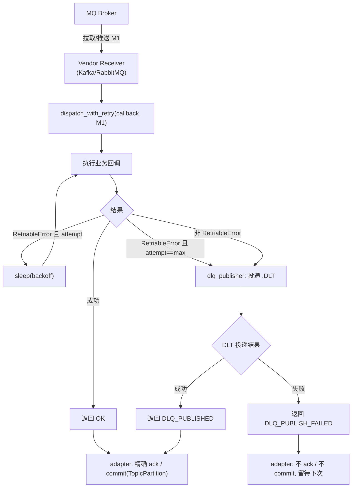

# MQ 消费 poison pill 死信与重试兜底 技术设计

- **文档状态：** 技术方案已冻结（2026-05-19）
- **项目名称：** toLink-Rag
- **业务域：** 消息中台 (MQ adapter / consumer framework)
- **需求名称：** MQ 消费 poison pill 死信与重试兜底
- **业务输入：** [docs/MQ消费死信兜底/brief.md](./brief.md)
- **验收输入：** [docs/MQ消费死信兜底/acceptance.feature](./acceptance.feature)
- **输出文件：** docs/MQ消费死信兜底/technical_design.md
- **最后更新时间：** 2026-05-19

---

## 1. 文档修订记录

| 版本号 | 修改日期   | 修改内容简述           | 来源/提出人                  | 审核状态 |
| :----- | :--------- | :--------------------- | :--------------------------- | :------- |
| v1.0   | 2026-05-19 | 初始技术设计创建       | brief.md + acceptance.feature | 待审核   |

---

## 2. 输入依据与设计目标

### 2.1 输入依据映射

| 输入来源              | 关键结论                                                                                                                                | 技术设计承接方式                                                                                                                              |
| :-------------------- | :-------------------------------------------------------------------------------------------------------------------------------------- | :------------------------------------------------------------------------------------------------------------------------------------------- |
| `brief.md`            | 三层修复：异常分类、adapter 有限重试 + 死信兜底 + 精确位点提交、配置项 + RabbitMQ 对齐；死信恒启用；计数进程内存；进死信即终止。       | 新增 `RetriableError` + `dispatch_with_retry` 公共编排层；Kafka/RabbitMQ adapter 改用编排层 + 精确 ack；启动期 topic_admin/DLX 幂等创建。     |
| `acceptance.feature`  | 17 Scenario：主流程 / 可重试退避 / 终态分流 / 死信内容与可靠性 / 精确提交 / 计数语义 / 厂商对齐。                                       | 每条 Scenario 对应至少一个 [修改] / [新增] 方法，详见 §7.1 与 §10。                                                                          |
| 真实代码扫描          | `KafkaReceiver._consume_loop` 失败仅打日志不提交、`commit()` 无参跨分区提交；`RabbitMQReceiver` 用 `message.process()` 自动 nack 重入队；`ParseResultNotificationError` 已存在；topic_admin 已有 `build_default_topic_specs / ensure_topics`。 | 改造点直接落到既有方法；不重写 vendor 接口；DLT 规格沿用 `TopicSpec` 模型纳入 `build_default_topic_specs`。                                  |

### 2.2 技术目标

- 消除 `KafkaReceiver._consume_loop` 上的 poison pill：失败不再无限重投、不再因无参提交而静默跳过坏消息丢数据。
- RabbitMQ 行为对齐 Kafka：相同的异常分流与最大重试次数语义，超限路由到 DLX。
- 死信目标在 Kafka / RabbitMQ 启动时幂等创建，应用首次投递不依赖运维预置。
- 实现不污染业务回调：`ParseTaskPipeline` 与业务消费者无需感知重试/死信编排。
- 满足 acceptance.feature 全部 17 个 Scenario，新增专门的 acceptance 测试套件承接。

---

## 3. 改动范围

### 3.1 改动文件目录树

```text
toLink-Rag/
├── src/
│   ├── config.py                                       # [修改] 新增 MQ_MAX_RETRIES / MQ_RETRY_BACKOFF_SECONDS / MQ_DLQ_SUFFIX
│   ├── main.py                                         # [不改] 现有 lifespan 已调用 ensure_topics()，DLT 规格由 topic_admin 内部扩展
│   └── core/
│       ├── mq/
│       │   ├── exceptions.py                           # [修改] 新增 RetriableError 基类
│       │   ├── retry.py                                # [新增] 公共重试/死信编排层（RetryPolicy / DispatchOutcome / dispatch_with_retry / build_dlq_envelope）
│       │   ├── factory.py                              # [修改] 新增 get_retry_policy / get_dlq_publisher；get_receiver 注入编排依赖
│       │   ├── topic_admin.py                          # [修改] build_default_topic_specs 为每个业务 topic 追加同规格 DLT spec
│       │   └── vendors/
│       │       ├── kafka/
│       │       │   └── kafka_adapter.py                # [修改] KafkaReceiver 接入 dispatch_with_retry；commit 改为精确按 TopicPartition；接受 retry_policy / dlq_publisher
│       │       └── rabbitmq_adapter.py                 # [修改] RabbitMQReceiver 弃用 message.process()；启动时声明 DLX + DLT 队列；接入 dispatch_with_retry；手动 ack / reject
│       └── pipeline/parse_task/
│           └── notifier.py                             # [修改] ParseResultNotificationError 改为继承 RetriableError
├── tests/
│   ├── unit/core/mq/
│   │   ├── test_retry.py                               # [测试新增] dispatch_with_retry 全部分支
│   │   ├── test_factory.py                             # [测试修改] 覆盖 get_retry_policy / get_dlq_publisher / receiver 注入
│   │   ├── test_kafka_receiver.py                      # [测试新增] 精确提交 + 重试/死信编排（aiokafka mock）
│   │   ├── test_rabbitmq_receiver.py                   # [测试新增] DLX 装配 + 手动 ack/reject（aio_pika mock）
│   │   └── test_topic_admin.py                         # [测试新增] DLT spec 同规格 + ensure_topics 幂等
│   └── acceptance/
│       ├── mq_dlq_poison_pill.feature                  # [测试新增] 引用 docs/MQ消费死信兜底/acceptance.feature 同一份 Gherkin
│       └── steps/
│           └── mq_dlq_poison_pill_steps.py             # [测试新增] pytest-bdd step 定义
├── .env.example                                         # [修改] 新增 MQ_MAX_RETRIES / MQ_RETRY_BACKOFF_SECONDS / MQ_DLQ_SUFFIX 样例
└── docs/
    ├── architecture/mq_module.md                        # [修改] 同步：异常分类层、重试编排层、DLT 规格、配置项、消费链路图
    └── guides/configuration.md                          # [修改] 同步：新增 MQ_* 配置项说明（强制级别 ⚠️ warning，见 CLAUDE.md §五）
```

### 3.2 文件级改动说明

| 文件                                            | 动作       | 改动目的                                                                                  | 是否必须 |
| :---------------------------------------------- | :--------- | :---------------------------------------------------------------------------------------- | :------- |
| `src/core/mq/exceptions.py`                     | [修改]     | 新增 `RetriableError`，作为可重试异常分类的根                                              | 必须     |
| `src/core/mq/retry.py`                          | [新增]     | 厂商中立的"有限退避重试 + 死信兜底"编排，被 Kafka/RabbitMQ adapter 复用                    | 必须     |
| `src/core/mq/factory.py`                        | [修改]     | 向 receiver 注入 `RetryPolicy` 与 DLQ 投递函数，集中配置加载                              | 必须     |
| `src/core/mq/topic_admin.py`                    | [修改]     | DLT topic 与业务 topic 同规格幂等创建                                                     | 必须     |
| `src/core/mq/vendors/kafka/kafka_adapter.py`    | [修改]     | 失败兜底接入编排层；commit 改为按 `TopicPartition` 精确提交                                | 必须     |
| `src/core/mq/vendors/rabbitmq_adapter.py`       | [修改]     | 启动声明 DLX / DLT 队列；弃用 `message.process()`，手动 ack/reject 走编排层                | 必须     |
| `src/core/pipeline/parse_task/notifier.py`      | [修改]     | `ParseResultNotificationError` 继承 `RetriableError`，让消费框架自动识别                  | 必须     |
| `src/config.py` / `.env.example`                | [修改]     | 配置项 `MQ_MAX_RETRIES` / `MQ_RETRY_BACKOFF_SECONDS` / `MQ_DLQ_SUFFIX`                    | 必须     |
| `src/main.py`                                   | [不改]     | 现有 `lifespan` 调用 `ensure_topics()`；DLT 由 `topic_admin` 内部扩展，不改装配入口        | —        |
| `docs/architecture/mq_module.md`                | [修改]     | doc-sync warning：同步异常分类层、重试编排、DLT、配置                                     | 必须     |
| `docs/guides/configuration.md`                  | [修改]     | doc-sync warning：同步新增 MQ_* 配置                                                       | 必须     |
| `tests/unit/core/mq/test_*`                     | [测试新增/修改] | 单测覆盖编排层 + adapter 改造                                                         | 必须     |
| `tests/acceptance/mq_dlq_poison_pill.feature` / `steps/` | [测试新增] | 承接 acceptance.feature 17 Scenario                                                  | 必须     |

> CLAUDE.md §五的 doc-sync-rules：MQ 适配器代码 → `mq_module.md`（warning）；运行时配置 → `configuration.md`（warning）。本设计纳入对应同步。

---

## 4. 当前系统分析

| 类型 | 文件/类/方法 | 当前行为 | 问题或复用点 |
| :--- | :--- | :--- | :--- |
| 方法 | `kafka_adapter.py::KafkaReceiver._consume_loop`（339-349） | 回调异常仅 `logger.error`，不提交 offset；成功则 `await self._consumer.commit()`（无参） | **核心缺陷**：无参 commit 提交消费者组在所有已分配 partition 上的当前位置 → 失败 offset 卡在中间但后续成功会越过，等价于静默跳过；同时无限不提交 = poison pill。 |
| 方法 | `rabbitmq_adapter.py::RabbitMQReceiver._on_message`（259-285） | `async with message.process()`：异常自动 nack 重入队 | 同等 poison pill；自动 nack 无重试上限、无 DLX 路由。 |
| 类   | `notifier.py::ParseResultNotificationError`（24） | 仅是 `RuntimeError` 子类，无可重试语义标签 | 重投本来就是 brief 描述的"故意路径"——但消费框架无法据此与终态异常区分，导致两者同被无限重投。 |
| 方法 | `pipeline.py`（369-387 兜底 `except`） | 普通解析失败：标记终态、回发通知、正常返回，不抛异常；`ParseResultNotificationError` 显式 re-raise | 兜底逻辑本身**不**改；它已经把"正常解析失败"与"通知发送失败"切得很干净。本次只让消费框架按异常类型分流。 |
| 方法 | `factory.py::MQFactory.get_receiver`（170-228） | 已根据 vendor 注入连接参数 | 复用：把 `retry_policy` 与 DLQ 投递函数同样注入到 receiver。 |
| 方法 | `topic_admin.py::build_default_topic_specs`（67-105） | 为 4 个业务 topic 返回 `TopicSpec` 列表；`ensure_topics()` 幂等创建 | 复用：在该函数末尾追加每个 topic 的 `.DLT` 同规格 spec；无需新建装配入口。 |
| 配置 | `config.py::Settings`（147-165） | 已有 MQ_VENDOR / Kafka / RabbitMQ 参数 | 复用 `Settings` 装配，本次只补 3 个新键。 |
| 入口 | `main.py::lifespan`（27-50） | `if MQ_VENDOR=='kafka' and INIT_KAFKA_TOPICS_ON_STARTUP: ensure_topics()`；随后 `start_parse_consumer()` | 复用：现有装配顺序已能保证 Kafka DLT 在消费启动前创建；RabbitMQ DLX 由 receiver `start()` 内部声明。 |

---

## 5. 总体方案设计

### 5.1 总体流程



### 5.2 模块边界

| 模块                            | 职责                                                                                                                       | 本次是否改动                   |
| :------------------------------ | :------------------------------------------------------------------------------------------------------------------------- | :----------------------------- |
| `src/core/mq/retry.py`          | 厂商中立的失败兜底编排：异常分类、有限退避重试、生成 DLQ envelope、调用 DLQ 投递函数、返回 `DispatchOutcome`              | **新增**                       |
| `src/core/mq/exceptions.py`     | 异常基类与分类（新增 `RetriableError`）                                                                                    | 修改                           |
| `src/core/mq/factory.py`        | 根据 `Settings` 装配 `RetryPolicy` + DLQ 投递函数，注入 receiver                                                            | 修改                           |
| Vendor adapter                  | 厂商特定 I/O：取消息 / 调用编排层 / ack 或 commit / DLT 装配（Kafka 走 topic_admin，RabbitMQ 走启动声明 DLX）              | 修改                           |
| `src/core/mq/topic_admin.py`    | Kafka 所有业务 topic 与其 DLT 同规格幂等创建                                                                                | 修改                           |
| `ParseResultNotifier` / Pipeline | 继续抛 `ParseResultNotificationError`；该异常改为 `RetriableError` 的子类                                                  | 修改（仅基类继承）             |
| `MQService` / 业务消费者         | 不感知重试/死信编排                                                                                                         | 不改                           |

---

## 6. API、消息与数据设计

### 6.1 API 设计

无 HTTP API 变更。

### 6.2 MQ 消息设计

#### 6.2.1 死信消息封装（公共契约）

死信消息 **不重新序列化业务 body**，原 body bytes 原样写入 value；以下信息进入消息头（Kafka headers / RabbitMQ AMQP headers）：

| Header 键              | 类型   | 来源                                       | 用途                       |
| :--------------------- | :----- | :----------------------------------------- | :------------------------- |
| `x-original-topic`     | string | adapter 拉取消息时的 topic / queue 名      | 排查归属                   |
| `x-exception-class`    | string | `type(exc).__name__`                       | 区分终态 vs 可重试         |
| `x-exception-message`  | string | `str(exc)`（截断 1KB）                     | 排查原因                   |
| `x-retry-count`        | string | 累计已重试次数（int 转字符串）             | 区分"零重试直进死信"vs"重试耗尽" |
| `x-original-key`       | string | 原消息 key（Kafka partition key / RMQ routing key） | 保留路由信息       |
| `x-failed-at`          | string | ISO8601 时间戳                             | 排查时序                   |

> 业务侧需要从死信回灌时，按 `x-original-topic` + 原 body 重新发布即可。

#### 6.2.2 死信目标命名

- Kafka topic：`<原 topic>.DLT`（例：`tolink.rag.parse_task.DLT`）。
- RabbitMQ：交换器 `<原 queue>.DLX`（type=direct）+ 死信队列 `<原 queue>.DLT`，绑定 routing_key 与原 queue 同名。

### 6.3 数据与存储设计

- 不新增 MySQL 表、不新增 Redis key、不新增 Qdrant collection。
- 重试计数仅作为 `dispatch_with_retry` 局部状态存在，不持久化（已确认接受跨重启再走一轮）。
- 不影响 `docs/reference/mysql_schema.md` / `qdrant_schema.md` / `elasticsearch_schema.md`。

---

## 7. 方法级实现方案

### 7.1 方法级变更总表

| 文件                                          | 类/对象               | 方法/成员                                | 动作   | 入参变化                                                                                                   | 返回变化                                                | 改动目的                                                                                  | 对应 Scenario                                                                                                                                                       |
| :-------------------------------------------- | :-------------------- | :--------------------------------------- | :----- | :--------------------------------------------------------------------------------------------------------- | :------------------------------------------------------ | :---------------------------------------------------------------------------------------- | :------------------------------------------------------------------------------------------------------------------------------------------------------------------ |
| `src/core/mq/exceptions.py`                   | —                     | `RetriableError(MQException)`            | 新增   | —                                                                                                          | —                                                       | 标识"值得有限次重试"的异常基类                                                            | 异常按可重试 / 终态正确分流；Kafka 与 RabbitMQ 失败兜底行为一致                                                                                                     |
| `src/core/pipeline/parse_task/notifier.py`    | `ParseResultNotificationError` | 类定义                            | 修改   | 基类由 `RuntimeError` 改为 `RetriableError`                                                                | —                                                       | 让消费框架自动把通知失败识别为可重试                                                      | 可重试异常未达上限则退避后重投；可重试异常达上限后降级死信；异常按可重试 / 终态正确分流                                                                              |
| `src/core/mq/retry.py`                        | `RetryPolicy`         | dataclass                                | 新增   | `max_retries: int`, `backoff_seconds: float`, `dlq_suffix: str`                                            | —                                                       | 配置载体                                                                                  | 单条可重试消息阻塞本分区时间存在上界                                                                                                                                |
| `src/core/mq/retry.py`                        | `DispatchOutcome`     | Enum                                     | 新增   | —                                                                                                          | `OK / DLQ_PUBLISHED / DLQ_PUBLISH_FAILED`               | adapter 据此决定 ack / commit                                                              | 死信投递失败则不提交位点且消息不丢失                                                                                                                                |
| `src/core/mq/retry.py`                        | —                     | `build_dlq_envelope(...)`                | 新增   | `original_topic, original_body, original_key, original_headers, exc, retry_count`                          | `(body: bytes, headers: dict[str, str])`                | 组装 DLT 消息体 + 头部                                                                    | 死信消息携带排查所需元数据                                                                                                                                          |
| `src/core/mq/retry.py`                        | —                     | `dispatch_with_retry(...)`               | 新增   | `callback, body, metadata, policy, dlq_publisher`                                                          | `DispatchOutcome`                                       | 核心编排：分类、有限退避重试、调用 DLQ                                                    | 可重试未达上限退避重投；中途成功；达上限进死信；阻塞上界；终态直进死信；异常分流 Outline；死信元数据；死信投递失败；计数累加；进程重启后清零；厂商对齐 Outline      |
| `src/core/mq/factory.py`                      | `MQFactory`           | `get_retry_policy()`                     | 新增   | —                                                                                                          | `RetryPolicy`                                           | 从 `Settings` 读取最大次数 / 退避 / 后缀                                                  | 单条可重试消息阻塞本分区时间存在上界                                                                                                                                |
| `src/core/mq/factory.py`                      | `MQFactory`           | `get_dlq_publisher()`                    | 新增   | —                                                                                                          | `Callable[[str, bytes, dict[str, str]], Awaitable[None]]` | 复用 `get_sender()`；返回闭包向 `<原 topic>.DLT` 发送                                     | 死信消息携带排查所需元数据；死信投递失败                                                                                                                            |
| `src/core/mq/factory.py`                      | `MQFactory`           | `get_receiver(**overrides)`              | 修改   | 内部自动注入 `retry_policy` + `dlq_publisher`（不改公开签名）                                              | —                                                       | 把编排依赖透传给 vendor receiver                                                          | （间接：所有 adapter 行为类）                                                                                                                                       |
| `src/core/mq/vendors/kafka/kafka_adapter.py`  | `KafkaReceiver`       | `__init__`                               | 修改   | 新增 kw 参数 `retry_policy: RetryPolicy \| None = None`, `dlq_publisher: Callable \| None = None`         | —                                                       | 允许 factory 注入；默认 None 时退化为旧行为（仅过渡，发布前置为必填）                     | （间接）                                                                                                                                                            |
| `src/core/mq/vendors/kafka/kafka_adapter.py`  | `KafkaReceiver`       | `_consume_loop()`                        | 修改   | —                                                                                                          | —                                                       | 用 `dispatch_with_retry` 替代裸 try/except；ack 路径改为精确提交                          | 回调成功精确提交；Pipeline 正常失败不进死信；可重试未达上限；可重试中途成功；可重试达上限；终态不重试；死信元数据；死信投递失败；失败未解决不被静默跳过；跨分区隔离 |
| `src/core/mq/vendors/kafka/kafka_adapter.py`  | `KafkaReceiver`       | `_commit_partition_offset(msg)`          | 新增   | `msg: ConsumerRecord`                                                                                      | `None`                                                  | 仅对 `TopicPartition(msg.topic, msg.partition)` 提交 `msg.offset + 1`                     | 回调成功精确提交；失败未解决不被静默跳过；跨分区隔离                                                                                                                |
| `src/core/mq/vendors/rabbitmq_adapter.py`     | `RabbitMQReceiver`    | `start()`                                | 修改   | —                                                                                                          | —                                                       | 启动期声明 DLX exchange + DLT queue，并把原 queue 的 `x-dead-letter-exchange` 指向 DLX     | 死信目标在启动时被幂等创建（rabbitmq）；RabbitMQ 失败不再无条件 nack 重入队                                                                                          |
| `src/core/mq/vendors/rabbitmq_adapter.py`     | `RabbitMQReceiver`    | `__init__`                               | 修改   | 新增 kw `retry_policy`, `dlq_publisher`                                                                    | —                                                       | 同 Kafka 注入                                                                              | （间接）                                                                                                                                                            |
| `src/core/mq/vendors/rabbitmq_adapter.py`     | `RabbitMQReceiver`    | `_on_message(message)`                   | 修改   | —                                                                                                          | —                                                       | 弃用 `message.process()`；调 `dispatch_with_retry`；按 outcome `ack()` / `nack(requeue=True)` | 回调成功路径；Pipeline 正常失败；所有 retry/DLQ 类；RabbitMQ 不再无条件 nack；厂商对齐 Outline                                                                       |
| `src/core/mq/topic_admin.py`                  | —                     | `build_default_topic_specs()`            | 修改   | —                                                                                                          | `list[TopicSpec]`（长度加倍）                            | 为每个业务 topic 追加同规格 `.DLT` spec                                                   | 死信目标在启动时被幂等创建（kafka）                                                                                                                                 |
| `src/config.py`                               | `Settings`            | 字段 `MQ_MAX_RETRIES`                    | 新增   | —                                                                                                          | —                                                       | 默认 `3`                                                                                  | 阻塞上界；可重试达上限；计数累加；厂商对齐                                                                                                                          |
| `src/config.py`                               | `Settings`            | 字段 `MQ_RETRY_BACKOFF_SECONDS`          | 新增   | —                                                                                                          | —                                                       | 默认 `1.0`                                                                                | 可重试未达上限退避；阻塞上界                                                                                                                                        |
| `src/config.py`                               | `Settings`            | 字段 `MQ_DLQ_SUFFIX`                     | 新增   | —                                                                                                          | —                                                       | 默认 `.DLT`                                                                               | 死信目标在启动时被幂等创建                                                                                                                                          |

> 重试计数语义不需要独立方法承接：`dispatch_with_retry` 的循环内 `attempt` 局部计数 = acceptance 中"重试计数"的可观察值。重启清零即"新一次 dispatch 从 0 起算"。

### 7.2 逐方法实现设计

#### 7.2.1 `src/core/mq/exceptions.py::RetriableError`

- **当前缺口**：无该类；可重试性靠业务代码 `isinstance(exc, ParseResultNotificationError)` 硬判断。
- **修改后职责**：MQ 框架层识别"可重试"的根类型。所有应被有限退避重试的异常必须显式继承它。
- **签名**：`class RetriableError(MQException): pass`
- **对应测试**：`异常按可重试 / 终态正确分流` Outline。

#### 7.2.2 `src/core/pipeline/parse_task/notifier.py::ParseResultNotificationError`

- **当前**：`class ParseResultNotificationError(RuntimeError)`。
- **修改后**：`class ParseResultNotificationError(RetriableError)`；不修改任何抛出点、不修改 `notifier.send_or_raise`、不修改 `pipeline.py:370` 的 re-raise。
- **跨模块依赖**：notifier 引入 `from src.core.mq.exceptions import RetriableError`——这是 pipeline → mq 单向依赖，目前已存在（`notifier.py:13` 已 `from src.services.mq_service import MQService`），方向一致，无新增反向耦合。
- **对应测试**：`异常按可重试 / 终态正确分流` Outline；继承关系单测。

#### 7.2.3 `src/core/mq/retry.py`（新增整文件）

- **`RetryPolicy`**（frozen dataclass）：
  - `max_retries: int`
  - `backoff_seconds: float`
  - `dlq_suffix: str`

- **`DispatchOutcome`**（Enum）：`OK`、`DLQ_PUBLISHED`、`DLQ_PUBLISH_FAILED`。

- **`build_dlq_envelope(original_topic, original_body, original_key, original_headers, exc, retry_count) -> (bytes, dict[str, str])`**：
  - body：直接返回 `original_body`（不重新序列化）。
  - headers：基于 `original_headers` 浅拷贝，叠加 §6.2.1 中 6 个 `x-*` 头。
  - 时间戳用 UTC ISO8601。
  - 异常 message 截断 1024 字节防止巨型消息。

- **`async dispatch_with_retry(callback, body, metadata, policy, dlq_publisher) -> DispatchOutcome`**：
  - `attempt = 0`
  - while True：
    - try: `await callback(body, metadata)` → return `OK`
    - except `RetriableError` as exc:
      - `attempt += 1`
      - if `attempt > policy.max_retries`: 落入"投递 DLT"分支（同终态走相同代码路径，传 `retry_count=attempt-1`，对应 acceptance 中"重试 N 次后进死信"——`callback` 调用次数 = `1 + max_retries`）
      - else: `logger.warning(...)`；`await asyncio.sleep(policy.backoff_seconds)`；continue
    - except Exception as exc（非 `RetriableError`）：终态分支，`retry_count=0`，落入"投递 DLT"。
  - 投递 DLT 分支：
    - 构造 dlt_topic = `metadata["topic"] + policy.dlq_suffix`（对 RabbitMQ adapter 注入的 metadata 里 topic 已规整为原 queue 名）。
    - `dlq_body, dlq_headers = build_dlq_envelope(...)`
    - `try: await dlq_publisher(dlt_topic, dlq_body, dlq_headers, original_key) ; return DLQ_PUBLISHED`
    - `except Exception: logger.error(...); return DLQ_PUBLISH_FAILED`
- **幂等与并发边界**：函数无外部状态；并发安全；同一消息再次进入即新一次 dispatch（与"重启清零"语义一致）。
- **不抛异常**：所有内部异常被分流到 `DispatchOutcome`，避免反向污染调用方。
- **对应测试**（`tests/unit/core/mq/test_retry.py`）：
  - 第一次即成功 → `OK`，callback 调用 1 次。
  - 可重试连续失败 N 次后第 N+1 次成功 → `OK`，callback 调用 N+1 次（仅当 N ≤ max_retries）。
  - 可重试持续失败 → callback 调用 `1+max_retries` 次后 `DLQ_PUBLISHED`。
  - 终态异常 → callback 调用 1 次后 `DLQ_PUBLISHED`，`x-retry-count=0`。
  - DLT 发布抛错 → `DLQ_PUBLISH_FAILED`。
  - 退避总时长 ≈ `backoff × max_retries`（用注入时钟）。

#### 7.2.4 `src/core/mq/factory.py::MQFactory`

- **`get_retry_policy()`**：
  - 读 `settings.MQ_MAX_RETRIES / MQ_RETRY_BACKOFF_SECONDS / MQ_DLQ_SUFFIX`，构造 `RetryPolicy`。缓存一份单例。
- **`get_dlq_publisher()`**：
  - 复用 `get_sender()`；返回 `async def publisher(topic: str, body: bytes, headers: dict[str, str], key: str | None) -> None`：内部调用 `sender.send(topic=topic, message=body.decode('utf-8', errors='replace'), key=key, headers=headers)`。
  - 注：现有 `IMQSender.send` 第二参数为 `str`，DLT 同样走 utf-8 文本路径，与业务消息序列化方式一致。如未来引入二进制消息，扩展 `IMQSender.send_bytes`，但本次范围不引入。
- **`get_receiver(**overrides)`**：
  - 在装配 `KafkaReceiver` / `RabbitMQReceiver` 时把 `retry_policy=self.get_retry_policy()` 与 `dlq_publisher=self.get_dlq_publisher()` 加入构造 kwargs（不影响 `overrides`）。
  - 不改公开签名。
- **对应测试**：`tests/unit/core/mq/test_factory.py` 增补 `get_retry_policy / get_dlq_publisher / receiver kwargs 注入` 三组 case。

#### 7.2.5 `src/core/mq/vendors/kafka/kafka_adapter.py::KafkaReceiver`

- **`__init__`**：在现有 kw 末尾追加 `retry_policy: RetryPolicy | None = None, dlq_publisher: Callable | None = None`。两者为 None 时仅做装配兼容（factory 必定注入；裸构造仅出现在测试，测试中允许显式注入 mock）。
- **`_consume_loop()`** 整段改造（339-349 区间）：
  ```text
  async for msg in self._consumer:
      if not self._running: break
      cb = callback_map.get(msg.topic)
      if not cb: ...continue
      metadata = {...}  # 沿用现有 metadata 构造
      outcome = await dispatch_with_retry(
          cb, msg.value, metadata,
          policy=self._retry_policy,
          dlq_publisher=lambda topic, body, headers, key=msg.key:
              self._dlq_publisher(topic, body, headers, key),
      )
      if outcome in (OK, DLQ_PUBLISHED):
          await self._commit_partition_offset(msg)
      else:  # DLQ_PUBLISH_FAILED
          logger.error("[Kafka] DLT 投递失败，保留 offset 等待下次重投")
          # 不提交。下一次 rebalance/restart 会从 last_committed 重放本条
  ```
- **`_commit_partition_offset(msg)`**（新增）：
  ```python
  from aiokafka import TopicPartition
  tp = TopicPartition(msg.topic, msg.partition)
  await self._consumer.commit({tp: msg.offset + 1})
  ```
- **事务/异常边界**：`dispatch_with_retry` 已吞所有业务异常；本方法只处理 commit 异常（仅记日志，不抛出，与现有"消费循环异常退出"分支语义一致）。
- **并发边界**：aiokafka 单消费循环，无需额外锁。
- **对应测试**（`tests/unit/core/mq/test_kafka_receiver.py`，全用 aiokafka mock）：
  - 成功 → `commit({tp: offset+1})` 被调用 1 次，且 args 精确。
  - 可重试达上限 → DLT publisher 被调用 1 次，随后 `commit` 调用。
  - DLT publisher 抛错 → `commit` 不被调用。
  - 多 partition 消息混合处理：partition=0 失败 + partition=1 成功 → 仅 partition=1 收到 commit。

#### 7.2.6 `src/core/mq/vendors/rabbitmq_adapter.py::RabbitMQReceiver`

- **`start()`** 改造：在 `for sub in self._subscriptions:` 之前为每个订阅声明 DLX 与 DLT 队列：
  ```text
  dlx_name = sub['queue_name'] + ".DLX"
  dlt_name = sub['queue_name'] + self._retry_policy.dlq_suffix  # ".DLT"
  dlx = await channel.declare_exchange(dlx_name, type=direct, durable=True)
  dlt_queue = await channel.declare_queue(dlt_name, durable=True)
  await dlt_queue.bind(dlx, routing_key=sub['queue_name'])
  ```
  然后原队列声明附加 `arguments={"x-dead-letter-exchange": dlx_name, "x-dead-letter-routing-key": sub['queue_name']}`。
  > 声明动作幂等，重复启动不会失败（AMQP `declare` 在参数一致时为 no-op）。
- **`__init__`**：追加 `retry_policy / dlq_publisher` kw。
- **`_on_message(message)`** 改造（替换原闭包内 `message.process()` 段）：
  ```text
  body = message.body.decode("utf-8")
  metadata = {"topic": message.routing_key or queue_name, ...同现有字段}
  outcome = await dispatch_with_retry(
      _cb, body, metadata, policy=self._retry_policy,
      dlq_publisher=lambda t, b, h, k=message.message_id: self._dlq_publisher(t, b, h, k),
  )
  if outcome in (OK, DLQ_PUBLISHED):
      await message.ack()
  else:  # DLQ_PUBLISH_FAILED
      await message.nack(requeue=True)
  ```
  > 不再用 `async with message.process()`，避免上下文管理器在异常自动 nack 重入队的旧行为。
- **对应测试**（`tests/unit/core/mq/test_rabbitmq_receiver.py`，全用 aio_pika mock）：
  - `start()` 调用后 `declare_exchange(...DLX)` / `declare_queue(...DLT)` / `bind` 均被调用。
  - 重复 `start()` 不抛异常（mock 验证幂等）。
  - 可重试达上限 → DLT publisher 被调用，`message.ack()` 被调用，`message.nack` 不被调用。
  - DLT publisher 抛错 → `message.nack(requeue=True)` 被调用。
  - 终态异常 → DLT publisher 调用 1 次，无重试 sleep。

#### 7.2.7 `src/core/mq/topic_admin.py::build_default_topic_specs`

- **修改**：在原 4 条 spec 之后，追加同长度的 `.DLT` spec：
  ```text
  base = [...原 4 条 TopicSpec...]
  dlt_suffix = os.getenv("MQ_DLQ_SUFFIX", settings.MQ_DLQ_SUFFIX)
  dlt_specs = [
      TopicSpec(
          name=spec.name + dlt_suffix,
          partitions=spec.partitions,
          replication_factor=spec.replication_factor,
          retention_ms=spec.retention_ms,
          min_insync_replicas=spec.min_insync_replicas,
          max_message_bytes=spec.max_message_bytes,
      )
      for spec in base
  ]
  return base + dlt_specs
  ```
- **`ensure_topics()` / `describe_topics()`** 不动；已自然覆盖新增 spec。
- **对应测试**（`tests/unit/core/mq/test_topic_admin.py`）：返回长度 = 8；DLT 与对应业务 topic 同参数；`ensure_topics` 重复调用不重复创建。

#### 7.2.8 `src/config.py::Settings`

- 在 MQ 配置区追加 3 字段（紧邻 `INIT_KAFKA_TOPICS_ON_STARTUP`）：
  ```text
  MQ_MAX_RETRIES: int = 3
  MQ_RETRY_BACKOFF_SECONDS: float = 1.0
  MQ_DLQ_SUFFIX: str = ".DLT"
  ```
- `.env.example` 同步追加示例值。

---

## 8. 组件与集成设计

- **复用**：`MQFactory`（注入）、`IMQSender.send`（DLT 投递）、`topic_admin.TopicSpec / ensure_topics`、`Settings` 加载、`aiokafka.TopicPartition` 精确提交、`aio_pika` `declare_exchange / declare_queue / queue.bind / message.ack / message.nack`。
- **新增依赖**：无（`aiokafka` / `aio_pika` 均已使用）。
- **公共契约影响**：不修改业务消息契约（`ParseTaskMessage` / `ParseResultMessage`）；新增 DLT 消息头是消费框架内部约定，业务消费者无需感知。如未来 Java 侧也要消费 DLT，再单独开契约 PR。

---

## 9. 异常处理与降级策略

| 异常场景                                     | 处理方式                                                                  | 是否抛出 | 是否影响消息确认                                  |
| :------------------------------------------- | :------------------------------------------------------------------------ | :------- | :------------------------------------------------ |
| 业务回调抛 `RetriableError`，未达上限         | `sleep(backoff)` 后重试同一消息                                            | 否       | 不 ack / 不 commit                                |
| 业务回调抛 `RetriableError`，达上限           | 调 `dlq_publisher` 投 DLT；成功后返回 `DLQ_PUBLISHED`                       | 否       | 投递成功才 ack / commit                           |
| 业务回调抛非 `RetriableError`                 | 直接投 DLT，0 次重试                                                       | 否       | 投递成功才 ack / commit                           |
| DLT 投递抛 `MQSendError` 或其他              | 返回 `DLQ_PUBLISH_FAILED`，记 `logger.error`                              | 否       | 不 ack / 不 commit；消息保留待下轮（Kafka 重新拉取，RabbitMQ nack-requeue） |
| Kafka `commit` 抛错                          | 记 `logger.error`，循环继续；下次循环会重新提交（at-least-once 已可接受） | 否       | —                                                |
| 启动期 DLT topic 创建失败（Kafka）           | `ensure_topics()` 抛错；按现有 lifespan 行为终止启动                       | 是       | 启动失败，避免运行时首发漏掉 DLT                  |
| 启动期 RabbitMQ DLX 声明失败                  | `RabbitMQReceiver.start()` 抛 `MQConnectionError`；lifespan 失败            | 是       | 同上                                              |

---

## 10. 测试方案

### 10.1 方法级测试映射

| 被测文件/方法                                       | 测试文件                                              | 对应 Scenario                                                                                                                  | 断言要点                                                                                                                                                                |
| :-------------------------------------------------- | :---------------------------------------------------- | :----------------------------------------------------------------------------------------------------------------------------- | :---------------------------------------------------------------------------------------------------------------------------------------------------------------------- |
| `retry.py::dispatch_with_retry`                     | `tests/unit/core/mq/test_retry.py`                    | 可重试未达上限退避重投；中途成功；达上限进死信；终态异常直进死信；阻塞上界；死信投递失败；计数累加；进程重启后清零；异常分流 Outline | callback 调用次数、`asyncio.sleep` 调用次数与参数、`DispatchOutcome` 返回值、`x-retry-count` 与 `x-exception-class` 头部                                                |
| `retry.py::build_dlq_envelope`                      | 同上                                                  | 死信消息携带排查所需元数据                                                                                                     | 6 个 `x-*` 头部完整；body 与原 body 一致；时间戳 UTC ISO8601                                                                                                            |
| `exceptions.py::RetriableError`                     | `tests/unit/core/mq/test_retry.py`                    | 异常按可重试 / 终态正确分流                                                                                                    | `issubclass(ParseResultNotificationError, RetriableError) is True`；非 RetriableError 子类（如 `ValueError`）被识别为终态                                              |
| `factory.py::MQFactory.get_retry_policy / get_dlq_publisher` | `tests/unit/core/mq/test_factory.py`         | 单条阻塞上界；死信元数据；死信投递失败                                                                                         | policy 字段 = Settings 值；dlq_publisher 调用底层 `sender.send` 时 topic = `<原>.DLT` 且 headers 透传                                                                  |
| `kafka_adapter.py::KafkaReceiver._consume_loop / _commit_partition_offset` | `tests/unit/core/mq/test_kafka_receiver.py` | 回调成功精确提交；Pipeline 正常失败不进死信；可重试未达上限；可重试达上限进死信；终态直进死信；死信投递失败；失败未解决不被静默跳过；跨分区隔离 | `consumer.commit` 接收 `{TopicPartition: offset+1}` 单条；多 partition 混合 + 失败时只 commit 成功分区；DLT 投递失败时 commit 未被调用                                  |
| `rabbitmq_adapter.py::RabbitMQReceiver.start / _on_message` | `tests/unit/core/mq/test_rabbitmq_receiver.py`     | 死信目标启动幂等创建（rabbitmq）；RabbitMQ 不再无条件 nack；厂商对齐 Outline                                                  | `declare_exchange / declare_queue / bind` 被调用且参数正确；重复 start 幂等；终态/可重试达上限时 `message.ack` 被调用 + DLT 发出；DLT 失败时 `message.nack(requeue=True)` |
| `topic_admin.py::build_default_topic_specs / ensure_topics` | `tests/unit/core/mq/test_topic_admin.py`           | 死信目标启动幂等创建（kafka）                                                                                                  | 长度 = 8；DLT spec 与对应业务 topic 同参数；`ensure_topics` 重复调用不重复 `create_topics`                                                                              |
| `notifier.py::ParseResultNotificationError`         | `tests/unit/core/mq/test_retry.py`                    | 异常按可重试 / 终态正确分流                                                                                                    | 继承自 `RetriableError`；现有 `notifier.send_or_raise` 行为不变                                                                                                         |
| 全链路 acceptance                                   | `tests/acceptance/mq_dlq_poison_pill.feature` + `steps/mq_dlq_poison_pill_steps.py` | 全 17 Scenario                                                                                                | pytest-bdd 加载 Gherkin 直接生成 case；step 内 mock 出 KafkaReceiver / RabbitMQReceiver 行为                                                                            |

### 10.2 Scenario 覆盖自检

| Scenario                                                       | 承接方法                                                                                | 承接测试                                              | 是否覆盖 |
| :------------------------------------------------------------- | :-------------------------------------------------------------------------------------- | :---------------------------------------------------- | :------- |
| 回调成功后精确提交本分区位点                                   | `KafkaReceiver._consume_loop` / `_commit_partition_offset`                              | `test_kafka_receiver.py` + `mq_dlq_poison_pill.feature` | ✅       |
| Pipeline 正常失败不进死信且正常提交                            | `_consume_loop`（callback 正常返回）                                                    | `test_kafka_receiver.py` + acceptance                  | ✅       |
| 可重试异常未达上限则退避后重投且不提交位点                     | `dispatch_with_retry`（RetriableError 分支）                                            | `test_retry.py` + acceptance                           | ✅       |
| 可重试异常重试中途成功则提交位点并清理计数                     | `dispatch_with_retry`（attempt loop 成功退出）                                          | `test_retry.py` + acceptance                           | ✅       |
| 可重试异常达最大重试次数后降级死信并提交位点                   | `dispatch_with_retry` + adapter ack 路径                                                | `test_retry.py` + `test_kafka_receiver.py` + acceptance | ✅       |
| 单条可重试消息阻塞本分区时间存在上界                           | `dispatch_with_retry`（注入时钟）                                                       | `test_retry.py`                                        | ✅       |
| 终态异常不重试直接进死信并提交位点                             | `dispatch_with_retry`（非 RetriableError 分支）                                         | `test_retry.py` + adapter 测试                         | ✅       |
| 异常按可重试 / 终态正确分流 (Outline)                          | `RetriableError` + `dispatch_with_retry`                                                | `test_retry.py`                                        | ✅       |
| 死信消息携带排查所需元数据                                     | `build_dlq_envelope`                                                                    | `test_retry.py`                                        | ✅       |
| 死信投递失败则不提交位点且消息不丢失                           | `dispatch_with_retry`（DLQ_PUBLISH_FAILED）+ adapter ack 跳过路径                       | `test_retry.py` + adapter 测试                         | ✅       |
| 死信目标在启动时被幂等创建 (Outline)                           | `topic_admin.build_default_topic_specs` / `RabbitMQReceiver.start`                      | `test_topic_admin.py` + `test_rabbitmq_receiver.py`    | ✅       |
| 失败未解决的消息不被后续成功消息的提交静默跳过                 | `_commit_partition_offset`（替代旧无参 commit）                                         | `test_kafka_receiver.py`                               | ✅       |
| 某分区失败重试不阻塞也不误提交其它分区                         | `_consume_loop` + `_commit_partition_offset`                                            | `test_kafka_receiver.py`                               | ✅       |
| 同一消息反复触发可重试异常计数逐次累加                         | `dispatch_with_retry`（attempt 增长）                                                   | `test_retry.py`                                        | ✅       |
| 进程重启后内存计数清零并重新走一轮上限内重试                   | `dispatch_with_retry`（每次 dispatch 独立 attempt）                                     | `test_retry.py`                                        | ✅       |
| Kafka 与 RabbitMQ 失败兜底行为一致 (Outline)                   | `dispatch_with_retry` + 两个 adapter                                                    | acceptance + 两个 adapter 单测                         | ✅       |
| RabbitMQ 失败不再无条件 nack 重入队                            | `RabbitMQReceiver._on_message`                                                          | `test_rabbitmq_receiver.py`                            | ✅       |

无未覆盖 Scenario。

### 10.3 回归命令

```bash
# 单元
.venv/bin/pytest tests/unit/core/mq -q
.venv/bin/pytest tests/unit/services/test_mq_service.py -q

# 集成（既有 Kafka 端到端套件，验证未引入回归）
.venv/bin/pytest tests/integration/core/mq -q

# acceptance（pytest-bdd 加载 Gherkin）
.venv/bin/pytest tests/acceptance/mq_dlq_poison_pill.feature -q
```

---

## 11. 发布与回滚

- **发布顺序**：
  1. 配置项默认值（`MQ_MAX_RETRIES=3 / MQ_RETRY_BACKOFF_SECONDS=1.0 / MQ_DLQ_SUFFIX=.DLT`）落 `Settings` 与 `.env.example`，部署侧确认环境变量。
  2. 部署前一轮先把 Kafka `*.DLT` topic 与 RabbitMQ DLX/DLT 提前 ensure（应用启动自动创建，但部署窗口期可先用 `python -c "from src.core.mq.topic_admin import ensure_topics; ensure_topics()"` 显式跑一次，避免首批消费消息时还未声明）。
  3. 发版本身：`KafkaReceiver` / `RabbitMQReceiver` 改造对业务消费回调完全透明，无需协调 Java 侧。
- **观测**：
  - 新增日志 prefix `[Kafka] retry attempt={n}` / `[Kafka] -> DLT topic={t} retry_count={n}` / `[Kafka] DLT publish failed`。
  - 监控建议（运维侧）：`<原 topic>.DLT` 的入队速率 = 死信发生率；非零即应关注。
- **回滚预案**：
  - 失败回退：把 `KafkaReceiver._consume_loop` 与 `RabbitMQReceiver._on_message` 回退到上一版本即可恢复旧 poison 行为；不留持久化状态，无需数据回滚。
  - DLT topic / 交换器**保留**（即便回滚也不删除，避免再次发布时丢消息）。

---

## 12. 风险与待确认问题

| 风险/问题                                                                                                       | 影响                                                                  | 建议处理                                                                                        |
| :-------------------------------------------------------------------------------------------------------------- | :-------------------------------------------------------------------- | :---------------------------------------------------------------------------------------------- |
| 现有无参 `commit()` 改为精确提交后，若过去无意识依赖"跨分区一起提交"的边界行为，可能暴露未发现的延迟提交       | 微小：当前消费链路只有 `parse_task` 单 group，未发现依赖项            | 单元测试覆盖单/多 partition 路径；集成测试在多 partition topic 上回归一次                       |
| RabbitMQ `x-dead-letter-exchange` 与 `x-dead-letter-routing-key` 在 queue 已存在但 arguments 不同时声明会报错 | 老环境如已存在同名 queue 且无 DLX argument，启动会失败                | 部署前由运维一次性删除 / 重建相关 queue；或在 `start()` 中捕获 PRECONDITION_FAILED 时给出明确提示 |
| `dispatch_with_retry` 同步等待 `asyncio.sleep` 期间阻塞同一 consumer task 处理后续消息                          | 同一 partition / queue 期间吞吐下降（已设计为可接受，brief 已确认）  | 默认 backoff=1.0s，max_retries=3 → 最坏 3 秒；可通过配置下调                                    |
| Kafka `*.DLT` 与业务 topic 同 replication_factor / min_insync_replicas，若集群副本数不足可能创建失败            | 启动失败                                                              | 与运维确认目标环境 broker 数；保留与业务 topic 相同的容错约束是有意的（死信也是关键数据）        |
| 跨重启场景下"已重试 2 次未提交"的可重试消息被重新拉取后再走一轮 max_retries，逻辑上是 acceptance 已接受的"重启清零再试一轮" | 重启期短期内可能多消耗一轮重试预算                                    | 已在 brief / acceptance 接受；监控 DLT 速率即可观测                                              |

**当前无阻塞性待确认问题。** 若 ⚠️ 风险 2（RabbitMQ queue 已存在）经运维确认无环境冲突，可直接进入实现阶段。

---

## 13. 实施顺序

1. `src/core/mq/exceptions.py` 新增 `RetriableError`；`notifier.py` 切换基类；跑现有 `tests/unit/core/mq` 与 `tests/unit/services` 回归（确保异常体系无回归）。
2. `src/core/mq/retry.py` 新增；`tests/unit/core/mq/test_retry.py` 新增并通过。
3. `src/config.py` + `.env.example` 加配置；`MQFactory.get_retry_policy / get_dlq_publisher` 新增；`test_factory.py` 扩展。
4. `topic_admin.py` 改造 + `test_topic_admin.py` 新增。
5. `kafka_adapter.py::KafkaReceiver` 改造 + `test_kafka_receiver.py` 新增。
6. `rabbitmq_adapter.py::RabbitMQReceiver` 改造 + `test_rabbitmq_receiver.py` 新增。
7. `tests/acceptance/mq_dlq_poison_pill.feature` + step defs；`pytest tests/acceptance` 全绿。
8. 同步 `docs/architecture/mq_module.md`、`docs/guides/configuration.md`；运行 `python scripts/check_docs_sync.py --staged` 确认无 doc-sync 报错。
9. `pytest tests/integration/core/mq -q` 与 `pytest tests -q` 全量回归。

---

## 14. 人工审核清单

- [ ] 改动文件目录树已确认（含 doc-sync 同步项）
- [ ] 方法级变更总表 17 Scenario 全覆盖已确认
- [ ] DLT 消息头契约 §6.2.1 已确认
- [ ] Kafka 精确 `commit({TopicPartition: offset+1})` 策略已确认
- [ ] RabbitMQ DLX 命名 `<queue>.DLX` 与 DLT 队列 `<queue>.DLT` 命名已确认
- [ ] 配置项默认值（3 / 1.0 / .DLT）已确认
- [ ] 回滚预案（保留 DLT topic / 交换器）已确认
