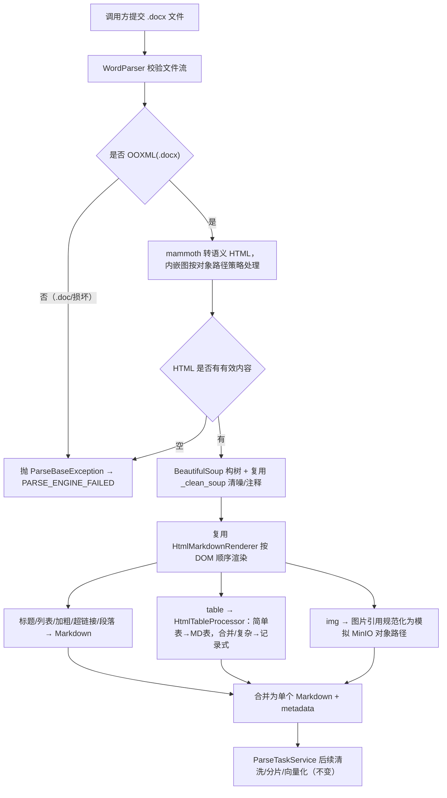

# Word解析优化 Brief

> 姊妹模块：`docs/HTML解析混合优化/`（commit `b4d2b76` 已交付，`src/core/parser/html/` 提供渲染器/表格/图片引擎）。本模块复用该引擎，方向经真实 docx 实测锁定。

## 1. 需求摘要

- **做什么**：重建 Word（.docx）解析能力，把当前原始的 python-docx 手撸解析换成「mammoth 转语义 HTML + 复用已交付的 HTML 渲染引擎」混合方案，产出与 HTML 一致的、结构保真的 RAG 友好 Markdown：标题、嵌套列表、加粗、超链接、按原文顺序、简单表格→标准 Markdown 表格、合并/复杂单元格→记录式兜底、内嵌图片→模拟 MinIO 对象路径。
- **为什么做**：现状 `WordParser` 把所有表格抽到文末 `### 文档表格数据`（非合法 Markdown 表格、丢原文顺序、合并单元格文本错乱）、内嵌图片完全丢弃、无超链接与嵌套列表保真，是 HTML 重构前的同类问题甚至更差，直接拉低 Word 文档的 chunk 与召回质量。真实 docx 实测：mammoth 能把 docx 转成正确带 `rowspan/colspan`、按原文顺序、内嵌图转 data:base64 的干净语义 HTML，再走我们刚交付并验证过的 HTML 引擎即得到结构保真 Markdown，复用度高、双格式输出一致。
- **本次不做**：不处理 legacy `.doc`（旧 OLE 二进制，非 OOXML，mammoth 与 python-docx 均不支持）——明确快速失败，不在本轮支持；不做真实图片下载/上传 MinIO（与 HTML 一轮一致，只生成模拟对象路径）；不改 HTML 模块已冻结的表格/图片算法本身与其 28 个验收场景的既有行为；不改 API/MQ/数据库/对象存储公共契约、不改 pipeline、分片、向量化、ES、Qdrant；不引入 Pandoc（实测对 RAG 复杂表格反而更差、依赖更重，已否）；不引入 LLM。

## 2. 业务流程

### 2.1 主流程图

### 2.2 流程详解

调用入口与现状一致：`ParserFactory` 按 `docx`/`doc` 分发到 `WordParser`，`WordParser.parse(file_stream: bytes) -> str` 返回 Markdown，metadata 经 `extract_metadata()` 暴露，`ParseTaskService` 调用方式不变。

`WordParser` 先做字节流校验。随后判定是否为 OOXML（.docx 为 zip 容器）：legacy `.doc`（OLE 二进制）或损坏文件无法被 mammoth 解析，直接抛解析异常，经现有 `pipeline.py` 映射 `PARSE_ENGINE_FAILED`，不静默产出空结果、不新增错误码。

合法 .docx 交 mammoth 转语义 HTML：mammoth 按 Word 样式映射输出 `<h1..h6>`、`<ul>/<ol>`（含嵌套）、`<strong>`、`<a>`、`<table>`（合并单元格输出 `rowspan/colspan`，垂直合并产出多 `
` 单元格）。**内嵌图片在此步由 mammoth 的 `convert_image` 钩子处理**：逐张取图片字节 → 计算模拟 MinIO 对象路径 → 作为 `` 直接写入 HTML（不输出 data:base64）。docx 是纯内容、无站点样板，**跳过 trafilatura 正文定位**（这是与 HTML 模块的关键差异：HTML 要从网页里定位正文，Word 整篇即正文）。

mammoth 的 HTML 经 BeautifulSoup 构树并复用 HTML 模块的 `_clean_soup`（清噪声标签/隐藏节点/注释），再交 `HtmlMarkdownRenderer` 按 DOM 顺序渲染：标题→ATX、嵌套列表→Markdown 列表、加粗/超链接→Markdown、段落→正文；`table` 交 `HtmlTableProcessor`——普通二维表输出标准 Markdown 表格，合并单元格/多段长文本单元格走记录式 Markdown 兜底（实测 mammoth 的 vMerge 产出多 `
` 单元格已天然触发该分支）；`img` 此时 `src` 已是模拟对象路径，按现有图片引用规则原样渲染。

内嵌图片处理是本模块唯一新增能力，且**完全落在 Word 适配层（mammoth `convert_image` 钩子）**：HTML 场景里 data: 是噪声（HTML 模块原行为：保留原样 + warning，不生成对象路径）；Word 场景内嵌图是真内容，钩子逐张取图片字节 → 计算**模拟 MinIO 对象路径**（与 HTML 的 URL 图片→`mock-minio://...` 同形态，来源是图片字节而非 URL）→ 直接作为 ``。本轮只生成模拟对象路径，不真实上传。**`HtmlImageRewriter` 及整个 HTML 模块零改动**，渲染器看到的是已规范化的 src，HTML 28 个验收场景行为天然零变化（不依赖开关隔离）。

异常分支：① 字节流为空 → 抛解析异常；② 非 OOXML/.doc/损坏 mammoth 无法解析 → 抛 `ParseBaseException` 走 `PARSE_ENGINE_FAILED`；③ mammoth 转换后 HTML 无有效内容 → 抛解析异常；④ 单个表格渲染异常 → 复用 `HtmlTableProcessor` 原位失败记录 + warning，不阻断整篇；⑤ 单张图片无法生成对象路径 → 保留可读占位 + warning，不阻断整篇。

## 3. 核心模块与实现思路

### Word 解析入口

- **位置**：`src/core/parser/providers/word_parser.py`（重写）。
- **职责**：`BaseParser` 契约入口，校验、OOXML 判定、编排 mammoth + HTML 引擎、metadata 暴露。
- **实现思路**：删除现状 python-docx 手撸逻辑；委托 mammoth 得到 HTML，再走 HTML 引擎产出 Markdown。入口保持薄层，`parse(file_stream: bytes) -> str` 签名与 `ParseTaskService` 调用方式不变。`ParserFactory` 当前对 `docx`/`doc` 调 `WordParser()` 不传 kwargs，故 `WordParser` 自包含构造解析选项（Word 无相对 URL，无需来源 URL 上下文）。
- **关键决策**：复用 HTML 引擎而非自撸或引 Pandoc——一套引擎管两格式、输出一致、复用已验证的复杂表格记录式与图片对象路径能力；Pandoc 实测对 RAG 复杂表格更差且依赖重，已否。

### docx → 语义 HTML（mammoth）

- **位置**：`src/core/parser/providers/word_parser.py` 内（或同包内部小模块）。
- **职责**：把 .docx 转成结构完好的语义 HTML；内嵌图由 `convert_image` 钩子转模拟 MinIO 对象路径。
- **实现思路**：新增轻量依赖 mammoth（已 pip 安装、实测无警告）。利用 mammoth 样式映射保真标题/列表/加粗/超链接/表格；**`convert_image` 钩子逐张取图片字节 → 计算模拟 MinIO 对象路径 → 作为 `` 直接输出**（不产 data:base64，故不触碰 HTML 图片逻辑）。非 .docx 触发异常。
- **关键决策**：只取 mammoth 的语义 HTML 作为「结构来源」，最终 Markdown 仍由本项目 HTML 渲染器产出——与 HTML 模块「外部库只做结构、渲染归本模块」的一致原则；docx 无样板，不接 trafilatura；对象路径生成隔离在 Word 适配层，HTML 模块零改动。

### HTML 渲染引擎（复用，不改算法）

- **位置**：`src/core/parser/html/{renderer.py, table_processor.py, image_rewriter.py, service.py, models.py}`（commit `b4d2b76`）。
- **职责**：把 mammoth HTML 渲染为结构保真 Markdown：标题/列表/加粗/超链接/段落、简单表→MD 表、合并/复杂表→记录式、图片引用按现有规则渲染。
- **实现思路**：复用 `_clean_soup`、`HtmlMarkdownRenderer`、`HtmlTableProcessor`、`HtmlImageRewriter` **全部原样、零改动**。图片 `src` 进入渲染器前已是模拟对象路径（Word 适配层钩子生成），渲染器无需感知来源差异。
- **关键决策**：HTML 模块整体不改动（含 image_rewriter），HTML 28 场景行为天然零变化、无需开关隔离；对象路径生成职责归 Word 适配层，边界清晰、回归面最小。

### 解析质量测试与评测

- **位置**：`tests/unit/core/parser/`，必要时新增 Word 专项测试与生成式 docx fixture。
- **职责**：用代表性 docx 守住标题/嵌套列表/超链接/普通表/合并单元格表/内嵌图的输出形态，并回归 HTML 28 场景不受影响。
- **实现思路**：用 python-docx 生成确定性 docx fixture（覆盖上述结构），断言 Markdown 标题/列表/标准表/记录式表/模拟 MinIO 图片引用；同时跑 HTML 既有单测/集成确认零回归。
- **关键决策**：确定性 fixture + 断言，不引 LLM 评测；HTML 回归作为「不破坏姊妹模块」的硬门禁。

### Markdown 后续链路（不动）

- **位置**：`src/services/parse_task_service.py`、`src/core/markdown_parser/`、`src/core/splitter/`。
- **职责/实现**：消费 Word 输出的 Markdown，后续清洗/分片/向量化不变。
- **关键决策**：不改公共契约与 pipeline，仅提升 docx→Markdown 内部质量。

## 4. 风险与不确定性

| 风险 / 问题 | 触发条件 | 影响 | 当前判断 / 应对方向 |
| :--- | :--- | :--- | :--- |
| Word 引入影响 HTML 既有行为 | 复用 HTML 引擎渲染 mammoth HTML | HTML 28 场景回归 | image_rewriter/HTML 模块零改动（对象路径在 Word 适配层钩子生成），无共享逻辑被改；HTML 全量单测/集成仍作硬门禁兜底 |
| mammoth 垂直合并单元格文本重复 | docx vMerge 单元格 | 记录式输出出现「用户 用户」重复文本 | 语义不损、RAG 可读，本轮接受；必要时加一步去重（留 TD 评估） |
| 复杂 Word 样式映射不全 | 自定义样式名、非标准列表/标题样式 | 个别标题/列表降级为普通段落 | mammoth 默认样式映射覆盖主流场景；确定性 fixture 固定主流结构，异常样式记 warning 不阻断 |
| legacy .doc 进入解析 | 调用方上传 .doc | mammoth 无法解析 | 已定：`WordParser` 内检测非 OOXML 即抛 `ParseBaseException` → `PARSE_ENGINE_FAILED`，不改 factory/错误码/对外契约 |
| 新增 mammoth 依赖部署未同步 | pyproject 变更后 CI/镜像未装 | Word 解析导入期失败 | pyproject 登记 mammoth，同步 deployment.md；纯 Python 轻依赖 |
| 内嵌图大文件/异常编码 | docx 含大图或损坏图 | 模拟路径生成异常 | 单图失败不阻断整篇，保留占位 + warning（复用 HTML 图片失败兜底策略） |

