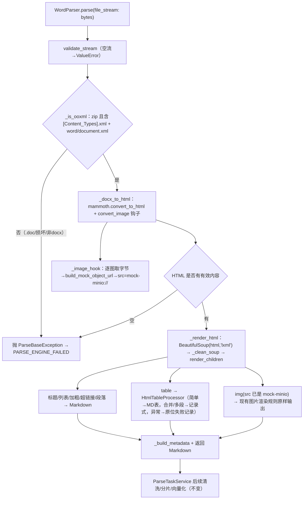

# Word解析优化 技术设计

- **文档状态：** 技术方案待审核
- **项目名称：** toLink-Rag
- **业务域：** 文档解析 / Word 解析
- **需求名称：** Word解析优化
- **业务输入：** `docs/Word解析优化/brief.md`
- **验收输入：** `docs/Word解析优化/acceptance.feature`（16 Scenario）
- **输出文件：** `docs/Word解析优化/technical_design.md`
- **最后更新时间：** 2026-05-19

> 姊妹模块 `docs/HTML解析混合优化/`（commit `b4d2b76` 已交付）提供 HTML 渲染引擎。本 TD 基于真实代码做增量设计：Word 适配层新增，HTML 引擎原样复用、零改动。

---

## 1. 文档修订记录

| 版本号 | 修改日期 | 修改内容简述 | 来源/提出人 | 审核状态 |
| :--- | :--- | :--- | :--- | :--- |
| v1.0 | 2026-05-19 | 初始技术设计：docx→mammoth→复用 HTML 引擎，内嵌图钩子转模拟 MinIO | brief.md + acceptance.feature | 待审核 |

---

## 2. 输入依据与设计目标

### 2.1 输入依据映射

| 输入来源 | 关键结论 | 技术设计承接方式 |
| :--- | :--- | :--- |
| `brief.md` | docx→mammoth 语义 HTML→复用 HTML 引擎；跳过 trafilatura；内嵌图经 mammoth 钩子转模拟对象路径；.doc 快速失败；HTML 模块零改动 | `WordParser` 重写为适配层；复用 `HtmlMarkdownRenderer/HtmlTableProcessor/HtmlImageRewriter/_clean_soup`，不经 `_locate_main_content` |
| `acceptance.feature` | 16 Scenario：标题/列表/加粗超链接/顺序、普通表→MD 表、合并表→记录式、内嵌图→mock-minio、非 OOXML/空流失败、不改链路/契约、HTML 零回归 | 方法级逐条映射 + `test_word_parser.py` + HTML 既有 81 测试作零回归门禁 |

### 2.2 技术目标

- docx → mammoth 语义 HTML → 复用 HTML 引擎产出与 HTML 一致的结构保真 Markdown。
- 内嵌图片在 mammoth `convert_image` 钩子内转模拟 MinIO 对象路径（复用 `HtmlImageRewriter.build_mock_object_url` 同款规则），不产 data:base64。
- 跳过 trafilatura（docx 无站点样板）。
- 非 OOXML/legacy .doc/损坏/空流 → `ParseBaseException`，经 `pipeline.py:160-169` 映射 `PARSE_ENGINE_FAILED`，不新增错误码。
- `src/core/parser/html/*` 零改动，HTML 28 场景 + 81 测试零回归。

---

## 3. 改动范围

### 3.1 改动文件目录树

```text
toLink-Rag/
├── pyproject.toml                              # [修改] 主依赖新增 mammoth>=1.6.0
├── src/core/parser/providers/word_parser.py    # [修改] 重写：mammoth + 复用 HTML 引擎适配层
├── src/core/parser/factory.py                  # [不改] docx/doc 仍→WordParser()，.doc 在 WordParser 内判失败
├── src/core/parser/base.py                     # [不改] 复用 validate_stream / metadata
├── src/core/parser/html/service.py             # [不改] 复用 _clean_soup（不经 parse/_locate_main_content）
├── src/core/parser/html/renderer.py            # [不改] 复用 HtmlMarkdownRenderer
├── src/core/parser/html/table_processor.py     # [不改] 复用（记录式兜底）
├── src/core/parser/html/image_rewriter.py      # [不改] 复用 build_mock_object_url 公开方法
├── src/core/parser/html/models.py              # [不改] 复用 HtmlParseOptions
├── src/core/pipeline/parse_task/pipeline.py    # [不改] 已有 ParseBaseException→PARSE_ENGINE_FAILED
├── src/core/pipeline/parse_task/error_codes.py # [不改] 不新增错误码
├── tests/unit/core/parser/test_word_parser.py  # [测试新增] python-docx 生成 fixture 覆盖 16 Scenario
├── docs/architecture/file_parser_module.md     # [修改] 同步 Word 链路
└── docs/guides/deployment.md                   # [修改] 同步 mammoth 依赖
```

### 3.2 文件级改动说明

| 文件 | 动作 | 改动目的 | 是否必须 |
| :--- | :--- | :--- | :--- |
| `pyproject.toml` | 修改 | 登记 `mammoth>=1.6.0`（纯 Python 轻依赖） | 是 |
| `word_parser.py` | 修改 | 删 python-docx 手撸逻辑，重写为 mammoth + 复用 HTML 引擎适配层 | 是 |
| `html/*` | 不改 | 原样复用，HTML 零回归（含 image_rewriter，仅调用其公开方法） | - |
| `factory.py` / `pipeline.py` / `error_codes.py` | 不改 | 分发/异常映射/错误码均复用 | - |
| `file_parser_module.md` / `deployment.md` | 修改 | doc-sync warning 级同步 | 是 |

---

## 4. 当前系统分析

| 类型 | 文件/类/方法 | 当前行为 | 问题或复用点 |
| :--- | :--- | :--- | :--- |
| 入口 | `word_parser.py::WordParser.parse` | python-docx 遍历 paragraphs/tables，表格抽到文末 `### 文档表格数据`，无分隔行，合并单元格文本错乱，图片丢弃 | 整体重写 |
| 工厂 | `factory.py::ParserFactory.get_parser` | `docx`/`doc` → `WordParser()`（不传 kwargs） | 不改；`WordParser` 自包含构造选项；.doc 在内部判失败 |
| 基类 | `base.py::BaseParser.validate_stream` | 空流抛 `ValueError("文件流不可为空")` | 复用（空流场景） |
| 渲染 | `html/renderer.py::HtmlMarkdownRenderer.render_children` | 按 DOM 顺序渲染标题/列表/加粗/链接/段落/表格/图片 | 直接复用，喂 mammoth HTML 根节点 |
| 服务 | `html/service.py::HtmlParseService._clean_soup` | 删噪声标签/隐藏/注释，返回注释数 | 复用（实例方法，构造 `HtmlParseService()` 后调用）；**不调用 `parse`/`_locate_main_content`**（那会跑 trafilatura） |
| 表格 | `html/table_processor.py::HtmlTableProcessor` | 普通表→MD 表，合并/多段单元格→记录式，异常→原位失败记录 | 复用；mammoth vMerge 产多 `<p>` 单元格天然触发记录式 |
| 图片 | `html/image_rewriter.py::HtmlImageRewriter.build_mock_object_url` | 入参 URL，输出 `{base}/{prefix}/{sha1[:12]}/{filename}`；`data:` scheme 返回 None | 复用公开方法：Word 钩子传「按图片字节 sha1 合成的伪 URI」即得一致 mock-minio 路径，HTML 模块零改动 |
| 管道 | `pipeline.py:160-169` | `_parse_file` 抛任意异常 → `PARSE_ENGINE_FAILED` | 失败抛 `ParseBaseException` 即自动复用 |
| 实测 | mammoth 1.x | docx→语义 HTML，输出 `<h1..6>/<ul>/<ol>/<strong>/<a>/<table rowspan|colspan>`，按原文顺序，无警告 | 作结构来源；`convert_image` 钩子定制图片 src |

---

## 5. 总体方案设计

### 5.1 总体流程



### 5.2 模块边界

| 模块 | 职责 | 本次是否改动 |
| :--- | :--- | :--- |
| `WordParser`（适配层） | 校验/OOXML 判定/mammoth 转换/图片钩子/复用渲染编排/metadata | 重写 |
| mammoth | docx→语义 HTML + 图片钩子回调 | 新增依赖 |
| `HtmlMarkdownRenderer`/`HtmlTableProcessor`/`HtmlImageRewriter`/`_clean_soup`/`HtmlParseOptions` | HTML→Markdown 渲染、表格、对象路径规则 | 不改（仅调用） |
| ParseTaskPipeline / factory / error_codes | 分发与异常映射 | 不改 |

---

## 6. API、消息与数据设计

### 6.1 API 设计

- 无 API 变更。`WordParser.parse(file_stream: bytes) -> str` 签名与返回不变。

### 6.2 MQ 消息设计

- 无 MQ 变更。失败走现有 `PARSE_ENGINE_FAILED` 通知链路。

### 6.3 数据与存储设计

- 无 DB/OSS 结构变更。`WordParser.metadata`（`BaseParser.metadata` dict）暴露：
  `table_count`、`record_table_count`、`table_failure_count`、`image_count`、
  `image_warning_count`（由渲染器统计与图片钩子告警计数汇总），与 HTML 模块语义一致。
- 内嵌图只生成模拟对象路径 `mock-minio://...`，本轮不真实上传。

---

## 7. 方法级实现方案

### 7.1 方法级变更总表

| 文件 | 类 | 方法 | 动作 | 入参 | 输出 | 改动目的 | 对应 Scenario |
| :--- | :--- | :--- | :--- | :--- | :--- | :--- | :--- |
| word_parser.py | WordParser | `parse` | 重写 | `file_stream: bytes` | `str`(Markdown) | 编排校验/判定/转换/渲染/metadata | 全部 16 |
| word_parser.py | WordParser | `_is_ooxml` | 新增 | `bytes` | `bool` | 判 zip 且含 OOXML 标志，拦 .doc/损坏 | 非 OOXML 输入快速失败 |
| word_parser.py | WordParser | `_docx_to_html` | 新增 | `bytes` | `str`(HTML) | mammoth 转换 + 注入图片钩子 | 标题/列表/加粗超链接/表格/顺序 |
| word_parser.py | WordParser | `_image_hook` | 新增 | mammoth image | `dict`(src 属性) | 取图字节→mock-minio 路径 | 内嵌图片转模拟 MinIO；单图失败占位 |
| word_parser.py | WordParser | `_render_html` | 新增 | `str`(HTML) | `str`(Markdown) | bs4→`_clean_soup`→`render_children`，跳过 trafilatura，空则抛异常 | 表格/记录式/顺序/mammoth 空内容失败 |
| word_parser.py | WordParser | `_build_metadata` | 新增 | renderer + 钩子告警 | `None`(写 self.metadata) | 汇总计数 | 普通表/记录式/单表失败/图片计数 |
| pyproject.toml | - | 主依赖 | 修改 | - | - | 登记 mammoth>=1.6.0 | 全部（依赖支撑） |

### 7.2 逐方法实现设计

#### 7.2.1 `WordParser.parse`（重写）

- 当前行为：python-docx 手撸，表格抽文末、图丢弃。
- 修改后职责：`validate_stream(file_stream)`（空流→`ValueError("文件流不可为空")`）→ `if not self._is_ooxml(file_stream): raise ParseBaseException("Word 解析失败：非 .docx（OOXML）文件或文件损坏")` → `html = self._docx_to_html(file_stream)` → `markdown = self._render_html(html)` → `self._build_metadata(...)` → `return markdown`。
- 入参/返回：不变（`bytes` → `str`）。
- 异常边界：所有失败 `ParseBaseException`（空流为 `ValueError`，沿用 BaseParser 既有契约与 acceptance「文件流不可为空」），经 pipeline 映射 `PARSE_ENGINE_FAILED`，不新增错误码。
- 调用关系：入口经 `ParserFactory`；`ParseTaskService` 调用方式不变。
- 对应测试：全部 16 Scenario 编排。

#### 7.2.2 `WordParser._is_ooxml`（新增）

- 职责：判定字节流是合法 OOXML .docx。
- 步骤：`zipfile.is_zipfile(BytesIO(bytes))` 为否 → False（legacy .doc OLE、损坏非 zip、任意二进制）；为是则打开 zip，`namelist()` 同时含 `[Content_Types].xml` 与 `word/document.xml` → True，否则 False。
- 异常边界：`zipfile.BadZipFile`/异常 → 返回 False（由 `parse` 抛 `ParseBaseException`）。
- 对应测试：`非 OOXML 输入快速失败`（Outline：legacy .doc / 损坏非 zip / 任意二进制）。

#### 7.2.3 `WordParser._docx_to_html`（新增）

- 职责：mammoth 把 .docx 转语义 HTML，内嵌图经钩子转对象路径。
- 步骤：`mammoth.convert_to_html(BytesIO(bytes), convert_image=mammoth.images.img_element(self._image_hook))`；取 `result.value` 为 HTML。`result.messages` 中的告警计入 metadata 备查（不阻断）。
- 关键决策：仅取 mammoth 语义 HTML 作结构来源，渲染归本项目 HTML 引擎（与 HTML 模块「外部库只做结构」一致）。
- 对应测试：标题层级/顺序、加粗超链接、嵌套列表、表格图片段落 DOM 顺序、普通表、合并表。

#### 7.2.4 `WordParser._image_hook`（新增）

- 职责：mammoth 每张内嵌图回调，生成模拟 MinIO 对象路径作 ``。
- 步骤：`with image.open() as f: data = f.read()`；`ext` 由 `image.content_type` 推断（如 `image/png`→`png`，未知→`bin`）；`digest = sha1(data).hexdigest()`；构造伪 URI `f"docx-embedded://{digest}.{ext}"`；调用复用的 `HtmlImageRewriter(HtmlParseOptions()).build_mock_object_url(伪URI)` 得 `mock-minio://...` 路径；返回 `{"src": object_url}`（mammoth 据此输出 ``，不产 data:base64）。失败（读图异常/路径生成 None）→ 记 `image_warning` 计数，返回 `{"src": f"mock-minio://unresolved/{digest}"}` 或可读占位，不抛异常（单图失败不阻断）。
- 关键决策：复用 `HtmlImageRewriter.build_mock_object_url` 公开方法（伪 URI scheme≠`data:` → 正常返回路径），路径格式与 HTML 完全一致，且 image_rewriter 零改动（仅调用，不修改）。
- 对应测试：`内嵌图片转为模拟 MinIO 对象路径`、`单张图片对象路径生成失败时保留可读占位`。

#### 7.2.5 `WordParser._render_html`（新增）

- 职责：把 mammoth HTML 用 HTML 引擎渲染为 Markdown，跳过 trafilatura。
- 步骤：`soup = BeautifulSoup(html, "lxml")`；`HtmlParseService()._clean_soup(soup)`；`root = soup.body or soup`；`renderer = HtmlMarkdownRenderer(HtmlParseOptions())`；`md = renderer.render_children(root)`；`if not md.strip(): raise ParseBaseException("Word 解析失败：文档无有效内容")`；保存 `renderer` 供 `_build_metadata`。
- 关键决策：复用与 `HtmlParseService.parse` **相同的清理+渲染组件**，仅省略 `_locate_main_content`（docx 无样板）；不调用 `HtmlParseService.parse`（其内置 trafilatura 定位不适用 Word）。不修改 html 模块。
- 异常边界：渲染空 → `ParseBaseException` → `PARSE_ENGINE_FAILED`。
- 对应测试：普通表→MD 表、合并表→记录式、单表失败原位记录、DOM 顺序、`mammoth 转换后无有效内容时失败`。

#### 7.2.6 `WordParser._build_metadata`（新增）

- 职责：把 `renderer` 计数与图片钩子告警写入 `self.metadata`。
- 步骤：`self.metadata.update({table_count, record_table_count, table_failure_count, image_count, image_warning_count})`，取值来源 `renderer.table_count/record_table_count/table_failure_count/image_count` 与钩子累计的图片告警数。
- 对应测试：`普通二维表格...metadata.table_count==1`、`合并单元格...record_table_count>=1`、`单个表格处理失败...table_failure_count==1`、`内嵌图片...image_count==1`、`单张图片失败...image_warning_count==1`。

---

## 8. 组件与集成设计

- **mammoth（新增依赖，pyproject `mammoth>=1.6.0`）**：纯 Python，docx→语义 HTML；`mammoth.images.img_element` 注入 `convert_image` 钩子定制 ``。
- **HTML 引擎（现有，不改）**：`HtmlParseService._clean_soup`、`HtmlMarkdownRenderer`、`HtmlTableProcessor`、`HtmlImageRewriter.build_mock_object_url`、`HtmlParseOptions` 均通过实例化/调用复用，源文件零改动。
- **BeautifulSoup + lxml（现有）**：复用 `lxml` 解析 mammoth HTML（与 HTML 模块一致）。
- **ParseTaskPipeline（现有，不改）**：`ParseBaseException` → `PARSE_ENGINE_FAILED`。
- 不接入 Redis/MQ/OSS/Qdrant 新契约；不真实上传图片。

---

## 9. 异常处理与降级策略

| 异常场景 | 处理方式 | 是否抛出 | 是否影响消息确认 |
| :--- | :--- | :--- | :--- |
| 空文件流 | `validate_stream` 抛 `ValueError("文件流不可为空")` | 是 | 走解析失败链路 |
| 非 OOXML/.doc/损坏 | `_is_ooxml` 为否 → `parse` 抛 `ParseBaseException` | 是 | `PARSE_ENGINE_FAILED` |
| mammoth 转换异常 | 异常上抛为 `ParseBaseException`（parse 捕获 mammoth 异常并转换） | 是 | `PARSE_ENGINE_FAILED` |
| mammoth HTML 空/渲染空 | `_render_html` 抛 `ParseBaseException` | 是 | `PARSE_ENGINE_FAILED` |
| 单张图片读/路径失败 | `_image_hook` 记 warning + 占位 src，不抛 | 否 | 不阻断整篇 |
| 单个表格渲染异常 | 复用 `HtmlTableProcessor` 原位失败记录 + warning | 否 | 不阻断整篇 |

---

## 10. 测试方案

### 10.1 方法级测试映射

| 被测方法 | 测试文件 | 对应 Scenario | 断言要点 |
| :--- | :--- | :--- | :--- |
| `parse`/`_docx_to_html`/`_render_html` | test_word_parser.py | 标题层级与原文顺序 | `# / ## / ###` 与出现顺序 |
| 同上 | test_word_parser.py | 段落/加粗/超链接 | `**粗体**`、`[文本](url)` |
| 同上 | test_word_parser.py | 嵌套列表 | `- ` / `1. ` 与子项缩进 |
| 同上 | test_word_parser.py | 表格图片段落 DOM 顺序 | index 先后断言 |
| `_render_html`+table_processor | test_word_parser.py | 普通表→MD 表在原位 | 含 `\| --- \|`、不含 `### 文档表格数据`、`table_count==1` |
| 同上 | test_word_parser.py | 合并单元格→记录式 | `[HTML表格开始：`、`记录 1：`、不含 `<table`、`record_table_count>=1` |
| 同上 | test_word_parser.py | 单表失败原位记录 | 失败记录位置 + `table_failure_count==1` + 不抛整篇 |
| `_image_hook` | test_word_parser.py | 内嵌图→mock-minio | 含 `![](mock-minio://`、不含 `data:image`、`image_count==1` |
| `_image_hook` | test_word_parser.py | 单图失败占位 | 占位引用 + `image_warning_count==1` + 不抛整篇 |
| `_is_ooxml`/`parse` | test_word_parser.py | 非 OOXML Outline（.doc/损坏/二进制） | 抛 `ParseBaseException`，不产空 Markdown |
| `parse` | test_word_parser.py | 空文件流 | 抛异常，原因含「文件流不可为空」 |
| `_render_html` | test_word_parser.py | mammoth 空内容 | 抛 `ParseBaseException` |
| factory | test_parser_factory.py（既有） | 不改非 Word 链路 | pdf→PdfParser、html→HtmlParser |
| `parse` 输出形态 | test_word_parser.py | 不改 pipeline 契约 | 返回 str，metadata 字段齐全 |
| —（门禁） | 既有 HTML 单测/集成 | 复用 HTML 引擎不改其行为 | `git diff` 无 `src/core/parser/html` 改动；HTML 81 测试全过 |

### 10.2 Scenario 覆盖自检

16 条逐条均有承接方法 + test_word_parser.py 用例；「HTML 零回归」由「不改 html 模块 + 跑 HTML 既有 81 测试」承接。无未承接 Scenario。

### 10.3 回归命令

```bash
.venv/bin/python -m pytest tests/unit/core/parser/test_word_parser.py -q
.venv/bin/python -m pytest tests/unit/core/parser tests/integration/core/parser -q   # HTML 零回归门禁
git diff --stat -- src/core/parser/html                                              # 应为空
.venv/bin/python scripts/check_docs_sync.py --staged
```

---

## 11. 发布与回滚

- 发布：`pip install -e ".[dev]"` 安装 `mammoth`；无 DB 迁移、无配置/契约变更。
- 回滚：改动集中在 `word_parser.py` + `pyproject.toml`，`git revert` 本模块实现 commit 即回到原 WordParser；HTML 模块未动，不受影响。

---

## 12. 风险与待确认问题

| 风险/问题 | 影响 | 建议处理 |
| :--- | :--- | :--- |
| mammoth vMerge 单元格文本重复 | 记录式出现「用户 用户」 | 语义不损、RAG 可读，本轮接受；fixture 固定该形态 |
| 复用 HtmlImageRewriter 伪 URI 规则 | 路径与 HTML 不一致风险 | 用 `build_mock_object_url` 同一公开方法、伪 URI scheme≠data:，路径格式天然一致；单测断言 `mock-minio://` 前缀 |
| 复杂 Word 自定义样式映射不全 | 个别标题/列表降级为段落 | mammoth 默认样式映射覆盖主流；fixture 用标准 Heading/List 样式；异常样式记 warning 不阻断 |
| 新增 mammoth 依赖未同步部署 | Word 解析导入期失败 | pyproject 登记 + deployment.md 同步；纯 Python 轻依赖 |
| 复用 `_clean_soup` 私有方法 | 形式上调用 service 实例方法 | 仅调用不修改，属复用；如担忧可在实现期评估是否值得在 service 暴露薄包装（不在本轮强制） |

无阻塞性待确认问题（brief Q1/Q2 已冻结）。

---

## 13. 实施顺序

1. `pyproject.toml` 登记 `mammoth>=1.6.0`，安装验证 import。
2. 重写 `word_parser.py`：`_is_ooxml` → `_image_hook` → `_docx_to_html` → `_render_html` → `_build_metadata` → `parse` 串接。
3. 新增 `test_word_parser.py`（python-docx 生成 fixture 覆盖 16 Scenario）。
4. 跑 10.3 全部命令；确认 `git diff src/core/parser/html` 为空、HTML 81 测试全过。
5. 同步 `file_parser_module.md`、`deployment.md`；跑 `check_docs_sync.py`。

---

## 14. 人工审核清单

- [ ] 改动文件目录树已确认
- [ ] 方法级变更总表已确认（16 Scenario 全覆盖）
- [ ] mammoth 图片钩子 + 复用 build_mock_object_url 路径一致性已确认
- [ ] 跳过 trafilatura 的复用渲染路径已确认
- [ ] HTML 模块零改动 / 零回归门禁已确认
- [ ] 不触碰 error_codes/pipeline/factory/公共契约已确认
