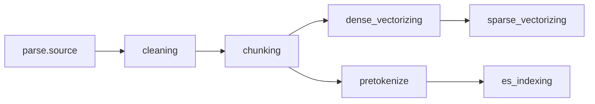

# Workflow Engine

`src/core/workflow/` 是一个轻量流程编排内核。它只理解节点声明的产物依赖，不理解业务对象；业务侧通过节点实现、初始产物和 `WorkflowStore` 选择是否持久化运行态。

## 边界

- 节点通过 `requires` 和 `provides` 声明输入、输出产物。
- 产物 key 是不透明字符串；命名规范由调用方维护。
- `output_ref` 是不透明引用，用于后续 `restore()`；框架只持久化和回传，不解析内容。
- `InMemoryWorkflowStore` 用于单进程内核验证；`MySQLWorkflowStore` 将运行态写入 `workflow_run` / `workflow_node_run`，用于跨进程恢复验证。
- 现网 `ParseTaskPipeline` / `StagePipeline` 不由该模块接管；`src/core/pipeline/parse_task/workflow_demo/` 只提供并行 demo DAG。

## 核心对象

| 对象 | 职责 |
| --- | --- |
| `WorkflowNode` | 节点抽象，声明 `key` / `requires` / `provides` / `allow_failure`，实现 `run()` 和按需实现 `restore()` |
| `WorkflowDefinition` | 加载节点集合，做启动期校验，并从产物依赖推导 DAG |
| `WorkflowContext` | 单轮 run 内的产物容器 |
| `WorkflowEngine` | 调度执行、并发限流、完成事件串行推进、续跑恢复和终态收敛 |
| `WorkflowStore` | run 与 node run 状态读写抽象 |
| `InMemoryWorkflowStore` | 一期内存实现 |
| `MySQLWorkflowStore` | MySQL 持久化实现，写入 `workflow_run` / `workflow_node_run` |

## 加载期校验

`WorkflowDefinition.from_nodes()` 会在创建定义时完成校验，失败抛 `WorkflowValidationError(code, detail)`，不会创建 run，也不会执行节点。

| 错误码 | 含义 |
| --- | --- |
| `CYCLE` | 产物依赖推导出的节点图存在环 |
| `DUPLICATE_PRODUCER` | 同一产物被多个节点 `provides` |
| `DANGLING_REQUIRES` | `requires` 的产物既无节点提供，也不是外部初始产物 |
| `ALLOW_FAILURE_PROVIDES_REQUIRED` | `allow_failure=true` 节点提供了被其他节点依赖的产物 |

## 运行语义

调用方通过 `WorkflowEngine.run(definition, store=..., initial_products=...)` 启动一轮 run。入口产物，例如解析链路中的源文件坐标，应同时在定义的 `initial_products` 中声明，并在运行时通过 `initial_products` 注入具体值。

引擎按以下规则调度：

- 节点处于 `PENDING`，且所有 `requires` 产物都已存在于 `WorkflowContext` 时才会就绪。
- 同一轮最多同时运行 `WORKFLOW_MAX_CONCURRENCY` 个节点；调用 `run(..., max_concurrency=n)` 可覆盖默认值。
- 节点执行可并发，但完成事件由引擎串行处理，避免下游重复调度。
- 必需节点失败后，不再调度新的节点；已经运行中的节点会自然结束。
- `allow_failure` 节点失败会记录 `FAILED` 和 `tolerated=true`，不影响整体成功判定。

## 续跑语义

续跑通过 `previous_run_id` 指向上一轮 run。引擎会新建一轮 run，上一轮只读不改。

- 上一轮 `SUCCESS` 的节点，本轮标记为 `SKIPPED`。
- 若这些成功节点的产物仍被本轮待执行节点依赖，引擎调用对应节点的 `restore(ctx, output_ref)` 恢复产物。
- 若产物本轮无人消费，只跳过，不调用 `restore()`。
- `restore()` 失败时，本轮整体 `FAILED`，`failure_phase=RESTORE`。

## 节点实现约定

节点的 `run()` 应把下游需要的产物写入 `WorkflowContext`，并返回可用于恢复的 `output_ref`。节点的外部副作用需要保持幂等，因为失败续跑会重新执行上一轮失败或未执行的节点。

## Parse Task Demo DAG

`src/core/pipeline/parse_task/workflow_demo/` 提供解析任务的 demo DAG 定义，入口为 `build_parse_task_demo_workflow()`。调用方需显式注入 `ParseWorkflowRuntime` 作为 `parse.source` 初始产物。

当前 demo DAG：

说明：`sparse_vectorizing` 依赖 `dense_vectorizing`，因为当前 `StageServices.run_sparse_vectorizing()` 会重新加载 chunk 并过滤 `dense_vector_status == SUCCESS` 的记录；它不是和 dense 完全并行的分支。
