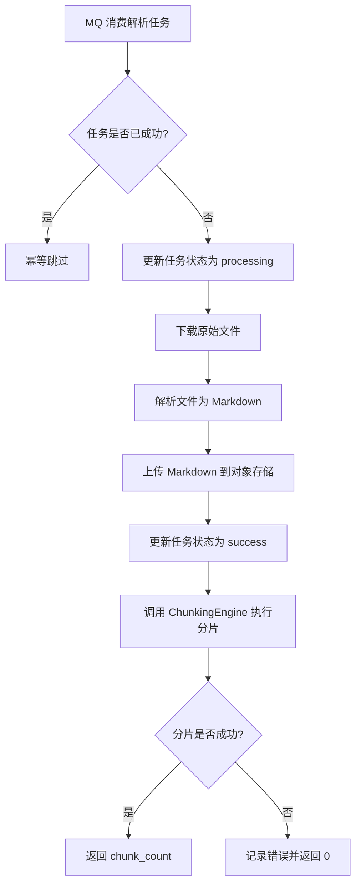

# toLink-Rag 文档分片模块产品需求文档 (PRD)

> **文档状态：** 评审中
> **项目名称：** toLink-Rag
> **模块名称：** 文档分片模块
> **文档定位：** 基于当前代码实现反向整理的模块级 PRD
> **最后更新时间：** 2026-04-26

---

## 1. 文档修订记录

| 版本号 | 修改日期 | 修改内容简述 | 提出人 | 审核人 |
| :--- | :--- | :--- | :--- | :--- |
| v1.0 | 2026-04-26 | 基于当前 `splitter` 代码与测试补齐首版 PRD | 用户 | 待定 |

---

## 2. 背景与目标

### 2.1 需求背景

- 文档解析链路已具备“原始文件解析为 Markdown”能力，分片模块负责把 Markdown 继续拆解为适合检索、向量化和后续索引的 Chunk。
- 当前仓库已经存在三类能力：结构规则分片、结构+语义混合分片、最终向量化管线。
- 但生产主链路当前仅在 `ParseTaskPipeline` 中接入 `ASTAwareChunker` 进行规则分片，语义细分和最终 embedding 仍停留在模块能力与测试验证阶段，尚未进入主执行链路。
- 现阶段需要一份基于真实代码逻辑的 PRD，统一产品边界、输出语义、接入现状和后续演进方向，避免后续把“已实现但未接入”的能力误判为线上能力。

### 2.2 业务目标

- 明确文档分片模块在文档解析链路中的职责边界和业务价值。
- 定义 Chunk 输出应满足的结构完整性、可追溯性和后续检索友好性要求。
- 明确当前一期实际交付能力，以及二期可接入的语义分片与向量化能力。
- 为后续接入向量库、召回链路、分片质量评估提供统一需求基线。

### 2.3 目标用户

| 角色 | 使用方式 | 关注点 |
| :--- | :--- | :--- |
| Python 后端研发 | 维护解析与分片链路 | 分片规则是否稳定、元数据是否完整 |
| 检索/知识库研发 | 消费 Chunk 做索引和召回 | Chunk 边界、上下文保留、来源追踪 |
| 测试与质量人员 | 回归验证分片结果 | 不同 Markdown 元素的切分一致性 |
| 运维/排障人员 | 通过日志和元数据定位问题 | `source_file`、行号、分片数量、失败降级行为 |

### 2.4 范围与分期

**本期已上线/已接入能力：**

- Markdown 解析后基于 AST 结构做规则分片
- 标题层级驱动的正文聚合
- 代码块、公式块、表格、图片等结构化块独立切分
- `source_file`、`heading_trail`、`chunk_index`、`element_types` 等元数据输出
- 分片作为解析成功后的独立步骤执行，分片失败不影响解析主流程成功态

**本期模块内已具备但未接入主流程的能力：**

- 超长正文块的百分位阈值语义切分
- 邻接上下文 overlap 拼接
- 最终 Chunk 批量 embedding、缓存复用与统计记录
- 图片/表格增强描述参与分片内容构造

**本期明确不做：**

- 不在本 PRD 中定义向量库 schema、召回策略、重排策略
- 不把测试中的语义分片能力直接视为生产已接入能力
- 不改造 MQ 消费模型和解析主流程事务语义

---

## 3. 核心业务流程

### 3.1 流程说明

- 分片发生在文档已解析成功、Markdown 已上传之后。
- 当前生产流程通过 `ChunkingEngine(chunker=ASTAwareChunker())` 执行规则分片。
- 当前分片结果只统计数量并打日志，尚未在主流程中持久化到向量库或检索存储。
- 分片失败只影响 `chunk_count`，不回滚解析成功状态。

---

## 4. 全局规则

### 4.1 模块职责规则

- 分片模块只负责把 Markdown 结构化内容切成顺序稳定的 Chunk，不负责原始文档解析。
- 分片模块负责输出可追溯元数据，不负责最终检索召回。
- 生产主链路当前默认使用规则分片；语义分片属于可扩展能力，不得在未接入前对外宣称已上线。

### 4.2 一致性规则

- Chunk 顺序必须与原文顺序一致。
- Chunk 必须保留源文档行号范围，支持排障和回溯。
- `source_file` 存在时必须写入每个 Chunk 的元数据。
- 对于图片、表格、代码块、公式块，必须优先保持结构完整，不允许把单个结构块拆散到多个 Chunk。

### 4.3 失败与降级规则

- 解析主链路成功后，即使分片失败，也不得把任务状态改回失败。
- 若后续接入语义分片且 embedding 失败，需按模块现有设计降级为长度优先切分，而不是直接中断整个分片流程。
- 若没有可切内容，允许输出空 Chunk 列表。

### 4.4 元数据规则

- 规则分片至少输出：`element_types`、`chunk_index`、`heading_trail`
- 统一补充：`source_file`
- 语义分片扩展元数据应包含：`split_strategy`、`semantic_percentile`、`semantic_threshold`
- 邻接上下文扩展元数据应包含：`context_prev_tokens_applied`、`context_next_tokens_applied`、`context_overlap_mode`

---

## 5. 功能需求详述

### 5.1 模块一：规则分片主流程

- **前置条件**：上游已输出 Markdown 文本，且 `ChunkingEngine` 能拿到 `ParseResult`
- **交互说明**：解析后的 Markdown 先进入 `MarkdownParser`，再进入 `ASTAwareChunker`

| 模块/页面 | 功能点 | 优先级 | 需求描述 | 验收标准 |
| :--- | :--- | :--- | :--- | :--- |
| 文档分片 | 结构规则分片 | P0 | 作为检索链路，我希望 Markdown 能按结构边界稳定切分，避免块内容被无规则打散 | 1. 标题层级 `<=3` 时必须触发缓冲区刷新并形成新的上下文路径。2. `front_matter` 与分隔线不进入最终 Chunk。3. 输出 Chunk 顺序与输入元素顺序一致。 |
| 文档分片 | 标题路径保留 | P0 | 作为排障和召回链路，我希望每个 Chunk 都能保留所属标题路径 | 1. 每个 Chunk 都包含 `heading_trail`。2. 标题层级变化时路径要正确裁剪并重建。 |
| 文档分片 | 独立结构块保护 | P0 | 作为下游索引方，我希望表格、图片、代码块、公式块保持完整 | 1. `table`、`image`、`code_block`、`math_block` 必须单独成块。2. 这些结构块不得与前后正文拼成同一个规则块。 |
| 文档分片 | 来源追溯 | P0 | 作为运维和研发，我希望最终 Chunk 可追溯到来源文件 | 1. `ParseResult.source_file` 存在时，每个 Chunk 均自动写入 `source_file`。2. Chunk 保留 `start_line` / `end_line`。 |

### 5.2 模块二：解析流水线中的分片接入

- **前置条件**：文档解析成功、Markdown 上传成功
- **交互说明**：`ParseTaskPipeline` 在主流程中调用 `_run_chunking()` 执行分片，并返回 `chunk_count`

| 模块/页面 | 功能点 | 优先级 | 需求描述 | 验收标准 |
| :--- | :--- | :--- | :--- | :--- |
| 解析流水线 | 成功后触发分片 | P0 | 作为解析任务系统，我希望分片在 Markdown 成功落盘后执行，避免中间态影响主链路 | 1. 分片只在 `_mark_success()` 之后执行。2. 分片输入为解析得到的 Markdown 文本和 `md_object_key`。 |
| 解析流水线 | 分片失败隔离 | P0 | 作为任务执行系统，我希望分片失败不回滚解析成功态 | 1. 分片异常时记录日志并返回 `0`。2. `ParsePipelineResult.status` 仍为 `SUCCESS`。 |
| 解析流水线 | 统计输出 | P1 | 作为任务结果调用方，我希望至少能拿到本次分片数量 | 1. 成功时返回 `chunk_count=len(chunks)`。2. 当前主流程不要求写入 Chunk 详情。 |

### 5.3 模块三：语义分片增强能力

- **说明**：本模块能力已在 `src/core/splitter` 和测试中实现，但当前未接入生产主流程
- **前置条件**：需要有 embedder 和 tokenizer，且正文块超过 `max_chunk_tokens`

| 模块/页面 | 功能点 | 优先级 | 需求描述 | 验收标准 |
| :--- | :--- | :--- | :--- | :--- |
| 语义分片 | 超长正文细分 | P1 | 作为检索系统，我希望超长正文能按语义边界继续切分，而不是只按结构硬切 | 1. 当缓冲区 token 数未超过上限时，仍走 `rule`。2. 超长且多元素正文可按语义距离分组，`split_strategy=semantic`。3. 超长单元素正文可切为 `semantic_single_element`。 |
| 语义分片 | 动态阈值断点 | P1 | 作为质量治理方，我希望切分断点基于正文相邻语义距离动态决定 | 1. 使用相邻 embedding 余弦距离计算阈值。2. 阈值取距离分布 percentile。3. 语义断点仅在超过绝对阈值门槛且满足最小 token 数时生效。 |
| 语义分片 | 长度保底降级 | P0 | 作为系统稳定性保障，我希望 embedding 失败时仍可得到可用分片 | 1. embedding 异常时必须降级为仅按长度切分。2. `fallback_used=True` 可用于诊断。 |

### 5.4 模块四：邻接上下文增强

- **说明**：本能力存在于 `StructuredSemanticChunker`，用于让独立块保留附近语义

| 模块/页面 | 功能点 | 优先级 | 需求描述 | 验收标准 |
| :--- | :--- | :--- | :--- | :--- |
| 上下文增强 | 邻接块 overlap | P1 | 作为检索召回链路，我希望图片、表格等独立块也能附带前后文，提升可理解性 | 1. 开启 overlap 时，相邻 Chunk 可拼接前后 token 上下文。2. 需记录 `context_prev_tokens_applied` 和 `context_next_tokens_applied`。3. overlap 不得超过配置预算。 |

### 5.5 模块五：最终向量化管线

- **说明**：本能力已在模块与集成测试中具备，但当前未进入 `ParseTaskPipeline`

| 模块/页面 | 功能点 | 优先级 | 需求描述 | 验收标准 |
| :--- | :--- | :--- | :--- | :--- |
| 向量化 | 批量 embedding | P1 | 作为向量索引链路，我希望最终 Chunk 能批量向量化，减少远程调用次数 | 1. 支持按 `batch_size` 批量调用 embedding。2. 批次维度统计 `batch_count`。 |
| 向量化 | 缓存复用 | P1 | 作为成本控制方，我希望相同模型和相同文本的 embedding 能复用 | 1. 缓存键必须包含模型名和内容哈希。2. 命中后不再重复请求 embedding 服务。 |
| 向量化 | 统计观测 | P2 | 作为运维，我希望看到缓存命中与批处理效果 | 1. 输出 `total_chunks`、`cache_hits`、`cache_misses`、`batch_count`、`embedding_model`。 |

---

## 6. 当前实现映射

### 6.1 当前生产已接入

| 能力 | 当前状态 | 代码依据 |
| :--- | :--- | :--- |
| 规则分片 | 已接入生产主流程 | `ParseTaskPipeline._chunk_markdown()` 使用 `ChunkingEngine(chunker=ASTAwareChunker())` |
| 分片触发时机 | 已接入 | 解析成功并更新成功状态后再执行 `_run_chunking()` |
| 分片失败隔离 | 已接入 | `_run_chunking()` 捕获异常后返回 `0`，不改解析成功态 |
| `source_file` 注入 | 已接入 | `BaseChunker.chunk_from_parse_result()` 自动注入 |

### 6.2 当前模块已实现但未接入主流程

| 能力 | 当前状态 | 代码依据 |
| :--- | :--- | :--- |
| 结构+语义混合分片 | 模块已实现，主流程未接入 | `StructuredSemanticChunker` |
| 百分位阈值语义切分 | 模块已实现，主流程未接入 | `PercentileSemanticChunker` |
| 邻接上下文增强 | 模块已实现，主流程未接入 | `_apply_neighbor_context()` |
| Chunk embedding 管线 | 模块已实现，主流程未接入 | `ChunkEmbeddingPipeline` |
| 图片/表格增强后再分片 | 集成测试已覆盖，主流程未接入 | `test_markdown_parser_to_splitter_integration.py` |

---

## 7. 非功能性需求

### 7.1 稳定性

- 分片模块必须具备可降级能力，不能因为 embedding 失败导致整个文档处理不可用。
- 分片结果必须保持原文顺序稳定，避免同一文档重复处理后出现块顺序漂移。

### 7.2 可观测性

- 至少要能观测 `chunk_count`。
- 后续若接入语义分片与 embedding，需要观测 `split_strategy`、阈值、降级标记、缓存命中率和批次数。

### 7.3 可扩展性

- 主流程需要允许从规则分片平滑切换到“结构规则 + 语义增强”模式。
- 数据结构上需兼容后续写入向量库、检索库或召回评估系统。

### 7.4 测试要求

- 需要覆盖规则分片、语义分片、失败降级、embedding 缓存命中、图片/表格增强参与分片等关键路径。
- 必须有集成测试验证多种 Markdown 元素类型的完整覆盖。

---

## 8. 风险与待确认事项

### 8.1 当前风险

- 当前生产仅统计 `chunk_count`，Chunk 明细尚未持久化，下游价值尚未完全闭环。
- 规则分片虽然稳定，但对超长正文的语义边界控制有限，可能影响检索质量。
- 语义分片与 embedding 已有实现，但未接入主流程，产品认知和实际交付之间容易产生偏差。

### 8.2 待确认问题

1. 二期是否要把 `StructuredSemanticChunker` 替换当前生产中的 `ASTAwareChunker`。
2. Chunk 最终是写入 Qdrant、Elasticsearch，还是先落 MySQL/对象存储做中间态。
3. 图片与表格增强能力是否要进入生产主链路，并作为分片前置步骤。
4. 分片结果是否需要面向 API 或管理后台提供人工预览能力。

---

## 9. 验收标准汇总

| 验收项 | 验收标准 | 验证方式 |
| :--- | :--- | :--- |
| 规则分片边界 | 标题、代码块、公式块、表格、图片的分片边界符合现有实现 | 单元测试 + 集成测试 |
| 元数据完整性 | `heading_trail`、`chunk_index`、`element_types`、`source_file` 输出完整 | 单元测试 |
| 主流程隔离性 | 分片失败不影响解析成功状态 | 单元测试 |
| 语义能力边界表达 | 文档中明确区分“已接入”和“已实现未接入” | PRD 评审 |
| 扩展可用性 | 语义切分、邻接上下文和 embedding 管线具备可接入基础 | 代码审查 + 测试验证 |
