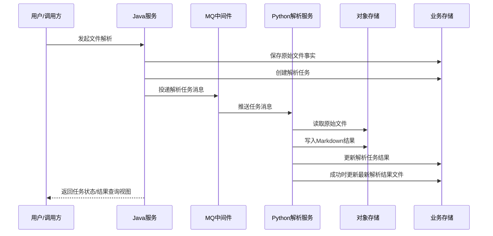

# toLink-Rag 文件解析任务契约重构需求文档 (PRD)

> **文档状态：** 草稿
> **职能说明：** 面向 Java 服务、Python 解析服务、测试与架构评审协同使用
> **项目名称：** toLink-Rag
> **模块名称：** 文件解析任务契约重构
> **分支信息：**
> **主分支：** main
> **相关分支：** Java 后端 / Python 后端
> **负责人：** Codex
> **最后更新时间：** 2026-04-26

---

## 1. 文档修订记录 (Change Log)
*规范：任何需求变更必须在此记录，杜绝口头需求。*

| 版本号 | 修改日期 | 修改内容简述 | 提出人 | 审核人 |
| :--- | :--- | :--- | :--- | :--- |
| v1.0 | 2026-04-26 | 初始版本创建，整理 MQ 消息变更和三类业务对象职责边界 | 用户 | 待定 |
| v1.1 | 2026-04-26 | 结合 `init.sql` 补充三张表现状约束，明确失败不自动重试、查询仅看最新成功结果、通知 Java 延后二期 | 用户 | 待定 |

---

## 2. 业务层 (Business Layer)

### 2.1 需求背景

- 当前现状：文件解析链路由 Java 端创建业务记录并通过 MQ 向 Python 端发送解析任务，Python 端消费消息后完成原始文件下载、解析和 Markdown 结果回写。
- 当前问题：
  - MQ 消息体仍基于旧契约，无法完整表达当前任务归属、数据集归属以及结果文件的目标定位。
  - 现有需求表述未与当前 `document_original_file`、`document_parse_task`、`document_parsed_file` 三张表的职责划分完全对齐。
  - 原始文件、解析执行过程、最新解析结果三类事实混杂，导致后续状态流转、回写责任和重复解析语义不清。
- 触发本次需求的原因：需要围绕 Java 端发起的异步解析链路，重构跨系统任务契约和业务对象边界，为后续技术设计与实现提供统一需求口径。

### 2.2 需求目标

- 业务目标：建立一套可稳定支撑“原始文件长期保留 + 解析任务可重复执行 + 最新解析结果可直接读取”的业务模型。
- 用户目标：业务侧能够基于单个原始文件多次发起解析，并准确区分上传事实、任务执行结果和当前最新解析结果。
- 本次完成后的预期收益：
  - Java 与 Python 间的解析任务载荷边界明确。
  - 三类业务对象职责清晰，能够与当前数据库初始化脚本中的三张业务表一一对应。
  - 后续状态流转、手动重试、历史追踪和结果覆盖都能建立在统一需求前提之上。

### 2.3 范围与分期

**本期必须完成：**

- 明确 Java 端发送给 Python 端的 MQ 解析任务消息契约。
- 明确“原始文件、解析任务、最新解析结果文件”三类业务对象的职责、归属关系和结果语义。
- 明确解析链路中谁负责创建任务、谁负责推进任务状态、谁负责回写最终结果。
- 明确解析结束后 Python 端需要把成功或失败结果记录到对应表中的业务要求。
- 明确重复解析场景下历史保留、用户手动重新解析与最新结果覆盖的业务边界。
- 明确本期需求与当前 `document_original_file`、`document_parse_task`、`document_parsed_file` 表职责的一致性约束。

**本期明确不做：**

- 不在需求文档中给出最终表字段、索引、SQL 和迁移脚本方案。
- 不在需求文档中固化具体 API、MQ topic、group、路由键和代码类结构。
- 不在本期实现 Python 解析完成后主动通知 Java 的协同链路，该能力延后二期处理。
- 不在本阶段定义进度上报通道、自动重试机制实现、幂等实现细节和事务策略。
- 不扩展到检索、向量化、知识库消费等解析后下游链路。

**后续期次规划：**

- 一期：完成解析任务契约重构需求定义，锁定跨系统消息边界和三类业务对象职责。
- 二期：完成技术设计与代码实现，落地 MQ 消息调整、结果回写、以及解析完成后通知 Java 的协同链路。
- 三期：按业务需要评估进度展示、任务运维视图、版本切换等扩展能力。

### 2.4 角色与参与方

| 角色/系统 | 身份说明 | 在本需求中的职责 |
| :--- | :--- | :--- |
| 业务用户 | 在 Java 端上传文件并触发解析的业务使用方 | 发起上传、触发解析、查看最终解析结果 |
| Java 服务 | 业务主调系统 | 维护业务主记录、创建解析任务、发送 MQ 消息、承接前端查询 |
| Python 解析服务 | 异步解析执行方 | 消费解析任务消息、执行解析、推进任务状态、回写解析结果 |
| MQ 中间件 | 异步任务传递通道 | 承载 Java 到 Python 的解析任务投递 |
| 对象存储 | 原始文件与 Markdown 结果存储介质 | 提供原始文件读取和 Markdown 结果写入能力 |
| 测试/运维人员 | 联调与异常排查角色 | 校验契约一致性、排查任务失败与回写异常 |

### 2.5 核心业务场景

#### 场景 A：Java 创建解析任务并发送 MQ 消息

- 触发条件：Java 端已存在待解析的原始文件，并决定发起一次新的解析执行。
- 主流程：
  - Java 端基于原始文件创建一条新的解析任务记录。
  - Java 端组织本次任务所需的最小必要消息载荷并投递 MQ。
  - Python 端收到消息后，以任务消息中的任务标识和文件定位信息作为执行依据。
- 用户可见结果：任务进入“已受理/待执行”语义，前端后续可基于该任务查询执行结果。

#### 场景 B：Python 消费任务并完成一次成功解析

- 触发条件：Python 端成功消费到一条合法的解析任务消息，且原始文件可读取、解析流程执行成功。
- 主流程：
  - Python 端根据消息中的源文件定位信息读取原始文件。
  - Python 端执行解析，并将 Markdown 结果写入消息中约定的目标位置。
  - Python 端更新本次解析任务的最终结果，并将“最新解析结果文件”对象更新为本次成功结果。
- 用户可见结果：本次解析任务显示成功，业务侧能读取到当前最新 Markdown 结果。

#### 场景 C：Python 消费任务但解析失败

- 触发条件：消息合法，但读取原始文件、执行解析或写入结果时发生异常。
- 主流程：
  - Python 端将本次解析任务标记为失败。
  - Python 端记录本次失败结果所需的任务级信息。
  - 原始文件记录保持不变，最新解析结果文件对象不被更新为失败结果。
- 用户可见结果：本次解析任务显示失败，系统不自动重试；用户如需再次解析，需重新点击解析按钮发起新任务。

#### 场景 D：同一原始文件多次解析

- 触发条件：业务侧针对同一原始文件再次发起解析。
- 主流程：
  - Java 端基于用户再次点击解析，为该原始文件创建新的解析任务，而不是覆盖历史任务。
  - Python 端按新任务执行本次解析。
  - 若本次成功，则更新最新解析结果文件；若失败，则仅保留失败任务历史。
- 用户可见结果：同一原始文件可看到多次解析历史，系统对外只暴露当前最新成功结果，不额外暴露“最近一次任务结果”独立视图。

### 2.6 关键异常场景

| 异常场景 | 触发条件 | 系统预期行为 | 用户可见结果 |
| :--- | :--- | :--- | :--- |
| MQ 消息缺少关键标识或定位信息 | `task_id`、原始文件标识或源/目标对象定位信息不完整 | Python 端拒绝按成功任务处理，记录消息不合法问题 | 任务不应被误判为成功，需可追踪异常原因 |
| 任务记录存在但原始文件无法读取 | 源 bucket 或对象 key 不可访问，或对象已丢失 | 本次解析任务按失败处理 | 用户看到任务失败，原始文件主记录不被覆盖 |
| Markdown 写入失败 | 解析成功但结果写入目标位置失败 | 本次解析任务按失败处理，不更新最新解析结果文件 | 用户看到任务失败，仍保留旧的最新成功结果 |
| 同一原始文件重复触发解析 | 用户再次点击解析按钮 | 系统新增任务历史，而不是覆盖旧任务，也不自动重试旧失败任务 | 用户可看到新的任务执行结果，旧任务历史仍可追溯 |

### 2.7 验收标准

| 验收项 | 验收标准 | 验证方式 |
| :--- | :--- | :--- |
| MQ 契约完整性 | 解析任务消息至少能表达任务标识、原始文件标识、用户归属、数据集归属、源文件定位信息和 Markdown 目标定位信息 | 需求评审 + 联调用例 |
| 三类对象职责清晰 | 原始文件、解析任务、最新解析结果文件三类对象职责不重叠，能够分别承载上传事实、任务历史和当前结果 | 需求评审 |
| 结果落库语义 | Python 在解析结束后能将成功或失败结果分别记录到任务结果对象中，成功时更新最新解析结果文件 | 需求评审 + 用例走查 |
| 重复解析语义 | 同一原始文件再次解析时，系统新增任务历史，且仅最新成功结果覆盖当前结果对象 | 需求评审 + 用例走查 |
| 失败隔离语义 | 解析失败不会破坏原始文件事实，也不会将失败结果覆盖为最新成功结果 | 需求评审 + 用例走查 |
| 手动重试语义 | 解析失败后系统不自动重试，必须由用户重新点击解析按钮触发新任务 | 需求评审 + 用例走查 |
| 回写责任边界 | Java 负责建任务和投递，Python 负责执行、推进任务状态和回写结果；解析完成后通知 Java 不属于本期 | 需求评审 |

---

## 3. 架构约束层 (Architecture Constraint Layer)

### 3.1 主业务维度

- 本需求围绕的主业务对象：原始文件驱动下的一次次解析任务及其当前有效解析结果。
- 其他对象如何归属于主业务对象：解析任务归属于原始文件，最新解析结果文件归属于原始文件并由某一次成功解析任务产出，任务操作归属于用户和数据集。
- 明确不是主维度的对象：前端上传过程、检索索引、向量化产物、知识问答消费结果。

### 3.2 系统职责划分

| 端 / 系统 / 模块 | 负责内容 | 明确不负责内容 |
| :--- | :--- | :--- |
| 前端 | 发起上传/解析请求，查看解析结果 | 不直接维护任务消息与解析状态 |
| Java 端 | 维护原始文件事实、创建解析任务、组织并发送 MQ 消息、对外提供当前结果查询视图 | 不执行实际文件解析，不要求本期接收 Python 主动通知 |
| Python 端 | 消费解析任务、读取原始文件、生成 Markdown、推进任务状态、回写解析结果 | 不决定业务侧何时创建原始文件和何时发起任务，不负责本期通知 Java |
| 中间件 / 任务系统 | 传递异步任务消息 | 不负责业务状态解释和结果存储 |
| 对象存储 / 数据存储 | 持久化原始文件和解析结果，存储业务状态记录 | 不负责任务编排和业务判定 |

### 3.3 核心业务流程

#### 主流程时序图


#### 关键补充说明

- 主链路说明：Java 端先形成稳定的业务事实和解析任务，再通过 MQ 将本次执行所需的最小必要信息交给 Python 端；Python 本期只负责解析结束后的结果落库。
- 与其他链路的衔接关系：Python 端只围绕“已创建的解析任务”执行，不负责原始文件上传链路与前端展示逻辑。
- 本期不进入的后续链路：解析进度上报、解析完成后通知 Java、任务清理策略、结果版本切换策略不在本次需求定稿范围内。

### 3.4 关键状态与结果

| 对象 | 关键状态 | 状态含义 | 谁负责更新 | 谁需要感知 |
| :--- | :--- | :--- | :--- | :--- |
| 原始文件 | uploading/success/failed | 原始文件上传状态，决定原始文件是否可作为解析来源 | Java 端 | Java 端、业务侧 |
| 解析任务 | created | 本次解析任务已创建，待 MQ 消费执行 | Java 端 | Java 端、Python 端 |
| 解析任务 | processing | Python 端已开始处理本次任务 | Python 端 | Java 端、业务侧 |
| 解析任务 | success | 本次解析完成，任务结果已落库 | Python 端 | Java 端、业务侧 |
| 解析任务 | failed | 本次解析失败，记录失败原因，等待用户手动再次发起 | Python 端 | Java 端、业务侧 |
| 最新解析结果文件 | 当前有效 | 当前原始文件最近一次成功解析后的结果 | Python 端 | Java 端、业务侧 |

### 3.5 核心数据对象

先列出本需求涉及的数据对象总览：

| 数据对象 | 职责说明 | 与主维度关系 | 本期是否需要 |
| :--- | :--- | :--- | :--- |
| 原始文件 | 承载原始上传文件事实和稳定来源信息 | 主维度入口对象 | 是 |
| 解析任务 | 承载一次独立解析执行的状态、结果和失败信息 | 主维度执行对象 | 是 |
| 最新解析结果文件 | 承载原始文件当前最新成功解析结果 | 主维度结果对象 | 是 |

然后对每个关键数据对象分别补充以下说明：

#### 数据对象 A：原始文件

- 对象职责：稳定保留业务上传事实，并作为所有解析任务的来源对象。
- 记录的核心事实：文件归属的用户、数据集、原始文件名、后缀、大小、源文件存储位置以及上传状态。
- 归属关系：归属于某个用户和某个数据集。
- 与其他对象的关系：一个原始文件可关联多条解析任务，并对应一个“当前最新解析结果文件”对象。
- 本期是否必须存在：是。
- 关键状态/结果是否挂在该对象上：只挂原始文件自身事实，不挂解析任务历史与失败过程。
- 明确不放在该对象中的内容：不承担多次解析历史、不承担任务级错误信息、不承担当前最新 Markdown 内容本身。

#### 数据对象 B：解析任务

- 对象职责：记录一次具体解析执行的生命周期、结果和异常信息。
- 记录的核心事实：任务标识、任务归属的原始文件、任务归属的用户和数据集、触发方式、任务状态、投递时间、开始结束时间、耗时和失败原因。
- 归属关系：归属于某一个原始文件，可同时具备用户和数据集归属信息用于追踪。
- 与其他对象的关系：同一个原始文件可产生多条解析任务；成功任务可更新最新解析结果文件对象。
- 本期是否必须存在：是。
- 关键状态/结果是否挂在该对象上：是，任务状态、任务结果和失败原因均应挂在该对象上。
- 明确不放在该对象中的内容：不承担原始文件上传事实，不作为最新结果的唯一长期读取对象。

#### 数据对象 C：最新解析结果文件

- 对象职责：承载某个原始文件当前最新一次成功解析后的有效结果。
- 记录的核心事实：当前有效结果来源于哪次成功任务、原始文件名快照、解析结果文件名、结果文件的存储定位信息以及累计成功解析次数。
- 归属关系：归属于某一个原始文件。
- 与其他对象的关系：由解析任务成功后更新；失败任务不能覆盖该对象。
- 本期是否必须存在：是。
- 关键状态/结果是否挂在该对象上：只承载“当前最新成功结果”语义。
- 明确不放在该对象中的内容：不保留完整任务历史，不承担失败记录列表，不承担进度展示信息。

说明：

- 本节在 PRD 中采用对象级模型，用于提前锁定三类业务对象的职责边界。
- 本节不要求给出最终表字段、字段类型、索引或 SQL。
- 最终字段级模型放在 `technical_design.md`。

### 3.6 依赖与协作关系

| 依赖项 | 依赖类型 | 对本需求的影响 | 当前状态 |
| :--- | :--- | :--- | :--- |
| Java 端业务主流程 | 系统 | 决定原始文件何时建档、解析任务何时创建、消息何时发送 | 已具备 |
| MQ 中台 | 组件 | 决定解析任务能否可靠送达 Python 端 | 已具备 |
| 对象存储 | 组件 | 决定源文件读取与 Markdown 结果写入的定位语义 | 已具备 |
| 当前数据库三表模型 | 数据 | 决定结果需要分别落到原始文件、解析任务、最新解析结果文件对应对象中 | 已具备 |
| Java/Python 联调约定 | 人工流程 | 决定消息字段口径和状态口径是否一致 | 待确认 |

---

## 4. 技术边界层 (Technical Boundary Layer)

### 4.1 关键技术约束

本节用于提前敲定那些会影响需求边界和职责边界的技术约束，但不展开最终实现方案。

| 约束项 | 当前约束说明 | 是否本期定稿 |
| :--- | :--- | :--- |
| 核心存储边界 | 原始文件、解析任务、最新解析结果文件必须分别对应 `document_original_file`、`document_parse_task`、`document_parsed_file` 的职责边界 | 是 |
| 系统间交互方式 | Java 通过 MQ 向 Python 发送异步解析任务，Python 基于任务消息独立执行 | 是 |
| 关键定位信息生成方 | 任务消息中应明确给出源文件和 Markdown 结果的存储定位信息，供 Python 端直接消费 | 是 |
| 幂等与稳定性要求 | 同一原始文件允许多次解析，但每次解析必须对应独立任务语义；失败后不自动重试 | 是 |
| 交互载荷边界 | 本次任务消息只传递本次执行所需的最小必要业务标识与对象定位信息 | 是 |
| 状态更新责任 | Java 负责创建任务，Python 负责推进任务状态并回写执行结果 | 是 |
| 扩展兼容要求 | 后续扩展通知 Java、进度展示、运维视图时，不应破坏现有三类对象职责边界 | 是 |

### 4.2 涉及的存储与中间件类型

* [x] 关系型数据库
* [ ] 缓存
* [x] 消息队列
* [x] 对象存储
* [ ] 搜索 / 向量检索
* [ ] 外部系统
* [x] 其他：Java 与 Python 的跨系统任务契约

### 4.3 本期需要提前确认的技术原则

- 解析任务消息必须围绕“一次独立任务执行”建模，而不是继续混用原始文件事实和结果事实。
- 原始文件事实必须稳定保留，不能因任务失败或重复解析而被覆盖。
- 解析任务历史必须可重复产生并保留，以承载一次次独立执行的结果。
- 最新解析结果文件只承载当前有效成功结果，不承载失败结果和完整历史。
- Python 端消费消息时，应以消息明确给出的源文件和目标结果定位信息为准。
- 解析失败后不进行系统自动重试，只记录失败结果并等待用户重新点击解析按钮。
- Java 对外查询以当前最新成功结果为主，本期不额外提供“最近一次任务结果”独立视图。
- 需求阶段只锁定业务边界和职责边界，不提前展开具体表字段、消息模型代码和迁移实现。

### 4.4 延后到技术方案确认的内容

以下内容可以在 PRD 中先描述原则，不要求在本阶段定到最终实现细节：

- 三张表的最终字段、索引和约束设计
- MQ 消息模型在代码中的具体定义与兼容策略
- 状态枚举、失败码、错误信息格式
- 手动重新解析按钮的前端交互与接口细节
- 补偿、幂等、事务和回滚策略
- 解析完成后通知 Java 的实现方式

---

## 5. 风险、依赖与待确认问题 (Dependencies & Open Issues)

### 5.1 当前主要风险

- Java 与 Python 若对 MQ 消息字段语义理解不一致，容易造成任务消费成功但结果回写错误。
- 新三对象模型若在实现阶段继续混用职责，后续仍会出现历史任务、当前结果和原始文件事实相互污染的问题。
- 解析完成后本期不通知 Java，若 Java 查询侧依赖主动通知才能刷新结果，则联调阶段可能出现结果可查但状态刷新不及时的问题。

### 5.2 前置依赖

- Java 端需要能先完成原始文件主记录和解析任务记录创建，再投递 MQ 消息。
- Python 端需要能基于消息中的源/目标定位信息完成文件读取、结果写入和任务结果落库。
- Java 与 Python 双方需要统一任务状态语义、失败语义和最新成功结果读取语义。

### 5.3 待确认问题

- 最新解析结果文件对象是否只记录 Markdown 结果，还是后续还需纳入图片、附件等关联产物语义。
- 当前提供的 MQ 新消息载荷是否已是最终口径，后续是否还会补充解析策略类字段。

---

## 附：当前确认的 MQ 任务最小载荷

以下内容用于帮助需求评审统一“任务契约承载哪些最小必要信息”的口径，不作为最终代码模型定义：

```json
{
  "task_id": "9f6b7d7e-4e7b-4a3f-9f4d-8d2a1b6c7e90",
  "original_file_id": 10001,
  "user_id": 10002,
  "dataset_id": 10003,
  "file_type": "pdf",
  "source_bucket": "rag-raw",
  "source_object_key": "original/user-10002/dataset-10003/2026/04/26/10001/report.pdf",
  "source_filename": "report.pdf",
  "md_bucket": "rag-md",
  "md_object_key": "parsed/user-10002/dataset-10003/2026/04/26/9f6b7d7e-4e7b-4a3f-9f4d-8d2a1b6c7e90/report.md"
}
```

该载荷在需求层面的含义是：

- `task_id`：标识一次独立解析执行。
- `original_file_id`：标识本次任务来源的原始文件。
- `user_id`、`dataset_id`：标识任务归属上下文，确保任务能回到正确业务域。
- `source_bucket`、`source_object_key`、`source_filename`：标识本次解析输入来源。
- `md_bucket`、`md_object_key`：标识本次解析成功后结果写入位置。
