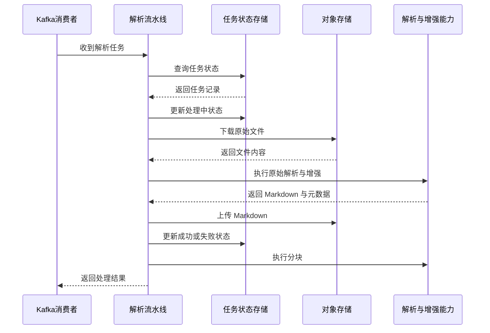

# toLink-Rag 文档解析链路线程池边界治理需求文档 (PRD)

> **文档状态：** 评审中
> **职能说明：** 面向 Python 后端研发、架构评审和任务链路维护人员共同使用
> **项目名称：** toLink-Rag
> **模块名称：** 文档解析链路线程池边界治理
> **分支信息：**
> **主分支：** main
> **相关分支：** Python 后端
> **负责人：** Codex
> **最后更新时间：** 2026-04-26

---

## 1. 文档修订记录 (Change Log)
*规范：任何需求变更必须在此记录，杜绝口头需求。*

| 版本号 | 修改日期 | 修改内容简述 | 提出人 | 审核人 |
| :--- | :--- | :--- | :--- | :--- |
| v1.0 | 2026-04-26 | 初始版本创建，明确解析链路线程池边界治理范围 | 用户 | 待定 |

---

## 2. 业务层 (Business Layer)

### 2.1 需求背景

- 当前现状：文档解析任务通过 Kafka 异步消费触发，单条消息会串行执行文件下载、原始解析、Markdown 增强、状态更新和分块等步骤。
- 当前问题：链路中部分同步阻塞步骤通过线程池规避事件循环阻塞，但数据库读写也被包装进线程池，形成跨线程数据库访问语义不清、稳定性不可控的问题。
- 触发本次需求的原因：需要明确线程池使用边界，避免不合理的线程池封装继续放大 Kafka 消费超时、任务重发、状态错乱或偶发数据库异常的风险。

### 2.2 需求目标

- 业务目标：保证文档异步解析链路在高耗时场景下仍能稳定推进，并减少线程池误用带来的状态更新风险。
- 用户目标：研发与维护人员能够明确哪些步骤允许使用线程池、哪些步骤应直接使用异步能力处理。
- 本次完成后的预期收益：降低跨线程数据库访问风险，收敛解析链路执行模型，为后续 Kafka 超时治理和任务后台化改造打下边界基础。

### 2.3 范围与分期

**本期必须完成：**

- 明确解析链路中的线程池使用边界
- 去除数据库查询与状态更新环节中不合理的线程池使用
- 保证数据库访问收敛到项目现有异步数据库能力
- 保持现有 Kafka 消费语义、任务状态语义和解析结果语义不变

**本期明确不做：**

- 不改造 Kafka 消费模型为快速确认后后台执行
- 不调整 MQ topic、group、消息结构
- 不引入新的对象存储 SDK 或全异步对象存储客户端
- 不重写 PDF 解析、Markdown 增强或分块算法

**后续期次规划：**

- 一期：完成线程池边界治理和数据库访问方式收敛
- 二期：无
- 三期：无

### 2.4 角色与参与方

| 角色/系统 | 身份说明 | 在本需求中的职责 |
| :--- | :--- | :--- |
| 内部解析消费者 | Kafka 消费文档解析任务的内部执行单元 | 触发并等待整条解析链路完成 |
| Python 后端服务 | 承载解析编排、状态更新和增强逻辑的服务进程 | 执行线程池边界治理后的链路行为 |
| 数据库 | 持久化解析任务状态和结果元数据 | 提供任务状态查询与更新能力 |
| 对象存储 | 存放原始文件、Markdown 和图片对象 | 提供同步下载与上传能力 |
| 维护研发人员 | 负责后续问题定位和链路扩展 | 依据需求边界进行实现与排障 |

### 2.5 核心业务场景

#### 场景 A：消费解析任务并完成成功链路

- 触发条件：Kafka 消费到一条待处理的文档解析任务消息。
- 主流程：消费者读取任务状态、下载原始文件、执行解析和增强、写回 Markdown、更新任务成功状态、执行分块。
- 用户可见结果：任务状态变为成功，Markdown 与相关产物可被后续链路继续消费。

#### 场景 B：消费解析任务并处理异常链路

- 触发条件：解析、对象存储或增强流程中出现异常。
- 主流程：消费者捕获异常、回写失败状态、不提交成功处理结果，由 MQ 语义决定后续重试。
- 用户可见结果：任务状态变为失败并记录错误信息，消息可能被后续重新消费。

### 2.6 关键异常场景

| 异常场景 | 触发条件 | 系统预期行为 | 用户可见结果 |
| :--- | :--- | :--- | :--- |
| 线程池误用于数据库访问 | 任务状态查询或更新在跨线程上下文中执行 | 改为基于异步数据库能力直接执行 | 不再依赖跨线程 Session 行为 |
| 对象存储操作耗时较长 | 下载或上传为同步阻塞调用 | 允许保留在线程池中执行 | 任务整体耗时上升但事件循环保持可调度 |
| 原始解析耗时较长 | PDF 解析、图像处理或分块为同步重计算 | 允许保留在线程池中执行 | 单条任务仍串行等待，但不直接阻塞事件循环 |
| 解析中途失败 | 解析、增强或上传过程抛错 | 写回失败状态并保持 MQ 可重试语义 | 用户可见失败状态与错误原因 |

### 2.7 验收标准

| 验收项 | 验收标准 | 验证方式 |
| :--- | :--- | :--- |
| 数据库访问边界 | 解析流水线中的任务状态查询与更新不再通过线程池包装执行 | 单测 + 代码审查 |
| 线程池保留边界 | 对象存储下载/上传、同步解析、分块仍可在线程池中执行 | 单测 + 代码审查 |
| 行为兼容性 | 成功、跳过、失败三类任务结果语义与现有逻辑一致 | 单测 |
| 回归稳定性 | 现有相关测试全部通过，无新增明显行为回归 | 全量测试 |

---

## 3. 架构约束层 (Architecture Constraint Layer)

### 3.1 主业务维度

- 本需求围绕的主业务对象：文档解析任务执行链路
- 其他对象如何归属于主业务对象：对象存储文件、Markdown 产物、分块结果和状态记录均服务于解析任务执行
- 明确不是主维度的对象：外部搜索索引、前端交互流程、消息协议扩展

### 3.2 系统职责划分

| 端 / 系统 / 模块 | 负责内容 | 明确不负责内容 |
| :--- | :--- | :--- |
| 前端 | 无直接职责 | 不参与本需求改造 |
| Java 端 | 无直接职责 | 不参与解析线程池边界治理 |
| Python 端 | 编排解析链路、维护任务状态、收敛线程池边界 | 不改变跨系统接口协议 |
| 中间件 / 任务系统 | 提供 Kafka 消费与对象存储能力 | 不负责解析链路内部调度策略 |
| 对象存储 / 数据存储 | 提供原始文件、结果文件和状态持久化 | 不负责链路内线程调度语义 |

### 3.3 核心业务流程

#### 主流程时序图

#### 关键补充说明

- 主链路说明：数据库访问与线程池边界需要清晰分层，避免把已有异步能力再包装成跨线程调用。
- 与其他链路的衔接关系：Kafka offset 提交仍依赖整条解析链路完成，本需求不改变该消费语义。
- 本期不进入的后续链路：消息快速确认、后台 worker 解耦、Kafka 超时参数优化不属于本期交付范围。

### 3.4 关键状态与结果

| 对象 | 关键状态 | 状态含义 | 谁负责更新 | 谁需要感知 |
| :--- | :--- | :--- | :--- | :--- |
| 解析任务 | pending | 待处理 | 任务创建方 | 消费者 |
| 解析任务 | processing | 正在执行解析链路 | Python 后端 | 消费者、维护人员 |
| 解析任务 | success | 解析与 Markdown 回写完成 | Python 后端 | 下游链路、维护人员 |
| 解析任务 | failed | 本次执行失败，可重试 | Python 后端 | 消费者、维护人员 |

### 3.5 核心数据对象

先列出本需求涉及的数据对象总览：

| 数据对象 | 职责说明 | 与主维度关系 | 本期是否需要 |
| :--- | :--- | :--- | :--- |
| 解析任务记录 | 记录任务状态、结果位置与耗时信息 | 主业务对象 | 是 |
| 原始文件对象 | 作为解析输入 | 从属于解析任务 | 是 |
| Markdown 结果对象 | 作为解析输出 | 从属于解析任务 | 是 |
| 分块结果 | 作为后续检索处理的输入 | 从属于解析任务 | 是 |

然后对每个关键数据对象分别补充以下说明：

#### 数据对象 A：解析任务记录

- 对象职责：承载任务状态、结果定位和错误信息
- 记录的核心事实：任务当前状态、结果对象位置、耗时、异常信息
- 归属关系：唯一归属于单条解析任务
- 与其他对象的关系：关联原始文件对象、Markdown 对象和分块结果
- 本期是否必须存在：是
- 关键状态/结果是否挂在该对象上：是
- 明确不放在该对象中的内容：不承载线程池实现细节和消息消费参数

#### 数据对象 B：原始文件与 Markdown 对象

- 对象职责：分别承载解析输入与解析输出
- 记录的核心事实：原始文档内容、解析后 Markdown 内容及相关图片对象
- 归属关系：从属于解析任务记录
- 与其他对象的关系：由解析流水线读取与写回
- 本期是否必须存在：是
- 关键状态/结果是否挂在该对象上：否
- 明确不放在该对象中的内容：不承担任务状态流转语义

说明：

- 本节采用对象级模型，只锁定职责与边界
- 本期不在需求文档中展开最终字段、索引和 SQL

### 3.6 依赖与协作关系

| 依赖项 | 依赖类型 | 对本需求的影响 | 当前状态 |
| :--- | :--- | :--- | :--- |
| 异步数据库基础设施 | 组件 | 决定数据库读写能否从线程池中剥离 | 已具备 |
| Kafka 消费模型 | 系统 | 决定任务结果返回与消息重试语义 | 已具备 |
| 对象存储同步 SDK | 组件 | 决定下载/上传是否仍需线程池承载 | 已具备 |
| 同步 PDF 解析库 | 组件 | 决定原始解析是否仍需线程池承载 | 已具备 |

---

## 4. 技术边界层 (Technical Boundary Layer)

### 4.1 关键技术约束

本节用于提前敲定那些会影响需求边界和职责边界的技术约束，但不展开最终实现方案。

| 约束项 | 当前约束说明 | 是否本期定稿 |
| :--- | :--- | :--- |
| 核心存储边界 | 任务状态依赖数据库，原始文件与 Markdown 依赖对象存储 | 是 |
| 系统间交互方式 | Kafka 消费后在同一服务进程内同步等待任务完成 | 是 |
| 关键定位信息生成方 | 解析链路负责生成 Markdown 结果和结果定位信息 | 是 |
| 幂等与稳定性要求 | 已成功任务需要幂等跳过，失败任务保留重试语义 | 是 |
| 交互载荷边界 | 本期不修改任务消息载荷和对象存储定位信息结构 | 是 |
| 状态更新责任 | 解析流水线负责更新任务状态，不能依赖跨线程数据库会话副作用 | 是 |
| 扩展兼容要求 | 后续若引入后台 worker 或快速确认模型，本期边界应可平滑承接 | 是 |

### 4.2 涉及的存储与中间件类型

* [x] 关系型数据库
* [ ] 缓存
* [x] 消息队列
* [x] 对象存储
* [ ] 搜索 / 向量检索
* [ ] 外部系统
* [x] 其他：同步解析库与线程池执行模型

### 4.3 本期需要提前确认的技术原则

- 线程池只用于承载确有必要的同步阻塞步骤，不用于包装项目已具备异步能力的数据库访问
- 单条任务主流程仍保持串行执行，不以本期需求为名引入新的后台执行模型
- 本期治理目标是线程池边界收敛，不是解析链路整体架构升级

### 4.4 延后到技术方案确认的内容

以下内容可以在 PRD 中先描述原则，不要求在本阶段定到最终实现细节：

- 具体异步数据库访问封装形式
- 解析链路中各步骤的具体实现改动
- Kafka 超时参数是否需要进一步调整
- 是否在后续引入独立 worker、快速 ACK 或消费并发治理

---

## 5. 风险、依赖与待确认问题 (Dependencies & Open Issues)

### 5.1 当前主要风险

- 解析链路虽去除不合理线程池用法，但 Kafka 仍等待整条任务完成后才提交结果，长任务风险仍在
- 同步对象存储和同步解析库仍会占用线程池资源，在高并发下可能形成排队
- 图片增强与部分 Markdown 处理仍存在同步阻塞片段，后续可能继续影响整体耗时

### 5.2 前置依赖

- 异步数据库工厂与会话能力已稳定可用
- 现有解析任务状态模型可继续承载本次需求
- 单元测试与回归测试可覆盖状态流转和成功/失败分支

### 5.3 待确认问题

- 后续是否需要单独立项处理 Kafka 快速确认与后台 worker 解耦
- 后续是否需要继续梳理图片下载、Markdown 增强等同步阻塞点
