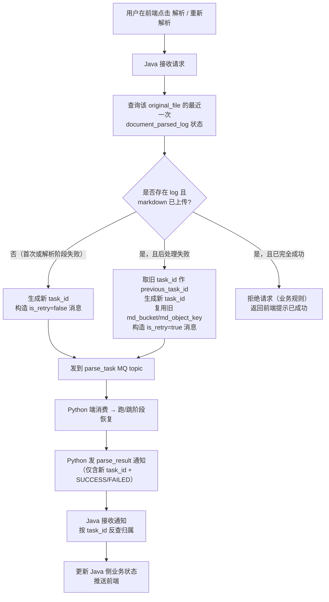

# 解析失败重试链路 + 稀疏向量阶段接入（Java 端） Brief

> 配对文档：[Python 端 brief（已冻结）](../parse-retry-and-sparse-vector-py/brief.md)

## 1. 需求摘要

- **做什么**：Java 业务端在用户发起"解析"或"重新解析"请求时，识别本次是"首次解析"还是"重试"。首次走现有流程不变；重试时生成新 task_id、把上次失败任务的 task_id 作为 `previous_task_id` 一并写入 MQ 消息，并复用上次已生成的 Markdown OSS 坐标。Java 端同时新增对 Python 端两个审计字段的读取能力，用于在管理页展示"重试链"。
- **为什么做**：当前用户点击"重新解析"会触发 Python 端从头跑整条流水线（重新下载源文件、解析、上传 markdown、分片、向量化、入索引），即使上次已经把 markdown 跑出来了也要重做，浪费成本。Python 端已在 [docs/parse-retry-and-sparse-vector-py/brief.md](../parse-retry-and-sparse-vector-py/brief.md) 实现"按 MQ 消息字段跳阶段恢复"的能力，需要 Java 端配合：识别重试场景、生成正确的消息、读懂新的审计字段、把重试结果反映到 Java 侧业务状态。
- **本次不做**：
  - "修改解析方式"字段（用户重试时改 PDF 解析器后端等）—— Java 端预留不实现，本期消息体可不出现该字段。
  - 重试次数上限 —— 本期不做（Java 业务表不加 retry_count 字段，不沿 retry_of_task_id 链查计数）。
  - "重试链"在 Java 审计页的展示 —— 本期不做（后端读字段能力具备，UI 改造单独排期）。
  - 发 MQ 前对 Python 服务做健康检查 —— 不做（MQ 解耦本身够用）。
  - parse_result 通知接收的幂等 / 超时告警 / 乱序兜底 —— 本期不做，已开独立 issue #44 后续处理。

## 2. 业务流程

### 2.1 主流程图

### 2.2 流程详解

#### 节点 1：用户请求接入与首次/重试判定

Java 接收到前端"解析"或"重新解析"请求后，必须判定本次属于哪种情况。判定依据是 Python 端持有的 `document_parsed_log` 表的最近一行（按 `document_original_file_id` 维度排序取最新）与对应 `document_post_process_pipeline` 行：

- **不存在任何 log 行** → 首次解析。
- **存在 log 行但 `parsed_object_key IS NULL`**（即上次连 markdown 都没成功上传）→ 视作首次解析，重新走全链路。Python 端这种情况下也不会接受 `previous_task_id`（严格校验会拒），所以 Java 必须按首次发。
- **存在 log 行 `parsed_object_key IS NOT NULL` 且对应 `document_post_process_pipeline.pipeline_status = FAILED`** → 重试场景。这是本期新增的核心分支。
- **存在 log 行 `parsed_object_key IS NOT NULL` 且 `pipeline_status = SUCCESS`** → 任务已完全成功，Java 端拒绝重试请求，给前端返回"已成功，无需重试"的友好提示，**不发 MQ 消息**。

> **字段权威迁移**：`document_parsed_log.task_status` / `failure_reason` 已下线（Python migration 0007）。整体任务状态以 `document_post_process_pipeline.pipeline_status` 为准；"markdown 是否已上传"以 `document_parsed_log.parsed_object_key IS NOT NULL` 为准；失败原因以 `document_post_process_pipeline.failure_reason` 为准。

> 判定数据源：Java 端与 Python 端**共用同一个 MySQL 实例**，Java 直接 SELECT 这两张表即可，无需镜像表或同步机制。判定查询走主库读，避免主从延迟。

#### 节点 2：首次解析分支

走现有 MQ 消息构造流程，唯一变化是新增 `is_retry=false`（或省略该字段，Python 端默认 false）。`previous_task_id` 不传。其他字段保持现状（`task_id`、`user_id`、`dataset_id`、`source_bucket`、`source_object_key`、`md_bucket`、`md_object_key`、`file_type` 等）。

#### 节点 3：重试解析分支（核心改造点）

依次完成：

1. **取旧 task_id**：从最近一次失败的 `document_parsed_log` 行取出 `task_id`，作为 `previous_task_id`。
2. **生成新 task_id**：UUID 或现有 task_id 生成规则，不复用旧的。Python 端新 log 行会用这个新 task_id 写入，旧 log 不动。
3. **复用旧 markdown 坐标**：从旧 `document_parsed_log` 行取 `parsed_bucket_name` / `parsed_object_key`（即上次解析产出的 markdown OSS 位置），原样填入新消息的 `md_bucket` / `md_object_key` 字段。Python 端会跳过源文件下载与解析步骤，直接读这个 markdown 继续做后处理。
4. **其他业务字段保持一致**：`user_id`、`dataset_id`、`source_bucket`、`source_object_key`、`source_filename`、`file_type`、`pdf_parser_backend` 等必须与原任务一致 —— Python 端虽然跳过解析阶段，但部分字段（如 user_id/dataset_id）仍用于后续阶段的 ownership 校验。
5. **构造 MQ 消息并发送**：在原 `tolink.rag.parse_task` topic 上发，topic 不变。`is_retry=true`、`previous_task_id=旧 task_id`。

#### 节点 4：拒绝已成功任务的重试

Python 端会严格校验：若 `previous_task_id` 指向的旧 pipeline 已经是 SUCCESS，会落 FAILED 拒绝处理。所以即便 Java 漏拦截，Python 端是兜底防线 —— 但用户会看到"系统拒绝"，体验差。Java 端应在前置就拦下来，给"已成功"明确反馈。

#### 节点 5：Python 端处理过程（透明给 Java）

Python 收到消息后：

- 首次消息 → 正常全链路跑。
- 重试消息 → 校验 `previous_task_id` 一致性（旧 log 存在、status=success、旧 pipeline 非 SUCCESS、markdown 坐标非空），通过后新建 log + 新建 pipeline 行（继承旧 SUCCESS 阶段状态），从首个失败阶段恢复执行。
- 重试校验失败（如旧 log 不存在、被并发覆盖等）→ Python 端给新 task_id 落 FAILED + 通过 parse_result MQ 通知 FAILED。

#### 节点 6：parse_result 通知接收

Python 完成（成功或失败）后向 Java 发 parse_result 消息。**关键约定**：消息体只含**新 task_id** 与 SUCCESS/FAILED 终态，不回带 `previous_task_id`。Java 接收方需要：

1. 按 task_id 查 Java 侧业务表，找到对应的"用户请求 / 解析任务记录"。
2. 如果业务上需要把"通知"和"该用户哪次重试请求"对应起来，Java 端自己用 `task_id → document_parsed_log.retry_of_task_id` 反查链路即可。
3. 更新 Java 侧业务状态（任务完成 / 任务失败原因），推送前端。

#### 异常分支：MQ 消息字段缺失或类型错误

若 Java 实现 bug 导致重试消息漏带 `previous_task_id` 或 `is_retry=false`：

- Python 端严格校验：`is_retry=true` 但 `previous_task_id` 为空 → 落 FAILED 通知。
- Python 端严格校验：`is_retry=true` 但 markdown 坐标字段为空 → 同上。

Java 端在发消息前必须自检消息完整性，避免无效消息白白触发一次 FAILED 通知影响业务方信任度。

#### 异常分支：并发重试同一 previous_task_id

两个用户操作并发触发重试同一个旧任务时，Python 端通过"`superseded_by_task_id IS NULL` CAS 校验"做并发控制：第二次重试会被 Python 拒绝（落 FAILED）。Java 端理想情况下也在请求入口加幂等防抖（如同一 original_file_id 短时间内只接受一次重试请求），但 Python 端是兜底。

### 2.3 跨服务状态一致性约定

- **首次解析失败、Java 收到 FAILED 通知** → Java 不应在 `document_parsed_log` 上做任何更新（Python 写）；Java 自己的业务表标"失败"即可。
- **重试发起前** → Java 不应直接修改 Python 持有的 `document_parsed_log` / `document_post_process_pipeline` 数据，所有状态变更都通过"发 MQ → Python 写库 → Java 收通知"链路完成。
- **审计读** → Java 可读 Python 的 `document_parsed_log.retry_of_task_id`、`document_post_process_pipeline.superseded_by_task_id`，但不写。

## 3. 核心模块与实现思路

### 3.1 用户请求入口（Java Controller / Service 层）

- **职责**：接收前端"解析 / 重新解析"请求，做首次/重试判定，构造并发送 MQ 消息。
- **实现思路**：
  - 复用现有"接收用户解析请求 → 发 parse_task MQ"的入口链路，新增判定分支。
  - 入口前置做幂等防抖（同一 `original_file_id` 短时间内只接受一次请求），避免并发重试冲突。
  - 判定逻辑：按 `original_file_id` 取 `document_parsed_log` 最新一行 + 对应 `document_post_process_pipeline` 行的 `pipeline_status`，按 2.2 节四种情况分支。读取走共享 MySQL 主库，避免从库延迟造成误判。
  - "已成功"分支直接返回前端友好提示，不进入 MQ 流程。
- **关键决策**：
  - Java 与 Python 共用同一 MySQL，判定直接 SELECT 两张表的最新状态，不引入镜像表。
  - 拒绝"已成功"重试请求是 Java 端业务规则，不依赖 Python 端兜底。

### 3.2 MQ 消息构造（Java Producer 模块）

- **职责**：构造符合新契约的 `parse_task` 消息。
- **实现思路**：
  - 在现有消息构造逻辑上新增两个字段：
    - `is_retry`：布尔值，重试场景填 true，首次填 false（或省略，由 Python 默认值兜底）。
    - `previous_task_id`：字符串，重试时填上次失败任务的 task_id，首次填 null 或省略。
  - 重试消息的 `md_bucket` / `md_object_key`（即 markdown 坐标）必须从旧 `document_parsed_log` 行取，不能用 null 或新值。
  - 其他字段（`user_id`、`dataset_id`、`source_bucket`、`source_object_key`、`source_filename`、`file_type` 等）与原任务保持一致。
  - 发送前自检消息完整性：is_retry=true 必伴随 previous_task_id 与 markdown 坐标非空。
- **关键决策**：
  - `is_retry` 与 `previous_task_id` 双字段冗余设计（其实只看 previous_task_id 非空就够），便于 Python 端早期校验 + 日志可读；接受这个冗余。
  - "修改解析方式"字段本期不传，预留位不写进消息体，未来扩展再说。

### 3.3 业务表读访问（Java Repository / DAO 层）

- **职责**：读取 Python 端的 `document_parsed_log` 与 `document_post_process_pipeline` 新增字段，供判定分支和审计查询使用。
- **实现思路**：
  - 现有"读 document_parsed_log" 的 DAO 增加新字段映射：`retry_of_task_id`（VARCHAR(36) NULL）。
  - 现有"读 document_post_process_pipeline" 的 DAO 增加新字段映射：`superseded_by_task_id`（VARCHAR(36) NULL）。
  - 删除/废弃字段：`document_post_process_pipeline.retry_count` 与 `last_retry_at` 在 Python 端本期会删除，Java 端如果有读这两个字段的旧代码须一并清理。
  - 新增"重试链反向查询"方法：给定 task_id，递归（或多次 SELECT）沿 retry_of_task_id 链回溯，返回该任务的完整重试历史。
- **关键决策**：
  - Java 端审计页是否展示"重试链"是 UI 层决策，本 brief 只保证后端能查到。
  - retry_of_task_id 是逻辑外键不是 DB 外键约束，Java 查询时容忍指向已删除的 task_id（理论不应发生，但兜底）。

### 3.4 parse_result MQ 通知接收（Java Consumer 模块）

- **职责**：接收 Python 端发来的 parse_result 通知，反查归属，更新 Java 侧业务状态。
- **实现思路**：
  - 现有 parse_result Consumer 不需要改契约（消息体仍只含 task_id + status + 失败原因），但消费逻辑需要适配重试场景：
    - 按 task_id 查 Java 侧的"用户解析请求记录"，更新状态。
    - 若该 task_id 在 Java 侧没有对应记录（异常），降级处理：记日志 + 告警，不抛业务异常。
  - 如果业务上需要"知道这是哪次重试的结果"，按 task_id 查 `document_parsed_log.retry_of_task_id`，递归得到首次 task_id 与重试链。
- **关键决策**：parse_result 消息体不回带 previous_task_id 是已敲定决策，Java 端必要时自查。

## 4. 风险与不确定性

| 风险 / 问题 | 触发条件 | 影响 | 当前判断 / 应对方向 |
| :--- | :--- | :--- | :--- |
| Java 与 Python 对 `document_parsed_log` / `document_post_process_pipeline` 状态读取不一致 | Java 读旧的 log 行做判定时，Python 端尚未提交完 markdown 上传事务，或主从延迟 | Java 误判"未完成 markdown" → 当作首次发；Python 收到后发现已有同 `original_file_id` 数据，行为可能与预期偏离 | Java 判定查询必须读主库（不读从库）；判定与发 MQ 之间不允许长时间间隔；Python 端通过 task_id 唯一索引兜底防重复 |
| 并发重试同一 previous_task_id | 用户多次快速点击重试 / 多端同时操作 | 两条新 task 同时被构造，最终一条成功 superseded、另一条被 Python 拒绝（落 FAILED 通知） | Java 入口加幂等防抖（同 original_file_id 短窗口内单请求）；Python 端 CAS 校验是兜底 |
| 重试消息漏带 markdown 坐标 | Java 构造重试消息时未从旧 log 复制 `md_bucket` / `md_object_key`（或填 null） | Python 校验失败 → 立即 FAILED 通知；用户看到"系统错误"无意义反馈 | Java 发消息前自检 is_retry=true 必含完整 markdown 坐标；单元测试覆盖该路径 |
| 用户在重试场景修改了 source（如重新上传过同名文件） | 原 source_object_key 还在，但内容已变，Java 仍用旧字段发重试消息 | Python 跳过解析阶段，仍用旧 markdown 处理，新文件内容根本没解析 | Java 端业务规则：用户重新上传文件视作"新 original_file"，不走重试分支 |
| `retry_count` / `last_retry_at` 字段被 Java 旧代码引用 | Python 端本期删除这两列，Java 历史代码若有 SELECT / 业务依赖会报错 | Java 服务侧报字段不存在异常，影响线上 | 联调前 grep Java 项目所有对这两列的引用，与 Python 删字段 migration 同窗口部署或先于 Python 部署清理代码 |
| Java 拒绝"已成功"重试请求的判定失误 | Java 看到 markdown 已上传但漏看 pipeline_status | 把"实际后处理失败"的任务误判为"已成功"拒绝 → 用户无法重试 | 判定必须同时看 `parsed_object_key IS NOT NULL` AND `pipeline_status = FAILED` 才允许重试；只看 log 不够 |
| Java 自查重试链时出现循环或链断 | retry_of_task_id 指向了不存在的 task_id（理论不应发生，但兜底）；或恶意构造形成环 | 递归 SELECT 死循环 / 链断后无法定位首次 | 递归限制深度（如最多 10 层）；遇到指向不存在 task_id 直接终止；recursion guard 测试覆盖 |
| Python 端 parse_result 通知丢失或乱序 | Kafka 重平衡 / 消费者重启 / 消息重投 | Java 侧业务状态长时间挂在 PROCESSING，或重复处理 | 本期不做兜底（issue #44 后续处理）；接受短期内偶发故障下需人工介入排查的代价 |

