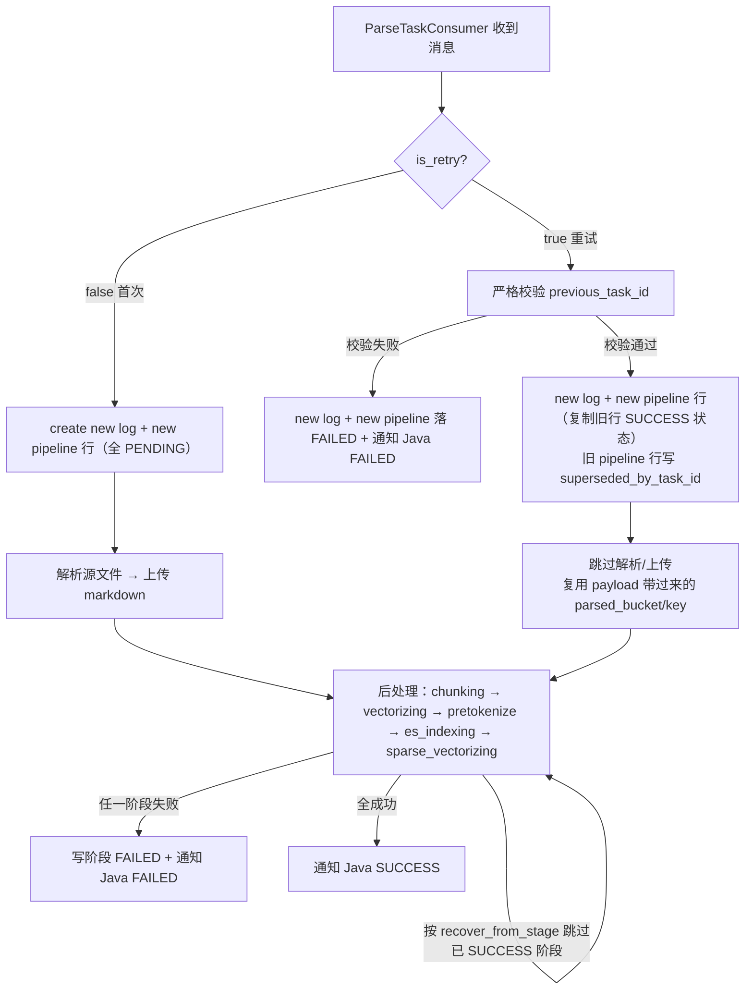

# 解析失败重试链路 + 稀疏向量阶段接入（Python 端） Brief

## 1. 需求摘要

- **做什么**：在 Python RAG 后端的解析主流水线 `ParseTaskPipeline` 内增加"重试分支"，当 Java 业务端针对一个旧解析任务发起重试时，按 MQ 消息携带的 `is_retry` + `previous_task_id` 跳过已成功阶段、从首个失败阶段恢复执行；同时把已有的稀疏向量底层能力接入主流水线，作为新的最后一个阶段（ES 索引之后）。
- **为什么做**：当前解析链路任一阶段失败即终态，仅记录 `recover_from_stage` 但没有任何"用户重试"触发路径（`claim_failed_for_retry` 预留未接线）。Java 端现已增加"判断首次/重试"逻辑，需要 Python 端配合，避免用户重试时整链路重跑，节省源文件下载、解析、向量化等高成本工作。稀疏向量底层（`src/core/sparse_vector/`、`vector_storage/management_pipeline.py`）已合并但仅服务于管理端重建路径，主解析流程尚未接入，本期一并完成，避免后续重试改造再动一次状态机契约。
- **本次不做**：
  - chunking 阶段内部批量落库 chunk 真值表 + dense 向量化逐 chunk 写入（Qdrant + MySQL 状态）的改造（在另一并行分支推进，本期不做但据其方向编写）。
  - Java 端预留的"修改解析方式"字段（Java 不传，Python 不解析）。
  - 重试次数上限控制（由 Java 端负责）。
  - 删除 `claim_failed_for_retry` 预留方法（独立 issue #42 跟进，不阻塞本期合并）。
- **本期同步推进的配套 issue #46（独立 PR 但语义在本 brief 中固化）**：
  - [#46 解析状态权威单源化与表结构清理](https://github.com/ql-link/LinkRag/issues/46)（由 Java/Python 团队联动推进）：
    - 删除 `document_parsed_log.task_status` 与 `document_parsed_log.failure_reason`
    - 删除 `document_post_process_pipeline.chunk_count` / `retry_count` / `last_retry_at`
    - 新增 `document_post_process_pipeline.parsing_status` 与 `parsing_duration_ms`
    - `document_post_process_pipeline` 表注释由"文件级解析后处理流程状态表"改为"**文件解析流程状态表**"（覆盖解析+后处理 6 阶段全状态机）
    - `pipeline_status` 成为整个解析任务状态的**唯一权威字段**，`log` 表只保留解析产物快照（parsed_*、parse_*_at 等）
    - 配套 Alembic migration 与 ORM 模型调整
  - 本 brief 后续章节按"该 issue 已完成 / 合并先行"为前提编写。

## 2. 业务流程

### 2.1 主流程图

### 2.2 流程详解

#### 入口分支判定（`ParseTaskPipeline.execute()` 头部）

消息载荷新增两个字段 `is_retry` 与 `previous_task_id`，进入 `execute` 后第一件事就是按 `is_retry` 分流：

- **`is_retry=false`**：完全沿用现状。`_create_log_record` 插入 `document_parsed_log`（依赖 `task_id` 唯一索引去重），创建对应 `document_post_process_pipeline` 行（所有 `*_status=PENDING`），进入正常解析链路。新增字段 `retry_of_task_id` 写 `NULL`。
- **`is_retry=true`**：进入"重试分支"，由 `ParseTaskGuard` 先做严格校验，校验通过才创建新 log + 新 pipeline 行；校验不过直接落 FAILED 并通知 Java。

#### 状态权威单源化（本期重大调整，配套 schema 清理 issue）

本期把整个解析任务的状态权威从"log + pipeline 双表对齐"统一收敛到 `document_post_process_pipeline` 一张表上：

- **`document_post_process_pipeline`** 升格为"**文件解析流程状态表**"，覆盖解析+后处理 6 个阶段（`parsing_status` / `chunking_status` / `vectorizing_status` / `pretokenize_status` / `es_indexing_status` / `sparse_vectorizing_status`）的完整状态机。`pipeline_status` 是整体任务终态的唯一权威。
- **`document_parsed_log`** 退化为"解析产物快照表"，仅保留 `parsed_bucket_name` / `parsed_object_key` / `parsed_at` / `parse_started_at` / `parse_finished_at` / `parse_duration_ms` / `trigger_mode` / `retry_of_task_id` 等解析阶段独有的产物与元数据。`task_status` 与 `failure_reason` 字段删除（由配套 issue #46 推进）。
- 外部读取规则：
  - "整体任务是否成功" → 读 `pipeline_status == SUCCESS`。
  - "上次 markdown 是否已上传" → 读 `log.parsed_object_key IS NOT NULL`。
  - "失败发生在哪个阶段" → 读 `pipeline.failed_stage`。
  - "失败原因" → 读 `pipeline.failure_reason`。

各阶段状态流转规则（与现状语义一致，仅新增 `parsing_status` 一列）：

| 时机 | `pipeline_status` | `failed_stage` | 备注 |
| :--- | :--- | :--- | :--- |
| log + pipeline 行刚插入 | `PENDING` | NULL | 行已建但 execute 尚未启动 |
| 进入 execute 后开始首个待执行阶段 | `PROCESSING` | NULL | **首次分支**：首个阶段是 parsing，编排层进入 `_parse_file` 前同事务把 `pipeline_status` 翻为 PROCESSING、`parsing_status` 翻为 PROCESSING。**重试分支**：首个待执行阶段为继承后 `*_status != SUCCESS` 的最早阶段（含可能的 parsing），编排层在调该阶段前同步翻转 |
| 解析+上传成功 | `PROCESSING`（保持，进入后处理）| NULL | `parsing_status=SUCCESS`，`parsing_duration_ms` 写入；log 表落 `parsed_*` 字段 |
| 解析阶段失败 | `FAILED` | `PARSING` | `parsing_status=FAILED`；log 表不写 failure_reason（字段已删） |
| 后处理任一阶段失败 | `FAILED` | 对应阶段名 | 该阶段 `*_status=FAILED` |
| sparse 阶段成功 | `SUCCESS` | NULL | 所有 6 阶段 `*_status=SUCCESS`；`finished_at` 与 `total_duration_ms` 写入 |
| 重试前置校验失败 | `FAILED` | `RETRY_VALIDATION` | 见下文"重试校验失败的落库形态" |

> `pipeline_status` 三态语义：`PENDING`=行已建未启动；`PROCESSING`=execute 已启动至少一个阶段；`SUCCESS`/`FAILED`=终态。
> 各阶段 `*_status` 也采用同三态语义（PENDING/PROCESSING/SUCCESS/FAILED），由各阶段 `mark_*_started`（新增）+ `mark_*_success`/`mark_*_failed` 同事务驱动。`mark_*_started` 同时把 `pipeline_status` 从 PENDING 翻为 PROCESSING（已是 PROCESSING 则 no-op）。

#### 重试前置校验（在 `ParseTaskGuard` 内扩展）

校验项与失败动作：

| 校验项 | 失败动作 |
| :--- | :--- |
| `previous_task_id` 非空 | 走"重试校验失败的落库形态"，落 FAILED + 通知 FAILED |
| 旧 log（按 `task_id=previous_task_id`）存在 | 同上 |
| 旧 log `parsed_object_key` 非空（即上次 markdown 已成功落 OSS） | 同上 |
| 旧 pipeline 行存在 | 同上 |
| 旧 pipeline `pipeline_status == "FAILED"`（曾经跑过且后处理失败；隐含排除 SUCCESS / PROCESSING） | 同上 |
| 旧 pipeline `recover_from_stage` 非空（即确实失败过） | 同上 |
| 旧 pipeline `superseded_by_task_id IS NULL`（未被其它并发重试占走，CAS 第 1 层快速失败） | 同上 |
| 消息 payload `parsed_bucket` / `parsed_object_key` 非空（重试必须由 Java 带过来） | 同上 |

校验通过则把旧 pipeline 行的所有阶段状态（`parsing_status`、`chunking_status`、`vectorizing_status`、`pretokenize_status`、`es_indexing_status`、`sparse_vectorizing_status`）一次性读出，用于新行的状态继承。

#### 重试校验失败的落库形态

校验未过的请求必须在 log + pipeline 都留下记录，但状态权威只在 pipeline：

- 新 `document_parsed_log`：`task_id=新ID`、`retry_of_task_id=previous_task_id`（即便校验失败也保留链路证据，便于审计追溯）、`trigger_mode` 等元数据从 payload 落；其它 `parsed_*` / `parse_*_at` 字段全部留空；本表不再有 `task_status` 与 `failure_reason` 字段。
- 新 `document_post_process_pipeline`：`task_id=新ID`、`pipeline_status=FAILED`（整体终态权威）、`failed_stage=RETRY_VALIDATION`、`failure_reason="RETRY_VALIDATION_FAILED:<具体校验项>"`、各阶段 `*_status=PENDING`（包括 `parsing_status`，语义上"未进入任一阶段"）、`started_at` 与 `finished_at` 都置当前时间（表示拒绝瞬间）、各 `*_duration_ms` 全空。
- 不更新任何旧表行（不修改旧 pipeline 的 `superseded_by_task_id`，因为旧任务并未被本次新任务"接班"）。
- `ParseResultNotifier` 通知 Java：`task_id=新ID`、`status=FAILED`。

#### 新 log + 新 pipeline 行创建（重试分支）

- 新 `document_parsed_log`：`task_id=new`，`retry_of_task_id=previous_task_id`，`parsed_bucket_name` / `parsed_object_key` / `parsed_at` 等字段从 payload 直接落，`parse_started_at` / `parse_finished_at` 留空（本次没真的解析）。本表已不含 `task_status` 字段，整体状态由 pipeline 行承载。
- 新 `document_post_process_pipeline`：
  - `task_id=new`、`document_parsed_log_id=新 log.id`。
  - 各 `*_status` 字段（含 `parsing_status`）从旧行复制：旧 SUCCESS → 继承 SUCCESS；旧非 SUCCESS（PENDING/FAILED）→ 重置为 PENDING。重试场景 `parsing_status` 通常继承为 SUCCESS（因为重试必然要求上次 markdown 已成功）。
  - `recover_from_stage` 重新计算（首个非 SUCCESS 阶段）。
  - `failed_stage` / `failure_reason` 清空。
  - `started_at=本次开始时间`，`finished_at` 留空。
  - 各阶段 `*_duration_ms` 字段（含 `parsing_duration_ms`）：继承的 SUCCESS 阶段保留旧 duration（代表上次实际花费），重置为 PENDING 的阶段清空，本次实际执行的阶段执行完再写本次 duration。
  - `pipeline_status=PROCESSING`。
- 旧 `document_post_process_pipeline`：UPDATE `superseded_by_task_id=新 task_id`，其他字段不动（FAILED 终态保留作为审计快照）。

#### 阶段跳过逻辑（`execute` 主体，6 个阶段统一处理）

执行到每个阶段（parsing / chunking / vectorizing / pretokenize / es / sparse）时，先查新 pipeline 行该阶段 `*_status`：
- `=SUCCESS` → 跳过实际执行，直接进入下一阶段。
- `=PENDING` → 调 `mark_*_started`（同事务把 pipeline_status 翻为 PROCESSING、本阶段 *_status 翻为 PROCESSING）→ 正常执行 → 成功后 `mark_*_success`、失败后 `mark_*_failed` + 通知 Java FAILED。

**统一机制覆盖 PARSING**：`_parse_file` + `_upload_markdown` 在 `execute` 中被同一套 `if parsing_status == SUCCESS: skip; continue` 判定包裹，与后处理 5 阶段对称。重试分支不再"硬跳"解析方法，而是通过继承到的 `parsing_status=SUCCESS` 自动跳过，逻辑一致性更好。

跳过的阶段不需要原阶段方法本身改造，跳过判定在 `execute` 编排层加分支即可。

#### 跳过阶段时下游所需数据从哪取（关键串联问题）

判断逻辑**集中在 `execute` 主链路**，下游阶段方法签名不动。下游始终消费内存 `list[Chunk]`，它在重试场景下由编排层从 DB 反查后塞进来。

- **首次解析**：执行完 `_run_chunking` 拿到 `chunks: list[Chunk]`，直接传给 `_store_chunk_vectors(chunks, payload, db)`。完全沿用现状。
- **重试解析**：`execute` 在进入后处理 try 块之前判断：若 `chunking_status` 继承为 SUCCESS（即跳过 chunking），由编排层主动调用 `_load_chunks_from_db(doc_id)`（新增辅助方法）按 `doc_id` 反查 chunk 表，组装成与 `_run_chunking` 等价语义的 `list[Chunk]` 内存对象，赋给同一个 `chunks` 变量；之后 `_store_chunk_vectors(chunks, ...)` 调用形态与首次完全一致。
- **反查谓词**：`vector_status IN (PENDING, FAILED)`（重试时只补做未完成的）；若 `chunking_status=SUCCESS` 但反查结果为空，视为状态不一致 → 落 FAILED + 通知 Java FAILED。
- **pretokenize / es / sparse**：本来就按 `doc_id + 对应状态` 反查（pretokenize 见 [preprocessor/service.py:99](src/core/preprocessor/service.py#L99)，es 消费 pretokenize 产出的内存 plan，sparse 新阶段同样按 `doc_id + sparse_vector_status` 反查 chunk 真值）。这三个阶段无论首次还是重试**都走 DB 反查**，不需要改造。
- **前置依赖说明（独立分支正在做）**：另一个并行分支正在拆分 chunking 与 dense 向量化的写库时机，方向是：
  - **chunking 方法内部完成分片后，批量落库 chunk 真值表**（chunk 文本 + 元数据 + `vector_status=PENDING`），不再延迟到 vectorizing 阶段开头的 `_insert_pending`。
  - **dense 向量化阶段遍历 chunk 列表，每生成一个 1024 维向量立即写 Qdrant + UPDATE 该 chunk `vector_status=INDEXED`**（逐 chunk 写入，不批量积累；理由：1024 维 × N chunk 的内存代价过高）。
  - 该分支未合并完，但**本期 brief 据其方向编写**：`_load_chunks_from_db` 反查的就是 chunking 阶段写下的 PENDING/FAILED 行；如果该分支本期未及时合并，回退路径与现状（vectorizing 自己写 `_insert_pending`）也兼容，`_load_chunks_from_db` 语义不变。

#### dense 向量化阶段的失败与重试语义（重点）

由于 dense 是逐 chunk 写入而非批量原子，**DB 必然出现 chunk 级混合态**。本期处理规则严格如下：

- **首次流程的失败行为**：dense 阶段遍历 chunk 时，**任一 chunk 生成向量或写 Qdrant/MySQL 失败 → 立即终止本次执行**（不再继续处理后续 chunk），写 `vectorizing_status=FAILED`、`pipeline_status=FAILED`、`failed_stage=VECTORIZING`、`recover_from_stage=VECTORIZING`、`failure_reason=VECTORIZING_FAILED:<原因>`，通知 Java FAILED 整体终止流水线，不进入 pretokenize / es / sparse 阶段。
- **DB 残留状态**：失败终止时，已成功的 chunk 保留 `vector_status=INDEXED`，未跑到的 chunk 保留 `vector_status=PENDING`，触发失败的那一个 chunk 标 `vector_status=FAILED`。这种混合态是预期的、合规的。
- **重试流程的补做语义**：重试进入 vectorizing 阶段时，`_load_chunks_from_db` 严格用 `vector_status IN (PENDING, FAILED)` 反查 —— **只补做未完成 chunk，不重做已 INDEXED 的**。处理完这批后再判定：若反查结果全部 INDEXED 才视为本阶段 SUCCESS，进入 pretokenize；任一 chunk 仍失败 → 同首次失败路径处理（再次终止 + 通知 FAILED）。
- **用户视角的"all-or-nothing"**：从 Java/用户视角看，向量化阶段仍是"全部成功才算成功，否则失败" —— 通知层面文件级 all-or-nothing；DB 层面是 chunk 级断点续传，重试不重做已成功部分（避免 1024 维向量重复生成的成本）。这是**文件级失败语义 + chunk 级补做语义**的组合，不是物理批量原子。

**好处**：vectorizing/pretokenize/es/sparse 各模块对"是否重试"完全无感，所有重试相关编排集中在 `ParseTaskPipeline.execute`，便于测试与维护。

#### 稀疏向量阶段（新增最后一段）

- 在 `_run_es_indexing` 成功并 `mark_es_success` 之后、`_send_parse_result success` 之前插入。
- 编排方法 `_run_sparse_vectorizing`：按 `doc_id` 反查 `sparse_vector_status IN (PENDING, FAILED)` 且 `vector_status=INDEXED`、`es_status=SUCCESS` 的 chunk，文件级 all-or-nothing 批量调用 `SparseVectorService` 生成稀疏向量并 upsert 到 Qdrant（复用 `management_pipeline.py` 已有的 `ensure_sparse_vector_schema` / `upsert_sparse_vectors` 路径，但要从"管理端单 chunk 重建"语义改/抽取为"文件级批量"）。
- 任一 chunk 处理失败 → 整体失败：触发失败的 chunk `sparse_vector_status=FAILED`（保留失败痕迹便于审计）；文件级 `sparse_vectorizing_status=FAILED`、`pipeline_status=FAILED`、`failed_stage=SPARSE_VECTORIZING`、`recover_from_stage=SPARSE_VECTORIZING`、通知 Java FAILED。重试时按 `sparse_vector_status IN (PENDING, FAILED)` 反查只补做未完成 chunk。
- 成功 → `sparse_vectorizing_status=SUCCESS`、`pipeline_status=SUCCESS`、`finished_at`、`total_duration_ms`、通知 Java SUCCESS。
- 阶段失败码新增 `SPARSE_VECTORIZING_FAILED`（与 `VECTORIZING_FAILED` 平级）。

#### 通知 Java（`ParseResultNotifier`）

不变：通知体只带 `task_id=新 task_id` 与 SUCCESS/FAILED；不需要回带 `previous_task_id` 或 `retry_of_task_id`，Java 自有映射。

## 3. 核心模块与实现思路

### 3.1 MQ 消息契约（`src/core/mq/messages/parse_task.py`）

- **位置**：现有 `ParseTaskPayload`。
- **职责**：承载 Java 端解析请求，新增重试相关字段。
- **实现思路**：
  - 新增 `is_retry: bool = False`（默认 False 保持向后兼容）。
  - 新增 `previous_task_id: Optional[str] = None`。
  - 同步更新 `ParseTaskMessage.build()` 工厂方法签名。
  - `parsed_bucket` / `parsed_object_key` 实际上等价于 payload 已有的 `md_bucket` / `md_object_key`（解析产物的对象存储坐标）—— 复用现有字段，**不新增**。重试时 Java 把上次解析产生的 `md_bucket/key` 原样填回即可。
- **关键决策**：字段默认值保证非重试老消息可正常反序列化；`is_retry` 设为必显式 `true` 才走重试分支，避免误触发。

### 3.2 数据库 schema 变更（`src/models/parse_task.py` + Alembic migration）

- **位置**：`DocumentParsedLog`、`DocumentPostProcessPipeline` ORM；新增 `migrations/versions/00XX_*.py`。
- **职责**：承载新字段、删除废弃字段、扩充阶段状态列，落实状态权威单源化（详见 1.本次同步推进 issue）。
- **实现思路**：
  - `DocumentParsedLog`：
    - 新增 `retry_of_task_id: VARCHAR(36) NULL`（带索引 `idx_parsed_log_retry_of`，方便审计反查）。
    - **删除** `task_status` 字段（含相关索引 `idx_parsed_log_original_status` 与 `idx_parsed_log_parse_task_status` 里的 `task_status` 引用，索引同步重建或调整）。
    - **删除** `failure_reason` 字段（失败原因唯一权威迁移到 pipeline 表）。
    - 表注释同步更新为"文件解析产物快照表"。
  - `DocumentPostProcessPipeline`：
    - 新增 `parsing_status: VARCHAR(20) NOT NULL DEFAULT 'PENDING'` 与 `parsing_duration_ms: BIGINT NULL`（覆盖解析+上传阶段）。
    - 新增 `sparse_vectorizing_status: VARCHAR(20) NOT NULL DEFAULT 'PENDING'` 与 `sparse_vectorizing_duration_ms: BIGINT NULL`。
    - 新增 `superseded_by_task_id: VARCHAR(36) NULL`（带索引 `idx_post_pipeline_superseded`）。
    - **删除** `chunk_count`（chunk 真值表本身就是 source of truth）。
    - **删除** `retry_count` 与 `last_retry_at`（重试由 Java 端负责，重试链通过 `retry_of_task_id` / `superseded_by_task_id` 追溯）。同步删除 `idx_post_pipeline_retry` 复合索引里的 `retry_count` 引用，索引名/字段重建。
    - `failed_stage` 字段值域扩充：新增 `PARSING` / `RETRY_VALIDATION` / `SPARSE_VECTORIZING`，与现有 `CHUNKING` / `VECTORIZING` / `PRETOKENIZE` / `ES_INDEXING` 并列。字段类型不变。
    - 表注释由"文件级解析后处理流程状态表"改为"**文件解析流程状态表**"（覆盖解析+后处理 6 阶段全状态机）。
    - `pipeline_status` 升格为整体任务状态的唯一权威字段。
  - 修改 `docs/reference/mysql_schema.md` 与 [parse_task_pipeline_module.md](docs/architecture/parse_task_pipeline_module.md) 同步反映：明确 Java 侧不再读 `log.task_status`，整体终态读 `pipeline.pipeline_status`；markdown 是否上传读 `log.parsed_object_key IS NOT NULL`；失败原因读 `pipeline.failure_reason`。
- **关键决策**：`superseded_by_task_id` 与 `retry_of_task_id` 用 nullable 字符串（与 `task_id` 字段同型），**不做外键约束**（保持与现有表无外键的一致风格，跨任务追溯靠应用层查询）。状态权威收敛到 pipeline 一张表后，外部读取一律以 pipeline 为准，log 表仅承担产物快照职责。

### 3.3 解析主编排（`src/core/pipeline/parse_task/pipeline.py`）

- **位置**：`ParseTaskPipeline.execute` 与各阶段方法。
- **职责**：入口分支、跳阶段执行、稀疏阶段编排。
- **实现思路**：
  - `execute` 开头读 `payload.is_retry`，true → 走 `_handle_retry_branch` 子路径（新增方法）：调用 `ParseTaskGuard.validate_retry_context()` → `_log_repository.create_for_retry()`（新增）→ `_post_process_repository.create_with_inherited_state()`（新增，详见 3.5）→ 更新旧 pipeline `superseded_by_task_id` → 跳过 `_parse_file` / `_upload_markdown` 直接进入后处理 try 块。
  - 后处理 try 块在每个阶段调用前增加 `if pipeline_record.<stage>_status == SUCCESS: skip; continue`。
  - vectorizing/pretokenize/es/sparse 各阶段方法签名一律不动；`execute` 主链路在重试且 chunking 被跳过时，调用新增辅助方法 `_load_chunks_from_db(doc_id, db) -> list[Chunk]` 把 chunk 真值表的 PENDING/FAILED 行组装成内存 list，赋给原 `chunks` 变量，下游照常消费。
  - 新增 `_run_sparse_vectorizing(payload, pipeline_record, db)`，结构对齐 `_run_pretokenize` / `_run_es_indexing`：成功 mark + 继续，失败 mark + 通知 + return FAILED。
  - `_infer_recover_stage` 阶段序列扩为 `CHUNKING → VECTORIZING → PRETOKENIZE → ES_INDEXING → SPARSE_VECTORIZING`，新增 `SPARSE_VECTORIZING` 阶段枚举（[constants.py](src/core/pipeline/parse_task/post_process/constants.py)）。
- **关键决策**：
  - 跳阶段判定写在编排层，不下沉到各阶段方法内部 —— 各阶段方法保持"被调即执行"的简单语义，便于测试。
  - 重试分支与首次分支共享同一段后处理 try 块代码，仅在前置阶段（创建 log/pipeline 行 + 解析/上传）有差异。

### 3.4 重试前置校验（`src/core/pipeline/parse_task/validator.py`）

- **位置**：`ParseTaskGuard` 类。
- **职责**：重试场景的严格校验。
- **实现思路**：新增 `validate_retry_context(payload, db) -> tuple[OldLog, OldPipeline] | RetryValidationError`，覆盖第 2.2 节列出的全部校验项；返回旧 log + 旧 pipeline 行供编排层继承状态使用。
- **关键决策**：校验失败统一抛 `RetryValidationError`（新增异常），由 `execute` 捕获后走"新 log 落 FAILED + 通知 FAILED"统一路径；不在 guard 内部直接写库或发通知，保持职责单一。

### 3.5 仓储扩展（`log_repository.py` + `post_process/repository.py`）

- **位置**：`ParseLogRepository`、`PostProcessPipelineRepository`。
- **职责**：支持重试场景的新建与继承。
- **实现思路**：
  - `ParseLogRepository.create_for_retry(payload, parsed_bucket, parsed_object_key, retry_of_task_id, db) -> DocumentParsedLog`：新 log 写入 markdown 坐标与 `retry_of_task_id`，`parse_started_at`/`parse_finished_at` 留空。本 log 行不再承载状态字段。
  - `ParseLogRepository.mark_parsed(payload, log_record, db)`：写 `parsed_bucket_name`/`parsed_object_key`/`parsed_at`/`parse_finished_at`/`parse_duration_ms`，不动状态字段。
  - `ParseLogRepository.mark_success` / `mark_failed` 方法**整体废弃**（task_status 已删除），原调用点改为只写 `PostProcessPipelineRepository` 的 pipeline 状态翻转。
  - 新增 `ParseLogRepository.create_failed_for_retry_validation(payload, previous_task_id, db) -> DocumentParsedLog`：仅写 `retry_of_task_id` 与基础元数据；配套 `PostProcessPipelineRepository.create_failed_for_retry_validation(new_log_id, failure_reason, db)` 落 `pipeline_status=FAILED`、`failed_stage=RETRY_VALIDATION`、`failure_reason="RETRY_VALIDATION_FAILED:..."`、各阶段 `*_status=PENDING`、`started_at`=`finished_at`=now。
  - `PostProcessPipelineRepository.create_with_inherited_state(old_pipeline, new_log_id, db) -> DocumentPostProcessPipeline`：按 3.2 描述复制 6 个 `*_status`（含 `parsing_status`）的 SUCCESS 状态、PENDING 化失败阶段、清空 failure 字段、计算新 `recover_from_stage`、保留 SUCCESS 阶段的 `*_duration_ms`（含 `parsing_duration_ms`）。
  - `PostProcessPipelineRepository.mark_superseded(old_pipeline, new_task_id, db)`：UPDATE 旧行 `superseded_by_task_id` 时 WHERE 子句必须带 `superseded_by_task_id IS NULL`（CAS 第 2 层兜底），返回 rowcount；编排层据 rowcount=0 判定并发冲突走"重试校验失败"路径。
  - 新增 `mark_parsing_success` / `mark_parsing_failed` 编排首次分支解析阶段的状态翻转，与 chunking/dense/sparse 等其他阶段对称：失败时同事务写 `parsing_status=FAILED`、`pipeline_status=FAILED`、`failed_stage=PARSING`、`failure_reason="PARSING_FAILED:..."`。
  - 新增 `mark_sparse_vectorizing_success` / `mark_sparse_vectorizing_failed` 与 dense 对应方法对称。
  - `claim_failed_for_retry` 方法删除由独立 issue #42 处理，不在本期 brief 范围。
- **关键决策**：所有状态翻转集中在 `PostProcessPipelineRepository`，`ParseLogRepository` 退化为纯产物写入；外部读取整体任务状态一律通过 pipeline 行；这是配套 issue #46 的实现侧落点。

### 3.6 稀疏向量阶段接入（`src/core/sparse_vector/indexing.py`）

- **位置**：`src/core/sparse_vector/indexing.py` 新增 `SparseIndexingPipeline` 类。底层稀疏向量能力（`SparseVectorService` 等）保留在 `src/core/sparse_vector/` 现有模块；新增的类承担"主流水线阶段编排"职责，与底层能力同包，对应 `EsIndexingPipeline` 在 ES 链路里的角色。
- **职责**：文件级 all-or-nothing 批量构建稀疏向量并写 Qdrant。
- **实现思路**：
  - 输入：`doc_id`、`bucket_id`、（可选 `task_id` 用于日志）。
  - **前置数据健康性校验**（进入实际处理前先做）：
    - 按 `doc_id` 查 chunk 表总行数。若 `chunk_count == 0` → 视为状态严重不一致，抛文件级异常，落 FAILED + 通知 Java。
    - 按 `doc_id + sparse_vector_status IN (PENDING, FAILED)` 反查待处理 chunk。若反查结果为空且总行数 > 0（全部已 INDEXED）→ 直接判 SUCCESS，不执行实际处理。
    - （可选更严格）反查到的 chunk 若 `vector_status != INDEXED` → 状态不一致，落 FAILED。
  - **主流程**：按 `doc_id` 查待处理 chunk → 批量调 `SparseVectorService.vectorize(chunk_texts)` 拿稀疏向量 → 调 `qdrant_store.ensure_sparse_vector_schema` → 批量 `upsert_sparse_vectors` → 批量 UPDATE chunk `sparse_vector_status=INDEXED`。
  - **失败处理**：任一步骤失败 → 触发失败的 chunk 标 `sparse_vector_status=FAILED`（保留失败痕迹便于审计），抛文件级异常，由 `_run_sparse_vectorizing` 统一 mark FAILED + 通知 Java。重试时按 `sparse_vector_status IN (PENDING, FAILED)` 反查只补做未完成 chunk。
  - 复用 `management_pipeline.py` 已有的 sparse 工具函数（`sparse_indexed_point_from_record`、`_mark_sparse_*`），但跳过管理端的"单 chunk 串行"路径，改为文件级批量。
- **关键决策**：与 dense 当前"逐 chunk 写"实现不同，sparse 一开始就做文件级批量调用 —— 稀疏向量本身维度不固定（取决于词典 nonzero 数量）但远比 dense 1024 维节省内存，批量在内存里聚合可承受；如果 `SparseVectorService` 模型 API 单次 batch 上限受限，内部分批但仍保持文件级 all-or-nothing 语义。

### 3.7 错误码与状态枚举（`error_codes.py` + `post_process/constants.py`）

- 新增 `ParseFailureCode.SPARSE_VECTORIZING_FAILED`。
- 新增 `ParseFailureCode.RETRY_VALIDATION_FAILED`（用于重试前置校验失败的 `failure_reason` 前缀；编排层格式化为 `"RETRY_VALIDATION_FAILED:<具体校验项>"` 写入 pipeline）。
- 新增 `ParseFailureCode.PARSING_FAILED`（用于解析阶段失败的 `failure_reason` 前缀，写入 pipeline）。
- 新增 `STAGE_PARSING`、`STAGE_SPARSE_VECTORIZING`、`STAGE_RETRY_VALIDATION` 枚举（用于 `failed_stage`；`recover_from_stage` 不引用 `PARSING` 与 `RETRY_VALIDATION`：前者解析失败本期不支持重试跳阶段恢复，后者校验失败没有"恢复"语义）。
- 同步更新 [docs/reference/error_codes.md](docs/reference/error_codes.md) 与 [parse_task_pipeline_module.md](docs/architecture/parse_task_pipeline_module.md)。

### 3.8 测试覆盖

- `tests/unit/core/pipeline/test_parse_task_pipeline.py`：增加首次/重试两套用例；重试覆盖"校验失败 → pipeline 落 FAILED + failed_stage=RETRY_VALIDATION"、"解析阶段失败 → pipeline failed_stage=PARSING + parsing_status=FAILED"、"重试跳过 chunking"、"重试从 sparse 起步"、"重试时旧 pipeline 被 superseded（CAS rowcount=1）"、"并发重试第二次 mark_superseded rowcount=0 走校验失败路径"、"pipeline_status 仅在全 6 阶段 SUCCESS 后才置 SUCCESS"。
- 新增 `test_parse_task_pipeline_sparse.py`：sparse 阶段成功/失败/跳过/全 INDEXED 短路/chunk 总数 0 不一致。
- `tests/unit/core/pipeline/test_post_process_repository.py`：`create_with_inherited_state` 各种状态组合、`mark_superseded` CAS 行为、`create_failed_for_retry_validation` 双表落库。
- `tests/unit/core/pipeline/test_validator.py`：`validate_retry_context` 各校验失败路径（含 CAS 第 1 层快速失败）。
- `tests/integration/core/mq/test_kafka_parse_task_pipeline_integration.py`：端到端重试链路（含 Java 视角的 superseded 链）。

## 4. 风险与不确定性

| 风险 / 问题 | 触发条件 | 影响 | 当前判断 / 应对方向 |
| :--- | :--- | :--- | :--- |
| `_load_chunks_from_db` 反查结果为空（状态不一致） | `chunking_status=SUCCESS` 但 chunk 表对应 doc_id 行已被外部清理或写库时机错位 | vectorizing 入参为空，无法重试 | `_load_chunks_from_db` 入口显式校验：反查结果至少 1 行（`chunk_count` 字段本期删除，不再做"DB 行数 vs 字段值"比对，直接以 chunk 真值表行数为准），否则视为状态不一致 → 直接落 FAILED + 通知 Java FAILED，不静默通过 |
| `_load_chunks_from_db` 组装 Chunk 对象与 chunking 阶段产出的 Chunk 字段不完全等价 | chunk 表存的是真值快照，可能缺少 chunking 阶段内存对象的某些瞬态字段（如 `parse_result` 引用） | vectorizing 行为偏离 | 实现前先核对 `Chunk` 类型定义与 vectorizing 实际消费的字段，确保 DB 反查能补齐；缺字段就显式 `None` 并在 vectorizing 内部容错 |
| 跳过阶段后下游数据完整性假设破裂 | 用户在跳过 chunking 的重试场景里，doc_id 对应的旧 chunk 已被某些清理动作删除（如手动删文件） | vectorizing 反查不到 chunk，导致空跑通过 | 在每个跳阶段执行前增加"前置数据存在性校验"：vectorizing/pretokenize/es/sparse 启动前 chunk 行计数为 0 → 视为状态不一致，落 FAILED 并通知 |
| 旧 pipeline 行 `superseded_by_task_id` 与新 log `retry_of_task_id` 双向链可能错乱 | 并发场景：同一 previous_task_id 被两次重试并发触发 | 旧 pipeline 行可能被覆盖一次，但新 log 都成功创建 → 出现"两个新 task 指向同一旧 task" | **两层 CAS 都保留**：第 1 层 `ParseTaskGuard.validate_retry_context` SELECT 校验"旧 pipeline `superseded_by_task_id IS NULL`"用于快速失败（不依赖此层正确性，仅做体验优化）；第 2 层 `PostProcessPipelineRepository.mark_superseded` UPDATE 子句带 `WHERE superseded_by_task_id IS NULL` 并检查 rowcount=1，rowcount=0 走"重试校验失败的落库形态"路径。两层关系：第 1 层 read-only 不持锁存在 TOCTOU 窗口，第 2 层是真正的原子保证 |
| 稀疏向量模型 API 单次 batch 上限超限 | 单文档 chunk 数过多 | 一次性批量调用 OOM 或 API 拒绝 | sparse 阶段内部按固定大小分批调用 `SparseVectorService`（具体批大小由 technical_design 阶段结合模型/显存确定，本 brief 不锁死数值）；文件级仍 all-or-nothing：任一批失败即整体 FAILED，已成功批次的 chunk 保留 `sparse_vector_status=INDEXED` 供重试时复用 |
| 删除 `log.task_status` / `log.failure_reason` / `pipeline.chunk_count` / `retry_count` / `last_retry_at` 对外部消费方的影响 | 任何代码（含 Java 端 / 管理端 / 监控大盘 / 历史脚本）还在读这五列 | 外部读会报字段不存在；Java 端原依赖 `task_status` 判定首次/重试的逻辑会失效 | 配套 issue #46 提交前：①Python 仓库 grep 这五个字段全局确认无残留引用；②与 Java 团队同步并先行修订 Java DAO 与判定逻辑（改读 `pipeline_status` / `parsed_object_key` / `pipeline.failure_reason`）；③migration 写 down 路径回滚字段；④文档（mysql_schema.md / api_contracts.md / parse_task_pipeline_module.md）同步更新 |
| 状态权威由 log 迁移到 pipeline 后，新旧代码并存窗口可能出现读不一致 | 配套 issue #46 与本期 brief 实现分两次部署 | 中间窗口部分实例读旧字段，部分实例读 pipeline，判定结果偏离 | 配套 issue #46 必须**先于**本 brief 实现合入并完成数据迁移；本 brief 实现 PR 在 CI 上强制依赖配套 issue #46 的 migration 已 stamp |
| 旧 `init.sql` 是 0001 baseline 冻结快照，本次 schema 改动一律走 Alembic | 误改 init.sql 触发 CI fail | 阻塞合入 | 严格按 [CLAUDE.md](CLAUDE.md) 第五节规则，只动 ORM + 写 migration，不动 init.sql |
| 首次/重试两个分支共享后处理 try 块导致编排可读性下降 | execute 方法体进一步变长 | 维护成本上升 | 把"跳阶段判定 + 阶段执行"抽成独立辅助方法（如 `_execute_stage_if_pending`），保持 try 块结构清晰 |

