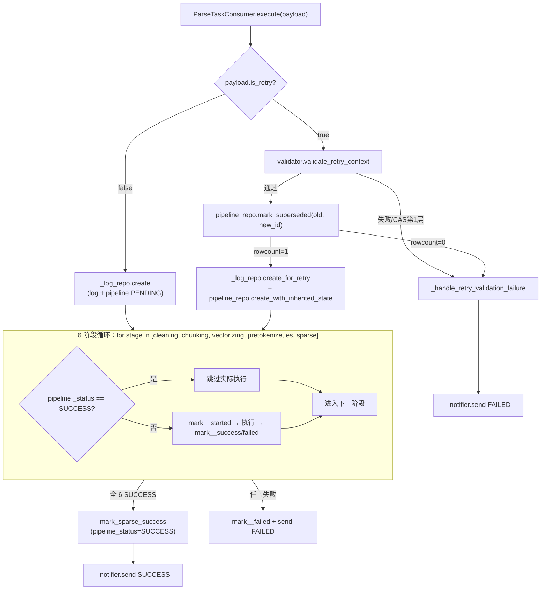

# 解析失败重试链路 + 稀疏向量阶段接入（Python 端）技术设计

- **文档状态：** 技术方案已冻结（2026-05-26）
- **项目名称：** toLink-Rag
- **业务域：** 文档解析流水线
- **需求名称：** parse-retry-and-sparse-vector-py
- **业务输入：** [brief.md](./brief.md)（v3 已冻结 2026-05-26）
- **验收输入：** [acceptance.feature](./acceptance.feature)（v3 已冻结 2026-05-26，22 Scenario）
- **输出文件：** [technical_design.md](./technical_design.md)
- **最后更新时间：** 2026-05-26

---

## 1. 文档修订记录

| 版本 | 日期 | 内容 | 来源 | 状态 |
| :--- | :--- | :--- | :--- | :--- |
| v1.0 | 2026-05-26 | 初始技术设计 | brief.md v3 + acceptance.feature v3 | 已冻结 |

---

## 2. 输入依据与设计目标

### 2.1 输入依据映射

| 输入来源 | 关键结论 | 技术设计承接方式 |
| :--- | :--- | :--- |
| `brief.md` 第 1 节 | 在 `ParseTaskPipeline` 入口按 `is_retry` 分流；稀疏向量化作为新最后阶段 | `execute` 头部加 `_handle_retry_branch`；新增 `_run_sparse_vectorizing` |
| `brief.md` 第 2.2 节 | `pipeline_status` 单源；6 阶段统一 `*_status==SUCCESS` 跳过判定；`mark_*_started` 翻 PROCESSING | repository 新增 6 个 `mark_*_started`；`execute` 主链路按阶段循环执行 |
| `brief.md` 第 2.2 节 | 重试前置 8 项校验；分支顺序 validate → mark_superseded CAS → create new rows | `validator.validate_retry_context`；`mark_superseded` CAS UPDATE rowcount 兜底 |
| `brief.md` 第 3.6 节 | sparse 文件级 all-or-nothing，复用 sparse_vector 底层 | 新增 `SparseIndexingPipeline` 类编排 |
| `acceptance.feature` 22 Scenario | 状态翻转 / 跳阶段 / CAS 仲裁 / 重试补做 / 健康性校验 | 每个 Scenario 对应至少一个被测方法（详见 §10.2） |

### 2.2 设计目标

- 在不破坏现有首次解析流程的前提下，引入完整重试分支（含双层 CAS）
- 6 阶段（PARSING/CHUNKING/VECTORIZING/PRETOKENIZE/ES_INDEXING/SPARSE_VECTORIZING）的状态翻转、跳过、失败处理在编排层统一封装
- 稀疏向量阶段以文件级 all-or-nothing 接入，复用现有 `sparse_vector` 底层模块
- 整体任务状态权威单源化到 `document_parse_pipeline.pipeline_status`

### 2.3 命名一致性说明（重要）

| brief / acceptance 用语 | 代码侧实际名 | 说明 |
| :--- | :--- | :--- |
| `parsing_status` / `parsing_duration_ms` | `cleaning_status` / `cleaning_duration_ms` | 配套 issue #46（migration 0007）落地时选用了 `cleaning` 词根；本 TD 与代码保持一致，相关 Scenario 实现时映射读 |
| `document_post_process_pipeline` | `document_parse_pipeline` | issue #46 已在 0007 中 rename 完成 |
| `PostProcessPipelineRepository` | `ParsePipelineRepository`（旧名为别名） | repository.py 末尾保留 `PostProcessPipelineRepository = ParsePipelineRepository` |
| `STAGE_PARSING` | `POST_PROCESS_STAGE_CLEANING` | 已存在 |
| `mark_parsing_started/success/failed` | `mark_cleaning_started/success/failed` | 已存在（need to align 命名约定） |

后续 TD 文本统一用 **代码实际名**（`cleaning_*`），acceptance Scenario 中的 `parsing_*` 在测试装配/断言层做术语映射；对外文档（如 `parse_task_pipeline_module.md`）补充术语对照表。

> 术语统一（`cleaning_* → parsing_*` 全量重命名）由独立 issue [#48](https://github.com/ql-link/LinkRag/issues/48) 跟踪，本期主 PR 合入后再启动，避免与本期活跃改动冲突。

---

## 3. 改动范围

### 3.1 改动文件目录树

```text
toLink-Rag/
├── src/
│   ├── core/
│   │   ├── mq/messages/
│   │   │   └── parse_task.py                                    # [修改] ParseTaskPayload 新增 is_retry / previous_task_id
│   │   ├── pipeline/parse_task/
│   │   │   ├── pipeline.py                                      # [修改] execute 重写为 6 阶段统一编排 + 重试分支
│   │   │   ├── validator.py                                     # [修改] 新增 validate_retry_context；新增 RetryValidationError
│   │   │   ├── log_repository.py                                # [修改] 新增 create_for_retry / create_failed_for_retry_validation
│   │   │   ├── error_codes.py                                   # [修改] 新增 PARSING_FAILED / SPARSE_VECTORIZING_FAILED / RETRY_VALIDATION_FAILED
│   │   │   └── post_process/
│   │   │       ├── constants.py                                 # [修改] 新增 STAGE_SPARSE_VECTORIZING / STAGE_RETRY_VALIDATION；PIPELINE_STATUS_PROCESSING 已存在
│   │   │       └── repository.py                                # [修改] 6 个 mark_*_started + sparse 系列方法 + mark_superseded + create_with_inherited_state + create_failed_for_retry_validation
│   │   └── sparse_vector/
│   │       └── indexing.py                                      # [新增] SparseIndexingPipeline 文件级 all-or-nothing 编排
│   └── models/
│       └── parse_task.py                                        # [修改] log 新增 retry_of_task_id；pipeline 新增 sparse_vectorizing_status/_duration_ms / superseded_by_task_id
├── migrations/versions/
│   └── 0009_20260527_add_retry_link_and_sparse_stage.py         # [新增] 增字段 + 索引
├── tests/
│   ├── unit/core/pipeline/
│   │   ├── test_parse_task_pipeline.py                          # [测试修改] 6 阶段统一跳过 + 重试分支 + CAS
│   │   ├── test_parse_task_pipeline_sparse.py                   # [测试新增] sparse 阶段 4 Scenario
│   │   ├── test_validator.py                                    # [测试修改] validate_retry_context 9 路径
│   │   └── test_parse_pipeline_repository.py                    # [测试修改] mark_*_started / mark_superseded / create_with_inherited_state / create_failed_for_retry_validation
│   └── integration/core/mq/
│       └── test_kafka_parse_task_pipeline_integration.py        # [测试修改] 端到端重试链路（superseded 链）
├── docs/
│   ├── architecture/parse_task_pipeline_module.md               # [修改] 6 阶段状态机、重试分支流程、术语对照表
│   ├── reference/mysql_schema.md                                # [修改] 字段增删
│   └── reference/error_codes.md                                 # [修改] 新增错误码
└── scripts/db/init.sql                                          # [不改] 0001 baseline 冻结
```

### 3.2 文件级改动说明

| 文件 | 动作 | 改动目的 | 必须 |
| :--- | :--- | :--- | :--- |
| `pipeline.py` | 修改 | execute 改造为 6 阶段统一跳过判定 + 加重试分支 | ✅ |
| `validator.py` | 修改 | 新增 `validate_retry_context` + 异常类 | ✅ |
| `post_process/repository.py` | 修改 | `mark_*_started` × 6、sparse 系列、`mark_superseded`、`create_with_inherited_state`、`create_failed_for_retry_validation` | ✅ |
| `log_repository.py` | 修改 | `create_for_retry` + `create_failed_for_retry_validation` | ✅ |
| `sparse_vector/indexing.py` | 新增 | 文件级 all-or-nothing 编排，复用底层 `SparseVectorService` + Qdrant 写入 | ✅ |
| `models/parse_task.py` | 修改 | 新增 3 列：`log.retry_of_task_id`、`pipeline.sparse_vectorizing_status`、`pipeline.sparse_vectorizing_duration_ms`、`pipeline.superseded_by_task_id` | ✅ |
| `migrations/versions/0008_*.py` | 新增 | DDL 增字段 + 索引（`idx_parsed_log_retry_of` / `idx_parse_pipeline_superseded`） | ✅ |
| `core/mq/messages/parse_task.py` | 修改 | payload 新增字段 | ✅ |
| `error_codes.py` / `post_process/constants.py` | 修改 | 错误码与阶段枚举扩充 | ✅ |
| `parse_task_pipeline_module.md` / `mysql_schema.md` / `error_codes.md` | 修改 | doc-sync 强制 | ✅ |
| `scripts/db/init.sql` | 不改 | 0001 baseline 冻结快照 | ✅ |

---

## 4. 当前系统分析

| 类型 | 文件/类/方法 | 当前行为 | 复用点 / 缺口 |
| :--- | :--- | :--- | :--- |
| 编排 | `ParseTaskPipeline._run` (pipeline.py L119-484) | 单分支顺序执行 5 阶段（cleaning→chunking→vectorizing→pretokenize→es）；失败即抛 + 通知 | **缺**：6 阶段统一跳过判定、重试分支、sparse 阶段、`mark_*_started` 调用 |
| 校验 | `ParseTaskGuard.validate` / `handle_duplicate` | 现有 validate 仅校验消息一致性；handle_duplicate 处理 MQ 重投 | **缺**：`validate_retry_context` 重试 8 项校验 + `RetryValidationError` |
| Repo | `ParsePipelineRepository` (post_process/repository.py) | 已有 `mark_cleaning_started` + `mark_<stage>_success/failed` × 5；`mark_post_cleaning` 兼容存在 | **缺**：剩余 4 个 `mark_*_started`、sparse 系列、`mark_superseded`、`create_with_inherited_state`、`create_failed_for_retry_validation` |
| Repo | `ParseLogRepository.create` | 同事务建 log + pipeline 行，task_id 唯一键去重 | **复用**；**缺** `create_for_retry` / `create_failed_for_retry_validation` |
| Model | `DocumentParsePipeline` | 5 阶段 `*_status` 已就位（cleaning/chunking/vectorizing/pretokenize/es_indexing），无 sparse 列、无 superseded 列 | **缺**：3 列待加（见 §3.1） |
| Model | `DocumentParsedLog` | task_status / failure_reason 已删除（issue #46 migration 0007）；无 retry_of_task_id | **缺**：1 列待加 |
| MQ | `ParseTaskPayload` | 现有 trigger_mode / md_bucket / md_object_key 等字段；无 is_retry / previous_task_id | **缺**：2 字段 |
| 稀疏 | `src/core/sparse_vector/` 已有 encoder/factory/pipeline/exceptions | 现仅服务于管理端 single-chunk 重建路径 | **复用底层能力**（encoder + Qdrant 写入）；**缺** 文件级 all-or-nothing 编排类 |
| Migration | 0007 已落地 issue #46 大部分 | 字段删除 + 表 rename + cleaning_status 引入 | 本期 0008 只补本 brief 新增字段 |

---

## 5. 总体方案设计

### 5.1 总体流程



### 5.2 模块边界

| 模块 | 职责 | 本次改动 |
| :--- | :--- | :--- |
| `ParseTaskPipeline` | 6 阶段编排 + 重试分支入口 | ✅ 主体重写 execute |
| `ParseTaskGuard` | 重试前置校验 | ✅ 新增 `validate_retry_context` |
| `ParseLogRepository` | log 行 CRUD（产物快照） | ✅ 新增 2 个 create 方法 |
| `ParsePipelineRepository` | pipeline 状态翻转（单源） | ✅ 新增 6 个 mark_started + sparse + superseded + 2 create |
| `SparseIndexingPipeline`（新） | sparse 阶段文件级编排 | ✅ 新建 |
| `sparse_vector/*`（底层） | encoder + Qdrant 写入 | ❌ 不改，仅复用 |
| `ParseResultNotifier` | 通知 Java | ❌ 不改 |

---

## 6. API、消息与数据设计

### 6.1 API 设计

无对外 HTTP API 改动。

### 6.2 MQ 消息设计

`ParseTaskPayload`（`src/core/mq/messages/parse_task.py`）新增 2 个可选字段：

```python
class ParseTaskPayload(BaseModel):
    # ...existing fields...
    is_retry: bool = False                        # 默认 False，老消息向后兼容
    previous_task_id: Optional[str] = None        # is_retry=True 时必填
```

- 不引入新 topic / 不改 consumer group
- `ParseResultNotifier` 通知体不变（`{task_id, status}`），不回带 retry 信息

### 6.3 数据与存储设计

**migration 0009** 增量 DDL：

```sql
-- document_parsed_log
ALTER TABLE document_parsed_log
  ADD COLUMN retry_of_task_id VARCHAR(36) NULL COMMENT '重试链路上一个 task_id',
  ADD INDEX idx_parsed_log_retry_of (retry_of_task_id);

-- document_parse_pipeline
ALTER TABLE document_parse_pipeline
  ADD COLUMN sparse_vectorizing_status VARCHAR(20) NOT NULL DEFAULT 'PENDING'
    COMMENT '稀疏向量阶段状态: PENDING/PROCESSING/SUCCESS/FAILED',
  ADD COLUMN sparse_vectorizing_duration_ms BIGINT NULL
    COMMENT '稀疏向量阶段耗时（毫秒）',
  ADD COLUMN superseded_by_task_id VARCHAR(36) NULL
    COMMENT '被哪个新 task_id 接班（重试 CAS 第 2 层目标列）',
  ADD INDEX idx_parse_pipeline_superseded (superseded_by_task_id);
```

**回滚（down）**：drop 上述 3 列 + 2 索引。

**ORM 同步更新** `src/models/parse_task.py`，对应 3 列。

---

## 7. 方法级实现方案

### 7.1 方法级变更总表

| 文件 | 类 | 方法 | 动作 | 入参 | 返回 | 改动目的 | 对应 Scenario |
| :--- | :--- | :--- | :--- | :--- | :--- | :--- | :--- |
| `parse_task.py` (mq msg) | `ParseTaskPayload` | 字段 `is_retry`, `previous_task_id` | 新增 | — | — | 重试请求载体 | 老消息缺省 is_retry 字段按首次解析处理；重试场景跳过已 SUCCESS 阶段 |
| `pipeline.py` | `ParseTaskPipeline` | `execute` | 修改 | 同 | 同 | 顶部分流到 `_run_first_time` / `_run_retry_branch`，统一进入 6 阶段循环 | 首次解析全链路成功；重试场景跳过已 SUCCESS 阶段 |
| `pipeline.py` | `ParseTaskPipeline` | `_handle_retry_branch` | 新增 | `payload, db` | `(log, pipeline) \| RetryValidationError → 走失败路径` | 重试分支顺序：validate→mark_superseded→create | 重试场景跳过已 SUCCESS 阶段；并发重试 CAS 第 2 层 |
| `pipeline.py` | `ParseTaskPipeline` | `_handle_retry_validation_failure` | 新增 | `payload, prev_task_id, reason, db` | `ParsePipelineResult(FAILED)` | 落 log + pipeline FAILED + 通知 | validate_retry_context 校验失败统一落 FAILED |
| `pipeline.py` | `ParseTaskPipeline` | `_execute_stage_if_pending` | 新增（抽出） | `payload, pipeline, stage, runner, db` | `bool 是否继续` | 单阶段执行：SUCCESS 跳过；PENDING/FAILED 走 mark_started→runner→mark_success/failed | 行刚创建时整体处于 PENDING；首个 mark_*_started 把 pipeline_status 翻 PROCESSING；后续不重复翻转 |
| `pipeline.py` | `ParseTaskPipeline` | `_load_chunks_from_db` | 新增 | `doc_id, db` | `list[Chunk]` | chunking 跳过时反查 `vector_status IN (PENDING, FAILED)` | 重试场景跳过 chunking 时从 DB 反查 chunks；反查为空判状态不一致 |
| `pipeline.py` | `ParseTaskPipeline` | `_run_sparse_vectorizing` | 新增 | `payload, pipeline, db` | `bool` 成功/失败 | sparse 阶段编排，调 `SparseIndexingPipeline` | 稀疏向量阶段在 ES 成功后执行成功；任一 chunk 失败整体 FAILED |
| `validator.py` | `ParseTaskGuard` | `validate_retry_context` | 新增 | `payload, db` | `tuple[OldLog, OldPipeline]`，校验失败抛 `RetryValidationError` | 8 项校验（含 CAS 第 1 层 SELECT） | validate_retry_context 校验失败统一落 FAILED |
| `validator.py` | `RetryValidationError` | — | 新增 | `reason: str` | — | 校验失败异常类 | 同上 |
| `log_repository.py` | `ParseLogRepository` | `create_for_retry` | 新增 | `payload, parsed_bucket, parsed_object_key, retry_of_task_id, db` | `DocumentParsedLog` | 新 log 行：填 md 坐标 + retry_of_task_id | 重试场景跳过已 SUCCESS 阶段 |
| `log_repository.py` | `ParseLogRepository` | `create_failed_for_retry_validation` | 新增 | `payload, previous_task_id, db` | `DocumentParsedLog` | 仅写 retry_of_task_id + 元数据 | validate_retry_context 校验失败 |
| `post_process/repository.py` | `ParsePipelineRepository` | `mark_cleaning_started` 等 6 个 `mark_*_started` | 修改/新增 | `db, pipeline, *, started_at` | None | 翻 pipeline_status=PROCESSING（PENDING→PROCESSING，幂等） + 本阶段 `*_status=PROCESSING` | 首个 mark_*_started 翻转；后续不重复翻转 |
| `post_process/repository.py` | `ParsePipelineRepository` | `mark_sparse_vectorizing_success` / `_failed` | 新增 | 同其他 mark | None | sparse 阶段终态 + pipeline_status=SUCCESS（成功）/FAILED（失败） | 稀疏向量阶段成功 / 失败 |
| `post_process/repository.py` | `ParsePipelineRepository` | `mark_superseded` | 新增 | `db, old_pipeline, new_task_id` | `int rowcount` | CAS UPDATE WHERE superseded_by_task_id IS NULL | 并发重试 CAS 第 2 层 |
| `post_process/repository.py` | `ParsePipelineRepository` | `create_with_inherited_state` | 新增 | `db, old_pipeline, new_log_id` | `DocumentParsePipeline` | 复制 6 个 `*_status` 的 SUCCESS、PENDING 化失败阶段、保留 SUCCESS duration、重算 recover_from_stage | 重试场景跳过已 SUCCESS 阶段；duration 继承 |
| `post_process/repository.py` | `ParsePipelineRepository` | `create_failed_for_retry_validation` | 新增 | `db, new_log_id, failure_reason` | `DocumentParsePipeline` | 落 pipeline_status=FAILED + failed_stage=RETRY_VALIDATION | validate 校验失败统一落 FAILED |
| `sparse_vector/indexing.py` | `SparseIndexingPipeline` | `run` | 新增 | `doc_id, bucket_id, task_id, db` | None（成功 silently；失败抛 `SparseIndexingError`） | 文件级 all-or-nothing：健康性校验 → 反查待处理 chunk → batch encode → Qdrant upsert → mark INDEXED | 稀疏向量阶段全部 Scenario |
| `error_codes.py` | `ParseFailureCode` | `PARSING_FAILED` / `SPARSE_VECTORIZING_FAILED` / `RETRY_VALIDATION_FAILED` | 新增 | — | — | failure_reason 前缀 | 解析阶段失败；sparse 失败；validate 失败 |
| `post_process/constants.py` | — | `STAGE_SPARSE_VECTORIZING` / `STAGE_RETRY_VALIDATION` | 新增 | — | — | failed_stage 枚举值 | sparse 失败；validate 失败 |

### 7.2 逐方法实现设计

#### 7.2.1 `pipeline.py::ParseTaskPipeline.execute`

- **当前**：直接 `await self._run(payload, db)`，`_run` 内单分支顺序执行。
- **修改后**：
  1. 创建 session（不变）
  2. 若 `payload.is_retry == True`：调 `self._handle_retry_branch(payload, db)`，捕获 `RetryValidationError` → 调 `self._handle_retry_validation_failure(...)` 返回 FAILED 结果。
  3. 否则走原 `_log_repository.create()` 首次路径（含 MQ 重投 `handle_duplicate` 兜底）。
  4. 拿到 `(log_record, pipeline_record)` 后进入 **6 阶段统一循环**：依次对 `cleaning`/`chunking`/`vectorizing`/`pretokenize`/`es_indexing`/`sparse_vectorizing` 调 `_execute_stage_if_pending`；任一阶段返回 False（失败）即终止并返回 FAILED；全部 True 则 `mark_sparse_vectorizing_success` 翻 `pipeline_status=SUCCESS`、通知 SUCCESS。
- **事务边界**：每个阶段 commit 一次（保留现有粒度，便于崩溃后续跑）。
- **调用关系**：调 `_handle_retry_branch` / `_execute_stage_if_pending` / `_notifier`。
- **对应测试**：`首次解析全链路成功`、`重试场景跳过已 SUCCESS 阶段`、`老消息缺省 is_retry`。

#### 7.2.2 `pipeline.py::ParseTaskPipeline._handle_retry_branch`

- **新增方法**。
- **步骤**：
  1. `(old_log, old_pipeline) = await self._guard.validate_retry_context(payload, db)`（失败抛 `RetryValidationError`）。
  2. `rowcount = await self._pipeline_repository.mark_superseded(db, old_pipeline, new_task_id=payload.task_id)`；rowcount==0 → 抛 `RetryValidationError("RETRY_VALIDATION_FAILED:concurrent_supersede")`。
  3. `new_log = await self._log_repository.create_for_retry(payload, parsed_bucket=payload.md_bucket, parsed_object_key=payload.md_object_key, retry_of_task_id=payload.previous_task_id, db=db)`。
  4. `new_pipeline = await self._pipeline_repository.create_with_inherited_state(db, old_pipeline, new_log_id=new_log.id)`。
  5. 返回 `(new_log, new_pipeline)`。
- **幂等/并发**：mark_superseded 必须先于 create_for_retry — 失败时无新行需回滚。
- **对应测试**：`重试场景跳过已 SUCCESS 阶段`、`并发重试 CAS 第 2 层 mark_superseded rowcount 仲裁`。

#### 7.2.3 `pipeline.py::ParseTaskPipeline._handle_retry_validation_failure`

- **新增**。
- **入参**：`payload, previous_task_id, failure_reason, db`。
- **步骤**：
  1. `new_log = await self._log_repository.create_failed_for_retry_validation(payload, previous_task_id, db)`。
  2. `await self._pipeline_repository.create_failed_for_retry_validation(db, new_log_id=new_log.id, failure_reason=failure_reason)`。
  3. `await self._notifier.send_or_raise(payload, PARSE_TASK_STATUS_FAILED, now(), failure_reason)`。
  4. 返回 `ParsePipelineResult(FAILED, ...)`。
- **对应测试**：`validate_retry_context 校验失败 Outline (9 个 Examples)`。

#### 7.2.4 `pipeline.py::ParseTaskPipeline._execute_stage_if_pending`

- **新增（核心抽象）**。
- **入参**：`payload, pipeline_record, stage_key: str, runner: Callable[..., Awaitable[Any]], db, ctx: dict`（ctx 用于在阶段间传递 chunks/plan 等内存对象）。
- **步骤**：
  1. `current = getattr(pipeline_record, f"{stage_key}_status")`
  2. 若 `current == STAGE_STATUS_SUCCESS` → 对于 chunking 跳过时额外触发 `ctx["chunks"] = await self._load_chunks_from_db(doc_id, db)`；对于 cleaning 跳过时把 ctx 保持空（下游 chunking 反查 markdown 已上传，下游不消费内存）；return True（跳过）。
  3. 否则 `started_at = now()`；调对应 `mark_<stage>_started(db, pipeline_record, started_at=started_at)`。
  4. try: `result = await runner(payload, pipeline_record, db, ctx)`；调 `mark_<stage>_success(db, pipeline_record, duration_ms=...)`；return True。
  5. except Exception as exc: `failure_reason = build_failure_reason(<对应 code>, str(exc))`；调 `mark_<stage>_failed`；`await self._notifier.send_or_raise(... FAILED ...)`；return False。
- **幂等**：mark_started 自身幂等（PENDING→PROCESSING，已 PROCESSING 则 no-op）。
- **对应测试**：所有"状态权威单源化不变量"4 Scenario + 6 阶段执行类 Scenario。

#### 7.2.5 `pipeline.py::ParseTaskPipeline._load_chunks_from_db`

- **新增**。
- **入参**：`doc_id, db`。
- **步骤**：
  1. `rows = await self._chunk_repository.list_by_doc_id(db, doc_id, vector_status_in=(PENDING, FAILED))`（如 ChunkRepository 无该方法则新增最小包装）。
  2. 若 `len(rows) == 0` 且 `pipeline.chunking_status == SUCCESS` → 抛 `RuntimeError("CHUNK_STATE_INCONSISTENT: no chunks for doc_id=...")`；调用方 `_execute_stage_if_pending` 捕获 → mark vectorizing_failed → 通知 FAILED。
  3. 把 row 组装为 `list[Chunk]`（与 `_run_chunking` 产出字段对齐；缺字段 None）。
- **对应测试**：`重试场景跳过 chunking 时从 DB 反查 chunks 喂给下游`、`反查为空落 FAILED`。

#### 7.2.6 `pipeline.py::ParseTaskPipeline._run_sparse_vectorizing`

- **新增 runner**（被 `_execute_stage_if_pending` 调用）。
- **入参**：`payload, pipeline_record, db, ctx`。
- **步骤**：
  1. `from src.core.sparse_vector.indexing import SparseIndexingPipeline`
  2. `await SparseIndexingPipeline().run(doc_id=int(payload.original_file_id), bucket_id=int(payload.dataset_id), task_id=payload.task_id, db=db)`
  3. 异常向上抛，由 `_execute_stage_if_pending` 捕获走失败路径（`SPARSE_VECTORIZING_FAILED`）。
- **对应测试**：`稀疏向量阶段在 ES 成功后执行成功`、`任一 chunk 失败整体 FAILED`。

#### 7.2.7 `validator.py::ParseTaskGuard.validate_retry_context`

- **新增**。
- **入参**：`payload, db`。
- **步骤（顺序短路）**：
  1. `if not payload.previous_task_id: raise RetryValidationError("RETRY_VALIDATION_FAILED:missing_previous_task_id")`
  2. `if not (payload.md_bucket and payload.md_object_key): raise RetryValidationError(":missing_parsed_object_key_in_payload")`
  3. `old_log = await self._log_repository.get_by_task_id(payload.previous_task_id, db)`；None → raise `:previous_log_not_found`。
  4. `if not old_log.parsed_object_key: raise :previous_markdown_missing`
  5. `old_pipeline = await self._pipeline_repository.get_by_log_id(db, old_log.id)`；None → raise `:previous_pipeline_not_found`。
  6. `if old_pipeline.pipeline_status != PIPELINE_STATUS_FAILED: raise :previous_pipeline_not_in_failed_state`
  7. `if old_pipeline.recover_from_stage is None: raise :missing_recover_from_stage`
  8. `if old_pipeline.superseded_by_task_id is not None: raise :already_superseded`（CAS 第 1 层快速失败）
  9. return `(old_log, old_pipeline)`
- **不写库 / 不通知**：纯校验，副作用由 `_handle_retry_branch` / `_handle_retry_validation_failure` 承担。
- **对应测试**：`validate_retry_context 校验失败 Outline` 9 条 Examples 各对应一项 raise。

#### 7.2.8 `post_process/repository.py::ParsePipelineRepository.mark_<stage>_started`（6 个对称方法）

- 现有 `mark_cleaning_started` 已存在（语义即"翻 PROCESSING + 清空上一轮失败"）。新增/对称化 5 个：`mark_chunking_started` / `mark_vectorizing_started` / `mark_pretokenize_started` / `mark_es_indexing_started` / `mark_sparse_vectorizing_started`。
- **统一行为**：
  1. `if pipeline.pipeline_status == PIPELINE_STATUS_PENDING: pipeline.pipeline_status = PIPELINE_STATUS_PROCESSING`（幂等）
  2. `setattr(pipeline, f"{stage}_status", STAGE_STATUS_PROCESSING)`
  3. `if pipeline.started_at is None: pipeline.started_at = started_at`
  4. `pipeline.failed_stage = None; pipeline.failure_reason = None`（清空上一轮）
  5. `await db.commit()`
- **现有 `mark_cleaning_started` 改造**：保持已有签名；行为去掉"重置 started_at"，改为"if None 则写"以兼容重试分支（重试时 cleaning 通常已 SUCCESS 不进此分支）。
- **对应测试**：`首个 mark_*_started 把 pipeline_status 翻 PROCESSING`、`后续 mark_*_started 不重复翻转`。

#### 7.2.9 `post_process/repository.py::ParsePipelineRepository.mark_sparse_vectorizing_success / _failed`

- **新增**。
- success：与 `mark_es_success` 同型 — 翻 `sparse_vectorizing_status=SUCCESS` + `pipeline_status=SUCCESS` + `finished_at` + `total_duration_ms`。**注意**：现有 `mark_es_success` 把 pipeline 翻 SUCCESS — 本次改造需把"全 6 阶段 SUCCESS 才置 SUCCESS"的判定上移到 sparse_success（即 `mark_es_success` 不再翻 pipeline_status=SUCCESS，仅置 es_indexing_status=SUCCESS）。
- failed：调 `_mark_failed(stage=STAGE_SPARSE_VECTORIZING, ...)`。
- **对应测试**：`稀疏向量阶段成功 → pipeline_status=SUCCESS`、`任一 chunk 失败 → pipeline_status=FAILED failed_stage=SPARSE_VECTORIZING`、`全 6 阶段 SUCCESS 后整体终态才置 SUCCESS`。

#### 7.2.10 `post_process/repository.py::ParsePipelineRepository.mark_superseded`

- **新增**。
- **SQL**：`UPDATE document_parse_pipeline SET superseded_by_task_id = :new_task_id, updated_at = NOW() WHERE id = :old_pipeline_id AND superseded_by_task_id IS NULL`。
- **入参**：`db, old_pipeline, new_task_id`。**返回**：`int rowcount`。
- **不改其他字段**（保留 FAILED 终态作审计快照）。
- **对应测试**：`并发重试 CAS 第 2 层 rowcount 仲裁`、`重试场景旧 pipeline 被 UPDATE superseded_by_task_id`。

#### 7.2.11 `post_process/repository.py::ParsePipelineRepository.create_with_inherited_state`

- **新增**。
- **入参**：`db, old_pipeline, new_log_id`。**返回**：新 `DocumentParsePipeline`。
- **步骤**：
  1. 构造 `new_pipeline`：`document_parsed_log_id=new_log_id`、`task_id=new`、`pipeline_status=PROCESSING`、`started_at=now()`、`finished_at=None`、`failed_stage=None`、`failure_reason=None`。
  2. 对 6 个 `*_status` 字段：若 `old.<stage>_status == SUCCESS` → 复制 SUCCESS + 保留 `<stage>_duration_ms`；否则 → PENDING + duration None。
  3. `recover_from_stage = <首个非 SUCCESS 阶段名>`。
  4. `db.add(new_pipeline); await db.flush()`；返回。
- **对应测试**：`重试场景跳过已 SUCCESS 阶段`、`重试场景继承的 SUCCESS 阶段保留旧 duration_ms 重置阶段清空`。

#### 7.2.12 `post_process/repository.py::ParsePipelineRepository.create_failed_for_retry_validation`

- **新增**。
- **入参**：`db, new_log_id, failure_reason`。**返回**：新 `DocumentParsePipeline`。
- **步骤**：构 `new_pipeline`：`pipeline_status=FAILED`、`failed_stage=STAGE_RETRY_VALIDATION`、`failure_reason=failure_reason[:512]`、各阶段 `*_status=PENDING`、`started_at=finished_at=now()`、各 `*_duration_ms=None`。
- **对应测试**：`validate_retry_context 校验失败 Outline` + `并发重试 CAS 第 2 层 R2 走失败形态`。

#### 7.2.13 `log_repository.py::ParseLogRepository.create_for_retry`

- **新增**。
- **入参**：`payload, parsed_bucket, parsed_object_key, retry_of_task_id, db`。
- **步骤**：构 `DocumentParsedLog`：`task_id=payload.task_id`、`trigger_mode`、`retry_of_task_id`、`parsed_bucket_name`、`parsed_object_key`、`parsed_file_url`（拼接）、`parsed_at=now()`；`parse_started_at=None`、`parse_finished_at=None`（重试没真解析）。`db.add` + `await db.flush()`；不在此处 commit（由后续 `create_with_inherited_state` 同事务 commit）。
- **对应测试**：`重试场景跳过已 SUCCESS 阶段`（断言 `retry_of_task_id=T1`、`parse_started_at/parse_finished_at 为 NULL`）。

#### 7.2.14 `log_repository.py::ParseLogRepository.create_failed_for_retry_validation`

- **新增**。
- **入参**：`payload, previous_task_id, db`。
- **步骤**：构 `DocumentParsedLog`：仅写 `task_id`、`document_original_file_id`、`document_parse_task_id`、`trigger_mode`、`retry_of_task_id=previous_task_id`；其余 parsed_* / parse_*_at 全 None；`db.add` + `await db.flush()`。
- **对应测试**：`validate_retry_context 校验失败 Outline`（断言 log 字段全 NULL 但 retry_of_task_id 保留）。

#### 7.2.15 `sparse_vector/indexing.py::SparseIndexingPipeline.run`

- **新建文件**。结构对齐 `EsIndexingPipeline`。
- **入参**：`doc_id: int, bucket_id: int, task_id: str, db: AsyncSession`。
- **步骤**：
  1. **健康性校验**：`total = await self._chunk_repo.count_by_doc_id(db, doc_id)`；`total == 0` → 抛 `SparseIndexingError("SPARSE_VECTORIZING_FAILED:chunk_total_zero")`。
  2. `pending_rows = await self._chunk_repo.list_by_doc_id(db, doc_id, sparse_vector_status_in=(PENDING, FAILED), vector_status=INDEXED)`。
  3. `if len(pending_rows) == 0 and total > 0`：直接 return（全 INDEXED 短路）。
  4. **分批 encode**（batch_size 由 settings 取，默认 64）：`for batch in chunks(pending_rows, batch_size): vectors = await SparseVectorService.vectorize([r.text for r in batch])`；批失败 → mark 触发失败 chunk `sparse_vector_status=FAILED` + 抛 `SparseIndexingError`。
  5. **Qdrant upsert**（复用 `ensure_sparse_vector_schema` + `upsert_sparse_vectors`，从 `management_pipeline` 抽取或调用）。
  6. **mark chunk INDEXED**：`UPDATE kb_document_chunk SET sparse_vector_status='INDEXED', updated_at=NOW() WHERE id IN (...)`。
- **异常类**：`SparseIndexingError(ParseException)`，failure_reason 前缀 `SPARSE_VECTORIZING_FAILED:`。
- **复用**：`src/core/sparse_vector/encoder.py`、`src/core/sparse_vector/factory.py`、Qdrant client。
- **对应测试**：`稀疏向量阶段 *` 4 Scenarios（含健康性校验 Outline 2 行）。

#### 7.2.16 `error_codes.py` / `post_process/constants.py`

- `ParseFailureCode` 新增枚举值 `PARSING_FAILED`、`SPARSE_VECTORIZING_FAILED`、`RETRY_VALIDATION_FAILED`。
- `post_process/constants.py` 新增：
  ```python
  POST_PROCESS_STAGE_SPARSE_VECTORIZING = "SPARSE_VECTORIZING"
  POST_PROCESS_STAGE_RETRY_VALIDATION = "RETRY_VALIDATION"
  ```
- `_infer_recover_stage`（在 validator 中）扩展：新增对 sparse_vectorizing 的判定（pretokenize SUCCESS → es；es SUCCESS → sparse）。
- **对应测试**：所有 failed_stage 断言。

---

## 8. 组件与集成设计

| 组件 | 集成点 | 复用 / 改动 |
| :--- | :--- | :--- |
| Qdrant | sparse_vector 写入 | 复用现有 client + `ensure_sparse_vector_schema` / `upsert_sparse_vectors`（management_pipeline 抽出） |
| MySQL | `document_parse_pipeline` / `document_parsed_log` / `kb_document_chunk` | 增字段 + 索引；CAS 通过 SQLAlchemy UPDATE 返回 rowcount |
| Kafka | `parse_task` topic | payload schema 向后兼容增字段，不动 topic 配置 |
| MQ Notifier | `parse_result` topic | 不改 |
| BGE-M3 本地推理 | `SparseVectorService` | 复用现有 encoder |

不引入新中间件 / 新公共契约。

---

## 9. 异常处理与降级策略

| 异常场景 | 处理方式 | 是否抛出 | MQ ack |
| :--- | :--- | :--- | :--- |
| `RetryValidationError`（校验失败 / CAS rowcount=0） | 落 log+pipeline FAILED + 通知 FAILED | 否（捕获） | ack（业务终态） |
| 各阶段执行异常 | `mark_<stage>_failed` + 通知 FAILED | 否（捕获） | ack |
| `_load_chunks_from_db` 反查为空 | mark vectorizing_failed + 通知 FAILED | 否（捕获） | ack |
| `SparseIndexingError` chunk_total_zero | mark sparse_failed + 通知 FAILED | 否（捕获） | ack |
| `ParseResultNotificationError`（通知 MQ 不可用） | 向上抛 | 是 | nack（重投，避免静默丢通知） |
| DB 唯一键冲突（task_id 重复） | 走 `handle_duplicate` 重投兜底（不变） | 否 | ack |
| Qdrant 写入失败（sparse 阶段） | 触发失败 chunk 标 FAILED + 抛 SparseIndexingError | 由 runner 抛，被 `_execute_stage_if_pending` 捕获 | ack |

---

## 10. 测试方案

### 10.1 方法级测试映射

| 被测方法 | 测试文件 | 对应 Scenario | 断言要点 |
| :--- | :--- | :--- | :--- |
| `ParseLogRepository.create` + `create_for_log` | `test_parse_task_pipeline.py::test_first_time_creates_pending_rows` | 行刚创建时整体处于 PENDING | log 不含 task_status/failure_reason；pipeline 6 个 `*_status=PENDING` |
| `mark_cleaning_started`（重构后） | `test_parse_pipeline_repository.py::test_first_mark_started_flips_processing` | 首个 mark_*_started 翻转 | pipeline_status PENDING→PROCESSING；cleaning_status=PROCESSING |
| `mark_chunking_started` 等其他 5 个 | `test_parse_pipeline_repository.py::test_subsequent_mark_started_no_op` | 后续 mark_*_started 不重复翻转 | pipeline_status 保持 PROCESSING |
| `mark_sparse_vectorizing_success` | `test_parse_task_pipeline.py::test_full_pipeline_success_flips_pipeline_status` | 全 6 阶段 SUCCESS 后整体终态才置 SUCCESS | 仅在最后一阶段 SUCCESS 后 pipeline_status=SUCCESS |
| `execute`（首次分支） | `test_parse_task_pipeline.py::test_first_time_happy_path` | 首次解析全链路成功 | 6 阶段全 SUCCESS；retry_of_task_id=NULL |
| `execute`（is_retry 缺省） | `test_parse_task_pipeline.py::test_legacy_payload_treated_as_first_time` | 老消息缺省 is_retry 字段 | 不调 validate_retry_context |
| `_execute_stage_if_pending`（cleaning 失败） | `test_parse_task_pipeline.py::test_parsing_failure_only_pipeline_failed` | 解析阶段失败仅在 pipeline 落 FAILED | log 不含 task_status；pipeline failed_stage=CLEANING(=PARSING) |
| `_handle_retry_branch` | `test_parse_task_pipeline.py::test_retry_skips_success_stages` | 重试场景跳过已 SUCCESS 阶段 | 不调 _parse_file / _upload_markdown；mark_superseded rowcount=1；create_with_inherited_state 调用 |
| `create_with_inherited_state` | `test_parse_pipeline_repository.py::test_inherit_state_keeps_success_durations` | 重试场景继承 SUCCESS 阶段保留旧 duration | duration 字段复制 |
| `_load_chunks_from_db` | `test_parse_task_pipeline.py::test_retry_load_chunks_from_db` | 重试场景跳过 chunking 时反查 chunks | 反查谓词 vector_status IN (PENDING, FAILED) |
| `_load_chunks_from_db`（空结果） | `test_parse_task_pipeline.py::test_load_chunks_empty_marks_failed` | 反查为空落 FAILED | vectorizing_status=FAILED |
| `validate_retry_context`（9 路径） | `test_validator.py::test_validate_retry_context_each_failure[...]` | Outline 9 Examples | 每条 raise 对应 reason 前缀 |
| `mark_superseded` | `test_parse_pipeline_repository.py::test_mark_superseded_cas` | 并发重试 CAS 第 2 层 | rowcount=1 / rowcount=0 两种 |
| `_run_sparse_vectorizing` 成功 | `test_parse_task_pipeline_sparse.py::test_sparse_success_flips_pipeline_status` | 稀疏向量阶段在 ES 成功后执行成功 | pipeline_status=SUCCESS |
| `SparseIndexingPipeline.run`（任一失败） | `test_parse_task_pipeline_sparse.py::test_sparse_chunk_failure_all_failed` | 任一 chunk 失败整体 FAILED | sparse_vector_status=FAILED；failed_stage=SPARSE_VECTORIZING |
| `SparseIndexingPipeline.run`（重试补做） | `test_parse_task_pipeline_sparse.py::test_sparse_retry_only_pending` | 重试只补做未完成 chunk | 反查谓词 sparse_vector_status IN (PENDING, FAILED) AND vector_status=INDEXED |
| `SparseIndexingPipeline.run`（健康性 Outline） | `test_parse_task_pipeline_sparse.py::test_sparse_health_check[...]` | 健康性校验 Outline 2 行 | 总数 0 抛失败；全 INDEXED 短路 |
| dense 失败语义（不在本次主改动，回归覆盖） | `test_parse_task_pipeline.py::test_vectorizing_partial_failure_terminates`、`...retry_skips_indexed` | dense 失败/重试 Scenario | 现有逻辑 + chunk 状态断言 |
| `_handle_retry_validation_failure` | `test_parse_task_pipeline.py::test_validation_failure_double_table_record` | validate 校验失败统一落 FAILED | log + pipeline 双表落、不更新旧行、通知 FAILED |
| `notifier`（不变） | `test_parse_task_pipeline.py::test_notify_body_minimal` | 重试成功通知不回带 retry 信息 | 通知体 == {task_id, status} |
| migration 0009 | `tests/integration/.../test_migration_0009.py` | 数据库 schema 通过 Alembic 落地 | 字段/索引存在；init.sql 未改 |

### 10.2 Scenario 覆盖自检

| Scenario | 承接方法 | 承接测试 | 覆盖 |
| :--- | :--- | :--- | :--- |
| 行刚创建时整体处于 PENDING | `ParseLogRepository.create` + `create_for_log` | `test_first_time_creates_pending_rows` | ✅ |
| 首个 mark_*_started 翻 PROCESSING | `mark_cleaning_started`（refactored） | `test_first_mark_started_flips_processing` | ✅ |
| 后续 mark_*_started 不重复翻转 | 其他 5 个 `mark_*_started` | `test_subsequent_mark_started_no_op` | ✅ |
| 全 6 阶段 SUCCESS 才置 SUCCESS | `mark_sparse_vectorizing_success` | `test_full_pipeline_success_flips_pipeline_status` | ✅ |
| 首次解析全链路成功 | `execute` 首次分支 | `test_first_time_happy_path` | ✅ |
| 老消息缺省 is_retry 字段按首次解析处理 | `execute` 入口分流 | `test_legacy_payload_treated_as_first_time` | ✅ |
| 解析阶段失败仅在 pipeline 落 FAILED | `_execute_stage_if_pending` + `mark_cleaning_failed` | `test_parsing_failure_only_pipeline_failed` | ✅ |
| 重试场景跳过已 SUCCESS 阶段 | `_handle_retry_branch` + `_execute_stage_if_pending` | `test_retry_skips_success_stages` | ✅ |
| 重试场景继承 SUCCESS duration | `create_with_inherited_state` | `test_inherit_state_keeps_success_durations` | ✅ |
| 重试跳 chunking 反查 chunks | `_load_chunks_from_db` | `test_retry_load_chunks_from_db` | ✅ |
| validate_retry_context 校验失败 Outline (×9) | `validate_retry_context` + `_handle_retry_validation_failure` | `test_validate_retry_context_each_failure[...]` | ✅ |
| 并发重试 CAS 第 2 层 | `mark_superseded` + `_handle_retry_branch` 失败路径 | `test_mark_superseded_cas` + `test_concurrent_retry_cas_layer2` | ✅ |
| dense 首次任一 chunk 失败立即终止 | 现有 `_store_chunk_vectors` + `mark_vectorizing_failed` | `test_vectorizing_partial_failure_terminates` | ✅（含 chunk 状态断言扩充） |
| 重试 vectorizing 只补做未完成 | `_load_chunks_from_db` + `_store_chunk_vectors` | `test_retry_vectorizing_only_pending` | ✅ |
| sparse 成功 → pipeline_status=SUCCESS | `_run_sparse_vectorizing` + `mark_sparse_vectorizing_success` | `test_sparse_success_flips_pipeline_status` | ✅ |
| sparse 任一 chunk 失败整体 FAILED | `SparseIndexingPipeline.run` + `mark_sparse_vectorizing_failed` | `test_sparse_chunk_failure_all_failed` | ✅ |
| sparse 重试只补做未完成 | `SparseIndexingPipeline.run`（反查谓词） | `test_sparse_retry_only_pending` | ✅ |
| sparse 健康性校验 Outline (×2) | `SparseIndexingPipeline.run`（前置） | `test_sparse_health_check[...]` | ✅ |
| 重试跳过 chunking 反查为空判不一致 | `_load_chunks_from_db` | `test_load_chunks_empty_marks_failed` | ✅ |
| 重试成功通知不回带 retry 信息 | `ParseResultNotifier.send`（不变） | `test_notify_body_minimal` | ✅ |
| Schema 通过 Alembic 落地 | migration 0009 | `test_migration_0009` | ✅ |

**结论**：22 Scenario 全覆盖，无遗漏。

### 10.3 回归命令

```bash
# 单元测试（本次主体）
.venv/bin/pytest tests/unit/core/pipeline/ -q

# sparse 阶段
.venv/bin/pytest tests/unit/core/pipeline/test_parse_task_pipeline_sparse.py -v

# validator 重试校验
.venv/bin/pytest tests/unit/core/pipeline/test_validator.py -v

# 端到端集成
.venv/bin/pytest tests/integration/core/mq/test_kafka_parse_task_pipeline_integration.py -v

# 全量回归
.venv/bin/pytest tests -q
```

---

## 11. 发布与回滚

**发布顺序**：

1. 合入 migration 0009（仅增列 + 索引，不破坏现有行）
2. 部署本期 Python 改动（payload 增字段向后兼容，旧消息可继续消费）
3. Java 端按 issue #46 Body 中说明完成对接（读 pipeline_status / parsed_object_key），开始投递 `is_retry=true` 消息

**回滚**：

1. 回滚 Python 应用（消费旧 payload 兼容）
2. 必要时 alembic `downgrade -1` 回滚 0008（drop 新增 3 列）
3. 不需要数据补偿：新增字段为 nullable / 有默认值

**配置**：无新增 env / settings 项（sparse batch_size 复用现有 `settings.SPARSE_VECTOR_BATCH_SIZE`，若不存在则在 settings 中加默认 64）。

---

## 12. 风险与待确认问题

| 风险/问题 | 影响 | 建议处理 |
| :--- | :--- | :--- |
| brief 用语 `parsing_status` 与代码 `cleaning_status` 不一致 | 阅读理解 / 测试编写时混淆 | 本期方案 A：TD §2.3 已建立术语映射；测试代码注释引用 Scenario 时显式标注；架构文档加术语对照表。统一重命名由独立 issue [#48](https://github.com/ql-link/LinkRag/issues/48) 跟踪，主 PR 合入后启动 |
| `mark_es_success` 当前直接翻 pipeline_status=SUCCESS，本次改动需上移到 sparse | 修改不慎可能导致 ES 完成即通知 SUCCESS（错过 sparse） | 显式把翻转语义从 `mark_es_success` 移到 `mark_sparse_vectorizing_success`，并补回归测试 `test_es_success_does_not_flip_pipeline` |
| `ChunkRepository` 是否已具备按 `sparse_vector_status` / `vector_status` 集合反查的方法 | 若无需补 1-2 个简单查询方法 | 实现阶段先 grep `ChunkRepository` 现有方法；缺则补，不在 TD 锁死签名 |
| `management_pipeline.py` 中 sparse 工具函数是抽取还是调用 | 影响 sparse 模块内部依赖结构 | 倾向"复制必要 helper 到 indexing.py 后续合并"，避免管理端语义反向耦合解析流水线；实施阶段做 5 分钟判定 |
| sparse batch_size 是否需新增配置 | 部署成本 | 默认 64 内嵌；如压测发现需调，再 PR 加 settings |
| 配套 issue #46 字段重命名 `cleaning→parsing` 是否在本期一并做 | 接口/字段名变更面 | **不在本期做**；遵循"cleaning 是历史名"现状；后续独立 issue 收敛 |
| 本期 `_load_chunks_from_db` 与并行 chunking-dense 分支的写库时机假设 | brief §3.3 假设 chunking 阶段会落库 chunk 真值 | 若该分支未先合并，回退使用现有 `_insert_pending` 行（vectorizing 阶段自插入）；`_load_chunks_from_db` 反查谓词不变 |
| 6 阶段循环的事务边界仍是 per-stage commit | 长事务风险低，但崩溃恢复点更细 | 保持现状；如压测有性能问题再聚合 |

---

## 13. 实施顺序

1. **DB**：新增 ORM 字段 + migration 0009；本地 upgrade 验证。
2. **MQ payload**：新增 `is_retry` / `previous_task_id`；补 payload 单测。
3. **Repository 扩展**：新增 5 个 `mark_*_started`（cleaning 已存在）、sparse 系列、`mark_superseded`、`create_with_inherited_state`、`create_failed_for_retry_validation`；补 `test_parse_pipeline_repository.py`。
4. **Validator**：新增 `validate_retry_context` + `RetryValidationError`；补 9 路径单测。
5. **Log repository**：新增 `create_for_retry` / `create_failed_for_retry_validation`。
6. **SparseIndexingPipeline**：新建文件 + 健康性校验 + 批量编排；补 `test_parse_task_pipeline_sparse.py`。
7. **Pipeline 编排重构**：抽 `_execute_stage_if_pending`、加 `_handle_retry_branch` / `_handle_retry_validation_failure` / `_load_chunks_from_db` / `_run_sparse_vectorizing`；把 `mark_es_success` 的 pipeline_status=SUCCESS 翻转上移到 sparse。
8. **错误码 + 阶段枚举**：补 `error_codes.py` + `post_process/constants.py`。
9. **集成测试**：扩 `test_kafka_parse_task_pipeline_integration.py` 端到端重试链。
10. **文档同步**：`parse_task_pipeline_module.md` / `mysql_schema.md` / `error_codes.md`。
11. **全量回归**：`.venv/bin/pytest tests -q`。

---

## 14. 人工审核清单与已决策项

### 14.1 已决策（2026-05-26）

- [x] **Q1 命名映射**：本期方案 A（代码保持 `cleaning_*`，测试做术语映射）；统一重命名由 issue [#48](https://github.com/ql-link/LinkRag/issues/48) 跟踪
- [x] **Q2 `mark_es_success` 翻转上移**：拆分语义 — `mark_es_success` 只置 `es_indexing_status`；`pipeline_status=SUCCESS` 翻转下沉到 `mark_sparse_vectorizing_success`；补回归测试 `test_es_success_does_not_flip_pipeline`
- [x] **Q3 chunk 真值表写入时机**：本期 PR 显式依赖并行分支已 merge；若并行分支未合入，本期不能 merge
- [x] **Q4 Java 端发布节奏**：Java 等待 Python 部署完成（migration 0009 → Python 部署 → Java 开始投 `is_retry=true`），需 Java 团队确认

### 14.2 待人工 review

- [ ] §3.1 改动文件目录树
- [ ] §7.1 方法级变更总表所有方法对应 Scenario
- [ ] §9 异常处理 / MQ ack 策略
- [ ] §10.2 Scenario 覆盖自检（22/22）
