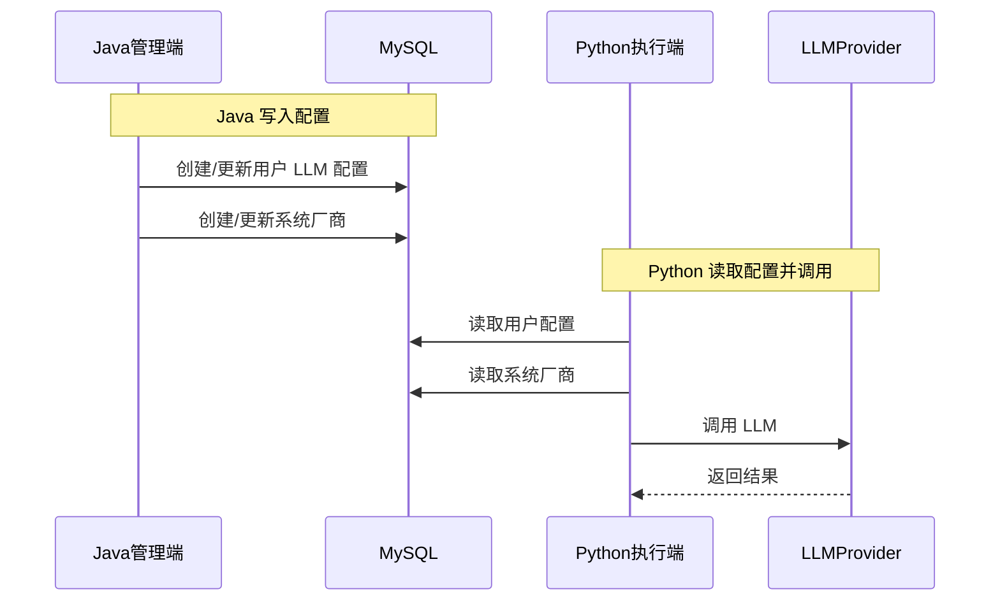
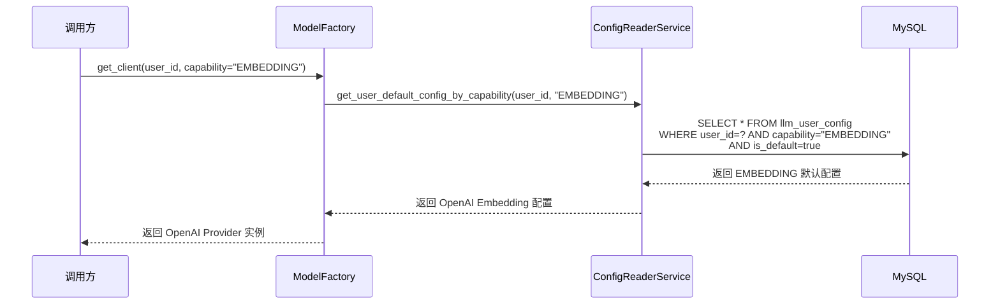

# 多 LLM 接入模块技术设计

> **项目定位**：Python RAG 执行端，负责 LLM 调用和 RAG 全流程实现
>
> **协作模式**：Java 管理端  ←（共用数据库）→  Python 执行端

---

## 阶段一：需求深度分析

### 1.1 核心业务逻辑

多 LLM 接入模块旨在提供**统一的 LLM 调用抽象层**，支持无缝切换和扩展多种大语言模型提供商（OpenAI、Claude等），同时保持接口一致性和业务代码的稳定性。

### 1.2 架构定位

```
┌─────────────────────────────────────────────────────────────────┐
│                        Java 管理端                               │
│                                                                 │
│  · 用户注册/登录                                                 │
│  · 用户信息管理                                                  │
│  · LLM 配置管理（用户级 CRUD）                                   │
│  · 系统厂商管理（管理员）                                        │
│                                                                 │
│  职责：只负责管理，不涉及任何 LLM 调用                           │
└─────────────────────────────────────────────────────────────────┘
                              │
                              │ 写入：用户配置、系统厂商
                              ▼
┌─────────────────────────────────────────────────────────────────┐
│                      Python RAG 执行端                           │
│                                                                 │
│  · 读取 llm_user_config 表                                      │
│  · LLM Provider 抽象与调用                                       │
│  · RAG Pipeline（文档解析 → 向量检索 → 生成）                   │
│                                                                 │
│  职责：配置读取 + LLM 调用 + RAG 全流程                          │
└─────────────────────────────────────────────────────────────────┘
```

### 1.3 边界与异常场景

| 场景 | 潜在问题 | 处理策略 |
|------|----------|----------|
| 单 LLM 提供商宕机 | 服务不可用 | 自动切换到备用 Provider |
| API Key 额度耗尽 | 限流/失败 | 优雅降级 + 告警 |
| 模型响应超时 | 请求阻塞 | 配置超时 + 重试机制 |
| 并发调用超额 | 连接池耗尽 | 限流 + 队列缓冲 |
| 网络波动 | 请求失败 | 指数退避重试 |

### 1.4 非功能性需求

- **并发支持**：单 Provider 至少支持 50+ 并发请求
- **延迟**：P99 延迟 < 5s（不含 LLM 自身响应时间）
- **可用性**：单 Provider 故障时自动切换，不影响核心流程
- **扩展性**：新增 Provider 无需修改已有代码（开闭原则）
- **可配置性**：支持动态配置模型参数，无需重启服务即可生效

---

## 阶段二：数据模型与存储设计

### 2.1 核心实体关系

```
┌──────────────────┐         ┌──────────────────┐
│  SystemProvider  │         │   UserLLMConfig  │
│   (系统级厂商)    │         │   (用户级配置)    │
├──────────────────┤         ├──────────────────┤
│ id (PK)          │──┐      │ id (PK)          │
│ provider_type    │  │      │ user_id (FK)     │──▶ User
│ provider_name    │  │  1:N │ provider_id (FK)│──▶ SystemProvider
│ api_base_url     │  │      │ api_key (加密)   │
│ supported_models │  │      │ custom_model_name│
│ is_active        │  │      │ priority         │
│ config_schema    │  └──────│ is_active        │
└──────────────────┘         │ is_default       │
                             │ extra_config     │
                             └──────────────────┘
```

**说明**：
- `SystemProvider`：系统级配置，定义平台支持的 LLM 厂商（由管理员维护，Java 写入）
- `UserLLMConfig`：用户级配置，每个用户可为每个厂商配置自己的 API Key 和参数（Java 写入）
- Python 只读取上述表，不写入配置

### 2.2 配置表结构

#### 2.2.1 系统级厂商配置表 (llm_system_provider)

| 字段名 | 数据类型 | 主键 | 索引 | 可空 | 注释 |
|--------|----------|------|------|------|------|
| id | BIGINT | ✅ | - | ❌ | 厂商唯一标识 (自增) |
| provider_type | VARCHAR(32) | - | ✅ | ❌ | 厂商类型：openai/claude/glm/deepseek |
| provider_name | VARCHAR(64) | - | ✅ | ❌ | 厂商展示名称，如 "OpenAI" |
| api_base_url | VARCHAR(512) | - | - | ❌ | 官方默认 API 地址 |
| supported_models | JSON | - | - | ✅ | 支持的模型及其能力，如 {"gpt-4": ["CHAT", "OCR"]} |
| config_schema | JSON | - | - | ✅ | 配置参数 Schema（用于前端表单渲染） |
| is_active | BOOLEAN | - | ✅ | ❌ | 是否启用 |
| priority | INT | - | ✅ | ❌ | 厂商优先级（默认 50） |
| created_at | DATETIME | - | - | ❌ | 创建时间 |
| updated_at | DATETIME | - | - | ❌ | 更新时间 |

#### 2.2.2 用户级 LLM 配置表 (llm_user_config)

| 字段名 | 数据类型 | 主键 | 索引 | 可空 | 注释 |
|--------|----------|------|------|------|------|
| id | BIGINT | ✅ | - | ❌ | 配置唯一标识 (自增) |
| user_id | BIGINT | - | ✅ | ❌ | 用户 ID |
| provider_id | BIGINT | - | ✅ | ❌ | 关联 SystemProvider ID |
| provider_type | VARCHAR(32) | - | - | ❌ | 厂商类型：openai/anthropic/glm/deepseek |
| provider_name | VARCHAR(64) | - | - | ❌ | 厂商展示名称 |
| config_name | VARCHAR(64) | - | ✅ | ❌ | 用户自定义配置名称 |
| api_key | VARCHAR(512) | - | - | ❌ | 用户提供的 API Key（加密存储） |
| custom_api_base_url | VARCHAR(512) | - | - | ✅ | 自定义 API 地址（覆盖系统默认） |
| model_name | VARCHAR(128) | - | ✅ | ❌ | 具体模型名，如 "gpt-4" |
| priority | INT | - | ✅ | ❌ | 优先级 1-100，数值越大越优先 |
| is_active | BOOLEAN | - | ✅ | ❌ | 是否启用 |
| is_default | BOOLEAN | - | ✅ | ❌ | 是否为该能力下的默认模型 |
| timeout_ms | INT | - | - | ✅ | 超时时间(ms)，默认 60000 |
| max_retries | INT | - | - | ✅ | 最大重试次数，默认 3 |
| stream_enabled | BOOLEAN | - | ✅ | ❌ | 是否支持流式输出 |
| extra_config | JSON | - | - | ✅ | 扩展配置（覆盖系统默认参数） |
| capability | VARCHAR(32) | - | ✅ | ❌ | 主要能力类型：CHAT/EMBEDDING/RERANK/OCR/VISION |
| created_at | DATETIME | - | - | ❌ | 创建时间 |
| updated_at | DATETIME | - | - | ❌ | 更新时间 |

**复合索引**：`idx_user_provider_cap(user_id, provider_type, capability)`

#### 2.2.3 用量日志表 (llm_usage_log)

| 字段名 | 数据类型 | 主键 | 索引 | 可空 | 注释 |
|--------|----------|------|------|------|------|
| id | BIGINT | ✅ | - | ❌ | 记录唯一标识 (自增) |
| user_id | BIGINT | - | ✅ | ❌ | 用户 ID |
| config_id | BIGINT | - | ✅ | ❌ | 用户配置 ID |
| provider_type | VARCHAR(32) | - | - | ❌ | 厂商类型 |
| model_name | VARCHAR(128) | - | - | ❌ | 模型名称 |
| prompt_tokens | INT | - | - | ❌ | 输入 Token 数 |
| completion_tokens | INT | - | - | ❌ | 输出 Token 数 |
| total_tokens | INT | - | - | ❌ | 总 Token 数 |
| latency_ms | INT | - | - | ✅ | 响应延迟(毫秒) |
| status | VARCHAR(16) | - | - | ❌ | 调用状态：success/failed/partial |
| error_message | VARCHAR(512) | - | - | ✅ | 错误信息（如果失败） |
| fallback_config_id | BIGINT | - | - | ✅ | 触发 Fallback 时记录原配置 ID |
| conversation_id | BIGINT | - | ✅ | ✅ | 会话 ID（用于多轮对话） |
| created_at | DATETIME | - | - | ❌ | 创建时间 |

**索引**：
- `idx_user_date(user_id, created_at)`
- `idx_config_date(config_id, created_at)`
- `idx_conversation_id(conversation_id)`

### 2.3 Redis 缓存策略

```
Key: llm:system:providers              →  List[SystemProvider] (所有启用的系统厂商)
Key: llm:system:provider:{type}        →  SystemProvider JSON
Key: llm:user:{user_id}:configs        →  List[UserLLMConfig] (用户所有配置)
Key: llm:user:{user_id}:config:{id}    →  UserLLMConfig JSON
Key: llm:user:{user_id}:default         →  UserLLMConfig JSON (用户默认配置)
Key: llm:user:{user_id}:default:{capability}  →  UserLLMConfig JSON (按能力默认配置)
Key: llm:user:{user_id}:configs:{capability} →  List[UserLLMConfig] (按能力的所有配置)
Key: llm:client:{user_id}:{config_id}  →  BaseLLM instance (已实例化的客户端)
TTL: 600s (10分钟)
淘汰策略: LRU
更新策略: 配置变更时主动删除相关缓存
```

---

## 阶段三：架构与模块设计

### 3.1 系统流转图



### 3.2 核心类图

```
┌─────────────────────────────────────────────────────────────┐
│                     ConfigReaderService                      │
│  (配置读取服务：从数据库读取配置，Python 端使用)              │
├─────────────────────────────────────────────────────────────┤
│ + get_system_providers() -> List[SystemProvider]           │
│ + get_system_provider_by_type(type) -> SystemProvider     │
│ + get_user_configs(user_id) -> List[UserLLMConfig]        │
│ + get_user_default_config(user_id) -> UserLLMConfig       │
│ + get_user_default_config_by_capability(user_id, cap,     │
│                                          provider_type?)   │
│                                        -> UserLLMConfig    │
│ + get_user_configs_by_capability(user_id, capability)      │
│                                        -> List[UserLLMConfig]
│ + get_user_config_by_id(user_id, config_id) -> UserLLMConfig│
│ + clear_cache(user_id?) -> void                            │
└─────────────────────────────────────────────────────────────┘

┌───────────────────────────────────────┐
│     专项能力接口 (Capability Interfaces) │
├───────────────────────────────────────┤
│ ITextGenerator: generate(), stream()  │
│ IEmbedder: embed(texts)               │
│ IReranker: rerank(query, docs)        │
│ IOcrProcessor: extract_text(image)    │
└───────────────────────────────────────┘
                   ▲ (implements multiple interfaces)
┌──────────────────┼─────────────────────────┐
│                 BaseProvider               │
├────────────────────────────────────────────┤
│ + has_capability(capability_type) -> bool  │
│ + test_connection() -> bool                │
└──────────────────┬─────────────────────────┘
                   │ inherits & implements    
     ┌─────────────┼──────────────┬─────────────┐
     ▼             ▼              ▼             ▼
┌──────────┐ ┌───────────┐ ┌─────────────┐ ┌─────────────┐
│ OpenAI   │ │ Zhipu     │ │ Qwen/Claude │ │ DeepSeek    │
│ Provider │ │ Provider  │ │ Provider    │ │ Provider    │
│(Text+Emb)│ │(Text+Emb) │ │ (Text+Emb)  │ │ (Text)      │
└──────────┘ └───────────┘ └─────────────┘ └─────────────┘

┌───────────────────────────────────────┐
│          ModelFactory                 │
├───────────────────────────────────────┤
│ + register_provider(type, cls)       │
│ + get_client(user_id, capability_type,│
│              provider_type?)          │
│   -> BaseProvider (按能力路由)        │
│ + get_client_by_id(config_id, user_id)│
│   -> BaseProvider                    │
│ + get_clients_by_capability(user_id, │
│                              cap)     │
│   -> List[BaseProvider]              │
│ + clear_cache(user_id?) -> void      │
└───────────────────────────────────────┘

┌─────────────────────────────────────┐
│        UsageLogService              │
├─────────────────────────────────────┤
│ + log_usage(record) -> void         │
│ + get_user_usage(user_id) -> List  │
│ + get_usage_summary(user_id) -> Summary│
└─────────────────────────────────────┘
```

### 3.3 关键设计决策

| 决策点 | 方案选型 | 理由 |
|--------|----------|------|
| 抽象层 | ABC + Protocol | 明确接口契约，支持静态类型检查 |
| 工厂模式 | 注册式工厂 | 新增 Provider 无需修改工厂代码 |
| 配置管理 | 只读配置服务 | Python 只读取，不写入配置 |
| 重试机制 | Exponential Backoff | 应对临时性网络抖动 |
| 流式输出 | AsyncIterator | 支持 Server-Sent Events |
| 落地方案 | 兼容 OpenAI 协议 | 大多数厂商支持，非标准(Claude)用 Adapter 转换 |
| 容错熔断 | 状态重试+熔断(Circuit Breaker) | 429退避，5xx熔断半开，401/422免重试直接失败 |
| Token计算 | 前置 Tokenizer 测算 | 拼装 RAG 上下文时主动测算并截断，防止溢出 |
| 用量记录 | 异步写入 | 不阻塞 LLM 调用响应 |
| 能力路由 | 按 capability 字段路由 | 支持同一用户配置不同能力的不同模型 |

### 3.4 能力路由设计

**问题背景**：同一用户可能同时使用多种 LLM 能力（如 Chat 对话、Embedding 向量化、Rerank 重排），不同能力可能使用不同厂商的模型。

**解决方案**：采用 `capability` 字段路由

```
用户配置示例：
┌──────┬───────────────┬────────────┬─────────────┬────────────┐
│ ID   │ provider_type │ model_name │ capability  │ is_default │
├──────┼───────────────┼────────────┼─────────────┼────────────┤
│ 1    │ openai        │ gpt-4      │ CHAT        │ true       │
│ 2    │ openai        │ text-emb-3 │ EMBEDDING   │ true       │
│ 3    │ cohere        │ rerank     │ RERANK      │ true       │
│ 4    │ anthropic     │ claude-3   │ CHAT        │ false      │
└──────┴───────────────┴────────────┴─────────────┴────────────┘
```

**路由流程**：



**API 调用示例**：

```python
# 调用 Chat 模型
chat_provider = await factory.get_client(
    user_id=12345,
    capability_type="CHAT"
)

# 调用 Embedding 模型
embedding_provider = await factory.get_client(
    user_id=12345,
    capability_type="EMBEDDING"
)

# 调用 Rerank 模型
rerank_provider = await factory.get_client(
    user_id=12345,
    capability_type="RERANK"
)
```

---


### 4.1 LLM 调用接口

#### `POST /api/v1/llm/generate`

**接口名称**：生成文本（非流式）

**请求参数**：

| 参数位置 | 字段名 | 类型 | 必填 | 描述 |
|----------|--------|------|------|------|
| Header | X-User-Id | string | ✅ | 用户 ID（由 Java 传入） |
| Body | config_id | string | ❌ | 用户配置的 LLM ID，不提供则使用默认 |
| Body | prompt | string | ✅ | 输入提示词 |
| Body | model | string | ❌ | 模型名称（覆盖配置） |
| Body | temperature | float | ❌ | 采样温度 0-2，默认 0.7 |
| Body | max_tokens | int | ❌ | 最大 token 数 |
| Body | system_prompt | string | ❌ | 系统提示词 |
| Body | tools | list | ❌ | 工具调用 (Function Calling) 定义 |

**请求示例**：

```json
{
  "config_id": "user-config-uuid",
  "prompt": "解释一下什么是 RAG",
  "temperature": 0.7,
  "max_tokens": 1000,
  "system_prompt": "你是一个专业的 AI 助手"
}
```

**成功响应示例**：

```json
{
  "code": 200,
  "message": "success",
  "data": {
    "content": "RAG（检索增强生成）是一种结合检索系统和生成模型的技术...",
    "model": "gpt-4",
    "usage": {
      "prompt_tokens": 20,
      "completion_tokens": 150,
      "total_tokens": 170
    },
    "provider_type": "openai",
    "latency_ms": 1234
  }
}
```

**错误响应示例**：

```json
{
  "code": 500,
  "message": "All LLM providers failed",
  "data": null
}
```

#### `POST /api/v1/llm/generate/stream`

**接口名称**：流式生成文本

**请求参数**：同 `generate`

**响应格式**：Server-Sent Events (SSE)

```
data: {"content": "RAG", "delta": "R", "is_end": false}
data: {"content": "AG（", "delta": "AG（", "is_end": false}
data: {"content": "检索...", "delta": "检索...", "is_end": false}
data: {"content": "", "delta": "", "is_end": true, "usage": {...}}
```

#### `POST /api/v1/llm/embed`

**接口名称**：文本向量化 (Embedding)

**请求参数**：

| 参数位置 | 字段名 | 类型 | 必填 | 描述 |
|----------|--------|------|------|------|
| Header | X-User-Id | string | ✅ | 用户 ID |
| Body | config_id | string | ❌ | 配置 ID，若空则使用默认配置 |
| Body | input | list/string | ✅ | 待向量化的文本内容 |
| Body | model | string | ❌ | 指定模型名称 (覆盖默认配置) |

**响应示例**：

```json
{
  "code": 200,
  "message": "success",
  "data": {
    "model": "text-embedding-3-small",
    "embeddings": [
      [0.0023, -0.0192, 0.0553],
      [0.0123, -0.0032, 0.0991]
    ],
    "usage": {
      "prompt_tokens": 15,
      "total_tokens": 15
    }
  }
}
```

#### `POST /api/v1/llm/rerank`

**接口名称**：文本语义重排 (Rerank)

**请求参数**：

| 参数位置 | 字段名 | 类型 | 必填 | 描述 |
|----------|--------|------|------|------|
| Header | X-User-Id | string | ✅ | 用户 ID |
| Body | config_id | string | ❌ | 选择启用了 Rerank 能力的配置 ID |
| Body | query | string | ✅ | 用户的初始检索问题 |
| Body | docs | list[string]| ✅ | 待重排打分的文档列表 |

**响应示例**：

```json
{
  "code": 200,
  "message": "success",
  "data": {
    "model": "bge-reranker-large",
    "results": [
      {"index": 2, "score": 0.98, "text": "最相关的文档原文..."},
      {"index": 0, "score": 0.54, "text": "稍有相关的文档..."},
      {"index": 1, "score": 0.12, "text": "不相关的文档..."}
    ],
    "usage": {
      "total_tokens": 512
    }
  }
}
```

#### `POST /api/v1/llm/ocr`

**接口名称**：多模态图像文本提取 (OCR / Vision)

**请求参数**：

| 参数位置 | 字段名 | 类型 | 必填 | 描述 |
|----------|--------|------|------|------|
| Header | X-User-Id | string | ✅ | 用户 ID |
| Body | config_id | string | ❌ | 选择具备 VLM/OCR 能力的配置 ID |
| Body | image_base64 | string | ✅ | 图像的 base64 编码字符串 |
| Body | prompt | string | ❌ | 分析提示词 (如："提取图片中的表格数据") |

**响应示例**：

```json
{
  "code": 200,
  "message": "success",
  "data": {
    "content": "提取出的表格结构或者文本内容...",
    "model": "gpt-4o",
    "usage": {
      "prompt_tokens": 1105,
      "completion_tokens": 200,
      "total_tokens": 1305
    }
  }
}
```

---

### 4.2 配置读取接口（供 RAG Pipeline 内部使用）

#### `GET /api/v1/internal/llm/configs`

**接口名称**：获取用户的 LLM 配置列表（内部接口）

**请求参数**：

| 参数位置 | 字段名 | 类型 | 必填 | 描述 |
|----------|--------|------|------|------|
| Header | X-User-Id | string | ✅ | 用户 ID |

**响应示例**：

```json
{
  "code": 200,
  "message": "success",
  "data": {
    "items": [
      {
        "id": "uuid-xxx",
        "config_name": "我的 GPT-4",
        "provider_type": "openai",
        "provider_name": "OpenAI",
        "model_name": "gpt-4",
        "api_key_masked": "sk-****....****",
        "custom_api_base_url": null,
        "priority": 100,
        "is_active": true,
        "is_default": true,
        "stream_enabled": true,
        "extra_config": {"temperature": 0.7}
      }
    ]
  }
}
```

---

### 4.3 系统厂商查询接口

#### `GET /api/v1/internal/llm/providers`

**接口名称**：获取系统级厂商列表（内部接口）

**响应示例**：

```json
{
  "code": 200,
  "message": "success",
  "data": {
    "items": [
      {
        "provider_type": "openai",
        "provider_name": "OpenAI",
        "api_base_url": "https://api.openai.com/v1",
        "supported_models": ["gpt-4", "gpt-3.5-turbo"],
        "config_schema": {
          "temperature": {"type": "float", "default": 0.7},
          "max_tokens": {"type": "int", "default": 1000}
        },
        "is_active": true
      }
    ]
  }
}
```

---

### 4.4 用量查询接口

#### `GET /api/v1/internal/llm/usage`

**接口名称**：获取用户用量统计（内部接口）

**请求参数**：

| 参数位置 | 字段名 | 类型 | 必填 | 描述 |
|----------|--------|------|------|------|
| Header | X-User-Id | string | ✅ | 用户 ID |
| Query | start_date | string | ❌ | 开始日期 YYYY-MM-DD |
| Query | end_date | string | ❌ | 结束日期 YYYY-MM-DD |

**响应示例**：

```json
{
  "code": 200,
  "message": "success",
  "data": {
    "total_calls": 100,
    "total_tokens": 50000,
    "prompt_tokens": 30000,
    "completion_tokens": 20000,
    "daily_stats": [
      {"date": "2026-04-10", "calls": 50, "tokens": 25000}
    ]
  }
}
```

---

## 阶段四：核心功能模块

#### 4.1 系统厂商读取

| # | 功能点 | 描述 | 优先级 |
|---|--------|------|--------|
| 1.1 | 读取所有启用厂商 | 从数据库/缓存读取所有启用的 SystemProvider | P0 |
| 1.2 | 按类型查询厂商 | 根据 provider_type 查询特定厂商 | P0 |
| 1.3 | 缓存管理 | 与 Java 协同，保持缓存一致 | P0 |

#### 4.2 用户配置读取

| # | 功能点 | 描述 | 优先级 |
|---|--------|------|--------|
| 2.1 | 读取用户配置列表 | 根据 user_id 读取该用户所有配置 | P0 |
| 2.2 | 读取默认配置 | 获取用户的默认 LLM 配置 | P0 |
| 2.3 | 按能力读取默认配置 | 根据 capability（CHAT/EMBEDDING/RERANK等）获取默认配置 | P0 |
| 2.4 | 按能力读取所有配置 | 根据 capability 获取该能力下所有配置（按优先级排序） | P0 |
| 2.5 | 按 ID 读取配置 | 根据 config_id 读取特定配置 | P0 |
| 2.6 | 配置验证 | 验证配置是否有效（未禁用等） | P0 |

#### 4.3 LLM 调用

| # | 功能点 | 描述 | 优先级 |
|---|--------|------|--------|
| 3.1 | 文本生成 | 调用 LLM 生成文本（非流式） | P0 |
| 3.2 | 流式文本生成 | 支持 SSE 流式输出 | P0 |
| 3.3 | 指定配置调用 | 通过 config_id 指定使用哪个配置 | P0 |
| 3.4 | 默认配置调用 | 不指定时使用用户的默认配置 | P0 |
| 3.5 | 参数覆盖 | 调用时可临时覆盖默认参数 | P1 |
| 3.6 | 故障自动切换 | 当首选配置失败时，自动切换到其他有效 LLM | P1 |
| 3.7 | 用量记录 | 记录每次调用的 Token 消耗 | P0 |
| 3.8 | 向量化 (Embedding) | 提供 RAG 必需的文本转向量接口 | P0 |
| 3.9 | 工具调用 (Tool Calling)| 兼容并统一 Function Calling 的参数透传 | P0 |
| 3.10| 精细化容错与熔断 | 区分 HTTP 状态码限流、宕机等情况进行熔断或重试 | P0 |
| 3.11| Token 预计算与截断 | 请求发起前主动测算 Token 并执行必要截断策略 | P1 |
| 3.12| 文本重排 (Rerank) | 获取独立的 Rerank 专项实例并执行打分排序 | P0 |
| 3.13| 多模态/OCR解析 | 调用特定的视觉分析接口模型提取多模态内容 | P2 |

#### 4.4 安全保障

| # | 功能点 | 描述 | 优先级 |
|---|--------|------|--------|
| 4.1 | API Key 解密 | 从数据库读取加密的 Key 并解密使用 | P0 |
| 4.2 | 用户隔离 | 确保用户只能使用自己的配置 | P0 |
| 4.3 | 配置有效性检查 | 使用前检查配置是否启用、厂商是否启用 | P0 |

#### 4.5 缓存与性能

| # | 功能点 | 描述 | 优先级 |
|---|--------|------|--------|
| 5.1 | 配置缓存 | Redis 缓存用户配置，TTL 10分钟 | P0 |
| 5.2 | 缓存失效监听 | 监听配置变更，主动删除缓存 | P0 |
| 5.3 | 客户端池化 | 复用 LLM 客户端实例 | P1 |
| 5.4 | 用量日志异步写入 | 不阻塞 LLM 调用响应 | P0 |

#### 4.6 后续扩展功能

| # | 功能点 | 描述 | 优先级 |
|---|--------|------|--------|
| F1 | 配额/限额管理 | 限制用户每日/每月的 API 调用次数 | P2 |
| F2 | 审计日志 | 记录配置变更等敏感操作 | P2 |
| F3 | 多轮对话/会话管理 | 支持 Chat 场景的上下文管理 | P2 |
| F4 | 批量调用 | 一次请求多个 prompt 并行处理 | P2 |

---

## 模块文件结构

```
src/core/llm/
├── __init__.py
├── interfaces.py            # ITextGenerator/IEmbedder 等抽象能力接口契约
├── base_provider.py         # BaseProvider 厂商基类
├── factory.py               # ModelFactory 工厂类 (按 Capability 分发)
├── circuit_breaker.py       # 熔断器与限流容错机制
├── config.py                # Pydantic 配置模型
├── encryption.py            # API Key 加密工具
├── tokenizer.py             # Token预计算工具(基于 tiktoken)
├── providers/
│   ├── __init__.py
│   ├── openai.py            # OpenAI Provider (Adapter层)
│   ├── anthropic.py         # Claude Provider
│   ├── glm.py               # 智谱 Provider
│   ├── deepseek.py          # DeepSeek Provider
│   └── qwen.py              # 阿里通义千问 Provider
├── response.py              # 统一响应模型
└── exceptions.py            # 自定义异常

src/services/
├── config_reader_service.py    # 配置读取服务（只读）
├── usage_log_service.py         # 用量日志服务
└── cache_sync_service.py       # 缓存同步服务

src/api/routes/
├── llm.py                   # LLM 调用接口
└── internal.py              # 内部接口（配置读取、用量查询）

src/models/
├── system_provider.py       # SystemProvider ORM 模型
├── user_llm_config.py      # UserLLMConfig ORM 模型
└── usage_log.py             # 用量日志 ORM 模型
```

---

## 与 Java 管理端协作说明

| 数据操作 | Java 管理端 | Python 执行端 |
|----------|-------------|--------------|
| 系统厂商 CRUD | ✅ 写入 | ✅ 读取 |
| 用户配置 CRUD | ✅ 写入 | ✅ 读取 |
| LLM 调用 | ❌ | ✅ 读取 + 执行 |
| 用量日志写入 | ❌ | ✅ 写入 |
| 用量日志读取 | ✅ 读取 | ❌ |

**通信方式**：
- 共享 MySQL 数据库（配置表、用量日志表）
- 共享 Redis 缓存
- Python 提供内部接口供 Java 查询用量统计
