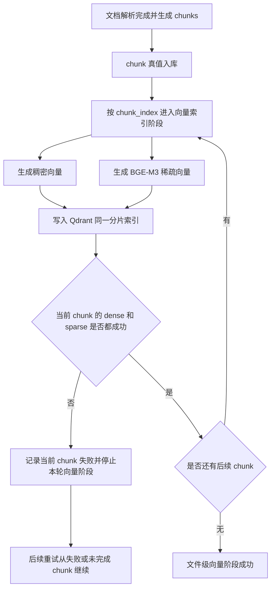

# 稀疏向量 Brief

## 1. 需求摘要

- **做什么**：在现有文档解析后的向量索引阶段新增 BGE-M3 稀疏向量能力。启用后，同一文档的每个有效 chunk 都需要完成稠密向量和稀疏向量入库，文件级向量阶段才可以向上游报告成功。同时支持在无显卡环境下使用本地 CPU fp32 BGE-M3 模型推理，并保留 CPU 与 CUDA 推理设备的切换入口。
- **为什么做**：现有纯稠密向量对关键词、实体、编号、术语、长尾词和混合中英文查询的召回不稳定。稀疏向量先作为稳定、可恢复、可验证的检索资产入库，为后续稠密检索、稀疏检索和混合检索打基础。
- **本次不做**：不交付检索入口，不暴露 sparse/hybrid 检索 API 或用户可见检索开关，不切换现有稠密向量模型为 BGE-M3，不纳入 BGE-M3 multi-vector / ColBERT，不让 ES 参与稀疏向量生成或一致性处理，不把 SPLADE 纳入实际开发流程。

## 2. 业务流程

### 2.1 主流程图

### 2.2 流程详解

文档解析任务完成解析和分片后，系统先保持现有做法，将 chunk 作为真值数据入库。随后进入向量索引阶段，按 `chunk_index` 的顺序处理每个 chunk。稀疏向量功能需要设计独立功能开关，首期默认开启；开启后，向量阶段不再只关注稠密向量是否成功，而是把稠密向量和 BGE-M3 稀疏向量看作同一 chunk 的两种检索表示。

对单个 chunk 来说，系统读取 chunk 原文内容和归属信息，继续按现有链路生成稠密向量，同时调用本地部署的 BGE-M3 生成稀疏向量。稀疏向量输入必须是 chunk 原文，不能使用 ES analyzer 产物或 ES 分词结果。BGE-M3 输出的稀疏表示需要能表达非零 token 的索引和值，并与同一 chunk 建立稳定关联。正常非空 chunk 生成空 sparse vector 视为失败，不能作为成功资产入库。

当前 chunk 的稠密向量和稀疏向量都写入 Qdrant 后，才允许该 chunk 在向量阶段收敛为成功。如果当前 chunk 的任一向量化或入库动作失败，系统只把当前 chunk 记录为失败，本轮文件级向量阶段不能报告成功；已经成功的前置 chunk 保持成功，后续 chunk 保持未完成，后续重试从第一个失败或未完成 chunk 继续。

文件级向量阶段的成功语义从“所有 chunk 的稠密向量成功”扩展为“所有有效 chunk 的稠密向量和稀疏向量都成功”。ES 入库、ES 补偿和最终通知不属于本需求处理范围，也不作为稀疏向量生成的前置条件。

本地模型推理设备由部署配置决定。配置为 CPU 时，即使运行环境没有可用 CUDA，也必须能完成 BGE-M3 稀疏向量推理；配置为 CUDA 时，系统应走 GPU 推理路径。设备选择只影响模型加载与推理方式，不改变 chunk 原文输入、稀疏向量输出结构、Qdrant 写入方式或 MySQL 状态语义。

异常分支包括模型不可用、CPU 推理不可用、CUDA/CPU 资源不足、输出为空或格式异常、Qdrant 稀疏向量写入失败、状态回写失败、重复执行同一 chunk。空 sparse vector 必须记录明确原因，包括模型异常、输出格式异常、输出数量不匹配、raw lexical weights 为空、过滤后为空、数值非法或转换失败。所有异常都必须落到可恢复语义：失败 chunk 可定位、已成功 chunk 可跳过、重复写入按 chunk 身份保持幂等。

## 3. 核心模块与实现思路

### 3.1 向量索引阶段

- **位置**：文档后处理中的向量存储与向量索引编排层。
- **职责**：把稀疏向量纳入现有向量阶段，使文件级成功边界同时覆盖 dense 和 sparse。
- **实现思路**：复用现有 chunk 真值、chunk 顺序、owner 信息、失败续跑和 Qdrant 分桶能力。新增 sparse 子流程时，不把它放到 ES 之后，也不做独立文件级 sparse 阶段，而是在每个 chunk 的向量处理闭环中并行或相邻完成 dense 与 sparse。功能开关需要显式存在，默认开启；关闭时保持旧 dense-only 向量阶段语义。当前 chunk 完成后再推进下一个 chunk。
- **关键决策**：首期采用“现有稠密向量保持不变，只新增 BGE-M3 稀疏向量”的路线，降低历史向量分布变化和全量重建风险。

### 3.2 BGE-M3 本地模型能力

- **位置**：稀疏向量模型提供方或模型编码层。
- **职责**：在本地环境加载 `BAAI/bge-m3`，对 chunk 原文生成稀疏向量表示。
- **实现思路**：开发测试阶段优先进程内调用本地模型，明确模型版本、CPU/CUDA 推理设备、批大小、最大长度、top-k 或 min weight 过滤、空输出处理。GPU 可用时支持 CUDA fp16 推理；无显卡开发机或低资源环境下，支持显式切到 CPU 并使用普通本地 BGE-M3 以 fp32 完成 sparse lexical weights 推理。对非空 chunk，空 sparse vector 视为失败，并按模型异常、输出缺失、数量不匹配、raw 为空、过滤后为空、数值非法或转换失败记录原因。后续如需资源隔离，可演进为同机或内网本地模型服务，但首期仍按本地部署目标管理。
- **关键决策**：首期只使用 BGE-M3 的 sparse lexical weights，不强制使用它生成 dense vector，也不使用 ColBERT multi-vector。SPLADE / SPLADE-like 只保留在文档评估中，不进入首期代码开发流程。

### 3.3 Qdrant 稀疏向量索引

- **位置**：Qdrant 向量存储访问层。
- **职责**：在稠密向量所在的同一 collection 中保存同一 chunk 的稀疏向量。
- **实现思路**：稀疏向量与稠密向量共用 chunk 身份和 owner payload。Qdrant 写入必须支持幂等覆盖，避免重复执行产生重复索引。若目标 collection 需要追加 sparse vector 配置或 named vector 配置，需要在技术设计中给出兼容、迁移或重建策略。
- **关键决策**：稀疏向量不落 ES，不新建与 dense 脱节的索引资产；同一 chunk 的检索表示应能在后续按 chunk 身份融合和回表。

### 3.4 Chunk 真值与状态记录

- **位置**：chunk 真值存储与状态管理层。
- **职责**：记录每个 chunk 的稀疏向量处理进度、失败原因、模型信息和可观测指标，为续跑与补偿提供依据。
- **实现思路**：稀疏向量生命周期需要独立于现有稠密向量状态，避免 dense 成功和 sparse 成功混在一起。文件级向量状态做汇总判断，分片级 sparse 生命周期作为续跑判断依据。后续重试按 chunk 顺序跳过已 INDEXED 分片，从第一个未成功分片继续。
- **关键决策**：不复用 dense 的状态字段表达 sparse 结果；否则排障、补偿和文件级成功边界都会变得不清晰。

### 3.5 一致性补偿与失败续跑

- **位置**：向量存储补偿、管理和重建流程。
- **职责**：处理 MySQL 真值状态、Qdrant dense vector、Qdrant sparse vector 之间的最终一致性问题。
- **实现思路**：沿用稠密向量“先写索引副本、再回写状态、失败 chunk 可重试”的最终一致性思路，但 sparse 必须有独立状态和独立失败原因。补偿时要能区分 dense 缺失、sparse 缺失、状态未回写和删除态竞争。
- **关键决策**：不追求 MySQL 与 Qdrant 跨库事务；通过分片级状态、幂等 upsert、失败可定位和补偿任务收敛。

### 3.6 ES 与后续检索预留

- **位置**：ES 入库与检索入口相关模块。
- **职责**：本需求中不承担稀疏向量生成和事务处理，只作为后续混合检索的可能并行召回来源。
- **实现思路**：稀疏向量生成不消费 ES 分词结果；ES 成功与否不作为 sparse 生成前置。首期不交付检索 API，也不暴露用户可见的 sparse/hybrid 检索开关；只在文档中明确未来读时规则：Qdrant 负责召回候选 `chunk_id`，MySQL 负责回查状态和原文。
- **关键决策**：ES 的 analyzer token 空间与 BGE-M3 模型词表空间不同，不能混用。未来 dense 检索只返回 `dense_vector_status=INDEXED` 的记录；sparse 或 hybrid 检索还必须要求 `sparse_vector_status=INDEXED`。

## 4. 风险与不确定性

| 风险 / 问题 | 触发条件 | 影响 | 当前判断 / 应对方向 |
| :--- | :--- | :--- | :--- |
| 稀疏向量失败导致文件级误报成功 | 只检查 dense 成功或只检查模型调用成功 | 文件看似完成，但部分 chunk 无 sparse 资产 | 文件级成功必须从严汇总 dense 和 sparse；当前 chunk 任一子步骤失败即本轮失败 |
| dense 与 sparse 状态混用 | 复用现有 dense 状态表达 sparse 结果 | 难以判断哪个向量资产缺失，补偿边界不清 | 使用独立 sparse 子状态，文件级状态只做汇总 |
| Qdrant collection 不支持直接追加 sparse 配置 | 现有 collection 结构与目标 named sparse vector 不兼容 | 可能需要迁移窗口或重建 collection | 技术设计阶段必须评估兼容与迁移策略 |
| BGE-M3 本地资源不足 | GPU 显存不足、CPU 延迟过高、长文本或 batch 过大 | 稀疏向量处理阻塞或失败，影响解析任务吞吐 | 开发期小 batch 和真实模型烟雾测试；工程化阶段评估独立模型服务或资源隔离 |
| 无显卡环境无法开发测试 | 开发机、测试机或 CI 节点没有可用 CUDA | 本地无法验证 BGE-M3 稀疏向量能力，阻塞首期开发闭环 | 支持 CPU fp32 推理；设备配置为 CPU 时不得依赖 CUDA 初始化；同一接口保留切换 CUDA 的能力 |
| CPU/CUDA 路径输出结构不一致 | 不同设备路径返回格式不同，或缺少 sparse lexical weights | 状态可能误判成功，或写入不可用 sparse vector | CPU/CUDA 路径必须复用同一稀疏向量输出契约；输出数量、非空、数值和排序校验不因设备路径放宽 |
| 空稀疏向量被误判为成功 | 模型异常、输出格式异常、输出数量不匹配、raw lexical weights 为空、过滤后为空、数值非法或转换失败 | 可能出现 sparse 状态成功但实际不可召回的坏数据 | 正常非空 chunk 生成空 sparse vector 视为失败；失败原因必须可区分、可观测、可用于重试排障 |
| 功能默认开启影响旧链路 | 首期 sparse 功能开关默认开启，但模型或 Qdrant sparse 配置未就绪 | 现有解析任务可能被新能力阻断 | 保留显式功能开关，默认开启；部署前必须通过本地 BGE-M3 和 Qdrant sparse 写入烟雾测试 |
| 批量输出与输入 chunk 无法对应 | 模型批处理返回数量不一致或顺序不可确认 | 可能把错误向量写到错误 chunk 下 | 必须校验输出数量与顺序，必要时降级单 chunk 处理 |
| ES 分词被误用为稀疏向量输入 | 为了复用 ES token 而跳过模型 tokenizer | 查询侧与文档侧 token 空间不一致，召回失真 | 明确禁止消费 ES analyzer 结果 |
| 后续切换 BGE-M3 dense 影响历史向量 | 未来把 dense 和 sparse 都改为 BGE-M3 | 历史 dense 向量不可直接混用，需要全量重建或双写灰度 | 首期只预留演进，不纳入交付 |
| SPLADE 备选范围膨胀 | 首期同时实现多模型路线 | 增加部署、测试和接口复杂度 | SPLADE / SPLADE-like 只保留在文档评估中，不进入首期实际开发流程 |
