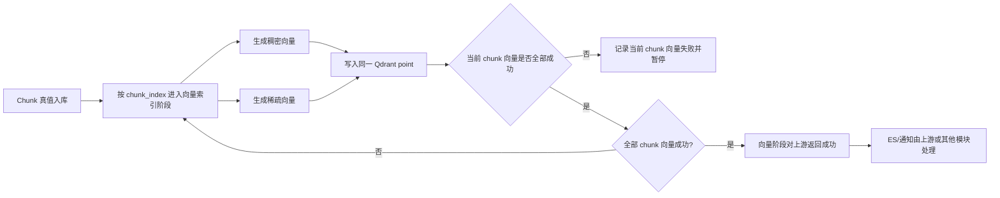

# 稀疏向量需求文档

## 1. 需求总述

本需求是在现有文档解析后处理链路中新增稀疏向量索引能力，用于补足纯稠密向量在关键词、实体、编号、术语、长尾词和混合中英文查询上的召回不稳定问题。首期目标不是交付完整混合检索，而是先把每个 chunk 的稀疏向量作为可恢复、可验证的检索资产稳定入库，为后续稠密检索、稀疏检索和混合检索打基础。

稀疏向量化应与稠密向量化同属“向量索引阶段”，而不是依赖 ES 入库完成后再作为独立尾部阶段执行。向量阶段只有在全部 chunk 完成稠密向量入库和稀疏向量入库后才可以对上游报告成功；任一 chunk 稀疏向量化失败，本轮向量索引阶段即失败，后续重试从失败或未完成的 chunk 继续。稀疏向量必须通过同一个 `chunk_id` 关联原分片，并与稠密向量写入同一个 Qdrant collection。

模型路线以 BGE-M3 为主选，SPLADE / SPLADE-like 模型仅作为备选评估。首期只使用 BGE-M3 的稀疏向量能力，不强制替换现有稠密向量模型；后续可评估是否统一切换为 BGE-M3 同时生成 dense vector 与 sparse vector。稀疏向量生成读取 chunk 原文 `content`，使用模型自身 tokenizer 和词表生成非零 token 的 `indices` + `values`，不依赖 ES analyzer 分词结果。

首期交付边界为：完成稀疏向量生成、同 collection 写入、分片级稀疏向量生命周期记录、失败续跑和基础可观测信息；不交付混合检索入口，不确定最终接口字段或表结构，不纳入 BGE-M3 multi-vector / ColBERT。模型部署方式已明确为本地部署 BGE-M3，并在本地完成开发测试；查询侧是否必须模型编码，以及稠密向量是否保持现状仍是后续技术设计需要决策的内容。

## 2. 目标、范围与验收

### 2.1 需求目标

- 支持对已生成的分片生成稀疏向量，并与原分片建立稳定关联。
- 以 BGE-M3 作为首期主选模型路线，同时保留 SPLADE / SPLADE-like 路线作为备选和对照分析。
- 保持现有稠密向量化链路的可用性，不因稀疏向量功能引入不可控回归；ES 相关事务不属于本需求处理范围。
- 为后续混合检索、RRF 或加权融合、rerank 提供可扩展基础。

### 2.2 范围与非目标

- **首期包含：**
  - 在现有向量索引阶段内新增稀疏向量化的业务语义。
  - BGE-M3 主选路线与 SPLADE / SPLADE-like 备选路线的需求差异。
  - 本地部署 `BAAI/bge-m3`，并在本地真实模型环境完成开发测试。
  - 稀疏向量索引与 `chunk_id`、稠密向量索引的关联要求。
  - 状态、补偿、灰度和可观测性要求。
- **本次明确不做：**
  - 不在需求文档中确定最终接口字段、表结构或类名。
  - 不提前实现检索 API。
  - 不把 BGE-M3 的 multi-vector / ColBERT 能力纳入首期必须范围。
  - 不采用“读取 ES 分词列表后，为每个 ES 分词逐个生成稀疏向量”的方案。
- **后续技术设计需明确：**
  - SPLADE / SPLADE-like 备选模型是否需要在首期实现扩展点，还是仅保留文档评估结论。

### 2.3 验收口径

首期验收以“链路可用、数据完整、失败可恢复、结果可验证”为主，不以模型论文指标作为唯一标准。至少需要满足：启用稀疏向量后，向量索引阶段会对同一文件的全部 chunk 同步推进稠密向量和稀疏向量；每个成功 chunk 都能通过 `chunk_id` 找到对应稠密向量和稀疏向量索引；任一 chunk 失败时向量阶段不会对上游报告成功；重试可以从失败或未完成 chunk 继续；重复执行不会生成重复索引；稀疏向量生成不读取 ES 分词结果。

首期已明确不交付混合检索入口，因此验收不要求验证稠密向量检索、稀疏向量检索和混合检索的完整返回效果。首期至少需要提供可观测的入库覆盖率、失败 chunk 列表、模型版本、稀疏向量非零 token 数和补偿重试结果，保证后续检索改造有可信的数据基础。

## 3. 项目上下文

### 3.1 可能涉及的模块

| 模块/能力 | 当前作用 | 与本需求的关系 | 交付判断 |
| :--- | :--- | :--- | :--- |
| `ParseTaskPipeline` | 编排解析、分片、向量索引和结果流转 | 需要接收向量阶段 dense+sparse 聚合结果；ES 和最终通知事务不由本需求处理 | 已纳入 |
| `VectorStorageFacade` / `VectorStoragePipeline` | 稠密向量写 MySQL + Qdrant | 稀疏向量应接入同一向量索引阶段，复用分片真值、owner、bucket、`chunk_id` 和补偿思路 | 已纳入 |
| `EsIndexingPipeline` | 将分片文本写入 ES | ES 事务不属于本需求处理范围；稀疏向量不依赖 ES 成功，也不消费 ES analyzer 的分词结果 | 明确排除 |
| `QdrantIndexStore` | 管理 Qdrant collection 和 point | 稀疏向量落在同一 Qdrant collection，需要支持 sparse vector 或 named vector 结构 | 待技术设计确认 |
| `kb_document_chunk` | 分片真值源 | 需要记录稀疏向量模型、状态或补偿依据 | 待技术设计确认 |
| `document_post_process_pipeline` | 文件级后处理状态 | 向量阶段成功语义需要扩展为 dense 和 sparse 均成功；无需把 sparse 设计成 ES 后的独立文件级阶段 | 已纳入 |

### 3.2 现有流程关系

- **新增链路：** 是，在向量索引阶段内新增稀疏向量化与同 point 写入。
- **改造链路：** 是，向量索引阶段的成功边界调整为稠密向量化和稀疏向量化全部成功；ES 入库、ES 补偿和最终通知事务不由本需求处理。
- **复用能力：** 可复用现有分片、owner、Qdrant 分桶、文件级状态、失败通知和补偿设计。
- **ES 分词关系：** 稀疏向量化阶段读取分片原文 `content`，主选使用 BGE-M3 自己的模型分词器和模型词表生成稀疏向量；SPLADE / SPLADE-like 备选方案也必须使用自身模型分词器；不依赖 ES 分词结果。
- **兼容影响：** 首期目标形态为稀疏向量与稠密向量写入同一个 Qdrant collection；技术设计阶段需要确认现有 collection 是否支持追加 sparse vector / named vector 配置，如不支持，需要设计迁移或重建策略。

### 3.3 关键约束与复用依据

- MySQL chunk 表是当前分片真值源，Qdrant 是向量索引副本；ES 事务不纳入本需求的一致性边界。
- 当前稠密向量化阶段已经具备“全部分片成功后才算文件级向量化成功”的保守语义。
- ES 阶段不由本需求处理，本文只约束稀疏向量不读取 ES 分词结果、不依赖 ES 成功。
- ES analyzer 的 token 空间与 BGE-M3 / SPLADE 的模型分词器空间不同，不能把 ES 分词结果直接作为稀疏向量输入。
- Qdrant 官方支持 sparse vector，并以 `indices` + `values` 表示非零元素；也支持通过向量名称指定查询使用的 vector。
- 稠密向量和稀疏向量是同一分片的两种检索表示，应共用 `chunk_id`、Qdrant collection 和 point；ES 不应成为稀疏向量生成的前置依赖。

## 4. 模型路线分析

### 4.1 BGE-M3 主选方案

BGE-M3 是一个多功能 embedding 模型，官方定位同时支持稠密向量检索、稀疏向量检索和 multi-vector retrieval；同时支持多语言和最长 8192 token 级别输入。它的稀疏输出通常称为 lexical weights，可以直接用于词项权重匹配。

从需求角度，BGE-M3 是首期主选方案。它的主要吸引力是“统一模型”：如果后续稠密向量也切到 BGE-M3，则一次模型路线可以同时覆盖稠密向量和稀疏向量，并为未来 ColBERT / multi-vector 留出口。当前项目的稠密向量模型已由系统 embedding 配置驱动，直接切换会影响现有稠密向量结果分布，因此首期建议先使用 BGE-M3 的稀疏向量能力，不强制替换当前稠密向量模型。

需求上需要保留一条中长期优化路线：如果后续评测确认 BGE-M3 的稠密向量召回效果满足业务要求，并且可以接受历史向量重建、collection 迁移和推理资源变化，则可以考虑将当前向量化链路统一切换为 BGE-M3，由同一个模型服务同时生成 dense vector 和 sparse vector。这样可以减少模型提供方差异，统一 batch、超时、重试、版本记录和重建索引策略；但这属于链路统一优化，不应在首期稀疏向量接入时强制完成。

BGE-M3 首期需求重点：

- 支持只取稀疏向量 lexical weights，避免把 multi-vector 变成首期范围。
- 支持与当前稠密向量模型不同源，允许稠密向量继续使用现有 `SYSTEM_LLM_MODEL_EMBEDDING`。
- 支持在后续评估中切换到“BGE-M3 同时产出稠密向量 + 稀疏向量”的统一向量化路径。
- 首期目标改为本地部署 BGE-M3，并在本地真实模型环境完成开发测试；需要评估 569M 级模型在目标机器上的 GPU/CPU 延迟、显存/内存占用、batch size 和长文本截断策略。

#### 4.1.1 中文支持判断

BGE-M3 官方定位是 multi-lingual，模型卡说明支持 100+ 工作语言，并且基于 `xlm-roberta` 路线，适合多语言和中文场景作为首选候选。对本项目而言，如果文档主体包含中文，BGE-M3 比英文 SPLADE checkpoint 更适合做默认稀疏向量模型提供方。

需要注意的是，BGE-M3 的中文支持并不自动等于“在本业务语料上最好”。术语、产品名、编号、表格字段、代码片段、混合中英文等场景仍需要项目内评测。需求上应明确：中文场景首期至少要建立一组 query-document 标注或人工验收样例，用于比较 BM25、稠密向量检索、BGE-M3 稀疏向量检索、混合检索的效果。

#### 4.1.2 BGE-M3 调用方式

离线/本地调用推荐使用 `FlagEmbedding`：

```python
from FlagEmbedding import BGEM3FlagModel

model = BGEM3FlagModel("BAAI/bge-m3", use_fp16=True)
output = model.encode(
    ["chunk text"],
    batch_size=12,
    max_length=8192,
    return_dense=False,
    return_sparse=True,
    return_colbert_vecs=False,
)
sparse = output["lexical_weights"]
```

查询侧同样调用 `encode(..., return_sparse=True)` 得到 lexical weights，再转换为 Qdrant sparse vector 的 `indices` 和 `values`。如果后续决定让 BGE-M3 同时生成稠密向量和稀疏向量，可把 `return_dense=True` 打开，但这会影响现有稠密向量分布，需要单独迁移。

首期不采用公共在线 API 或云端托管 API。BGE-M3 必须在本地环境加载和执行，以保证 lexical weights 输出契约、模型版本、数据边界和开发测试可控。工程实现可以先采用进程内 `FlagEmbedding` 调用；如果后续需要隔离模型资源，可在同一内网或同机部署本地模型服务，但仍按本地部署目标管理。

#### 4.1.3 BGE-M3 可选模型与形态

截至 2026-05-16，根据 BAAI 官方模型卡、BGE 文档和 BGE-M3 论文，BGE-M3 相关模型可以理解为一条训练链路上的三个层级，而不是三个效果相近的业务候选模型。首期业务落地只建议评估最终版 `BAAI/bge-m3`。

| 模型 | 官方定位 / 训练阶段 | 效果判断 | 部署形态 | 适用建议 |
| :--- | :--- | :--- | :--- | :--- |
| `BAAI/bge-m3` | 最终统一微调版；从 `bge-m3-unsupervised` 继续训练，同时支持 dense、sparse lexical weights、ColBERT multi-vector | 业务效果最完整，是官方主推的多语言、多功能、长文本检索模型；用于稀疏向量和后续 dense + sparse 统一链路 | 本地进程内 / 本地独立模型服务 | 主选方案；首期必须在本地部署并完成开发测试 |
| `BAAI/bge-m3-unsupervised` | 中间无监督/对比学习底座；从 `bge-m3-retromae` 继续训练 | 适合研究、微调或对照，不应预期达到最终版 `BAAI/bge-m3` 的业务检索效果 | 离线本地 | 不建议首期直接作为业务默认 |
| `BAAI/bge-m3-retromae` | 更底层预训练底座；将 XLM-RoBERTa 上下文长度扩展到 8192 并继续 RetroMAE 预训练 | 更接近预训练基础模型，不是面向最终检索效果的开箱即用 embedding 模型 | 离线本地 | 不建议首期直接使用 |

模型效果结论是：首期不要在三个 BGE-M3 变体中做业务 AB 测试，默认只落地 `BAAI/bge-m3`。`bge-m3-unsupervised` 和 `bge-m3-retromae` 只在后续需要自训练、微调或排查模型链路时作为底座参考。

#### 4.1.4 BGE-M3 稀疏向量维度

BGE-M3 的 dense embedding 维度是 1024，但它的稀疏向量维度不是 1024。BGE-M3 基于 XLM-RoBERTa 路线，模型配置中的 `vocab_size` 为 250002，因此 lexical weights 对应的是 250002 维词表空间中的非零 token 权重。实际模型输出通常是 `token_id -> weight` 字典，落到 Qdrant sparse vector 时应转换为 `indices` 和 `values`。

这意味着 BGE-M3 的稀疏向量理论维度明显大于常见 NAVER SPLADE 的 30522 维，但实际存储成本主要取决于每个分片激活的非零 token 数，而不是词表总维度。技术设计阶段需要为 BGE-M3 单独评估非零 token 数、top-k 截断、min weight 过滤、长文本截断和 Qdrant sparse vector 写入体积，不能用 dense 向量维度估算存储和检索成本。

### 4.2 SPLADE 备选与对照方案

SPLADE 是学习型稀疏检索模型，会把查询文本和文档分片映射到同一模型词表空间，输出 `token_id -> weight` 形式的稀疏表示。它的价值不是简单替代 BM25，而是通过神经模型预测词项权重，并可激活原文中没有出现但语义相关的扩展 token。

根据 `docs/splade.pdf`，SPLADE 相关落地判断包括：

- SPLADE / SPLADE-max：查询文本和文档分片都生成稀疏向量表示，召回效果通常更强，但查询时也需要运行查询编码器。
- SPLADE-doc：只离线生成文档侧稀疏向量，查询侧使用原始查询 token，查询更轻，但查询侧没有语义扩展能力。
- SPLADE 与 BM25 的主要区别在于权重来源：BM25 来自统计量，SPLADE 来自神经模型预测和语义扩展。
- 在 RAG 中，SPLADE 适合作为稠密向量召回的并行召回链路，尤其补足关键词、实体、编号、术语、长尾词匹配。
- 稀疏向量结果应与稠密向量结果按同一 `chunk_id` 融合、去重和回表。

从需求角度，SPLADE 路线适合作为备选与对照方案，用于验证专门学习型稀疏检索模型在关键词、术语和实体召回上的收益。考虑到常见 NAVER SPLADE checkpoint 以英文为主，中文场景不建议把 SPLADE 作为首期默认模型，除非选择明确支持中文或多语言的 SPLADE-like 模型，或者建立中文业务评测集后证明其效果优于 BGE-M3。

#### 4.2.1 中文支持判断

SPLADE 本身是一类稀疏检索建模方法，不等于某一个天然支持中文的模型。常见的 `naver/splade-cocondenser-ensembledistil`、`naver/splade-v3` 等 checkpoint 主要围绕英文检索数据和英文模型分词器生态发布，典型训练集是 MS MARCO。它们可以处理 Unicode 文本，但“模型分词器能处理中文字符”不等于“中文检索效果可靠”。中文场景下，直接把英文 SPLADE checkpoint 作为默认稀疏向量模型风险较高。

如果后续需要评估 SPLADE 路线，至少需要满足一个条件：使用明确面向中文或多语言训练过的学习型稀疏检索模型；对现有 SPLADE 方法做中文语料微调，并建立中文检索评测集；或者采用 doc-only / inference-free 类多语言稀疏模型，以降低在线查询成本。

可关注的 SPLADE 相近候选是 OpenSearch 的 `opensearch-neural-sparse-encoding-multilingual-v1`。它不是 NAVER 原版 SPLADE checkpoint，但属于学习型稀疏检索 / 文档扩展路线，模型卡标注基于 MIRACL 多语言数据，评测表包含 `zh`，并提供 doc-only 查询侧模型分词器 + 权重表模式。对中文优先的项目来说，它比英文 SPLADE checkpoint 更适合作为“中文稀疏向量模型”备选。

#### 4.2.2 SPLADE 调用方式

离线/本地调用通常有两类：

```python
from sentence_transformers.sparse_encoder import SparseEncoder

model = SparseEncoder("naver/splade-cocondenser-ensembledistil")
document_sparse = model.encode_document(["chunk text"])
query_sparse = model.encode_query(["query text"])
```

或使用 Transformers 自行执行 MLM 输出、ReLU/log/max pooling、top-k 截断和特殊 token 过滤。第二种方式灵活，但需要自己维护后处理一致性，不建议作为首期默认。

在线调用有三种形态：

- 自建 Python inference service：FastAPI/gRPC 包装 Sentence Transformers 或 Transformers，项目通过 HTTP 调用。
- Hugging Face Inference Endpoint / 云厂商托管：部署快，但中文效果、模型冷启动、成本和数据出境要单独评估。
- OpenSearch ML Commons：如果索引也落 OpenSearch，可把 neural sparse 模型注册到 OpenSearch 集群内；当前项目已有 ES，而不是 OpenSearch，需要先确认是否愿意引入 OpenSearch 特性。

#### 4.2.3 SPLADE 可选模型

| 模型 | 语言判断 | 部署形态 | 适用建议 |
| :--- | :--- | :--- | :--- |
| `naver/splade-cocondenser-ensembledistil` | 英文为主 | 离线本地 / HF endpoint | 可用于英文验证，不建议作为中文默认 |
| `naver/splade-v3` / `naver/splade-v3-doc` | 英文为主 | 离线本地 / HF endpoint | 可用于 SPLADE 新版本验证，中文仍需评测 |
| `naver/efficient-splade-*` | 英文为主 | 离线本地 | 适合关注效率的英文场景 |
| `opensearch-project/opensearch-neural-sparse-encoding-multilingual-v1` | 多语言，包含中文评测 | OpenSearch 内置 / 离线本地 / HF | 中文稀疏向量备选，尤其适合 doc-only 低查询成本路线 |

#### 4.2.4 SPLADE 稀疏向量维度

SPLADE 的稀疏向量维度等于模型词表大小，不等于 dense embedding 常见的 768、1024 或 4096 这类向量维度。常见 NAVER SPLADE / BERT 系列 checkpoint 基于 BERT 词表，稀疏向量空间通常是 30522 维；每个维度对应一个 WordPiece token，模型输出的是少量非零 token 的权重。实际写入 Qdrant sparse vector 时，不需要保存完整 30522 维数组，只需要保存非零 token 的 `indices` 和 `values`。

如果采用 SPLADE-like 的多语言模型，维度需要按具体模型词表重新确认。例如 OpenSearch 的 `opensearch-neural-sparse-encoding-multilingual-v1` 文档侧会编码到 105879 维稀疏空间，并通过剪枝控制实际非零 token 数。因此需求上不能把“SPLADE 维度”写死为统一常量，只能把“维度等于模型词表大小，入库存非零项”作为通用约束。

### 4.3 本地部署路线

本节针对首期 BGE-M3 稀疏向量落地。SPLADE / SPLADE-like 的在线或托管形态只作为后续备选模型评估，不影响首期 BGE-M3 本地部署目标。

| 方案 | 优点 | 缺点 | 当前建议 |
| :--- | :--- | :--- | :--- |
| 本地进程内调用 | 接入快，开发测试路径短，数据不出本机，便于直接验证 `FlagEmbedding` 输出 | 占用 API 进程资源，模型加载慢，多 worker 会重复占用显存/内存 | 首期开发测试默认路线 |
| 本地独立模型服务 | 数据可控，输出结构可控，便于 GPU 复用、限流、批处理和热加载 | 需要部署、监控、健康检查和本地服务治理 | 首期工程化落地优先演进 |
| 公共在线 API / 云端托管 | 免本地 GPU 运维 | 数据边界、成本、冷启动、限流、模型版本和 sparse lexical weights 输出不可控 | 首期不采用 |
| OpenSearch 内置 neural sparse | ingestion/search 一体化，doc-only 模式成熟 | 需要引入 OpenSearch 特性，和当前 ES/Qdrant 架构不完全一致 | 作为中文 SPLADE-like 候选评估 |

短期建议采用“本地 BGE-M3 + Qdrant sparse vector”的方式。开发阶段优先进程内调用 `FlagEmbedding`，确保输出结构、异常边界、top-k/min-weight 过滤和 Qdrant 写入闭环可测；工程化阶段再评估是否抽成同机或内网本地模型服务。这样不改变现有 LLM provider 契约，也不要求 ES 承担模型推理。后续如果 BGE-M3 的稠密向量效果也通过评估，再考虑是否把稠密向量和稀疏向量合并到同一 BGE-M3 embedding 服务。

### 4.4 BGE-M3 与 SPLADE 的需求差异

| 维度 | BGE-M3 | SPLADE |
| :--- | :--- | :--- |
| 核心定位 | 稠密向量、稀疏向量、multi-vector 统一模型 | 专门的学习型稀疏检索模型 |
| 输出形态 | 稠密向量、lexical weights、ColBERT vectors 可同时输出 | `token_id -> weight` 稀疏向量 |
| 稀疏向量理论维度 | 词表维度为 250002 维；dense embedding 维度为 1024，但 sparse lexical weights 不按 1024 维计算 | 常见 NAVER / BERT 系列约 30522 维；多语言 SPLADE-like 模型按自身词表确定，例如 OpenSearch multilingual neural sparse 为 105879 维 |
| 实际入库存储 | 只保存 lexical weights 中非零 token 的 `indices` 和 `values`，存储成本取决于非零 token 数和剪枝策略 | 只保存非零 token 的 `indices` 和 `values`，不保存完整高维数组 |
| 对当前稠密向量的影响 | 若只用稀疏向量，影响小；若统一稠密向量 + 稀疏向量，会影响现有稠密向量分布 | 可以完全独立于现有稠密向量模型 |
| 查询成本 | 稀疏向量查询也需要模型生成 lexical weights | 标准 SPLADE 需要查询编码器；SPLADE-doc 查询更轻 |
| 中文支持 | 官方强调多语言能力，更适合作为中文首选候选 | 原版常见 checkpoint 英文为主；中文需选多语言变体或微调 |
| 可调用模型 | `BAAI/bge-m3` | NAVER SPLADE、efficient SPLADE、OpenSearch multilingual neural sparse |
| 首期建议 | 主选方案；首期先启用稀疏向量能力，后续评估是否统一 dense + sparse | 备选和对照方案；英文/专业稀疏向量验证可选，中文默认需谨慎 |

## 5. 全链路推演

### 5.1 完整过程描述

文档解析任务仍由 MQ 触发。系统完成源文件解析、Markdown 上传、分片后，先按现有逻辑将分片全量写入 MySQL，并按 `chunk_index` 顺序进入向量索引阶段。启用稀疏向量时，当前 chunk 需要同时完成稠密向量化、BGE-M3 稀疏向量化和同一 Qdrant point 写入，才允许该 chunk 的向量索引状态收敛为成功。所有分片的向量索引成功后，向量阶段对上游返回成功；ES 后续事务由上游或其他模块处理。

稀疏向量化需要读取同一批分片的原文 `content`，按 `chunk_index` 顺序调用 BGE-M3 稀疏向量模型提供方生成稀疏向量；SPLADE / SPLADE-like 模型保留为备选扩展。该能力不读取也不依赖 ES analyzer 的分词结果；BGE-M3 或其他稀疏向量模型会使用各自模型分词器，在模型词表空间内生成非零 token 的 `indices` 和 `values`。每个稀疏向量通过同一 `chunk_id` 与 MySQL chunk、Qdrant 稠密向量 point 建立关联。只有同一文件内全部分片的稠密向量和稀疏向量都生成并入库成功后，文件级向量阶段才算成功。

如果任一分片的稠密向量或稀疏向量失败，需要记录失败分片、失败原因和可恢复入口，本轮向量阶段不算成功。后续重试从失败分片开始，成功后继续处理后续分片，直到该文件全部分片的稠密向量和稀疏向量都完成。已经成功的前置分片不应重复生成或重复写入；如果必须重复 upsert，也必须按 `chunk_id` 保持幂等覆盖。

### 5.2 主流程图



### 5.3 关键步骤

#### 步骤 1：向量索引阶段同时推进稠密向量和稀疏向量

- **触发/参与方：** `VectorStoragePipeline` / `VectorStorageFacade`
- **系统动作：** 在现有 dense 向量索引闭环中，为当前 chunk 同步生成稀疏向量并写入同一 Qdrant point。
- **输入/依赖：** `payload`、分片原文 `content`、owner 信息、dense embedding 配置、BGE-M3 配置、Qdrant collection 配置；不依赖 ES 分词结果。
- **输出/结果：** 当前 chunk 的 dense vector 和 sparse vector 均完成后，才回写该 chunk 的向量阶段成功。
- **失败影响：** 一旦稀疏向量功能对当前任务启用，配置不完整、模型不可用或任一分片处理失败都应阻断向量阶段成功，并进入可恢复失败。
- **待确认：** 稀疏向量功能是否默认开启，还是灰度开启。

#### 步骤 2：生成稀疏向量

- **触发/参与方：** SPLADE 模型提供方或 BGE-M3 模型提供方。
- **系统动作：** 对分片内容生成稀疏向量，并进行 top-k、min weight、空向量校验。
- **输入/依赖：** 分片正文 `content`、模型名称、batch size、模型分词器、设备资源。
- **输出/结果：** 每个分片得到 `indices` + `values`。
- **失败影响：** 模型超时、OOM、输出为空、输出格式异常都会导致当前分片的稀疏向量化失败；文档稀疏向量化阶段暂停在该分片，后续从该分片重试。
- **待确认：** 是否允许空稀疏向量作为成功，还是必须视为失败。

#### 步骤 3：写入稀疏向量索引

- **触发/参与方：** Qdrant 稀疏向量索引存储。
- **系统动作：** 在稠密向量所在的同一个 Qdrant collection 内，以同一 `chunk_id` 写入稀疏向量表示。
- **输入/依赖：** 稀疏向量、分片 owner payload、collection/index 配置。
- **输出/结果：** 分片具备后续稀疏向量检索或混合检索所需的索引数据。
- **失败影响：** 可能产生稠密向量已成功、稀疏向量未完成的不一致场景；该状态下向量阶段不能成功，应进入可恢复失败并保留失败分片续跑入口。
- **已确认：** 稀疏向量与稠密向量应写入同一个 Qdrant collection；同 point / named vector 的具体结构留到技术设计确认。

#### 步骤 4：批处理、统一入库与增量续跑

- **触发/参与方：** 稀疏向量化阶段内部执行器。
- **系统动作：** 首期需要在两种向量化方案中选择其一，并确认对应的批处理边界。
- **方案一：稠密向量保持现状，在同一向量阶段新增 BGE-M3 稀疏向量。** 当前稠密向量模型配置和历史向量分布保持不变；当前 chunk 同步完成 dense vector 与 BGE-M3 sparse vector 的同 point 写入。该方案迁移风险较小，适合首期。
- **方案二：稠密向量和稀疏向量统一使用 BGE-M3。** 同一次 BGE-M3 调用可同时产出 dense vector 和 sparse lexical weights，模型服务、batch、超时和版本记录更统一；但会改变现有稠密向量分布，通常需要历史向量重建、Qdrant collection 迁移或双写灰度，不建议首期直接采用。
- **批处理语义：** 对同一批分片，模型输出数量必须与输入分片数量一致，并保持输入顺序或提供可回填的分片标识。输出缺失、顺序不可确认、格式异常时，本批应视为失败。
- **写入一致性语义：** 稀疏向量复用现有稠密向量化策略，不追求 MySQL 与 Qdrant 的跨库事务。执行方式是：先保证分片真值和稀疏向量生命周期可被查询，再按 `chunk_index` 逐个 chunk 推进状态；当前 chunk 进入处理中后生成稀疏向量、按 `chunk_id` upsert Qdrant，upsert 成功后再把该 chunk 标记为稀疏向量 INDEXED。
- **部分失败语义：** 与现有稠密向量化一致，失败边界落在当前 chunk。当前 chunk 失败时，只把当前 chunk 标记为失败，已完成 chunk 保持成功，后续 chunk 保持待处理；文件级结果通过 `total_chunks / indexed_chunks / failed_chunk_ids` 或等价汇总判断。只有同一文件内所有 chunk 都完成稀疏向量 upsert，并且状态都回写为成功，向量阶段才允许对上游报告成功。
- **增量续跑语义：** 重试入口拿到同一文件的分片列表后，应按 `chunk_index` 遍历分片状态；已完成稀疏向量化的分片跳过，遇到第一个未完成或失败分片时从该分片继续处理。
- **失败影响：** 批量模型调用或批量入库中任一分片失败时，本轮文档稀疏向量化不算成功；需要记录失败分片位置，后续从失败分片继续。
- **待确认：** 首期是否明确采用方案一；如果未来采用方案二，需要单独评估历史稠密向量重建、灰度和回滚策略。

#### 步骤 5：检索融合（后续预留）

- **触发/参与方：** 后续检索入口。
- **系统动作：** 后续可由查询侧生成稠密查询向量和稀疏查询向量，分别召回后按 `chunk_id` 融合。
- **输入/依赖：** query、检索模式、融合参数、rerank 配置。
- **输出/结果：** 返回去重后的分片候选。
- **失败影响：** 稀疏向量索引覆盖不完整时，混合检索结果可能不稳定。
- **已确认：** 首期只完成稀疏向量存储和索引写入入口，不实现混合检索入口改造。

## 6. 状态与数据变化

- **核心对象：** 文件级向量阶段记录、分片、Qdrant 稠密向量 point、Qdrant 稀疏向量 point/vector。
- **状态变化：**
  - 稀疏向量化不新增独立文件级 `sparse_indexing_status` 阶段；开启稀疏向量后，文件级 `vectorizing_status` 的成功语义扩展为 dense 和 sparse 均成功。
  - 文件级向量阶段仍表达 `PENDING/PROCESSING/SUCCESS/FAILED`；其中 `SUCCESS` 要求全部有效 chunk 的 `dense_vector_status=INDEXED`，且 `sparse_vector_status=INDEXED`。
  - 分片级必须新增独立 `sparse_vector_status`，状态表达为 `PENDING/INDEXING/INDEXED/FAILED/DELETING/DELETED/DELETE_FAILED`，用于从失败分片开始续跑。
  - 分片级状态作为续跑判断依据：重试时按 `chunk_index` 顺序读取每个 chunk 的稀疏向量化状态，跳过已 `INDEXED` 的 chunk，从第一个未成功的 chunk 继续。文件级状态只做汇总，不作为唯一续跑依据。
  - 不建议只复用现有 `dense_vector_status`，否则稠密向量成功和稀疏向量成功会混在一起，排障和补偿边界不清。
  - 增量续跑时，应以分片级稀疏向量生命周期判断是否跳过已完成分片，避免重复消耗模型额度。
- **关键数据：**
  - 稀疏向量模型提供方、稀疏向量模型名称、稀疏向量非零 token 数、失败 `chunk_id`、失败 `chunk_index`、失败原因、耗时。
  - `chunk_id` 需要继续作为 MySQL、Qdrant 稠密向量 / 稀疏向量之间的统一关联键。
- **链路标识：** `task_id`、`doc_id`、`set_id`、`user_id`、`chunk_id`。

## 7. 重点风险

| 风险 | 为什么重要 | 如果不处理会怎样 | 当前建议 |
| :--- | :--- | :--- | :--- |
| 稀疏向量续跑游标不准确 | 当前确认要求从失败分片继续处理 | 可能跳过分片或重复处理大量已成功分片 | 记录失败 `chunk_id` 和 `chunk_index`，按文档顺序续跑 |
| 同 collection 改造破坏已有 Qdrant collection | Qdrant 已有 collection 可能不是 named vector + sparse 配置 | 线上迁移可能需要重建 collection，影响读取 | 目标形态仍为同 collection；技术设计阶段评估追加 sparse vector、迁移窗口或重建策略 |
| BGE-M3 / SPLADE 输出词表不一致 | 稀疏向量检索要求查询文本和文档分片在同一模型词表空间 | 查询侧稀疏向量和文档侧稀疏向量不可比，召回失真 | 同一模型提供方下查询侧和文档侧必须绑定同一模型与模型分词器 |
| 误用 ES 分词结果生成稀疏向量 | ES analyzer 与模型分词器不是同一词表空间 | 查询侧和文档侧稀疏向量无法正确匹配，或不同模型结果不可比较 | 稀疏向量化阶段必须基于分片原文和模型分词器生成 |
| 批量输出与输入分片无法一一对应 | 批量向量化需要把模型输出准确回填到分片 | 可能把 A 分片的稀疏向量写到 B 分片的 `chunk_id` 下 | 批量输出必须校验数量、顺序和分片标识 |
| 底层索引不支持事务性统一入库 | Qdrant upsert 通常不是 MySQL 事务的一部分 | 可能出现部分 point 已写入、状态未回写的不一致 | 复用现有稠密向量策略：按 chunk 状态推进、`chunk_id` 幂等 upsert、失败 chunk 单独标记、文件级汇总判断成功 |
| 稀疏向量非零 token 过多 | 稀疏索引体积和检索延迟会升高 | Qdrant 存储和查询成本不可控 | 需求中保留 top-k 和 min weight 配置 |
| BGE-M3 统一稠密向量 + 稀疏向量影响现有稠密向量语义 | 当前稠密向量由系统 embedding 配置控制 | 切换后历史向量不可直接混用 | 首期不要强制替换稠密向量模型 |
| 向量阶段内 dense/sparse 部分成功引入新不一致 | dense 向量、sparse 向量和 MySQL 状态分别落在不同写入动作 | 可能出现 dense 已写入、sparse 未完成，或 Qdrant 已写但状态未回写 | 保持 dense 与 sparse 分片状态独立，文件级向量阶段从严汇总，并复用失败 chunk 续跑与幂等 upsert |
| 英文 SPLADE 直接用于中文 | 常见 NAVER SPLADE checkpoint 主要是英文检索路线 | 中文召回可能弱于 BM25 或稠密向量检索，且难以解释 | 中文默认优先评估 BGE-M3 或多语言稀疏向量模型 |
| 本地 BGE-M3 运行资源不足 | 569M 级模型会占用显存/内存，长文本和 batch 会放大资源压力 | 本地开发测试无法稳定运行，可能影响主 API 进程 | 开发期先用小 batch、短样本文档和显式真实测试开关；工程化阶段评估本地独立模型服务、GPU 机器或 CPU 降级性能 |

## 8. 可扩展性判断

### 8.1 需要现在考虑

- 稀疏向量模型提供方抽象应以 BGE-M3 为主选实现，并保留 SPLADE / SPLADE-like 备选实现扩展点。
- BGE-M3 不仅能生成稀疏向量，也能生成稠密向量和 ColBERT multi-vector；因此需要预留“向量化链路统一切换为 BGE-M3”的中长期方案，但首期方案应优先保持现有稠密向量链路不变，只新增 BGE-M3 稀疏向量。
- 稀疏向量结果模型应独立于稠密向量 embedding 的 `list[float]`，表达 `indices` + `values`。
- 稀疏向量化执行器应优先支持批处理能力，并保留单分片降级路径。
- 检索入口应预留稠密向量检索、稀疏向量检索、混合检索三种模式，但首期不交付检索入口改造。
- 融合策略至少预留 RRF 和加权融合两类配置。
- 模型输出需要记录版本，后续重建稀疏向量索引时能够判断是否需要全量重算。

### 8.2 只需简单预留

- BGE-M3 的 multi-vector / ColBERT 输出暂不纳入首期，但模型提供方返回结构可以避免把它彻底堵死。
- 稠密向量和稀疏向量统一使用 BGE-M3 属于中长期方案，需要等待业务评测、历史向量重建策略和灰度方案成熟后再进入实施。
- SPLADE-doc 可作为低延迟方案预留，不作为默认首期目标。
- ES 内建 sparse/vector 能力暂不作为首选，但可在技术设计阶段与 Qdrant 方案比较。

### 8.3 暂不建议处理

- 不建议首期同时改造稠密向量模型为 BGE-M3。
- 不建议首期引入复杂在线学习或自动权重调参。
- 不建议首期把 BM25、SPLADE、BGE-M3、ColBERT 全部纳入同一版交付。

## 9. 决策与待确认项

| 编号 | 问题 | 为什么必须确认 | 不确认的影响 | 当前状态 |
| :--- | :--- | :--- | :--- | :--- |
| Q1 | 稀疏向量入库失败是否导致向量阶段失败 | 决定向量阶段成功语义和状态模型 | 无法设计文件级向量状态和补偿 | 已确认：会导致本轮向量阶段失败，需从失败分片起重试；ES 和最终通知事务不由本需求处理 |
| Q2 | 首期模型路线是否以 BGE-M3 为主选、SPLADE 仅作为备选评估 | 决定部署依赖、输出格式和检索查询侧实现 | 如果仍按多主选模型设计，技术设计会在模型接口上过度扩展 | 已确认主选 BGE-M3；SPLADE 作为备选评估，扩展点范围待技术设计确认 |
| Q3 | 稀疏向量索引落在 Qdrant 同 collection、新 collection，还是 ES | 决定迁移策略和检索融合方式 | 影响存储结构、灰度、回滚和补偿 | 已确认：放在同一个 Qdrant collection；具体 named vector / sparse vector 配置待技术设计确认 |
| Q4 | 首期是否实现混合检索入口，还是只完成稀疏向量入库 | 决定验收口径 | 可能出现“入库完成但效果无法验证” | 已确认：首期只完成稀疏向量存储和索引写入入口，不实现混合检索入口 |
| Q5 | 稀疏向量查询侧是否必须走模型编码 | BGE-M3 与 SPLADE / SPLADE-doc 的查询成本不同 | 影响在线延迟和服务部署 | 待确认 |
| Q6 | 首期文档语言是否以中文为主 | 决定 BGE-M3 主选方案的评测重点，以及 SPLADE 备选是否需要中文或多语言版本 | 模型效果评测可能失真 | 已确认：首期以中文为主，验收样例优先覆盖中文和混合中英文内容 |
| Q7 | BGE-M3 具体采用哪个模型，以及采用何种本地部署形态 | 模型变体决定效果基线，部署形态决定资源占用、延迟和调用契约 | 选错底座模型会导致效果不稳定；部署方式不清会影响配置项、超时、重试和批处理策略 | 已确认：首期使用最终版 `BAAI/bge-m3`，本地部署并完成本地开发测试；先支持进程内 `FlagEmbedding`，后续可演进为本地独立模型服务 |
| Q8 | 失败重试进度记录在哪里：只在文件级记录“当前失败 chunk_index”，还是给每个 chunk 单独记录 sparse 状态 | 决定失败后如何准确找到续跑起点，以及补偿任务如何查询未完成 chunk | 如果只记文件级游标，排障简单但状态不细；如果记分片级状态，续跑准确但需要更多字段和维护逻辑 | 已确认：需要记录每个 chunk 是否稀疏向量化成功；分片级状态作为续跑判断依据，文件级状态只做汇总 |
| Q9-A | 方案一：稠密向量保持现状，只新增 BGE-M3 稀疏向量 | 迁移风险小，不改变现有 dense embedding 分布，符合首期只做稀疏向量存储的范围 | 需要额外维护当前稠密模型与 BGE-M3 稀疏模型两套模型调用和版本记录 | 待确认是否作为首期默认方案 |
| Q9-B | 方案二：稠密向量和稀疏向量都统一使用 BGE-M3 | 模型服务、batch、版本和重建策略更统一，后续 hybrid 能力更一致 | 会改变现有稠密向量分布，需要历史向量重建、collection 迁移或双写灰度，首期风险较高 | 待确认是否仅作为后续演进方案 |
| Q10 | 一批 chunk 写入时，部分成功、部分失败怎么办；怎样保证不会误报文档成功 | 需要明确“成功”的边界是全部 chunk 都写入并标记完成，而不是模型调用成功或部分 upsert 成功 | 如果边界不清，可能出现部分 chunk 有稀疏向量、部分没有，但文件被误判成功 | 已确认：复用现有稠密向量化策略，按 chunk 推进状态，`chunk_id` 幂等 upsert，当前 chunk 失败只标记当前 chunk，文件级成功必须满足全部 chunk 成功 |
| Q11 | 稀疏向量功能默认开启还是灰度开启 | 决定旧链路兼容、发布范围和失败影响面 | 如果直接默认开启，模型服务或 Qdrant sparse 配置问题会影响全部解析任务 | 待确认 |
| Q12 | 空稀疏向量是否允许作为成功结果 | 决定模型输出校验和失败边界 | 如果允许空向量，后续检索可能出现不可召回 chunk；如果不允许，短文本或特殊内容可能更容易失败 | 待确认 |

## 10. 参考资料

- `docs/splade.pdf`：本项目已有 SPLADE 分析资料，创建时间为 2026-05-12。
- BAAI `BAAI/bge-m3` 模型卡：<https://huggingface.co/BAAI/bge-m3>
- BAAI `BAAI/bge-m3-unsupervised` 模型卡：<https://huggingface.co/BAAI/bge-m3-unsupervised>
- BAAI `BAAI/bge-m3-retromae` 模型卡：<https://huggingface.co/BAAI/bge-m3-retromae>
- BGE 官方文档 BGE-M3：<https://bge-model.com/bge/bge_m3.html>
- BGE-M3 论文：<https://arxiv.org/abs/2402.03216>
- SPLADE 原论文：<https://arxiv.org/abs/2107.05720>
- SPLADE v2 论文：<https://arxiv.org/abs/2109.10086>
- BGE-M3 Hugging Face 配置：<https://huggingface.co/BAAI/bge-m3/blob/main/config.json>
- Qdrant sparse vector 文档：<https://qdrant.tech/documentation/manage-data/vectors/>
- NAVER SPLADE 模型页：<https://huggingface.co/naver/splade-cocondenser-ensembledistil>
- NAVER SPLADE 说明：<https://europe.naverlabs.com/blog/splade-a-sparse-bi-encoder-bert-based-model-achieves-effective-and-efficient-first-stage-ranking/>
- OpenSearch 多语言 neural sparse 模型页：<https://huggingface.co/opensearch-project/opensearch-neural-sparse-encoding-multilingual-v1>
- OpenSearch neural sparse 自定义配置文档：<https://docs.opensearch.org/latest/vector-search/ai-search/neural-sparse-custom/>
