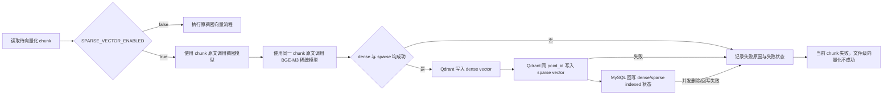

# 稀疏向量技术设计

- **文档状态：** 技术方案已冻结
- **项目名称：** toLink-Rag
- **业务域：** 文档向量化与向量存储
- **需求名称：** 稀疏向量
- **业务输入：** `docs/稀疏向量/brief.md`
- **验收输入：** `docs/稀疏向量/acceptance.feature`
- **输出文件：** `docs/稀疏向量/technical_design.md`
- **最后更新时间：** 2026-05-19

---

## 1. 文档修订记录

| 版本号 | 修改日期 | 修改内容简述 | 来源/提出人 | 审核状态 |
| :--- | :--- | :--- | :--- | :--- |
| v1.0 | 2026-05-19 | 基于已冻结 brief 与 acceptance 创建技术设计，补入 CPU BGE-M3 推理设计 | brief.md + acceptance.feature | 已冻结 |
| v1.1 | 2026-05-19 | 收敛 CPU/CUDA 模型路线：冻结 acceptance，明确以 `SPARSE_VECTOR_DEVICE` 判断设备；CPU 为 fp32，CUDA 为 fp16，不引入 int8 或独立 encoder | 用户确认 | 已冻结 |
| v1.2 | 2026-05-19 | 补充 dense+sparse 在 Qdrant 与 MySQL 间的联合一致性测试方案 | 用户确认 | 已冻结 |

---

## 2. 输入依据与设计目标

### 2.1 输入依据映射

| 输入来源 | 关键结论 | 技术设计承接方式 |
| :--- | :--- | :--- |
| `brief.md` | 稀疏向量默认开启；与稠密向量在同一向量化阶段执行；输入为 chunk 原文；ES 事务不由本模块处理；支持本地 BGE-M3 | 配置层保留开关与设备参数；编排层把稠密与稀疏绑定到同一 chunk 成功语义；ES 不作为依赖链路 |
| `acceptance.feature` | 16 个 Scenario/Scenario Outline，覆盖主流程、开关、CPU fp32、本地模型、失败阻断、重试、幂等、并发状态、检索边界与 SPLADE 非首期 | 方法级实现方案逐条映射 Scenario，并在测试方案中做完整覆盖自检 |
| 真实代码 | 已存在 `src/core/sparse_vector`、`src/core/vector_storage`、`src/core/qdrant_vector_storage`、`src/core/chunk_fact_storage` 相关草稿实现 | 在现有模块上收敛接口，复用 `BGEM3SparseVectorEncoder`，补齐 CPU/CUDA 设备语义、状态一致性、测试与文档同步 |
| 组件文档 | Qdrant、MySQL、配置文档存在；`docs/architecture/middleware_contract.md` 当前不存在 | 不新增 MQ/API；Qdrant 与 MySQL 文档按 doc sync 规则同步；MQ 标记为不涉及 |

### 2.2 技术目标

- 稀疏向量作为向量化阶段的一部分，与稠密向量共享 chunk 粒度的成功、失败、重试与幂等语义。
- 稀疏向量模型输入必须是 chunk 原文，不依赖 ES 分词结果，也不进入 ES 写入事务。
- 默认开启稀疏向量；关闭开关后保持现有稠密向量流程语义。
- 支持本地 BGE-M3 稀疏权重生成；支持通过配置切换 CPU 与 CUDA 推理。
- 在无 CUDA 设备环境下，CPU 路线复用现有 `BGEM3SparseVectorEncoder`，以 fp32 完成稀疏向量推理；CUDA 路线固定使用 fp16。
- 非空 chunk 生成空 sparse vector、模型输出数量不匹配、Qdrant 写入失败、状态回写失败均不能报告当前 chunk 成功。
- 首期不提供稀疏检索或混合检索入口，但为未来候选召回后的 MySQL 状态回查保留文档约束。

---

## 3. 改动范围

### 3.1 改动文件目录树

```text
[repo]/
├── src/
│   ├── config.py # [修改] 明确 CPU/CUDA 设备配置，并由设备推导推理精度
│   └── core/
│       ├── sparse_vector/
│       │   ├── encoder.py # [修改] 补齐 CPU/CUDA 设备选择、推理精度推导与输出校验
│       │   ├── factory.py # [修改] 从 Settings 创建稀疏向量服务时传入设备配置
│       │   ├── models.py # [不改] 复用 SparseVector/SparseChunkResult 数据结构
│       │   ├── pipeline.py # [修改] 保持 chunk 原文输入与空向量失败语义
│       │   └── deploy_bge_m3.py # [修改] 支持 CPU fp32 与 CUDA fp16 smoke 推理
│       ├── vector_storage/
│       │   ├── pipeline.py # [修改] 收敛稀疏与稠密的 chunk 成功语义、失败状态与重试边界
│       │   └── factory.py # [修改] 按配置注入 SparseVectorService
│       ├── qdrant_vector_storage/
│       │   ├── qdrant_store.py # [修改] 保证 sparse vector 以同一 chunk_id 幂等写入且不覆盖 dense vector
│       │   ├── point_factory.py # [不改] 复用 point 构造；必要时只补测试
│       │   └── models.py # [不改] 复用 SparseIndexedPoint
│       └── chunk_fact_storage/
│           └── repository.py # [修改] 明确 sparse 状态回写的并发删除返回语义
├── .env.example # [修改] 暴露 CPU/CUDA 设备配置样例
├── docs/
│   ├── guides/configuration.md # [修改] 按 doc sync 规则同步 CPU/CUDA 设备配置语义
│   ├── architecture/vectorization_module.md # [修改] 同步向量化编排与一致性边界
│   ├── reference/qdrant_schema.md # [修改] 同步 sparse vector 写入约束
│   ├── reference/mysql_schema.md # [修改] 同步 sparse 状态字段语义
│   └── 稀疏向量/
│       ├── brief.md # [已冻结] 本次设计输入
│       ├── acceptance.feature # [已冻结] 本次验收输入
│       ├── technical_design.md # [新增] 本文件
│       └── feature_info.md # [修改] 更新阶段状态
└── tests/
    ├── unit/core/sparse_vector/ # [测试新增/修改] 覆盖 encoder、factory、pipeline
    ├── unit/core/vector_storage/ # [测试修改] 覆盖稠密+稀疏同阶段成功/失败/重试
    ├── unit/core/qdrant_vector_storage/ # [测试修改] 覆盖 sparse upsert 幂等与 dense 保留
    ├── unit/core/chunk_fact_storage/ # [测试修改] 覆盖 sparse 状态回写
    └── integration/core/sparse_vector/ # [测试新增/修改] 显式环境变量控制真实 BGE-M3 smoke 测试
```

### 3.2 文件级改动说明

| 文件 | 动作 | 改动目的 | 是否必须 |
| :--- | :--- | :--- | :--- |
| `src/config.py` | 修改 | 明确 CPU/CUDA 切换接口与 `SPARSE_VECTOR_DEVICE` 决定精度路线 | 是 |
| `.env.example` | 修改 | 给出本地 BGE-M3 与 CPU/CUDA 设备选择配置样例 | 是 |
| `src/core/sparse_vector/encoder.py` | 修改 | 支持设备解析、推理精度推导、模型加载与 sparse weights 规范化 | 是 |
| `src/core/sparse_vector/factory.py` | 修改 | 从配置创建 encoder/service，避免业务层感知设备细节 | 是 |
| `src/core/sparse_vector/pipeline.py` | 修改 | 保证 chunk 原文输入、输出数量校验、空向量失败 | 是 |
| `src/core/sparse_vector/deploy_bge_m3.py` | 修改 | 支持本地部署脚本验证 CPU fp32 与 CUDA fp16 推理 | 是 |
| `src/core/vector_storage/pipeline.py` | 修改 | 统一稠密与稀疏的 chunk 成功条件和失败状态记录 | 是 |
| `src/core/vector_storage/factory.py` | 修改 | 配置开启时注入稀疏向量服务，关闭时保持旧行为 | 是 |
| `src/core/qdrant_vector_storage/qdrant_store.py` | 修改 | 明确 sparse vector 写入同一 point_id 且不覆盖 dense vector | 是 |
| `src/core/chunk_fact_storage/repository.py` | 修改 | 明确 sparse 状态更新受影响行数，并支持并发删除判断 | 是 |
| `docs/guides/configuration.md` | 修改 | 配置变更触发的文档同步 | 是 |
| `docs/architecture/vectorization_module.md` | 修改 | 向量化流程变更触发的文档同步 | 是 |
| `docs/reference/qdrant_schema.md` | 修改 | Qdrant sparse schema 变更触发的文档同步 | 是 |
| `docs/reference/mysql_schema.md` | 修改 | MySQL sparse 状态字段语义同步 | 是 |

---

## 4. 当前系统分析

| 类型 | 文件/类/方法 | 当前行为 | 问题或复用点 |
| :--- | :--- | :--- | :--- |
| 配置 | `src/config.py::Settings` | 已有 `SPARSE_VECTOR_ENABLED`、模型名、设备、batch、top_k、min_weight 等字段 | 需要明确默认开启、CPU/CUDA 切换，以及精度路线由 `SPARSE_VECTOR_DEVICE` 决定；移除外部 `SPARSE_VECTOR_USE_FP16` 配置 |
| 稀疏模型 | `src/core/sparse_vector/encoder.py::BGEM3SparseVectorEncoder` | 支持 BGE-M3 lexical weights、device、top_k、min_weight、输出规范化 | 可复用；CPU 显式选择应不依赖 CUDA，且 CPU 强制 fp32 |
| 稀疏服务 | `src/core/sparse_vector/pipeline.py::SparseVectorService.vectorize_chunk` | 按 chunk 请求调用 encoder 并要求返回单个结果 | 需要把空 sparse vector、输出数量不一致统一转为失败 |
| 向量编排 | `src/core/vector_storage/pipeline.py` | 已有 dense 流程，并有 sparse 草稿集成 | 需要明确 chunk 成功必须同时满足 dense 与 sparse；失败不进入 ES，且记录状态 |
| Qdrant | `src/core/qdrant_vector_storage/qdrant_store.py` | 已有 sparse schema 与 `update_vectors` 写入 | 需测试证明 sparse upsert 以同一 point_id 写入且不覆盖 dense |
| MySQL 状态 | `src/core/chunk_fact_storage/repository.py` | 已有 sparse 状态字段回写方法 | 需明确并发删除时返回失败，不允许报告 chunk 成功 |
| 检索入口 | 现有检索模块 | 当前主要依赖 dense/Qdrant + MySQL 状态回查 | 首期不新增 sparse/hybrid API；未来 sparse 候选仍必须 MySQL 回查 |

---

## 5. 总体方案设计

### 5.1 总体流程



### 5.2 模块边界

| 模块 | 职责 | 本次是否改动 |
| :--- | :--- | :--- |
| `sparse_vector` | 本地 BGE-M3 加载、CPU/CUDA 设备选择、稀疏权重生成与规范化 | 是 |
| `vector_storage` | 编排 dense+sparse 同阶段执行、Qdrant 写入、MySQL 状态回写 | 是 |
| `qdrant_vector_storage` | 创建 sparse schema、以 point_id 写入 sparse vector | 是，主要补边界与测试 |
| `chunk_fact_storage` | 维护 dense/sparse 状态、失败原因、重试查询 | 是 |
| ES | 文档索引与检索链路 | 不改；本需求不处理 ES 事务 |
| API/MQ | 对外接口与消息契约 | 不改；本需求不新增入口 |

---

## 6. API、消息与数据设计

### 6.1 API 设计

- 首期不新增稀疏检索或混合检索 API。
- 现有文档向量化入口的外部请求契约不变。
- 内部新增配置控制行为，不要求调用方传入 sparse 参数。

### 6.2 MQ 消息设计

- 本需求不新增 MQ topic、consumer 或消息字段。
- 向量化任务消息的确认语义保持现有规则：只要当前文件存在失败 chunk，文件级向量化不能被标记成功。

### 6.3 数据与存储设计

- MySQL 复用当前 sparse 状态字段，字段职责为：记录每个 chunk 的稀疏向量生命周期、模型名、错误原因、重试/时间信息。
- Qdrant 使用同一 `chunk_id`/point id 保存 dense vector 与 sparse vector；sparse 写入必须保留已存在 dense vector。
- CPU/CUDA 设备选择不新增数据库字段；`sparse_vector_model` 记录本次实际使用的模型名或本地模型路径。
- 配置新增建议：

```env
SPARSE_VECTOR_ENABLED=true
SPARSE_VECTOR_DEVICE=cpu
```

| 配置项 | 类型 | 默认值 | 说明 |
| :--- | :--- | :--- | :--- |
| `SPARSE_VECTOR_ENABLED` | bool | `true` | 是否启用稀疏向量；关闭后只执行稠密向量旧流程 |
| `SPARSE_VECTOR_DEVICE` | str | `auto` | `auto`、`cpu`、`cuda` 或 `cuda:0` |

### 6.4 基于 SPARSE_VECTOR_DEVICE 的模型精度选择

首期不引入 int8 量化模型，也不新增独立 encoder。系统必须以 `SPARSE_VECTOR_DEVICE` 字段作为设备路线判断入口，并复用现有 `BGEM3SparseVectorEncoder` 加载普通本地 `BAAI/bge-m3` 权重。该选择只影响本地模型加载与推理精度，不改变上游 chunk 输入、下游 `SparseVector` 输出、Qdrant sparse vector 写入结构和 MySQL 状态字段。

模型路径策略：

- `SPARSE_VECTOR_DEVICE=cpu`：走 CPU 推理路线，推理模型精度为 fp32，实际传入 `BGEM3FlagModel` 的 `use_fp16=false`。
- `SPARSE_VECTOR_DEVICE=cuda` 或 `cuda:n`：走 CUDA 推理路线，推理模型精度为 fp16，实际传入 `BGEM3FlagModel` 的 `use_fp16=true`。
- `SPARSE_VECTOR_DEVICE=auto`：先解析为具体设备；CUDA 可用时等价于 CUDA 路线并使用 fp16，CUDA 不可用时等价于 CPU 路线并使用 fp32。
- 不再暴露 `SPARSE_VECTOR_USE_FP16` 配置项；内部 `use_fp16` 参数只能由 `SPARSE_VECTOR_DEVICE` 解析结果推导，CPU 固定 `false`，CUDA 固定 `true`。

兼容性要求：

- CPU 和 CUDA 都复用 `BGEM3SparseVectorEncoder` 与 `FlagEmbedding.BGEM3FlagModel`。
- CPU 路线不得要求 CUDA 初始化，不得启用 fp16。
- CUDA 路线使用 fp16；如果 CUDA 不可用但用户显式配置 `SPARSE_VECTOR_DEVICE=cuda` 或 `cuda:n`，必须报配置错误，而不是静默回退 CPU。
- 不新增 `BGEM3Int8SparseVectorEncoder`、ONNX Runtime encoder 或 OpenVINO encoder。

---

## 7. 方法级实现方案

### 7.1 方法级变更总表

| 文件 | 类/对象 | 方法/成员 | 动作 | 入参变化 | 返回变化 | 改动目的 | 对应 Scenario |
| :--- | :--- | :--- | :--- | :--- | :--- | :--- | :--- |
| `src/config.py` | `Settings` | sparse 配置字段 | 修改 | 移除外部 `SPARSE_VECTOR_USE_FP16`；保留 `SPARSE_VECTOR_DEVICE` | 无 | 支持默认开启、CPU/CUDA 切换，并由设备推导推理精度 | 默认开启稀疏向量后整份文档向量阶段成功；CPU 复用现有 BGE-M3 encoder 以 fp32 进行稀疏向量推理 |
| `encoder.py` | `BGEM3SparseVectorEncoder` | `__init__` | 修改 | 保持现有入参 | 无 | 明确 CPU 路线复用现有 encoder，CPU 强制 fp32 | CPU 复用现有 BGE-M3 encoder 以 fp32 进行稀疏向量推理 |
| `encoder.py` | `BGEM3SparseVectorEncoder` | `_get_model` | 修改 | 保持现有入参 | 模型实例 | 在 CPU/CUDA 下加载同一 BGE-M3 模型，并由设备推导内部 `use_fp16` 参数 | CPU 复用现有 BGE-M3 encoder 以 fp32 进行稀疏向量推理 |
| `encoder.py` | 模块函数 | `resolve_sparse_vector_device` | 修改 | 保持现有入参 | 设备字符串 | 显式 `cpu` 不要求 CUDA；`auto` 有 CUDA 才选 CUDA | CPU 复用现有 BGE-M3 encoder 以 fp32 进行稀疏向量推理 |
| `encoder.py` | 模块函数 | `normalize_lexical_weights` | 修改 | 保持现有入参 | `SparseVector` | 空权重、格式异常、过滤后为空必须抛出可诊断错误 | 非空 chunk 生成空 sparse vector 必须失败并记录原因 |
| `factory.py` | 模块函数 | `create_sparse_vector_service_from_settings` | 修改 | 读取 device 配置 | `SparseVectorService` | 集中构造稀疏向量服务并隐藏模型细节，精度由设备推导 | 关闭稀疏向量开关时保持旧稠密向量语义；CPU 复用现有 BGE-M3 encoder 以 fp32 进行稀疏向量推理 |
| `pipeline.py` | `SparseVectorService` | `vectorize_chunk` | 修改 | 保持 `SparseChunkVectorizationRequest` | `SparseChunkResult` | 确保输入为 chunk 原文、单 chunk 只返回一个非空 sparse vector | 稀疏向量生成使用 chunk 原文而不是 ES 分词结果；稀疏向量输出数量与 chunk 数量不一致时整批失败 |
| `deploy_bge_m3.py` | CLI | `main` | 修改 | 设备参数 | 退出码 | 本地部署后能验证 CPU fp32 / CUDA fp16 smoke 推理 | CPU 复用现有 BGE-M3 encoder 以 fp32 进行稀疏向量推理 |
| `vector_storage/pipeline.py` | 向量化编排服务 | `_sparse_enabled` | 修改 | 无 | bool | 配置关闭时完全跳过 sparse；开启但服务缺失时失败 | 关闭稀疏向量开关时保持旧稠密向量语义 |
| `vector_storage/pipeline.py` | 向量化编排服务 | `_vectorize_chunk` 或等价 chunk 处理方法 | 修改 | 复用 chunk draft | 成功/失败状态 | dense 与 sparse 都成功才算 chunk 成功 | 稀疏向量与稠密向量使用同一个 chunk_id 入库；稠密向量失败时不会把稀疏向量单独判定为文件成功 |
| `vector_storage/pipeline.py` | 向量化编排服务 | `_write_sparse_vector` | 修改/新增 | chunk draft + sparse result | 无 | Qdrant sparse 写入失败时记录失败并阻断成功 | 稀疏向量 Qdrant 写入失败会阻断当前 chunk 成功 |
| `vector_storage/pipeline.py` | 向量化编排服务 | retry 相关方法 | 修改 | 失败 chunk 查询结果 | 无 | 重试从失败 chunk 继续，跳过已 indexed chunk | 重试从失败 chunk 继续且跳过已完成 chunk |
| `qdrant_store.py` | Qdrant store | `upsert_sparse_vectors` | 修改 | 保持 sparse points | 无 | 用同一 point_id 幂等更新 sparse vector，不覆盖 dense | 重复执行同一 chunk 写入不会生成重复索引 |
| `repository.py` | Chunk fact repository | `mark_sparse_indexing` / `mark_sparse_indexed` / `mark_sparse_failed` | 修改 | 保持现有入参 | 返回受影响行数或 bool | 并发删除时让编排层可判断失败 | 状态回写被并发删除抢先时不能报告当前 chunk 成功 |

### 7.2 逐方法实现设计

#### 7.2.1 `src/config.py::Settings`

- 当前行为：已有 sparse 基础配置，包含模型名、设备、batch、max_length 等字段；若代码中存在 `SPARSE_VECTOR_USE_FP16`，属于待移除的冗余配置。
- 修改后职责：把 sparse 默认开启、设备选择作为明确配置，并由 `SPARSE_VECTOR_DEVICE` 唯一决定推理精度。
- 详细步骤：将 `SPARSE_VECTOR_ENABLED` 默认值调整为 `True`；保留 `SPARSE_VECTOR_DEVICE` 作为 CPU/CUDA 切换接口；移除外部 `SPARSE_VECTOR_USE_FP16` 配置项；CPU/CUDA 精度选择在 encoder 内部由设备解析结果推导。
- 事务与异常边界：配置解析失败按 Pydantic 现有机制报错。
- 对应测试：默认开启、关闭开关、CPU fp32 配置读取、CUDA fp16 配置读取。

#### 7.2.2 `src/core/sparse_vector/encoder.py::BGEM3SparseVectorEncoder.__init__`

- 当前行为：接收普通 BGE-M3 模型名、device、batch、max_length、top_k、min_weight；若现有入参包含外部 fp16 参数，应改为内部推导，不再由配置透传。
- 修改后职责：保持现有 encoder 入参，明确 CPU 和 CUDA 共享同一模型加载路径。
- 详细步骤：保存 `device`；不接收 int8/quantized/fp16 配置参数；CPU 推理最终推导 `use_fp16=False`，CUDA 推理最终推导 `use_fp16=True`。
- 异常边界：配置错误在服务构建阶段暴露，不能延迟到 chunk 执行中才出现。
- 对应测试：CPU 不依赖 CUDA、CPU 下 use_fp16 最终为 false、CUDA 下 use_fp16 最终为 true。

#### 7.2.3 `src/core/sparse_vector/encoder.py::_get_model`

- 当前行为：延迟加载 `BGEM3FlagModel`。
- 修改后职责：按模型名和设备加载同一个 `BGEM3FlagModel`。
- 详细步骤：已注入模型则复用；解析普通 BGE-M3 模型名或本地模型路径；CPU 场景使用普通 BGE-M3 权重并 `use_fp16=False`；CUDA 场景使用普通 BGE-M3 权重并 `use_fp16=True`；保持 `cache_dir`、`local_files_only` 透传。
- 异常边界：模型加载失败向上抛出，由编排层记录 sparse failed。
- 对应测试：mock `BGEM3FlagModel`，断言传入模型名，并断言内部 `use_fp16` 由设备解析结果决定。

#### 7.2.4 `src/core/sparse_vector/encoder.py::resolve_sparse_vector_device`

- 当前行为：支持 `auto`、`cpu`、`cuda` 等设备解析。
- 修改后职责：显式 CPU 在无 CUDA 环境下稳定可用。
- 详细步骤：`cpu` 直接返回，不导入或检查 CUDA；`auto` 有 CUDA 返回 `cuda`，不可用返回 `cpu`；显式 `cuda` 不可用时报错。
- 对应测试：无 CUDA 环境显式 CPU 仍成功；显式 CUDA 不可用时报错。

#### 7.2.5 `src/core/sparse_vector/encoder.py::normalize_lexical_weights`

- 当前行为：把 BGE-M3 lexical weights 转换为 `SparseVector`，支持 top_k 和 min_weight。
- 修改后职责：输出可诊断的非空 sparse vector。
- 详细步骤：校验输入结构；过滤非法 id、非有限 weight、低于阈值的 weight；排序并截断 top_k；过滤后为空时抛出带原因分类的异常。
- 异常边界：模型异常、格式异常、过滤策略导致清空应能在错误信息中区分。
- 对应测试：格式异常、过滤后为空、正常 top_k。

#### 7.2.6 `src/core/sparse_vector/factory.py::create_sparse_vector_service_from_settings`

- 当前行为：按 Settings 创建 BGE-M3 sparse service。
- 修改后职责：统一读取 sparse 开关、模型和设备配置。
- 详细步骤：关闭开关时让上层跳过 sparse；`SPARSE_VECTOR_PROVIDER=bge_m3` 时构造 `BGEM3SparseVectorEncoder`；只透传 `SPARSE_VECTOR_DEVICE`，不透传外部 fp16 配置；不支持 provider 抛出配置错误。
- 对应测试：关闭开关、普通 BGE-M3、CPU fp32、CUDA fp16。

#### 7.2.7 `src/core/sparse_vector/pipeline.py::SparseVectorService.vectorize_chunk`

- 当前行为：调用 encoder 处理单个 chunk。
- 修改后职责：把 chunk 原文作为唯一输入，并保证单 chunk 单结果。
- 详细步骤：使用 `request.text` 调用 encoder，不接收 ES 分词结果；校验返回数量必须为 1；校验 sparse vector 非空；失败时抛出业务异常。
- 对应测试：输入原文透传、数量不一致失败、空向量失败。

#### 7.2.8 `src/core/sparse_vector/deploy_bge_m3.py::main`

- 当前行为：部署/验证普通 BGE-M3 模型。
- 修改后职责：支持 CPU fp32 和 CUDA fp16 smoke 推理。
- 详细步骤：解析 `--device cpu|cuda|auto`；按解析后的设备路线决定精度，CPU 时强制 `use_fp16=false`，CUDA 时强制 `use_fp16=true`；构造 encoder 并执行固定中文样例 smoke 推理；输出加载耗时、推理耗时、非零维度数、top tokens/ids。
- 对应测试：CLI 参数解析单元测试；真实模型 smoke 测试默认跳过。

#### 7.2.9 `src/core/vector_storage/pipeline.py::_vectorize_chunk`

- 当前行为：已有 dense 流程，并有 sparse 草稿集成。
- 修改后职责：把 dense 与 sparse 放在同一个 chunk 成功边界内。
- 详细步骤：生成 dense vector；如果 sparse 开启，标记 sparse indexing；使用同一 chunk 原文生成 sparse vector；dense 写入 Qdrant 成功后写入 sparse vector；dense 与 sparse 状态都回写成功后才判定 chunk 成功；任一步失败，记录对应 failed 状态并让文件级任务失败。
- 事务边界：MySQL 与 Qdrant 不做跨库事务；通过 chunk 状态和重试恢复。
- 对应测试：dense 失败、sparse 模型失败、sparse Qdrant 失败、重试跳过成功 chunk。

#### 7.2.10 `src/core/qdrant_vector_storage/qdrant_store.py::upsert_sparse_vectors`

- 当前行为：使用 Qdrant sparse vector 写入接口。
- 修改后职责：保证 sparse 写入同 point_id、同 vector name，且不覆盖 dense vector。
- 详细步骤：确保 sparse vector schema 存在；使用 `update_vectors` 或等价局部更新接口；point id 使用 chunk id；Qdrant 异常向上抛出。
- 对应测试：同 id 重复写入、dense vector 保留、Qdrant 异常传播。

#### 7.2.11 `src/core/chunk_fact_storage/repository.py::mark_sparse_*`

- 当前行为：已有 sparse 状态回写方法。
- 修改后职责：让编排层能判断状态回写是否真的命中 chunk。
- 详细步骤：`mark_sparse_indexing` 只允许从待处理/失败/过期状态进入 indexing；`mark_sparse_indexed` 只允许当前 chunk 存在且处于可完成状态；`mark_sparse_failed` 记录错误类型与错误信息；受影响行数为 0 时，编排层判定并发删除或状态竞争失败。
- 对应测试：并发删除、重复 indexed、失败后重试。

---

## 8. 组件与集成设计

- Qdrant：继续复用现有 collection，增加/确认 sparse vector schema；sparse 写入为 point 局部向量更新。
- MySQL：继续作为 chunk 状态事实源；所有未来 sparse 检索候选也必须回查 MySQL 状态。
- ES：本需求不接入 ES 分词结果，也不处理 ES 事务；ES 写入失败不由稀疏向量模块补偿。
- BGE-M3：通过 `SparseVectorEncoderProtocol` 隔离模型实现；CPU fp32 和 CUDA fp16 都复用 `BGEM3SparseVectorEncoder` 并输出统一 `SparseVector`。
- SPLADE：仅保留文档概念，不进入首期运行时代码。

---

## 9. 异常处理与降级策略

| 异常场景 | 处理方式 | 是否抛出 | 是否影响消息确认 |
| :--- | :--- | :--- | :--- |
| 稀疏向量开关关闭 | 跳过 sparse，执行旧 dense 流程 | 否 | 否 |
| 外部传入 fp16 配置 | 配置层不再接收该字段；encoder 只按设备推导内部 `use_fp16` | 否 | 否 |
| BGE-M3 模型加载失败 | 当前 chunk sparse failed，记录模型加载错误 | 是 | 是 |
| 模型调用失败 | 当前 chunk sparse failed，记录模型异常 | 是 | 是 |
| 模型输出格式异常 | 当前 chunk sparse failed，记录格式异常 | 是 | 是 |
| 过滤后 sparse vector 为空 | 当前 chunk sparse failed，记录过滤清空 | 是 | 是 |
| sparse 输出数量不等于 chunk 数量 | 当前批次失败，记录数量不一致 | 是 | 是 |
| Qdrant sparse 写入失败 | 当前 chunk sparse failed，文件级向量化失败 | 是 | 是 |
| MySQL 状态回写 0 行 | 判定并发删除/状态竞争，不能报告 chunk 成功 | 是 | 是 |

---

## 10. 测试方案

### 10.1 方法级测试映射

| 被测文件/方法 | 测试文件 | 对应 Scenario | 断言要点 |
| :--- | :--- | :--- | :--- |
| `Settings` sparse 配置 | `tests/unit/test_config_sparse_vector.py` | 默认开启稀疏向量后整份文档向量阶段成功；关闭稀疏向量开关时保持旧稠密向量语义 | 默认开启、显式关闭、CPU/CUDA 配置读取 |
| `BGEM3SparseVectorEncoder.__init__` | `tests/unit/core/sparse_vector/test_encoder.py` | CPU 复用现有 BGE-M3 encoder 以 fp32 进行稀疏向量推理 | CPU 不依赖 CUDA，复用现有 encoder |
| `_get_model` | `tests/unit/core/sparse_vector/test_encoder.py` | CPU 复用现有 BGE-M3 encoder 以 fp32 进行稀疏向量推理 | mock 模型加载参数为普通 BGE-M3 模型路径，CPU 下 use_fp16=false，CUDA 下 use_fp16=true |
| `normalize_lexical_weights` | `tests/unit/core/sparse_vector/test_encoder.py` | 非空 chunk 生成空 sparse vector 必须失败并记录原因 | 模型异常、格式异常、过滤清空可区分 |
| `create_sparse_vector_service_from_settings` | `tests/unit/core/sparse_vector/test_factory.py` | 关闭稀疏向量开关时保持旧稠密向量语义；CPU 复用现有 BGE-M3 encoder 以 fp32 进行稀疏向量推理 | 关闭返回空/跳过，开启构造正确 encoder |
| `SparseVectorService.vectorize_chunk` | `tests/unit/core/sparse_vector/test_pipeline.py` | 稀疏向量生成使用 chunk 原文而不是 ES 分词结果；稀疏向量输出数量与 chunk 数量不一致时整批失败 | 原文透传、单结果、非空向量 |
| `VectorStoragePipeline` chunk 编排 | `tests/unit/core/vector_storage/test_service.py` | 默认开启稀疏向量后整份文档向量阶段成功；稀疏向量与稠密向量使用同一个 chunk_id 入库；稠密向量失败时不会把稀疏向量单独判定为文件成功 | dense+sparse 都成功才成功，同 chunk id |
| `VectorStoragePipeline` sparse 失败处理 | `tests/unit/core/vector_storage/test_service.py` | 当前 chunk 的稀疏向量模型调用失败会阻断文件级向量成功；稀疏向量 Qdrant 写入失败会阻断当前 chunk 成功 | 失败状态、错误原因、不进入成功 |
| retry 相关方法 | `tests/unit/core/vector_storage/test_service.py` | 重试从失败 chunk 继续且跳过已完成 chunk | 已完成 chunk 不重复调用模型/写入 |
| `upsert_sparse_vectors` | `tests/unit/core/qdrant_vector_storage/test_qdrant_store.py` | 重复执行同一 chunk 写入不会生成重复索引 | 同 point id 局部更新、dense 保留 |
| `mark_sparse_*` | `tests/unit/core/chunk_fact_storage/test_repository.py` | 状态回写被并发删除抢先时不能报告当前 chunk 成功 | 0 行更新导致编排失败 |
| dense+sparse 联合一致性 | `tests/integration/core/vector_storage/test_dense_sparse_consistency.py` | 默认开启稀疏向量后整份文档向量阶段成功；稀疏向量与稠密向量使用同一个 chunk_id 入库；稀疏向量 Qdrant 写入失败会阻断当前 chunk 成功；状态回写被并发删除抢先时不能报告当前 chunk 成功；未来稀疏检索候选必须经过 MySQL 状态回查 | 拿到真实/伪造 chunk 后，同时校验 Qdrant dense/sparse point 与 MySQL chunk 状态，覆盖跨库不一致收敛 |
| 检索入口不变 | `tests/unit` 现有检索测试 | 首期不暴露稀疏检索或混合检索入口；未来稀疏检索候选必须经过 MySQL 状态回查 | 无新增 sparse/hybrid 对外入口 |
| 文档/运行时 SPLADE | 文档检查或配置测试 | SPLADE 不进入首期运行时开发流程 | 运行时 provider 不接受 SPLADE |

### 10.2 Scenario 覆盖自检

| Scenario | 承接方法 | 承接测试 | 是否覆盖 |
| :--- | :--- | :--- | :--- |
| 默认开启稀疏向量后整份文档向量阶段成功 | `Settings`、`VectorStoragePipeline._vectorize_chunk` | `test_config_sparse_vector.py`、`test_service.py` | 是 |
| 稀疏向量与稠密向量使用同一个 chunk_id 入库 | `_vectorize_chunk`、`upsert_sparse_vectors` | `test_service.py`、`test_qdrant_store.py` | 是 |
| 关闭稀疏向量开关时保持旧稠密向量语义 | `_sparse_enabled`、`create_sparse_vector_service_from_settings` | `test_factory.py`、`test_service.py` | 是 |
| 稀疏向量生成使用 chunk 原文而不是 ES 分词结果 | `SparseVectorService.vectorize_chunk` | `test_pipeline.py` | 是 |
| CPU 复用现有 BGE-M3 encoder 以 fp32 进行稀疏向量推理 | `BGEM3SparseVectorEncoder.__init__`、`_get_model`、`deploy_bge_m3.py::main` | `test_encoder.py`、集成 smoke 测试 | 是 |
| 当前 chunk 的稀疏向量模型调用失败会阻断文件级向量成功 | `_vectorize_chunk` | `test_service.py` | 是 |
| 稀疏向量 Qdrant 写入失败会阻断当前 chunk 成功 | `_write_sparse_vector`、`upsert_sparse_vectors` | `test_service.py`、`test_qdrant_store.py` | 是 |
| 非空 chunk 生成空 sparse vector 必须失败并记录原因 | `normalize_lexical_weights`、`vectorize_chunk` | `test_encoder.py`、`test_pipeline.py` | 是 |
| 稀疏向量输出数量与 chunk 数量不一致时整批失败 | `vectorize_chunk` | `test_pipeline.py` | 是 |
| 稠密向量失败时不会把稀疏向量单独判定为文件成功 | `_vectorize_chunk` | `test_service.py` | 是 |
| 重试从失败 chunk 继续且跳过已完成 chunk | retry 相关方法、repository 查询 | `test_service.py`、`test_repository.py` | 是 |
| 重复执行同一 chunk 写入不会生成重复索引 | `upsert_sparse_vectors` | `test_qdrant_store.py` | 是 |
| 状态回写被并发删除抢先时不能报告当前 chunk 成功 | `mark_sparse_indexed`、`mark_sparse_failed`、编排层判断 | `test_repository.py`、`test_service.py` | 是 |
| 首期不暴露稀疏检索或混合检索入口 | 检索模块不改 | 现有 API/检索测试 + contract guard | 是 |
| 未来稀疏检索候选必须经过 MySQL 状态回查 | 文档约束，未来检索入口承接 | 文档检查；首期无入口 | 是 |
| SPLADE 不进入首期运行时开发流程 | provider 校验 | `test_factory.py` | 是 |

### 10.3 dense+sparse 联合一致性测试

联合测试目标是验证“拿到 chunk 后，dense vector 与 sparse vector 在 Qdrant、MySQL 两侧的状态不会被误判为成功”。该测试不引入跨库事务，仍遵守现有一致性策略：Qdrant 是可重建索引副本，MySQL `kb_document_chunk` 是事实源；文件级成功只能由 MySQL 中每个 chunk 的 `dense_vector_status=INDEXED` 且 `sparse_vector_status=INDEXED` 汇总得到。

测试入口：

- 单元级联合测试：`tests/unit/core/vector_storage/test_service.py` 使用 fake repository、fake qdrant store、fake dense embedding、fake sparse encoder，覆盖编排顺序和失败状态。
- 集成级联合测试：新增 `tests/integration/core/vector_storage/test_dense_sparse_consistency.py`，在显式环境变量开启时连接真实 MySQL 与 Qdrant；BGE-M3 可用 fake sparse encoder 替代，避免该测试同时承担模型性能验证。
- 真实环境开关：沿用 `TOLINK_RUN_REAL_VECTOR_STORAGE_TESTS=1`；如需要真实 BGE-M3，再叠加 `TOLINK_RUN_REAL_SPARSE_VECTOR_TESTS=true`。

联合测试数据：

| 数据 | 要求 |
| :--- | :--- |
| chunk 输入 | 至少 2 个非空 chunk，包含稳定 `user_id`、`set_id`、`doc_id`、`chunk_index` |
| dense vector | 使用固定维度伪向量或测试 embedding，保证可重复断言 |
| sparse vector | 使用固定 `indices/values`，保证 `nonzero_count > 0` |
| Qdrant 定位 | collection 由 `bucket_id` 路由，point id 必须等于 `chunk_id` |
| MySQL 定位 | `kb_document_chunk.chunk_id` 与 Qdrant point id 一致，状态字段分别断言 dense/sparse |

必须覆盖的跨库场景：

| 场景 | 触发方式 | Qdrant 断言 | MySQL 断言 | 预期收敛 |
| :--- | :--- | :--- | :--- | :--- |
| 正常成功 | dense 和 sparse 均写入成功，状态回写成功 | 同一 `point_id=chunk_id` 同时存在 dense vector 与 sparse vector，payload 保留 `chunk_id/user_id/set_id/doc_id` | `dense_vector_status=INDEXED`，`sparse_vector_status=INDEXED`，`sparse_vector_nonzero_count>0` | chunk 与文件级向量阶段成功 |
| dense 写入失败 | Qdrant dense upsert 抛错 | 不要求存在 point；不得写入 sparse | `dense_vector_status=FAILED`，`sparse_vector_status` 不得为 `INDEXED` | 当前 chunk 失败，后续 chunk 不推进 |
| sparse 写入失败 | dense 已写入，sparse upsert 抛错 | 允许存在 dense orphan，但不得存在成功 sparse；重试仍使用同一 point 覆盖 | `dense_vector_status=FAILED`，`sparse_vector_status=FAILED`，错误包含 `SPARSE_QDRANT_UPSERT_FAILED` | MySQL 阻断成功，后续重试收敛 |
| Qdrant 成功后 MySQL 回写失败 | dense+sparse 均已写入，`mark_*_indexed` 返回 0 行或 chunk 进入 `DELETING` | 允许存在短暂 Qdrant orphan | dense/sparse 状态不得进入 `INDEXED`，文件级 `vectorizing_status=FAILED` | MySQL 事实源阻断检索成功 |
| 重试收敛 | 前次失败 chunk 重新处理 | 同一 `point_id` 被幂等覆盖，不产生重复 point | 失败 chunk 的 dense/sparse 状态变为 `INDEXED`，已成功 chunk 不重复调用模型 | 文件级向量阶段恢复成功 |
| 读时过滤预留 | 人工构造 Qdrant 候选包含状态不一致 chunk | Qdrant 可返回候选 `chunk_id` | MySQL 回查只允许 `dense_vector_status=INDEXED` 且 dense/sparse 均 `INDEXED` 的 chunk 返回 | 未来 sparse/hybrid 检索不暴露不一致资产 |

断言边界：

- 不以 Qdrant 是否存在 point 作为文件级成功依据。
- 不以 dense 写入成功推导 sparse 成功。
- 不以 sparse 写入成功推导 dense 成功。
- 不把 ES 状态纳入该联合测试的成功条件；ES 仍由后续阶段自行处理。
- Qdrant 写入成功但 MySQL 回写失败时，测试应明确这是允许的短暂不一致，最终以 MySQL 状态阻断检索和文件成功。

### 10.4 回归命令

```bash
pytest tests/unit/core/sparse_vector -q
pytest tests/unit/core/vector_storage -q
pytest tests/unit/core/qdrant_vector_storage -q
pytest tests/unit/core/chunk_fact_storage -q
pytest tests/unit -q
```

真实模型 smoke 测试必须显式开启，避免普通 CI 下载或加载大模型：

```bash
$env:TOLINK_RUN_REAL_SPARSE_VECTOR_TESTS="true"
pytest tests/integration/core/sparse_vector -q
```

真实 MySQL + Qdrant 联合一致性测试必须显式开启，并在测试结束清理对应 chunk 与 point：

```bash
$env:TOLINK_RUN_REAL_VECTOR_STORAGE_TESTS="1"
pytest tests/integration/core/vector_storage/test_dense_sparse_consistency.py -q
```

---

## 11. 发布与回滚

- 发布前确认 `.env.example` 与部署环境已显式配置模型缓存目录和 `SPARSE_VECTOR_DEVICE`。
- 如果 CPU 推理性能不足，可将 `SPARSE_VECTOR_DEVICE` 切换为 `cuda` 或 `cuda:n`；CUDA 路线固定使用 fp16。
- 如果稀疏向量整体影响生产任务，可将 `SPARSE_VECTOR_ENABLED=false` 回滚到旧 dense-only 流程。
- Qdrant sparse vector 写入和 MySQL sparse 状态字段是新增能力；关闭开关后历史 sparse 数据保留但不参与检索。

---

## 12. 风险与待确认问题

| 风险/问题 | 影响 | 建议处理 |
| :--- | :--- | :--- |
| 默认开启可能导致未配置模型的环境任务失败 | 开发/部署环境必须准备本地模型或允许下载 | 配置文档明确最小环境；测试环境可通过 mock 避免真实模型 |
| Qdrant 与 MySQL 无跨库事务 | Qdrant 写入成功但 MySQL 回写失败时存在短暂不一致 | 使用 chunk 状态作为事实源，重试或清理任务按状态恢复 |
| CPU 推理性能较低 | 大文档向量化耗时增加 | 部署文档给出 batch、max_length、top_k 调优建议；性能测试单独记录 |
| 未来 sparse/hybrid 检索入口尚未实现 | 当前无法验证召回效果闭环 | 首期只保证入库和状态一致；未来需求必须先补 acceptance |

---

## 13. 实施顺序

1. 更新配置层：`src/config.py`、`.env.example`、配置文档。
2. 更新 sparse encoder：设备解析、CPU fp32 / CUDA fp16 推导逻辑、模型加载、权重规范化错误分类。
3. 更新 sparse factory 与 service：配置注入、chunk 原文输入、单结果非空校验。
4. 更新部署脚本：CPU fp32 / CUDA fp16 smoke 推理输出。
5. 更新 vector storage 编排：dense+sparse 同 chunk 成功语义、失败状态、重试与并发删除处理。
6. 补齐 Qdrant 与 repository 边界测试。
7. 按 doc sync 规则同步架构、配置、Qdrant、MySQL 文档。
8. 执行分层测试并产出实现报告。

---

## 14. 人工审核清单

- [ ] 改动文件目录树已确认。
- [ ] CPU fp32 / CUDA fp16 路线已确认。
- [ ] 默认开启稀疏向量的部署影响已确认。
- [ ] dense+sparse 同 chunk 成功语义已确认。
- [ ] ES 不纳入本模块事务处理已确认。
- [ ] 首期不暴露 sparse/hybrid 检索入口已确认。
- [ ] 测试方案已确认。
