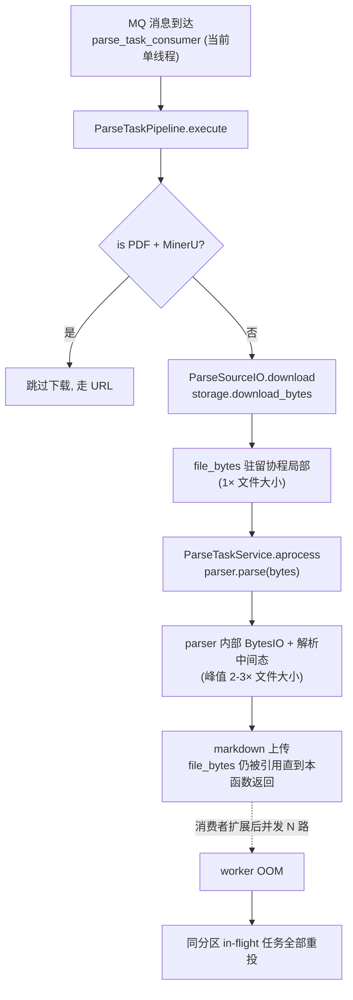
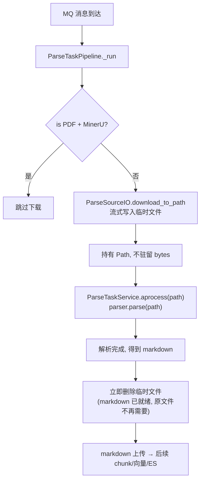

# 解析任务OOM风险治理 Brief

## 1. 需求摘要

- **做什么**：把解析流水线"对象存储 → bytes 全量驻留 → parser"的链路改造为"流式下载到临时文件 → parser 按路径读取 → markdown 拿到后立即清理临时文件"。仅治理"非 MinerU 旁路"的解析路径（PDF 非 MinerU 后端 / DOCX / DOC / HTML）。
- **为什么做**：
  - 当前 `ParseSourceIO.download` 通过 `storage.download_bytes` 一次性把整份源文件读进内存，`file_bytes` 变量贯穿 pipeline → ParseTaskService → parser，期间 parser 内部还会基于 `BytesIO` 再开一份解析中间态，单任务内存峰值为 2–3× 文件大小。
  - 当前 Kafka 消费者只有 1 个、单线程消费，实际并发 = 1，OOM 还没真正暴露；但生产侧已存在 100–500MB 级的 Word 大文件，单任务峰值已经接近常规 worker 容器（2–4GB）的安全水位。
  - 未来一旦把消费者数量调大或迁移到多线程消费模式，同 worker 多个 in-flight 大文件并存会直接 OOM kill 进程，并通过 Kafka rebalance 把同分区 in-flight 任务全部重投，故障半径远超单条任务。
  - 本次治理把"单任务峰值"这个最根本的问题解决掉——把 2–3× 文件大小的内存占用压到 parser 内部 buffer 量级，为后续扩消费者扫除主要内存障碍。
- **本次不做**：
  - 不引入 worker 级并发信号量 / 限流——当前单消费者下无价值，扩消费者时再单独评估
  - 不改 MinerU URL 旁路逻辑（PDF + MinerU 后端继续走 `should_skip_source_download`，根本不落本地）
  - 不重写 parser 后端实现（PyMuPDF / python-docx 等 provider 内部不动，只改入参形态）
  - 不调整 Kafka 消费者数量 / 不引入多线程消费框架
  - 不改 `document_parsed_log` 状态机、MQ 消息契约、错误码对外语义
  - 不做对象存储侧的分片上传 / 多版本改造（markdown 体积 KB 级，上传侧无需改）

## 2. 业务流程

### 2.1 当前链路与潜在 OOM 触发点

### 2.2 治理后链路

### 2.3 关键节点说明

- **流式下载**：`BaseObjectStorage` 增加 `download_to_path(bucket, key, dst: Path)`。MinIO 驱动用 boto3 `download_fileobj` 分块写入；OSS 驱动用 SDK 的流式 / `get_object_to_file` 接口。不在内存里拼接整体 bytes。
- **临时文件生命周期（本次新增的关键约束）**：
  - 在 `_run` 中下载前创建 `NamedTemporaryFile(delete=False, dir=PARSE_TEMP_DIR)`，拿到 path。
  - 在 `_parse_file` 完成、拿到 `parse_result["markdown"]` **之后立即删除临时文件**——原文件解析为 markdown 后已无下游用途。
  - 用 `try/finally` 兜底：解析失败或异常路径也必须删，绝不允许临时文件遗留到 pipeline 终态。
- **parser 入参演进**：`IFileParser.parse` 当前签名 `parse(file_stream: bytes) -> str` 改为接受 `parse(source: Path | str) -> str`。各 provider 内部本来就支持基于路径打开。
- **MinerU 旁路保留**：`should_skip_source_download` 命中时不下载、不创建临时文件、不删除（没东西可删），现有分支逻辑原样保留。
- **启动清理**：worker 启动时清空 `PARSE_TEMP_DIR` 整个目录，兜底回收上次异常退出残留的临时文件。当前单消费者下不存在"启动时还有别的 worker 在写文件"的并发问题，可以直接清空。
- **异常路径**：
  - 下载失败（对象存储 404 / 网络异常）→ finally 删半成品临时文件 → 归类 `SOURCE_FILE_NOT_FOUND`
  - 临时盘写满（`OSError: No space left on device`）→ finally 删半成品临时文件 → 归类**新增错误码 `TEMP_DISK_FULL`**
  - 解析失败 → finally 仍删临时文件，再走原有失败兜底
  - 进程被 SIGKILL → 临时文件残留，靠"启动时清空 PARSE_TEMP_DIR"兜底

## 3. 核心模块与实现思路

### 3.1 ParseSourceIO（`src/core/pipeline/parse_task/source.py`）

- **位置**：解析流水线对象存储 I/O 协作者。
- **职责**：本次成为"下载到临时文件"的唯一入口；不再向上层暴露 bytes。
- **实现思路**：
  - 新增 `download_to_path(payload, dst: Path) -> None`，内部调用底层 storage 的流式接口。
  - 由 pipeline 负责生成 dst 与最终清理；source.py 不持有临时文件所有权。
  - 原 `download(payload) -> bytes` 直接移除；`build_source_file_url` 与 `should_skip_source_download` 保持不变。
- **关键决策**：临时文件所有权显式交给调用方——避免"谁创建谁清理"的歧义，pipeline 层 try/finally 边界更清晰。

### 3.2 BaseObjectStorage 与驱动实现（`src/services/storage/`）

- **位置**：`base.py`、`minio_storage.py`、`oss_storage.py`。
- **职责**：提供与全量 `download_bytes` 等价的流式落盘接口。
- **实现思路**：
  - `BaseObjectStorage` 新增抽象方法 `download_to_path(bucket, key, dst: Path) -> None`。
  - MinIO 驱动：`client.download_fileobj(Bucket, Key, Fileobj=open(dst, "wb"))`，boto3 内部按 8MB 默认分块拉取。
  - OSS 驱动：用 `bucket.get_object_to_file(key, dst)` 或迭代式 read 写入。
  - 直接移除 `download_bytes`，杜绝静默回退到全量内存路径（markdown 上传仍走独立的 `upload_bytes`，互不影响）。
- **关键决策**：只对下载侧做流式化；上传侧（markdown 是 KB 级）保持 `upload_bytes` 不变。

### 3.3 ParseTaskPipeline（`src/core/pipeline/parse_task/pipeline.py`）

- **位置**：解析流水线主编排，第 140–183 行为核心改造区。
- **职责**：把"下载→解析→上传"链路从 bytes 改为 path，管理临时文件生命周期。
- **实现思路**：
  - 非旁路分支：`NamedTemporaryFile(delete=False, dir=settings.PARSE_TEMP_DIR)` 创建临时文件 → 传给 `ParseSourceIO.download_to_path` → 传给 `_parse_file`。
  - **临时文件清理时机**：在 `_parse_file` 返回、`parse_result["markdown"]` 拿到后立即 `os.unlink(tmp_path)`；外层 `try/finally` 做二次兜底（防止 `_parse_file` 抛异常时遗漏）。
  - `_parse_file` 的内部入参 `file_bytes: bytes` 改为 `source_path: Path`。
  - MinerU 旁路保持现状，不进入临时文件分支。
- **关键决策**：临时文件早删而不是 finally 末尾删——markdown 一旦生成原文件就是死重，越早释放磁盘越安全。

### 3.4 ParseTaskService 与 Parser 协议（`src/services/parse_task_service.py`, `src/core/parser/base.py`, `src/core/parser/providers/**`）

- **位置**：
  - service 入口：`ParseTaskService.aprocess` / `process_sync` / `_parse_markdown`
  - parser 协议：`IFileParser.parse(file_stream: bytes) -> str`
  - provider：`src/core/parser/pdf/`、`src/core/parser/providers/`（word/pdf/html）
- **职责**：接受文件路径而非 bytes，向各 parser 后端透传。
- **实现思路**：
  - `IFileParser.parse` 改为 `parse(source: Path | str) -> str`；`BaseParser.validate_stream` 同步改为 `validate_source`，基于 `os.path.exists` + 文件非空。
  - `ParseTaskService.aprocess` / `process_sync` 入参 `file_stream: bytes` → `source_path: Path`。
  - 各 provider 内部本就基于路径打开（PyMuPDF `fitz.open(path)`、python-docx `Document(path)`、html 用 `open(path).read()`），改造量集中在签名层。
  - MinerU 旁路：parser 由 URL 触发，不传 path，需保留原有 `parser_kwargs` 分支。
- **关键决策**：一次性破坏式替换 `parse(bytes)`——这是内部协议，无外部消费者；保留双轨会留下"静默回退到 bytes 路径"的隐患，反而抵消本次治理价值。

### 3.5 MQ 消费层（`src/core/mq/consumers/parse_task_consumer.py`）

- **位置**：MQ 回调入口。
- **职责**：本次不改回调逻辑。
- **实现思路**：保持 `pipeline = ParseTaskPipeline(); pipeline.execute(payload)` 调用形态。

### 3.6 配置项（`src/config.py`, `.env.example`, `docs/guides/configuration.md`）

- **位置**：Settings 类与配置文档。
- **职责**：新增本次治理的配置。
- **实现思路**：新增一项——
  - `PARSE_TEMP_DIR`（path，默认 `/tmp/tolink-rag-parse`）
- **关键决策**：不预设最小磁盘容量要求，沿用部署机系统盘大小；磁盘写满走 `TEMP_DISK_FULL` 错误码归类（见 3.7）。

### 3.7 错误码新增（`src/core/pipeline/parse_task/error_codes.py`, `docs/reference/error_codes.md`）

- **位置**：解析任务失败原因枚举与对外文档。
- **职责**：明确"临时盘写满"为一类可识别失败，便于运维定位与告警。
- **实现思路**：新增 `TEMP_DISK_FULL`，触发条件为下载阶段捕获到 `OSError: ENOSPC`（或等价磁盘满异常）。
- **关键决策**：单独建码而不复用 `SOURCE_FILE_NOT_FOUND`——后者语义是"对象存储侧不可达"，而磁盘满是 worker 本机问题，归错会误导排查方向。新增错误码需同步更新 [docs/reference/error_codes.md](docs/reference/error_codes.md) 并向 Java 端报备。

### 3.8 结构化观测日志（`src/core/pipeline/parse_task/pipeline.py`）

- **位置**：pipeline 主流程关键节点，复用现有 `loguru` 日志器。
- **职责**：把每次解析任务的"文件大小 / 下载耗时 / 解析耗时"作为结构化字段打出来，为后续判断"消费者能扩到多大"提供事实依据。
- **实现思路**：
  - 下载结束后打一行 `[ParseTaskPipeline] source downloaded: task_id={} file_size_mb={:.1f} download_ms={}`。
  - `_parse_file` 结束后打一行 `[ParseTaskPipeline] parse completed: task_id={} parse_ms={} markdown_chars={}`。
  - 字段命名沿用现有日志风格，便于后续直接 grep / 接入日志分析。
- **关键决策**：不引入 Prometheus / 指标库——本次只解决"事后能查数"，避免把可观测性基础设施改造一并带进来；后续扩消费者前如需告警，再独立建项做指标化。

## 4. 风险与不确定性

| 风险 / 问题 | 触发条件 | 影响 | 当前判断 / 应对方向 |
| :--- | :--- | :--- | :--- |
| parser 协议签名变更 | `IFileParser.parse(bytes)` → `parse(Path)` | 所有 provider、测试 mock 一并修改 | 内部协议无外部消费者，一次性替换；改造时 grep 兜底 |
| 临时盘写满 | 系统盘剩余空间不足以容纳源文件 | 下载失败、本任务终态失败 | 不预设最小容量；新增 `TEMP_DISK_FULL` 错误码区分定位，运维侧通过监控系统盘水位告警 |
| 临时文件泄漏 | 进程 SIGKILL / OOM kill 时残留 | 磁盘缓慢耗尽 | 独立 PARSE_TEMP_DIR + worker 启动时清空目录；不落在共享 `/tmp` |
| 老 `download_bytes` / `parse(bytes)` 遗留点 | 历史调试入口、测试桩仍传 bytes | 静默回退到内存路径，治理失效 | 改造时 grep `download_bytes(`、`parse(.*bytes`，一次性收敛；测试同步改造 |
| MinerU 旁路与新链路混淆 | 两条分支并存 | 维护成本、逻辑漂移 | pipeline 内集中分流，source.py 不感知；测试覆盖两条路径 |
| OSS / MinIO 流式接口差异 | boto3 vs 阿里云 SDK 行为不同 | 抽象方法语义不一致 | 抽象层只暴露 `download_to_path(dst)`，两家驱动本次同步改造，回归测试双覆盖 |
| PDF 后端分布未知 | `payload.pdf_parser_backend` 既可能 MinerU 也可能非 MinerU | 测试与方案重心可能错位 | 不假设占比，按"两条路径都可能高发"对待；测试用例覆盖 PDF+MinerU / PDF+非MinerU / Word / HTML 四类 |
| 扩消费者后并发未受控 | 后续把消费者数量调大 | 仍可能多任务并存 OOM | 本次不解决；扩消费者前需补"并发闸 / worker 内存监控"，作为独立改造项跟进 |
| HTML 路径量级评估 | HTML 文件理论也走全量 bytes | 极端大 HTML 仍会触顶 | 抽象层一起改造（反正改了 storage 接口），不专门为 HTML 调参 |

