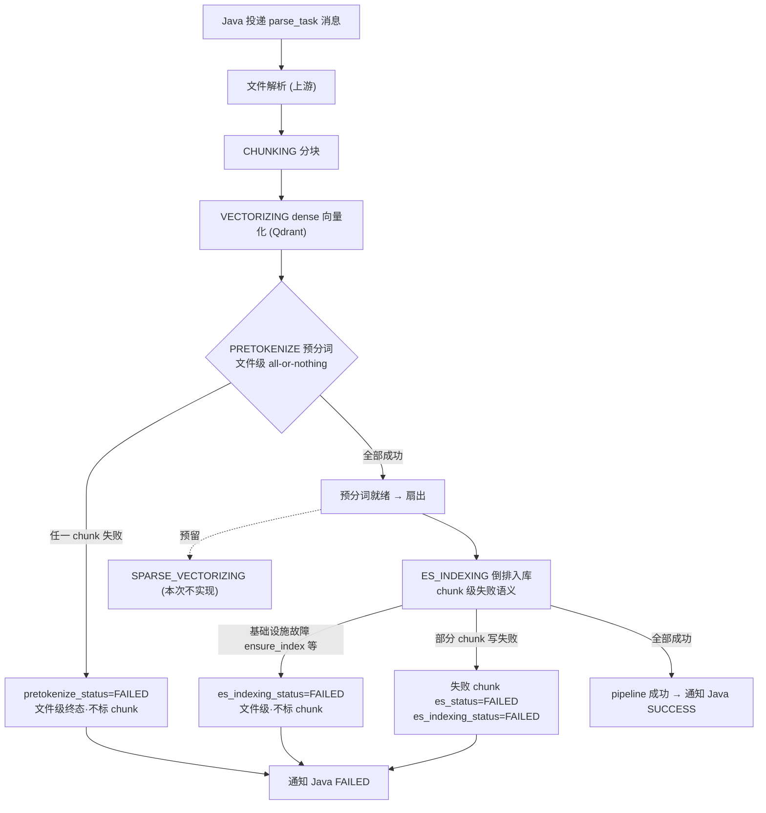

# 预分词独立阶段 Brief

## 1. 需求摘要

- **做什么**：把"预分词（pre-tokenization）"从当前内嵌在 ES 入库阶段内部的隐式步骤，提升为解析后处理流水线中的**一等独立阶段**：有独立的文件级状态、独立的失败语义、独立的恢复入口；并在阶段划分上为未来"稀疏向量化"消费者预留扇出位置。
- **为什么做**：预分词的产物（粗/细 token）不只服务 ES 倒排索引，未来还要交给稀疏向量化使用。当它被埋在 ES 阶段里时，"分词是否成功"与"ES 是否写入成功"被压在同一个 `es_indexing_status` 上，无法对分词单独记录状态，也无法让多个下游消费者清晰地依赖"分词已就绪"这一前置条件。
- **本次不做**：
  - 不实现稀疏向量化本身（其生成方式、存储介质、检索接入均不在本次范围），仅在阶段拓扑上预留。
  - 不持久化预分词产物（不新增 token 列 / token 表）。
  - 不改 ES 倒排索引的文档结构、mapping、批处理与 chunk 级回写逻辑（这部分现状已符合目标语义，保持不动）。
  - 不改 dense 向量化（Qdrant）阶段本身的实现。
  - **不做 ES 内部自动重试 / 上限 / retry-exhausted**：失败即终态，只把结果写入文件级流水线状态表并通知 Java；移除 ES 内部自动重试预算——`_handle_es_failure` 内 `retry_count` 自增、`_is_es_retry_exhausted` 上限判断、`retry_exhausted` 标记、`ES_INDEXING_MAX_RETRY` 配置。**保留** `retry_count`/`last_retry_at` 列与 `idx_post_pipeline_retry` 索引：其语义重定为"**用户前端触发重试**的计数与时间"，不再由模块/失败处理器写；本次仅提供预留的 pipeline 级"认领重试"动作（对照 chunk 的 `claim_failed_for_reindex`），**不接线任何触发路径**，留作后续需求。（v1 冻结后 TD 阶段订正：原"物理删除两列+索引"改为保留。）

## 2. 业务流程

### 2.1 主流程图

### 2.2 流程详解

**触发与上游**：Java 业务侧通过 MQ 投递解析任务，进入 parse_task 流水线。解析完成后进入文件级后处理流水线，其阶段顺序为 `CHUNKING → VECTORIZING(dense) → PRETOKENIZE → ES_INDEXING`（其中 `PRETOKENIZE→ES_INDEXING` 之间为"预分词就绪后扇出给消费者"的关系，未来 SPARSE_VECTORIZING 与 ES_INDEXING 并列消费）。

**PRETOKENIZE（预分词，本次核心新增阶段）**：
- 进入条件：dense 向量化阶段成功；预分词取数仍以"该 chunk dense 向量化成功"为前提（保持现有 `vector_status==SUCCESS` 语义，ES 文档集 ⊆ Qdrant 点集的对齐不变）。
- 系统做什么：取该文档下本趟需要处理的 chunk，逐 chunk 调用 RagFlow 分词器算出粗粒度与细粒度 token，构成一份文件级内存计划交给下游。
- 状态变化：全部 chunk 分词成功 → 该阶段状态置为成功，作为下游消费者的"分词就绪"闸门；任一 chunk 分词失败 → **整个文件的预分词阶段失败**（文件级 all-or-nothing）。
- 关键约束：预分词失败时**不在 chunk 明细上写任何 ES 相关状态**，只在文件级流水线记录上落预分词阶段失败（终态记录，不计数、不设重试上限）。
- 重要语义：阶段状态为"成功"仅表示"上一趟分词没失败"，是闸门 / 可观测信号，**不代表 token 已落库可直接取**；下游消费者总是按需现算 token。

**扇出给消费者（单趟扇出·内存传递）**：预分词与消费者在**同一次流水线执行内**完成——预分词算一次文件级 token 计划，以内存对象直接交给 ES 倒排入库（未来稀疏向量化并列消费）；一趟内只分词一次，所有消费者共享。本次仅 ES_INDEXING 实际执行。失败后若任务被外部重新投递，整趟重入（重算范围由 chunk 的 ES 明细状态天然收窄，见下文恢复）。

**ES_INDEXING（保持现状语义，仅与预分词解耦）**：
- 文件级基础设施故障（如确保索引存在失败、ES 不可达）：按文件级处理，只落文件级阶段失败，**不在 chunk 明细标失败**。
- chunk 级写入失败：不因首个失败中止整批，逐个把失败 chunk 的 ES 明细状态标为失败，文件级阶段记为失败；重入时仅收窄到"尚未成功"的 chunk 子集。
- 全部成功：文件级流水线收敛为成功，通知 Java。

**异常分支与失败恢复**（无内部重试计数 / 上限）：
- 任一失败（预分词文件级、ES 基础设施文件级、ES chunk 级）→ **失败即终态**：把结果写入文件级流水线状态表（阶段状态 FAILED、`failed_stage`、`recover_from_stage`、失败原因、结束时间、耗时）并通知 Java FAILED。系统**不计数、不设上限、不写 retry-exhausted**，也不自动重试。
- 若任务被外部重新投递（Java 重投 / 外部恢复），流水线据 `recover_from_stage` 从"首个非 SUCCESS 阶段"幂等续跑：预分词成功但 ES 失败 → 从 ES 续跑（因 token 不持久化，续跑会对 ES 待处理 chunk 重新分词，结果等价、确定性安全）；预分词失败 → 从预分词整篇重入。
- 续跑重算范围天然由 chunk 的 ES 明细状态收窄：全未成功即整篇，部分成功即只补失败子集（chunk 明细未被预分词失败污染）。
- 恢复入口推断（`recover_from_stage`）取**首个非 SUCCESS 阶段**，需新增对预分词阶段的识别（与现有"首个非 SUCCESS"推断语义一致）。

## 3. 核心模块与实现思路

### 3.1 预分词模块（`src/core/preprocessor/`）

- **位置**：现有 `src/core/preprocessor/`（`service.py` / `ragflow_tokenizer.py` / `models.py`），已存在但目前作为 ES 阶段的内部被调用方。
- **职责**：本次升级为流水线一等阶段的执行体——产出文件级 token 计划，并以"文件级 all-or-nothing"对外暴露成功/失败。
- **实现思路**：
  - 复用现有 `RagFlowTokenizer`（纯函数、确定性）与 token 计划模型，不改分词算法。
  - 移除"预分词失败时把 chunk 明细标 ES 失败"的现有副作用——失败只向上抛出，由流水线层落文件级阶段状态。
  - 不持久化产物：单趟扇出——同一次流水线执行内，预分词算一次 token 计划并以内存对象直接交给下游消费者（本次为 ES），一趟内只分词一次。
  - 取数范围保持耦合于 dense 向量成功（不解耦）；未来稀疏向量化作为同源消费者，同样在 dense 成功后才有可处理 chunk。
- **关键决策**：产物不落库。理由：分词是确定性纯函数，重算成本仅为失败子集 CPU，落库会引入新表/列、额外写入、schema 同步与一致性维护，收益不抵成本（YAGNI）。代价是多消费者 / 多次重入会各自重算同一批 token，确定性下安全。

### 3.2 解析后处理流水线编排（`src/core/pipeline/parse_task/`）

- **位置**：`pipeline.py`（现有 `_run_es_indexing` 把预分词与 ES 写入合并执行）、`validator.py`（恢复阶段推断）。
- **职责**：把"预分词"与"ES 入库"在编排层拆成两个语义独立的阶段；预分词作为下游消费者的前置闸门。
- **实现思路**：
  - 拆分现有合并执行：预分词单独成阶段，成功后在同一次执行内把内存 token 计划扇出给 ES 入库（未来稀疏并列消费）；预分词失败走文件级失败收敛，不进入 ES 入库。
  - 文件级失败（预分词失败、ES 基础设施故障）统一只落文件级阶段状态，失败原因加来源前缀以区分（预分词 / 基础设施 / ES 写入）；前缀为本侧内部排障约定，Java 仅展示原文、不按前缀解析，不涉对外契约。
  - 恢复阶段推断逻辑新增对预分词阶段的认知，按"首个非 SUCCESS 阶段"使中断的流水线能从预分词或 ES 入库正确续跑。
  - 移除 ES 内部自动重试预算：`_handle_es_failure` 内 `retry_count` 自增、`_is_es_retry_exhausted` 上限判断、`retry_exhausted` 失败原因后缀（`retry_count`/`last_retry_at` 列本身保留，仅不再被失败处写）。
- **关键决策**：失败即终态，仅记录结果、不计数、不设上限。`recover_from_stage` 取首个非 SUCCESS 阶段（预分词成功则记 ES_INDEXING），供外部重投后幂等续跑；续跑物理上重跑预分词只是恢复 ES 的手段，不体现在记账上。理由：与现有 `_infer_recover_stage`"首个非 SUCCESS"语义一致，可观测上"卡在哪就是哪"，且去掉计数后无需 per-stage 重试列。

### 3.3 文件级流水线状态记录（`src/core/pipeline/parse_task/post_process/` + `src/models/parse_task.py`）

- **位置**：后处理流水线状态仓储与其 ORM 模型（文件级一行，现有阶段：分块 / 向量化 / ES 入库）。
- **职责**：为预分词阶段提供独立的文件级状态记录与恢复闸门。
- **实现思路**：
  - 在文件级流水线状态记录上新增"预分词阶段状态"与"预分词耗时"字段（与 chunking/vectorizing/es_indexing 耗时对称）；阶段成功/失败/恢复入口的写入复用现有"每阶段一次终态写"的节奏，不引入第二张表、不引入 chunk 级预分词状态。
  - schema 变更仅"新增"：新增预分词阶段状态/耗时列；**保留** `retry_count`/`last_retry_at` 列与 `idx_post_pipeline_retry` 索引不动（用户侧重试计数）；新增 Alembic 迁移并同步 `docs/reference/mysql_schema.md`。
- **关键决策**：只加文件级阶段状态字段，不加 chunk 级预分词状态——因为预分词是文件级 all-or-nothing，chunk 级状态对预分词无意义；ES 的 chunk 级状态继续承担"补失败子集"的重入收窄职责。

### 3.4 ES 倒排入库模块（`src/core/es_index_storage/`）

- **位置**：现有 ES 入库管线。
- **职责**：作为预分词产物的消费者之一；保持 chunk 级失败语义不变。
- **实现思路**：仅调整其与预分词的边界（不再由它隐式触发并吞掉预分词失败），其余批处理、bulk、chunk 级回写、文档结构保持现状。基础设施故障（确保索引存在等）的兜底从"标全部 chunk 失败"调整为"文件级失败、不标 chunk"。
- **关键决策**：ES 内部 chunk 级失败语义已符合目标，不重写；只把"文件级 vs chunk 级"的失败归类理顺。

## 4. 风险与不确定性

| 风险 / 问题 | 触发条件 | 影响 | 当前判断 / 应对方向 |
| :--- | :--- | :--- | :--- |
| token 不持久化导致重复计算 | 单文档 chunk 量大、分词器慢，且 ES（未来还有稀疏）在不同趟重试或各自独立消费 | 同一批 token 被多次/多消费者重算，额外 CPU；功能正确（确定性） | 当前接受重算；仅当实测成为瓶颈再考虑落库，本次不做 |
| 流水线状态 schema 改动触发强制文档同步 | 仅新增预分词 2 列；`retry_count`/`last_retry_at` 列与 `idx_post_pipeline_retry` 索引保留不动 | `mysql_schema.md` 为 error 级强制同步，漏同步阻塞提交与 CI | 改动同时更新 `docs/reference/mysql_schema.md`，新增 Alembic 迁移（仅加列），跑文档同步自检 |
| 去掉重试上限后失败文件可被无限次重入 | 永久失败的文件被外部持续重新投递 | 无上限拦截，重复消耗解析/向量/分词算力 | 已确认接受：失败即终态记录，重投频控由外部投递策略承担；如需限频另立需求 |
| 未来稀疏向量化被 dense 成功门控（已接受的约束） | 保持预分词对 dense 成功的耦合 | dense 失败的 chunk 不进入预分词/ES/未来稀疏；稀疏无法与 dense 并行独立消费 | 已确认保持耦合以维持 ES⊆Qdrant 对齐；若未来稀疏需脱离 dense 并行，另立需求评估 |
| 拆分改动回归 ES 既有链路 | 拆分 `_run_es_indexing` 合并逻辑 | 既有 ES 入库单测、Kafka 解析集成测试可能回归 | 改动同步更新受影响单测/集成测试，纳入验收 |
| 失败原因前缀不统一 | 预分词 / 基础设施 / ES 写入三类失败都落同一文件级原因字段 | 排障时无法快速区分失败来源 | 统一约定来源前缀（纯内部排障、不涉对外契约），纳入验收断言 |
