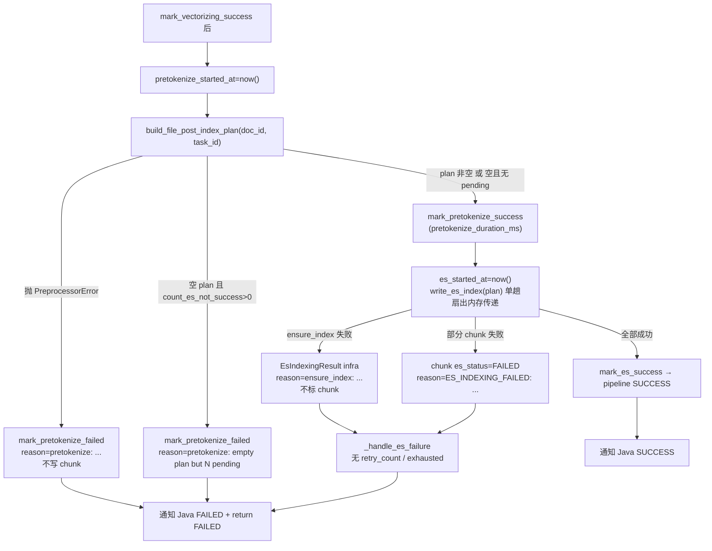

# 预分词独立阶段 技术设计

- **文档状态：** 技术方案已冻结（2026-05-18）
- **项目名称：** toLink-Rag
- **业务域：** 解析后处理流水线（parse_task post-process）
- **需求名称：** 预分词独立阶段
- **业务输入：** docs/预分词独立阶段/brief.md（已冻结 2026-05-18）
- **验收输入：** docs/预分词独立阶段/acceptance.feature（已冻结 2026-05-18，16 Scenario）
- **输出文件：** docs/预分词独立阶段/technical_design.md
- **最后更新时间：** 2026-05-18
- **目标分支：** feature/pretokenization

---

## 1. 文档修订记录

| 版本号 | 修改日期 | 修改内容简述 | 来源/提出人 | 审核状态 |
| :--- | :--- | :--- | :--- | :--- |
| v1.0 | 2026-05-18 | 初始技术设计创建 | brief.md + acceptance.feature | 待审核 |
| v1.1 | 2026-05-18 | 回写 R1（索引重命名保留）/R4（同步 init.sql）/R5（不引入 pytest-bdd，单测承接） | 开发者拍板 | 待审核 |
| v1.2 | 2026-05-18 | ~~已废弃~~：原计划新增 `pretokenize_failed` 持久标记列，实现阶段确认 `pretokenize_status` 已具备相同持久性，删除该冗余列 | 开发者拍板（TD 评审） | 已废弃 |
| v1.3 | 2026-05-18 | **保留** `retry_count`/`last_retry_at` 列（用户侧重试记录）；撤销 R1 索引改名；仅移除 ES 内部自动重试预算；新增预留 pipeline 级 `claim_failed_for_retry`（本次不接线）。**与冻结 brief Q7 / acceptance 一处断言冲突，见 §12 R9** | 开发者拍板（TD 评审） | 待审核 |
| v1.4 | 2026-05-18 | R9 受控订正完成：同步修订冻结 brief（§1/§3.2/§3.3/§4）与 acceptance（2 处断言 + Scenario 更名），三件套重新对齐；R9 关闭 | 开发者拍板（受控订正 brief+acceptance） | 待审核 |
| v1.4-冻结 | 2026-05-18 | 开发者确认冻结，进入 implementation-execution；R1–R10 全部处置完毕，三件套一致 | 开发者拍板 | 已冻结 |

---

## 2. 输入依据与设计目标

### 2.1 输入依据映射

| 输入来源 | 关键结论 | 技术设计承接方式 |
| :--- | :--- | :--- |
| `brief.md` | 预分词升为一等阶段；文件级 all-or-nothing 不污染 chunk；保持耦合 dense 成功；单趟扇出内存传递；失败即终态（移除重试计数）；新增预分词状态+耗时字段；recover 取首个非 SUCCESS 阶段；失败前缀纯内部 | 拆分 `_run_es_indexing` 为「预分词阶段 + ES 消费阶段」；新增 PRETOKENIZE 阶段常量/列/状态写入；移除 retry_count 链路；改 `_infer_recover_stage` |
| `acceptance.feature` | 16 Scenario（含 4 Outline）：主流程、预分词 all-or-nothing、dense 耦合、ES chunk 级、失败终态、外部重投幂等续跑、前缀映射 | 每个方法级改动在 §7.1 关联至少一条 Scenario，§10.2 做全覆盖自检 |

### 2.2 技术目标

- 在 `ParseTaskPipeline._run` 中把"预分词"显化为独立阶段：独立状态写入（`pretokenize_status`）、独立耗时（`pretokenize_duration_ms`）、独立失败收敛与恢复入口。
- 预分词失败只落文件级状态，**移除对 `kb_document_chunk.es_status` 的任何写入**。
- ES 入库阶段保持 chunk 级失败语义；`_ensure_index` 等文件级基础设施故障改为文件级处理、不标 chunk。
- 失败即终态 + 用户侧重试可计数：移除 **ES 内部自动重试预算**（`_handle_es_failure` 内的 `retry_count += 1`、`_is_es_retry_exhausted`、`retry_exhausted` 后缀、`ES_INDEXING_MAX_RETRY` 配置）；**保留** `retry_count`/`last_retry_at` 列与 `idx_post_pipeline_retry` 索引（撤销 R1 改名），用于"用户前端触发重试"的计数；模块与失败处理器一律不碰 retry_count，仅 pipeline 级在"认领重试"动作处 +1（对照 chunk 的 `claim_failed_for_reindex` 模式）。本次只提供预留的 pipeline 级 `claim_failed_for_retry`，不接线任何触发路径（见 §12 R10）。
- 失败原因来源前缀统一：`pretokenize:` / `ensure_index:` / `ES_INDEXING_FAILED:`，纯内部排障。
- 单趟扇出：预分词产出的 `FilePostIndexPlan` 在同一次执行内以内存对象传给 ES，产物不持久化。

不做：稀疏向量化实现、token 持久化、ES 文档结构/mapping/bulk 改动、dense 向量化阶段实现改动。

---

## 3. 改动范围

### 3.1 改动文件目录树

```text
toLink-Rag/
├── src/
│   ├── config.py                                              # [修改] 删除 ES_INDEXING_MAX_RETRY 配置项（仅 ES 内部自动重试预算）
│   ├── models/
│   │   └── parse_task.py                                      # [修改] DocumentPostProcessPipeline 增 pretokenize_status/pretokenize_duration_ms 两列；retry_count/last_retry_at 列与 idx_post_pipeline_retry 索引保留不动
│   └── core/
│       ├── preprocessor/
│       │   └── service.py                                     # [修改] 删除 _mark_pretokenize_failed 的 chunk 标记副作用，失败仅抛 PreprocessorError；移除未用 chunk_repository 依赖
│       ├── es_index_storage/
│       │   └── pipeline.py                                     # [修改] _ensure_index 失败改文件级（不标 chunk），失败原因加 ensure_index: 前缀
│       └── pipeline/
│           └── parse_task/
│               ├── pipeline.py                                 # [修改] 拆分预分词为独立阶段；移除 _handle_es_failure 内 retry_count+=1 与 _is_es_retry_exhausted；失败前缀归一
│               ├── validator.py                                # [修改] _infer_recover_stage 识别 PRETOKENIZE；_mark_incomplete_pipeline_failed 增 PRETOKENIZE 分支
│               └── post_process/
│                   ├── constants.py                            # [修改] 新增 POST_PROCESS_STAGE_PRETOKENIZE
│                   └── repository.py                            # [修改] 新增 mark_pretokenize_success/failed + create_for_log 增 pretokenize_status + _mark_failed 增 PRETOKENIZE 分支 + 新增预留 claim_failed_for_retry（不接线）
├── migrations/
│   └── versions/
│       └── 0002_20260518_pretokenize_stage.py                  # [新增] 仅加 pretokenize 两列（不删 retry 列、不动索引）
├── scripts/
│   └── db/
│       └── init.sql                                            # [修改] 同步 document_post_process_pipeline 仅新增 pretokenize 两列，保持新库冷启动与 Alembic head 一致
├── docs/
│   └── reference/
│       └── mysql_schema.md                                     # [修改] document_post_process_pipeline 段仅新增 pretokenize 两列行（error 级强制）
└── tests/
    └── unit/core/
        ├── preprocessor/test_service.py                        # [测试修改] 删除"预分词失败标 chunk"断言，改为"失败仅抛 PreprocessorError、不写 chunk"
        ├── es_index_storage/test_pipeline.py                    # [测试修改] _ensure_index 失败不标 chunk + ensure_index: 前缀
        └── pipeline/
            ├── test_parse_task_pipeline.py                      # [测试修改] 断言 _handle_es_failure 不再自增 retry_count、reason 无 retry_exhausted；retry_count 列仍在
            ├── test_parse_task_pipeline_es.py                   # [测试修改] 预分词阶段独立化、前缀、不标 chunk 断言
            └── test_post_process_repository.py                  # [测试修改] 新增 pretokenize 状态写入断言；保留 retry 列断言 + 预留 claim_failed_for_retry 断言
```

### 3.2 文件级改动说明

| 文件 | 动作 | 改动目的 | 是否必须 |
| :--- | :--- | :--- | :--- |
| `src/core/pipeline/parse_task/pipeline.py` | 修改 | 拆分预分词独立阶段、单趟扇出、移除 ES 内部自动重试自增、失败前缀归一 | 是 |
| `src/core/preprocessor/service.py` | 修改 | 预分词失败不再写 chunk es_status，只抛异常 | 是 |
| `src/core/es_index_storage/pipeline.py` | 修改 | `_ensure_index` 失败改文件级不标 chunk + 前缀 | 是 |
| `src/core/pipeline/parse_task/validator.py` | 修改 | 恢复推断识别 PRETOKENIZE 阶段 | 是 |
| `src/core/pipeline/parse_task/post_process/repository.py` | 修改 | 预分词阶段状态/耗时写入 + 预留 `claim_failed_for_retry`（不接线） | 是 |
| `src/core/pipeline/parse_task/post_process/constants.py` | 修改 | 新增 PRETOKENIZE 阶段常量 | 是 |
| `src/models/parse_task.py` | 修改 | 仅增预分词 2 列；retry 两列与 idx_post_pipeline_retry 索引保留不动 | 是 |
| `src/config.py` | 修改 | 删除 `ES_INDEXING_MAX_RETRY`（仅 ES 内部自动重试预算） | 是 |
| `migrations/versions/0002_*.py` | 新增 | 仅加 pretokenize 2 列（error 级强制） | 是 |
| `docs/reference/mysql_schema.md` | 修改 | 仅新增 pretokenize 2 列行（error 级强制） | 是 |
| `scripts/db/init.sql` | 修改 | 仅同步新增 pretokenize 2 列，保持冷启动一致（R4 已确认） | 是 |
| `src/core/es_index_storage/__init__.py` | 不改 | 导出契约不变 | — |
| `src/core/preprocessor/models.py` | 不改 | `FilePostIndexPlan` 契约不变（单趟扇出复用） | — |

---

## 4. 当前系统分析

| 类型 | 文件/类/方法 | 当前行为 | 问题或复用点 |
| :--- | :--- | :--- | :--- |
| 编排 | `parse_task/pipeline.py::ParseTaskPipeline._run` (≈208-339) | chunking→vectorizing→`_run_es_indexing`（预分词+ES 合并在 ES 阶段内）→ mark_es_success/`_handle_es_failure` | 需在 vectorizing 成功后插入独立预分词阶段块 |
| 编排 | `ParseTaskPipeline._run_es_indexing` (453-483) | 调 `build_file_post_index_plan`→异常走 `_handle_pretokenize_failure`→`write_es_index`→空计划但 pending>0 判失败 | 拆为「预分词阶段」+「ES 消费阶段」；空计划-pending 判定归预分词阶段 |
| 编排 | `_handle_pretokenize_failure` (485-505) | 列 chunk_ids 并 `mark_es_failed`（**写 chunk es_status**） | 必须移除 chunk 写入，改为只写 pretokenize 阶段失败 |
| 编排 | `_handle_es_failure` (507-529) | `pipeline_record.retry_count += 1`；`_is_es_retry_exhausted` 追加 `retry_exhausted=true`；`mark_es_failed` | 移除 retry_count 自增与 exhausted 后缀 |
| 编排 | `_is_es_retry_exhausted` (531-535) | 读 `settings.ES_INDEXING_MAX_RETRY` 判上限 | 整方法删除 |
| 编排 | `_build_es_failure_reason` (≈622-627) | 生成 `ES_INDEXING_FAILED: ...` | 复用为 ES chunk 级失败前缀来源 |
| 编排 | `_get_preprocessor`/`_get_es_indexing_pipeline` (435-451) | 懒加载协作者 | 复用，注入点不变 |
| 预分词 | `preprocessor/service.py::Preprocessor.build_file_post_index_plan` (51-92) | 查 `vector_status==SUCCESS & es_status in(PENDING,FAILED)`；分词；异常→`_mark_pretokenize_failed`+raise | 保留取数（dense 耦合不变）；删除失败副作用 |
| 预分词 | `Preprocessor._mark_pretokenize_failed` (138-151) | `chunk_repository.mark_es_failed` 写 chunk | 删除该方法；`build_file_post_index_plan` except 仅 `raise PreprocessorError` |
| 预分词 | `Preprocessor._list_chunks_for_pretokenization` (94-108) | 过滤 `vector_status==SUCCESS` | **不改**（Q3 保持耦合） |
| ES | `es_index_storage/pipeline.py::EsIndexingPipeline.write_es_index` (49-99) | ensure_index 失败→`_mark_all_failed`（标全部 chunk）；chunk 级 bulk 逐批标 success/failed | chunk 级语义保留；ensure_index 路径改文件级 |
| ES | `EsIndexingPipeline._mark_all_failed` (197-205) | 把传入 chunk_ids 全标 es_failed | ensure_index 场景不再调用它标 chunk |
| 恢复 | `validator.py::ParseTaskGuard._infer_recover_stage` (220-226) | chunking!=SUCCESS→CHUNKING；vectorizing!=SUCCESS→VECTORIZING；else ES_INDEXING | 在 vectorizing 与 ES 之间插入 pretokenize 判定 |
| 恢复 | `validator.py::_mark_incomplete_pipeline_failed` (183-217) | recover_stage 分支 CHUNKING/VECTORIZING/else→ES | 增 PRETOKENIZE 分支 |
| 仓储 | `post_process/repository.py::PostProcessPipelineRepository` | create_for_log 初始化三阶段 PENDING；mark_*_success/failed；`_mark_failed` 三分支 | 增 pretokenize 状态字段初始化与 success/failed；`_mark_failed` 增分支 |
| 模型 | `models/parse_task.py::DocumentPostProcessPipeline` (75-115) | 三阶段状态列 + `retry_count`/`last_retry_at` + `idx_post_pipeline_retry` | 增 2 列（`pretokenize_status`/`pretokenize_duration_ms`）；retry 列与索引保留不动 |
| 配置 | `config.py` (122) | `ES_INDEXING_MAX_RETRY: int = 3` | 删除 |

---

## 5. 总体方案设计

### 5.1 总体流程



### 5.2 模块边界

| 模块 | 职责 | 本次是否改动 |
| :--- | :--- | :--- |
| `ParseTaskPipeline`（编排） | 显化预分词阶段、单趟扇出、失败收敛、移除重试计数 | 是 |
| `Preprocessor`（预分词） | 产出文件级 plan；失败只抛异常不写 chunk | 是 |
| `EsIndexingPipeline`（ES 消费） | chunk 级失败语义保留；ensure_index 文件级 | 是（仅 ensure_index 路径） |
| `ParseTaskGuard`（恢复推断） | 识别 PRETOKENIZE 阶段 | 是 |
| `PostProcessPipelineRepository`（状态仓储） | 预分词阶段状态/耗时写入 | 是 |
| `DocumentPostProcessPipeline`（ORM/schema） | 增预分词列、删 retry 列/索引 | 是 |
| 分词算法 `RagFlowTokenizer` | 纯函数分词 | 否 |
| ES 文档结构 / mapping / batcher / bulk | chunk 级写入 | 否 |
| dense 向量化阶段 | Qdrant 写入 | 否 |

---

## 6. API、消息与数据设计

### 6.1 API 设计

无新增/变更 HTTP API。

### 6.2 MQ 消息设计

parse_result 通知契约**不变**：失败仍 `status=FAILED` + `failure_reason`（含内部前缀，Java 仅展示不解析，Q6/Scenario「失败来源映射」断言）。不新增 topic / 字段。

### 6.3 数据与存储设计

`document_post_process_pipeline` 表变更：

- **新增列**：
  - `pretokenize_status VARCHAR(20) NOT NULL DEFAULT 'PENDING'`（`PENDING`/`SUCCESS`/`FAILED`，阶段状态）
  - `pretokenize_duration_ms BIGINT NULL`（预分词耗时）
- **保留列（不删，v1.3 修正）**：`retry_count`、`last_retry_at` 继续存在，语义重定为"**用户前端触发重试**的计数与时间"，不再由任何模块/失败处理器写；仅由预留的 pipeline 级 `claim_failed_for_retry` 在认领重试时 +1。
- **保留索引（撤销 R1 改名）**：`idx_post_pipeline_retry(pipeline_status, recover_from_stage, updated_at)` 原名原列不动（重试概念仍在，无需改名）。
- 列顺序建议：`pretokenize_status` 紧随 `vectorizing_status` 之后、`es_indexing_status` 之前；`pretokenize_duration_ms` 紧随 `vectorizing_duration_ms` 之后。

Alembic 迁移 `0002_20260518_pretokenize_stage.py`：

- `revision="0002"`, `down_revision="0001"`。
- `upgrade()`：仅 `op.add_column` 两个 pretokenize 列（`pretokenize_status` 带 `server_default='PENDING'`，见 R2）。**不删 retry 列、不动任何索引。**
- `downgrade()`：仅 `op.drop_column` 两个 pretokenize 列。
- 不持久化 token：不新增任何 token 列/表。

**`scripts/db/init.sql` 同步（R4 已确认）**：init.sql 是冷启动建表权威、0001 基线快照。仅在 `document_post_process_pipeline` 建表语句中**新增** `pretokenize_status`/`pretokenize_duration_ms` 两列（`retry_count`/`last_retry_at`/`idx_post_pipeline_retry` 保持原样）。保证「新库 init.sql 冷启动 + alembic stamp 0001 + upgrade head」与「Alembic head」结构一致。

不涉及 Redis / OSS / Qdrant / 新 MQ 契约（无 `middleware_contract.md`，项目无该文件）。

---

## 7. 方法级实现方案

### 7.1 方法级变更总表

| 文件 | 类/对象 | 方法/成员 | 动作 | 入参变化 | 返回变化 | 改动目的 | 对应 Scenario |
| :--- | :--- | :--- | :--- | :--- | :--- | :--- | :--- |
| `parse_task/pipeline.py` | `ParseTaskPipeline` | `_run` | 修改 | 无 | 无 | vectorizing 成功后插入独立预分词阶段块，再单趟扇出调用 ES 消费 | 全链路成功并通知 Java；单趟扇出只分词一次且产物不持久化 |
| `parse_task/pipeline.py` | `ParseTaskPipeline` | `_run_pretokenize` | 新增 | `(payload, pipeline_record, db)` | `FilePostIndexPlan` 或抛失败收敛 | 独立预分词阶段：建 plan、空计划-pending 判定、写 pretokenize 终态 | 任一 chunk 分词失败则整文件预分词失败且不污染 chunk；各类分词失败触发条件 Outline；仍有 dense 未成功待索引 chunk 时不被误判成功 |
| `parse_task/pipeline.py` | `ParseTaskPipeline` | `_run_es_indexing` | 修改 | 改为接收 `plan: FilePostIndexPlan` | `EsIndexingResult` | 仅消费内存 plan 写 ES，不再内含预分词与空计划判定 | 部分 chunk 写 ES 失败不中止整批；ES 全部成功收敛；预分词成功但 ES 部分失败后重投只补失败子集 |
| `parse_task/pipeline.py` | `ParseTaskPipeline` | `_handle_pretokenize_failure` | 修改 | 去掉 chunk 列举 | `EsIndexingResult`→改为 None（直接落 pretokenize 失败） | 不写 chunk es_status，只 `mark_pretokenize_failed`（`pretokenize:` 前缀） | 任一 chunk 分词失败则整文件预分词失败且不污染 chunk |
| `parse_task/pipeline.py` | `ParseTaskPipeline` | `_handle_es_failure` | 修改 | 无 | 无 | 移除 `retry_count+=1`（内部按失败自增，错误）与 `_is_es_retry_exhausted` 调用、`retry_exhausted` 后缀；只前缀化 reason 落终态。retry_count 列保留但失败处不再写 | 任一失败均为终态且不产生 ES 内部重试计数；同一文件多次失败不被次数拦截 |
| `parse_task/pipeline.py` | `ParseTaskPipeline` | `_is_es_retry_exhausted` | 删除 | — | — | 移除 ES 内部自动重试上限判断 | 任一失败均为终态且不产生 ES 内部重试计数 |
| `parse_task/pipeline.py` | `ParseTaskPipeline` | `_build_es_failure_reason` | 不改 | — | — | 复用为 `ES_INDEXING_FAILED:` 前缀来源 | 失败来源映射到 failure_reason 前缀 |
| `preprocessor/service.py` | `Preprocessor` | `build_file_post_index_plan` | 修改 | 无 | 无 | except 仅 `raise PreprocessorError`，不写 chunk、不 commit | 任一 chunk 分词失败则整文件预分词失败且不污染 chunk |
| `preprocessor/service.py` | `Preprocessor` | `_mark_pretokenize_failed` | 删除 | — | — | 移除 chunk es_status 副作用 | 各类分词失败触发条件 Outline |
| `preprocessor/service.py` | `Preprocessor` | `__init__` | 修改 | 移除未用 `chunk_repository` | 无 | 删除随副作用一并失效的依赖（无死代码） | 单趟扇出只分词一次且产物不持久化 |
| `preprocessor/service.py` | `Preprocessor` | `_list_chunks_for_pretokenization` | 不改 | — | — | 保持 `vector_status==SUCCESS` 耦合 | 仅 dense 向量化成功的 chunk 进入预分词与 ES |
| `es_index_storage/pipeline.py` | `EsIndexingPipeline` | `write_es_index` | 修改 | 无 | `EsIndexingResult`（ensure_index 失败时 `failed_item_ids=[]`、`failure_reason="ensure_index: ..."`） | ensure_index 失败不标 chunk、文件级语义 | ES 基础设施故障按文件级处理不标 chunk |
| `es_index_storage/pipeline.py` | `EsIndexingPipeline` | `_ensure_index` | 修改 | 无 | 抛错信息加 `ensure_index:` 语义 | 前缀归一 | ES 基础设施故障按文件级处理不标 chunk；失败来源映射前缀 |
| `es_index_storage/pipeline.py` | `EsIndexingPipeline` | `_mark_all_failed` | 删除 | — | — | ensure_index 不再标 chunk，无其他调用方 | ES 基础设施故障按文件级处理不标 chunk |
| `parse_task/validator.py` | `ParseTaskGuard` | `_infer_recover_stage` | 修改 | 无 | 可返回 `PRETOKENIZE` | 在 vectorizing 后插入：pretokenize_status!=SUCCESS → 返回 PRETOKENIZE（pretokenize_status 不被 mark_processing 清，与其他阶段状态列一致） | recover_from_stage 取首个非 SUCCESS 阶段；预分词失败后重投从预分词整篇重入 |
| `parse_task/validator.py` | `ParseTaskGuard` | `_mark_incomplete_pipeline_failed` | 修改 | 无 | 无 | 增 PRETOKENIZE 分支调用 `mark_pretokenize_failed` | 预分词失败后重投从预分词整篇重入 |
| `post_process/repository.py` | `PostProcessPipelineRepository` | `create_for_log` | 修改 | 无 | 无 | 初始化 `pretokenize_status=PENDING` | 全链路成功并通知 Java |
| `post_process/repository.py` | `PostProcessPipelineRepository` | `mark_pretokenize_success` | 新增 | `(db, pipeline, *, duration_ms)` | None | 写预分词阶段成功 + 耗时 | 全链路成功并通知 Java；预分词失败后重投从预分词整篇重入 |
| `post_process/repository.py` | `PostProcessPipelineRepository` | `mark_pretokenize_failed` | 新增 | `(db, pipeline, *, reason, duration_ms, finished_at)` | None | 写预分词阶段失败（复用 `_mark_failed`） | 任一 chunk 分词失败则整文件预分词失败且不污染 chunk |
| `post_process/repository.py` | `PostProcessPipelineRepository` | `_mark_failed` | 修改 | 无 | 无 | 增 `PRETOKENIZE` 分支置 `pretokenize_status=FAILED` + 耗时 | recover_from_stage 取首个非 SUCCESS 阶段 |
| `post_process/repository.py` | `PostProcessPipelineRepository` | `mark_processing` | 不改（设计约束） | — | — | 保持现状重置 failed/recover/reason；**约束：不得把 `retry_count`、`last_retry_at` 加入重置集**（用户侧重试计数） | 预分词失败后重投从预分词整篇重入 |
| `post_process/repository.py` | `PostProcessPipelineRepository` | `claim_failed_for_retry` | 新增（预留·本次不接线） | `(db, pipeline)` | None/bool | 对照 chunk 的 `claim_failed_for_reindex`：用户触发重试时 `retry_count=retry_count+1`、`last_retry_at=now()`、重置易失字段以据 `recover_from_stage` 重跑。本次仅实现方法，不接入任何触发路径（见 §12 R10） | 任一失败均为终态且不产生 ES 内部重试计数（用户侧重试计数预留） |
| `post_process/constants.py` | 模块常量 | `POST_PROCESS_STAGE_PRETOKENIZE` | 新增 | — | `"PRETOKENIZE"` | 阶段标识 | recover_from_stage 取首个非 SUCCESS 阶段 |
| `models/parse_task.py` | `DocumentPostProcessPipeline` | 列定义 | 修改 | — | — | **仅增** 2 列（`pretokenize_status`/`pretokenize_duration_ms`）；`retry_count`/`last_retry_at` 列与 `idx_post_pipeline_retry` 索引保留不动 | 预分词失败后重投从预分词整篇重入 |
| `config.py` | `Settings` | `ES_INDEXING_MAX_RETRY` | 删除 | — | — | 移除 ES 内部自动重试上限配置（与用户侧 retry_count 无关） | 任一失败均为终态且不产生 ES 内部重试计数 |
| `migrations/versions/0002_*.py` | — | `upgrade/downgrade` | 新增 | — | — | 仅加 pretokenize 2 列（不删 retry 列、不动索引） | 预分词失败后重投从预分词整篇重入 |

### 7.2 逐方法实现设计

#### 7.2.1 `parse_task/pipeline.py::ParseTaskPipeline._run`

- 当前行为：vectorizing 成功后 `es_started_at=now()`→`_run_es_indexing(payload, pipeline_record, db)`→`is_success` 分支。
- 修改后职责：在 `mark_vectorizing_success` 之后、ES 之前，插入独立预分词阶段块。
- 详细步骤：
  1. `pretokenize_started_at = now()`；`plan = await self._run_pretokenize(payload, pipeline_record, db)`。
  2. `_run_pretokenize` 内部已在失败时完成「写 pretokenize 终态 + 通知 + 返回信号」；失败时 `_run` 直接 `return ParsePipelineResult(status=FAILED, ...)`（沿用现有 chunking/vectorizing 失败的返回风格）。
  3. 成功拿到 `plan` 后：`es_started_at=now()`；`es_result = await self._run_es_indexing(plan, payload, pipeline_record, db)`；其余 `is_success`/`mark_es_success`/`_handle_es_failure`/通知逻辑保持现状。
- 事务与异常边界：沿用现有「每阶段一次终态写 + db.commit（仓储内）」节奏；预分词阶段与 ES 阶段各自独立终态写。
- 调用关系：`_run` → `_run_pretokenize` → `_run_es_indexing`。
- 对应测试：`全链路成功并通知 Java`、`单趟扇出只分词一次且产物不持久化`。

#### 7.2.2 `parse_task/pipeline.py::ParseTaskPipeline._run_pretokenize`（新增）

- 职责：独立预分词阶段执行体。
- 入参：`payload`, `pipeline_record`, `db`；出参：`FilePostIndexPlan`（成功）或在失败时完成收敛并返回哨兵（建议返回 `None` 并由 `_run` 据此 return 失败结果，避免异常控制流）。
- 详细步骤：
  1. `pretokenize_started_at = now()`；`doc_id=int(payload.original_file_id)`。
  2. `try: plan = await self._get_preprocessor().build_file_post_index_plan(doc_id=doc_id, task_id=payload.task_id)`。
  3. `except Exception as exc:` → `await self._handle_pretokenize_failure(pipeline_record, str(exc), db, pretokenize_started_at, now())`；通知 `PARSE_TASK_STATUS_FAILED`；返回失败信号。
  4. 空计划判定（原 `_run_es_indexing` 474-483 迁移至此）：`if plan.total_items==0:` `pending=await self._chunk_repository.count_es_not_success_by_doc_id(db, doc_id)`；`if pending>0:` reason=`f"pretokenize: empty plan but {pending} chunks pending"` → `_handle_pretokenize_failure(...)` → 通知 FAILED → 返回失败信号；`else:`（无 pending，文件已完成）视为预分词成功空计划（幂等空操作场景）。
  5. 成功：`await self._post_process_repository.mark_pretokenize_success(db, pipeline_record, duration_ms=duration_ms(pretokenize_started_at, now()))`（内部置 `pretokenize_status=SUCCESS`）；返回 `plan`。
- 幂等与并发边界：`plan` 为内存对象，单趟扇出，不落库；空计划且无 pending → 不调用分词器、`mark_pretokenize_success`，ES 阶段对空 plan no-op（`write_es_index` total_items==0 提前返回）。
- 对应测试：`任一 chunk 分词失败则整文件预分词失败且不污染 chunk`、`各类分词失败触发条件 Outline`、`仍有 dense 未成功的待索引 chunk 时文件级 ES 不被误判成功`、`全部已成功的文件被重投为幂等空操作`。

#### 7.2.3 `parse_task/pipeline.py::ParseTaskPipeline._handle_pretokenize_failure`

- 当前行为：`list_es_pending_or_failed_chunk_ids_by_doc_id` + `mark_es_failed`（写 chunk）。
- 修改后职责：**不触碰 chunk**；仅 `await self._post_process_repository.mark_pretokenize_failed(db, pipeline_record, reason=("pretokenize: " 前缀化 reason), duration_ms=..., finished_at=...)`。
- 入参：`(pipeline_record, reason, db, started_at, finished_at)`。
- 详细步骤：reason 若未以 `pretokenize:` 开头则补前缀（`build_file_post_index_plan` 内部产生的 `ValueError` 文案含坏 chunk_id，统一在此加前缀）；调用 `mark_pretokenize_failed`（落 `pretokenize_status=FAILED`；`pretokenize_status` 不被 `mark_processing` 清，跨重投持久）。
- 事务与异常边界：仓储内 `db.commit()`；不调用任何 `chunk_repository` 写方法。
- 对应测试：`任一 chunk 分词失败则整文件预分词失败且不污染 chunk`（断言 chunk es_status 不变）。

#### 7.2.4 `parse_task/pipeline.py::ParseTaskPipeline._run_es_indexing`

- 当前行为：内部建 plan + 空计划判定 + `write_es_index`。
- 修改后职责：纯 ES 消费——入参改为 `(plan: FilePostIndexPlan, payload, pipeline_record, db)`，仅 `return await self._get_es_indexing_pipeline().write_es_index(plan, db=db)`。空计划判定移出（已在 `_run_pretokenize`）。
- 调用方同步：`_run` 改为传 plan。
- 对应测试：`部分 chunk 写 ES 失败不中止整批`、`ES 全部成功收敛`、`预分词成功但 ES 部分失败后重投只补失败子集`。

#### 7.2.5 `parse_task/pipeline.py::ParseTaskPipeline._handle_es_failure`

- 当前行为：`pipeline_record.retry_count = int(...) + 1`；`if self._is_es_retry_exhausted(...): reason += "; retry_exhausted=true"`；`mark_es_failed`。
- 修改后职责：删除 retry_count 自增与 `_is_es_retry_exhausted` 调用与 `retry_exhausted` 后缀；`failure_reason = es_result.failure_reason or self._build_es_failure_reason(es_result)`（保留 `ensure_index:` / `ES_INDEXING_FAILED:` 前缀）；`await self._post_process_repository.mark_es_failed(...)`。
- 对应测试：`任一失败均为终态且不产生 ES 内部重试计数语义`、`同一文件多次失败不被次数拦截`、`失败来源映射到 failure_reason 前缀`。

#### 7.2.6 `parse_task/pipeline.py::ParseTaskPipeline._is_es_retry_exhausted`（删除）

- 删除整方法及对 `settings.ES_INDEXING_MAX_RETRY` 的唯一引用点。
- 对应测试：`任一失败均为终态且不产生 ES 内部重试计数语义`。

#### 7.2.7 `preprocessor/service.py::Preprocessor.build_file_post_index_plan` / `_mark_pretokenize_failed` / `__init__`

- `build_file_post_index_plan`：`except Exception as exc:` 由「`reason=_format_failure_reason(exc)`；`await self._mark_pretokenize_failed(...)`；`raise PreprocessorError`」改为「`raise PreprocessorError(self._format_failure_reason(exc)) from exc`」——无 DB 写、无 commit。
- `_mark_pretokenize_failed`：删除整方法。
- `__init__`：移除 `chunk_repository`/`self._chunk_repository`（仅 `_mark_pretokenize_failed` 使用，删后无引用，避免死依赖）。`session_factory`/`tokenizer*` 保留。
- 调用方：`ParseTaskPipeline._get_preprocessor` 内 `Preprocessor(chunk_repository=self._chunk_repository)` → 改为 `Preprocessor()`（或保留 session/tokenizer 注入）。
- 事务与异常边界：预分词失败路径**零 DB 写**，失败语义完全上移到 `_run_pretokenize`。
- 对应测试：`任一 chunk 分词失败则整文件预分词失败且不污染 chunk`、`各类分词失败触发条件 Outline`（断言 chunk es_status 全程 PENDING、无 retry_count 写入）。

#### 7.2.8 `es_index_storage/pipeline.py::EsIndexingPipeline.write_es_index` / `_ensure_index` / `_mark_all_failed`

- 当前 ensure_index 失败路径（60-68）：`reason=str(EsBulkError(...))`→`_mark_all_failed(db, all_chunk_ids, reason)`→`EsIndexingResult(failed_item_ids=all_chunk_ids, failure_reason=reason)`。
- 修改后：
  - `_ensure_index` 抛出的异常信息统一可被识别为基础设施故障；`write_es_index` 捕获后 **不调用 `_mark_all_failed`**，返回 `EsIndexingResult(total_items=N, indexed_items=0, failed_item_ids=[], failure_reason=f"ensure_index: {原因}")`（`failed_item_ids=[]` ⇒ 不暗示 chunk 级失败；`is_success` 仍为 False，因 `indexed!=total`）。
  - `_mark_all_failed`：删除（ensure_index 是其唯一调用方）。
  - chunk 级 bulk 路径（70-99）**完全不改**：逐批 `mark_es_success`/`mark_es_failed`、`ES_INDEXING_FAILED:` 前缀保留。
- 幂等与并发边界：ensure_index 幂等（已存在/并发 already_exists 吞掉）逻辑保留。
- 对应测试：`ES 基础设施故障按文件级处理不标 chunk`（断言 chunk es_status 不变 + `ensure_index:` 前缀）、`部分 chunk 写 ES 失败不中止整批`（chunk 级语义回归不变）。

#### 7.2.9 `parse_task/validator.py::ParseTaskGuard._infer_recover_stage` / `_mark_incomplete_pipeline_failed`

- `_infer_recover_stage`：在 `vectorizing_status != SUCCESS → VECTORIZING` 之后、`return ES_INDEXING` 之前，插入预分词判定：`if getattr(pipeline_record, "pretokenize_status", None) != STAGE_STATUS_SUCCESS: return POST_PROCESS_STAGE_PRETOKENIZE`。`pretokenize_status` 不被 `mark_processing` 重置（与其他阶段状态列一致），跨重投持久，恢复推断据此回 PRETOKENIZE。
- `_mark_incomplete_pipeline_failed`：在 CHUNKING/VECTORIZING 分支后、`else→mark_es_failed` 前，增 `elif recover_stage == POST_PROCESS_STAGE_PRETOKENIZE: await self._post_process_repository.mark_pretokenize_failed(...)`。
- 导入：`validator.py` 增 `POST_PROCESS_STAGE_PRETOKENIZE` 导入。
- 对应测试：`recover_from_stage 取首个非 SUCCESS 阶段 Outline`、`预分词失败后重投从预分词整篇重入`、`预分词成功但 ES 部分失败后重投只补失败子集`。

#### 7.2.10 `post_process/repository.py` 与 `constants.py`

- `constants.py`：新增 `POST_PROCESS_STAGE_PRETOKENIZE = "PRETOKENIZE"`。
- `repository.py` 导入新增该常量。
- `create_for_log`：模型构造增 `pretokenize_status=STAGE_STATUS_PENDING`（或依赖列 default）。
- 新增 `mark_pretokenize_success(db, pipeline, *, duration_ms)`：`pipeline.pretokenize_status=SUCCESS`；`pipeline.pretokenize_duration_ms=duration_ms`；`pipeline.failure_reason=None`；`await db.commit()`（与 `mark_vectorizing_success` 同构）。
- 新增 `mark_pretokenize_failed(db, pipeline, *, reason, duration_ms, finished_at)`：`await self._mark_failed(db, pipeline, stage=POST_PROCESS_STAGE_PRETOKENIZE, reason=reason, finished_at=finished_at, duration_ms=duration_ms)`。
- `_mark_failed`：增 `elif stage == POST_PROCESS_STAGE_PRETOKENIZE: pipeline.pretokenize_status=STAGE_STATUS_FAILED; pipeline.pretokenize_duration_ms=duration_ms`；其余（`pipeline_status=FAILED`、`failed_stage`、`recover_from_stage=stage`、`failure_reason`、`finished_at`、`total_duration_ms`）通用逻辑复用。
- `mark_processing`：**不改**——它继续只重置 `pipeline_status`/`started_at`/`finished_at`/`failed_stage`/`recover_from_stage`/`failure_reason`；各阶段状态列（含 `pretokenize_status`）跨重投持久，不在 `mark_processing` 重置集内。
- 对应测试：`test_post_process_repository.py` 新增断言——预分词失败后 `pretokenize_status==FAILED`；调用 `mark_processing` 后 `pretokenize_status` 仍为 FAILED（持久性）；`mark_pretokenize_success` 后回 SUCCESS。

#### 7.2.11 `models/parse_task.py::DocumentPostProcessPipeline` / `config.py` / Alembic

- 模型：**仅新增** `pretokenize_status = Column(String(20), nullable=False, default="PENDING")`、`pretokenize_duration_ms = Column(BIGINT, nullable=True)`。`retry_count`/`last_retry_at` 列定义与 `__table_args__` 中 `Index("idx_post_pipeline_retry", ...)` **保持原样不动**（v1.3 撤销 R1 改名）。
- `config.py`：删除 `ES_INDEXING_MAX_RETRY: int = 3`（仅 ES 内部自动重试预算；确认无其他引用：仅 `_is_es_retry_exhausted`）。
- Alembic `0002_20260518_pretokenize_stage.py`：`revision="0002"`,`down_revision="0001"`；`upgrade`：**仅** add 两列（`pretokenize_status` 带 `server_default='PENDING'`、`pretokenize_duration_ms`）；`downgrade`：**仅** drop 两个 pretokenize 列。不删 retry 列、不动索引。
- `scripts/db/init.sql`（R4 已确认）：在 `document_post_process_pipeline` 建表语句中**仅新增** `pretokenize_status`/`pretokenize_duration_ms` 两列；`retry_count`/`last_retry_at`/`idx_post_pipeline_retry` 原样保留。
- `docs/reference/mysql_schema.md`：§`document_post_process_pipeline` 段——表头说明改"分片 → 向量化 → **预分词** → ES 入库四段"；字段表**插入** `pretokenize_status`/`pretokenize_duration_ms` 两行；`retry_count`/`last_retry_at` 行与 `idx_post_pipeline_retry` 索引保留不变（其语义说明可补注"用户侧重试计数"）。

#### 7.2.12 `post_process/repository.py::PostProcessPipelineRepository.claim_failed_for_retry`（新增·预留·本次不接线）

- 设计参照：`ChunkRepository.claim_failed_for_reindex`（`src/core/chunk_fact_storage/repository.py:457`）——计数在"认领重试"动作处自增，不在失败处、不在模块内。
- 职责：用户前端触发重试时，对 `pipeline_status==FAILED` 的行原子认领并计数。
- 入参：`(db, pipeline)`（或按 task_id 的 UPDATE 形式，与 chunk 版对照）。出参：是否认领成功（`bool`）或 None。
- 详细步骤（建议）：`UPDATE document_post_process_pipeline SET retry_count=retry_count+1, last_retry_at=now(), pipeline_status=PROCESSING, failed_stage=NULL, recover_from_stage 保留, failure_reason=NULL WHERE pipeline_status='FAILED'`；各阶段 `*_status` 不在此重置（持久，交由对应阶段成功时清）。
- **本次范围**：仅实现该仓储方法 + 单测；**不接入任何触发路径**（不改 `handle_duplicate`、不加新 MQ/接口契约）。触发路径为 §12 R10 待确认项，待后续需求接线。
- 约束：除本方法外，全仓**禁止**再出现对 `document_post_process_pipeline.retry_count` 的写入（模块、失败处理器、`mark_processing`、`_mark_failed`、`mark_es_failed` 一律不碰）。
- 对应测试：`test_post_process_repository.py` 断言——调用后 `retry_count` 自增 1、`last_retry_at` 被刷新、`pipeline_status` 置 PROCESSING；非 FAILED 行不被认领。

---

## 8. 组件与集成设计

- 不接入新组件。复用：`Preprocessor`/`RagFlowTokenizer`（分词，不改算法）、`EsIndexingPipeline`（chunk 级写入，不改 bulk）、`ChunkRepository.count_es_not_success_by_doc_id`（空计划-pending 判定，复用现有方法）、`PostProcessPipelineRepository._mark_failed`（失败终态通用写）。
- Alembic 已在 feature/pretokenization 接入（`migrations/`、`0001` 基线），本次按现有 `script.py.mako` 风格新增 `0002`。
- 业务层改动（编排/预分词/ES 失败归类/恢复推断/仓储/模型）与 framework 层（无）明确区分：本次不动 framework。

---

## 9. 异常处理与降级策略

| 异常场景 | 处理方式 | 是否抛出 | 是否影响消息确认 |
| :--- | :--- | :--- | :--- |
| 预分词任一 chunk 分词失败 | `Preprocessor` 抛 `PreprocessorError`；`_run_pretokenize` 捕获→`mark_pretokenize_failed`（`pretokenize:`）→通知 FAILED→return FAILED；**不写 chunk** | 内部抛后被编排捕获 | 与现有失败一致（通知后正常 ack，不靠异常驱动重投） |
| 预分词空计划但仍有 pending chunk | `_run_pretokenize` 判定为预分词失败（`pretokenize: empty plan but N pending`） | 否 | 同上 |
| 预分词空计划且无 pending（文件已完成） | 视为预分词成功，ES 阶段对空 plan no-op，pipeline 保持/收敛 SUCCESS | 否 | 正常 SUCCESS 通知 |
| ES `_ensure_index` 失败（ES 不可达等） | 文件级：`EsIndexingResult` infra（`failed_item_ids=[]`,`ensure_index:`）→`_handle_es_failure`→`mark_es_failed`；**不标 chunk** | 否 | 通知 FAILED |
| ES 部分 chunk bulk 失败 | chunk 级：失败 chunk `es_status=FAILED`+`es_error_msg`，成功 `SUCCESS`；`ES_INDEXING_FAILED:`；`mark_es_failed` | 否 | 通知 FAILED |
| 任一失败 | 失败即终态，**不自增 retry_count、不判上限、不写 retry_exhausted** | — | 不自动重试；外部重投按 `recover_from_stage` 幂等续跑 |
| 外部重投已 SUCCESS 文件 | 预分词空计划且无 pending → 幂等空操作，状态保持 SUCCESS | 否 | 按现有 guard 行为 |

---

## 10. 测试方案

### 10.1 方法级测试映射

| 被测文件/方法 | 测试文件 | 对应 Scenario | 断言要点 |
| :--- | :--- | :--- | :--- |
| `ParseTaskPipeline._run` / `_run_pretokenize` | `tests/unit/core/pipeline/test_parse_task_pipeline_es.py` | 全链路成功并通知 Java；单趟扇出只分词一次且产物不持久化 | 分词器每 chunk 调一次；`pretokenize_status=SUCCESS`+`pretokenize_duration_ms` 非空；无 token 落库；最终 SUCCESS 通知 |
| `_run_pretokenize` / `_handle_pretokenize_failure` / `Preprocessor.build_file_post_index_plan` | `test_parse_task_pipeline_es.py` / `tests/unit/core/preprocessor/test_service.py` | 任一 chunk 分词失败则整文件预分词失败且不污染 chunk；各类分词失败触发条件 Outline | `pretokenize_status=FAILED`；`failed_stage/recover_from_stage=PRETOKENIZE`；reason `pretokenize:` 前缀；chunk es_status 全程 PENDING；无 retry_count 写入 |
| `Preprocessor._list_chunks_for_pretokenization` | `test_service.py` | 仅 dense 向量化成功的 chunk 进入预分词与 ES | `vector_status!=SUCCESS` 的 chunk 不被分词、不进 ES |
| `_run_pretokenize` 空计划-pending 判定 | `test_parse_task_pipeline_es.py` | 仍有 dense 未成功的待索引 chunk 时文件级 ES 不被误判成功 | `es`/`pipeline` FAILED；reason `pretokenize:` 开头且含 `pending` |
| `EsIndexingPipeline.write_es_index`（chunk 级） | `tests/unit/core/es_index_storage/test_pipeline.py` | 部分 chunk 写 ES 失败不中止整批；ES 全部成功收敛 | 成功 chunk SUCCESS、失败 chunk FAILED+err；不中止；`ES_INDEXING_FAILED:` |
| `EsIndexingPipeline.write_es_index` / `_ensure_index` | `test_pipeline.py` | ES 基础设施故障按文件级处理不标 chunk | chunk es_status 不变；`ensure_index:` 前缀；文件级 FAILED |
| `_handle_es_failure` / 删除 `_is_es_retry_exhausted` / `claim_failed_for_retry`（预留） | `test_parse_task_pipeline.py` / `test_post_process_repository.py` | 任一失败均为终态且不产生 ES 内部重试计数；同一文件多次失败不被次数拦截 | reason 无 `retry_exhausted`/`MAX_RETRY`；**失败处不写 `retry_count`**；`retry_count`/`last_retry_at` 列**仍存在**；预留 `claim_failed_for_retry` 调用后 `retry_count` 自增 1；多次失败仍按终态记录 |
| `_run` 续跑 / `Preprocessor` 取数 | `test_parse_task_pipeline_es.py` | 预分词成功但 ES 部分失败后重投只补失败子集 | 仅 `es_status in(PENDING,FAILED)` 的 chunk 被重新分词与写 ES；SUCCESS chunk 不动 |
| `ParseTaskGuard._infer_recover_stage` / `_mark_incomplete_pipeline_failed` / `PostProcessPipelineRepository.mark_processing` | `tests/unit/core/pipeline/test_parse_task_pipeline.py` / `test_post_process_repository.py` | 预分词失败后重投从预分词整篇重入；recover_from_stage 取首个非 SUCCESS 阶段 Outline | recover 推断按 chunking→vectorizing→pretokenize→es 取首个非 SUCCESS；`pretokenize_status` 经 `mark_processing` 后仍持久（不被重置），恢复推断据此回 PRETOKENIZE；`mark_pretokenize_success` 后回 SUCCESS |
| `_run_pretokenize` 幂等 | `test_parse_task_pipeline_es.py` | 全部已成功的文件被重投为幂等空操作 | 分词器不调用、无 ES 写入、状态保持 SUCCESS |
| `_handle_*` 前缀 | `test_parse_task_pipeline_es.py` | 失败来源映射到 failure_reason 前缀 Outline | `pretokenize:`/`ensure_index:`/`ES_INDEXING_FAILED:`；通知体不依赖前缀 |

### 10.2 Scenario 覆盖自检

| Scenario | 承接方法 | 承接测试 | 是否覆盖 |
| :--- | :--- | :--- | :--- |
| 全链路成功并通知 Java | `_run`/`_run_pretokenize`/`mark_pretokenize_success` | test_parse_task_pipeline_es | ✅ |
| 单趟扇出只分词一次且产物不持久化 | `_run`/`_run_es_indexing`(传 plan) | test_parse_task_pipeline_es | ✅ |
| 任一 chunk 分词失败则整文件预分词失败且不污染 chunk | `build_file_post_index_plan`/`_handle_pretokenize_failure` | test_service / test_parse_task_pipeline_es | ✅ |
| 各类分词失败触发条件 Outline | `build_file_post_index_plan` | test_service | ✅ |
| 仅 dense 向量化成功的 chunk 进入预分词与 ES | `_list_chunks_for_pretokenization` | test_service | ✅ |
| 仍有 dense 未成功的待索引 chunk 时文件级 ES 不被误判成功 | `_run_pretokenize` 空计划-pending | test_parse_task_pipeline_es | ✅ |
| 部分 chunk 写 ES 失败不中止整批 | `write_es_index` | test_es_pipeline | ✅ |
| ES 基础设施故障按文件级处理不标 chunk | `write_es_index`/`_ensure_index` | test_es_pipeline | ✅ |
| ES 全部成功收敛为文件级成功 | `write_es_index`/`mark_es_success` | test_es_pipeline / test_parse_task_pipeline_es | ✅ |
| 任一失败均为终态且不产生 ES 内部重试计数语义 Outline | `_handle_es_failure`/删 `_is_es_retry_exhausted` | test_parse_task_pipeline / test_post_process_repository | ✅（R9 已受控订正：acceptance 该 Scenario 断言改为"失败处不写 retry_count/last_retry_at、两列保留"，brief 同步订正，三件套已对齐） |
| 同一文件多次失败不被次数拦截 | `_handle_es_failure`/`_handle_pretokenize_failure` | test_parse_task_pipeline | ✅ |
| 预分词成功但 ES 部分失败后重投只补失败子集 | `_run`/`_list_chunks_for_pretokenization` | test_parse_task_pipeline_es | ✅ |
| 预分词失败后重投从预分词整篇重入 | `_infer_recover_stage`/`_mark_incomplete_pipeline_failed` | test_parse_task_pipeline | ✅ |
| recover_from_stage 取首个非 SUCCESS 阶段 Outline | `_infer_recover_stage` | test_parse_task_pipeline | ✅ |
| 全部已成功的文件被重投为幂等空操作 | `_run_pretokenize` 空计划无 pending | test_parse_task_pipeline_es | ✅ |
| 失败来源映射到 failure_reason 前缀 Outline | `_handle_pretokenize_failure`/`_handle_es_failure`/`write_es_index` | test_parse_task_pipeline_es | ✅ |

全部 16 Scenario 均有方法与测试承接、无悬空。R9 已受控订正：acceptance 冲突 Scenario 断言与 brief Q7 相关表述已同步改为"保留 retry 两列、失败处不写"，三件套（brief / acceptance / TD）重新对齐。

### 10.3 回归命令

```bash
.venv/bin/pytest tests/unit/core/preprocessor tests/unit/core/es_index_storage tests/unit/core/pipeline -q
.venv/bin/pytest tests/integration/core/mq/test_kafka_parse_task_pipeline_integration.py -q
python scripts/check_docs_sync.py --staged
# Alembic 迁移自检（空库 stamp 0001 后）
alembic upgrade head && alembic downgrade -1 && alembic upgrade head
```

> 说明：项目暂无 `tests/acceptance/` pytest-bdd 目录；本次按现有单测/集成测试结构承接 acceptance.feature 的 Scenario（见 §12 R5）。

---

## 11. 发布与回滚

- 发布顺序：代码改动 + `0002` 迁移 + `init.sql` 同步 + mysql_schema 文档同步，同一 PR。
- 上线：先 `alembic upgrade head`（仅加 pretokenize 两列），再发布应用。
- 回滚：`alembic downgrade -1` 仅 drop 两个 pretokenize 列；回滚应用代码。`retry_count`/`last_retry_at` 列与 `idx_post_pipeline_retry` 索引全程不变，无数据丢失风险。
- 兼容性：parse_result MQ 契约不变；Java 侧无需改动。索引保持原状，恢复扫描性能不变。`retry_count`/`last_retry_at` 列在本次后处于"已建但仅由预留 `claim_failed_for_retry` 写、暂无触发路径"状态（见 §12 R10）。

---

## 12. 风险与待确认问题

| 风险/问题 | 影响 | 建议处理 |
| :--- | :--- | :--- |
| R1 索引处理（v1.3 撤销，最终：不动） | `idx_post_pipeline_retry` 是恢复扫描索引；retry 概念在 v1.3 后仍保留（用户侧重试），无需改名 | **最终**：`idx_post_pipeline_retry` 原名原列保留不动；v1.1 的"重命名为 idx_post_pipeline_recover"作废 |
| R2 新增非空列与存量行 | 存量 `document_post_process_pipeline` 行无新增 pretokenize 列 | 迁移 `add_column` 带 `server_default`（`pretokenize_status='PENDING'`）；存量行回填后多为终态，不影响已完成流程，仅影响极少数中断行 recover 推断——可接受 |
| R8 `pretokenize_failed` 列已废弃移除 | TD 评审阶段曾新增 `pretokenize_failed` 持久标记列（v1.2），实现阶段确认 `pretokenize_status` 不被 `mark_processing` 重置、已具备相同持久性，该列冗余，已删除 | 回归 brief 原定 2 列方案（`pretokenize_status` + `pretokenize_duration_ms`）；v1.2 修订标记为已废弃 |
| R9 v1.3 与冻结 brief/acceptance 冲突（已受控订正） | brief Q7 原"清爽删两列+索引"、acceptance Scenario 原断言"不存在 retry_count/last_retry_at 字段"与 v1.3"保留两列"抵触 | **已处置**：开发者选"受控订正 brief+acceptance"。brief §1/§3.2/§3.3/§4 已改为"仅删 ES 内部自动重试预算、保留用户侧 retry 两列+索引"；acceptance 两处断言改为"失败处不写 retry_count/last_retry_at（两列保留）"；Scenario 更名"…不产生 ES 内部重试计数语义"。三件套已对齐 |
| R10 用户侧重试触发路径未定（已确认：本次仅预留） | `claim_failed_for_retry` 已实现但无触发入口；`handle_duplicate` 对同 task_id 重投不重跑 | **已拍板**：本次只做仓储方法预留，不接线；触发路径（改 handle_duplicate / 新增重试消息或接口）作为后续独立需求；在此之前 `retry_count` 维持初始 0、无写入方 |
| R3 空计划-pending 判定的 reason 前缀口径 | brief/acceptance 要求 `pretokenize:` 开头且含 `pending` | 实现固定为 `f"pretokenize: empty plan but {n} chunks pending"`，测试按子串断言 |
| R4 `scripts/db/init.sql` 与 Alembic 基线（已确认：同步） | init.sql 是冷启动建表权威 | **已拍板**：同步 init.sql 该表列与索引重命名，保证新库冷启动与 Alembic head 一致 |
| R5 acceptance 运行器（已确认：不引入 bdd） | acceptance.feature 暂不被框架直接编译 | **已拍板**：本次以单测/集成测试逐 Scenario 承接（§10.2），不引入 pytest-bdd |
| R6 `Preprocessor` 移除 `chunk_repository` 影响构造点 | `_get_preprocessor` 注入参数变化 | 同步改 `ParseTaskPipeline._get_preprocessor` 构造调用；检查测试替身构造 |
| R7 文档同步强制级 | `mysql_schema.md`（error）、`parse_task_pipeline` 状态机（error）变更 | 同 PR 更新 mysql_schema.md 与受影响 architecture 文档，提交前跑 `scripts/check_docs_sync.py --staged` |

---

## 13. 实施顺序

1. `post_process/constants.py` 增 `POST_PROCESS_STAGE_PRETOKENIZE`。
2. `models/parse_task.py` 改列/索引；`config.py` 删 `ES_INDEXING_MAX_RETRY`。
3. 新增 Alembic `0002`；同步 `mysql_schema.md`（+ R4 待确认后处理 init.sql）。
4. `post_process/repository.py`：`create_for_log` + `mark_pretokenize_success/failed` + `_mark_failed` 分支。
5. `preprocessor/service.py`：删 `_mark_pretokenize_failed`、改 except、清依赖。
6. `es_index_storage/pipeline.py`：`_ensure_index`/`write_es_index` 文件级化、删 `_mark_all_failed`。
7. `parse_task/pipeline.py`：新增 `_run_pretokenize`、改 `_run`/`_run_es_indexing`/`_handle_pretokenize_failure`/`_handle_es_failure`、删 `_is_es_retry_exhausted`。
8. `validator.py`：`_infer_recover_stage` + `_mark_incomplete_pipeline_failed`。
9. 同步改受影响单测/集成测试（§3.1 测试项）。
10. 跑 §10.3 回归与文档同步自检。

---

## 14. 人工审核清单

- [ ] 改动文件目录树已确认
- [ ] 方法级变更总表已确认（每方法关联 Scenario）
- [x] R1（v1.3 撤销改名：`idx_post_pipeline_retry` 保留不动）已拍板
- [x] R4（同步 init.sql，仅加 pretokenize 2 列）已拍板
- [x] R5（不引入 pytest-bdd，单测承接）已拍板
- [x] R10（用户侧重试触发路径本次仅预留 `claim_failed_for_retry`，不接线）已拍板
- [x] R9（已受控订正：brief §1/§3.2/§3.3/§4 + acceptance 2 处断言已同步修订，三件套对齐）
- [ ] 消息 / 数据 / 事务边界已确认
- [ ] Alembic 迁移（仅加 2 列）与 mysql_schema + init.sql 同步已确认
